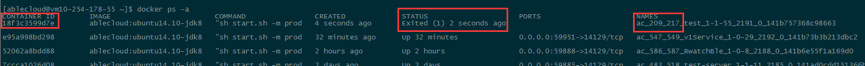
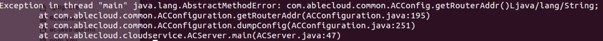

#AbleCloud 常见问题解决方法

#1.	APP开发
##1.1	SDK配置
###1.1.1	Android端uid和token怎么获取与保存？


```java
PreferencesUtils.putLong(AC.context, ACConfiguration.KEY_USERID, uid); 

PreferencesUtils.putString(AC.context, ACConfiguration.KEY_TOKEN, token);
```

###1.1.2	iOS端uid和token怎么获取与保存？

```objectivec
@interface ACKeyChain : NSObject 
	/*** 保存用户ID ***/ 
	(void)saveUserId:(NSNumber *)userId;
	
	/*** 获取用户ID ***/
	(NSNumber *)getUserId; 
	
	/*** 删除当前用户的id ***/ 
	(void)removeUserId; 
	
	/*** 保存以后 Token ***/ 
	(void)saveToken:(NSString *)token; 
	
	/*** 获取用户 Token ***/ 
	(NSString *)getToken; 
	
	/*** 删除当前用户的token ***/ 
	(void)removeToken; 
```

##1.2	基础框架
###1.2.1 APP提示签名失败是什么原因？
1. APP的本地时间不正确，导致签名超时，服务器是UTC时间。
2. 用户未登录

###1.2.3 推送失败可能的原因是什么？
1. 在AbleCloud平台配置的IOS证书，一定要和APP中打包的一样，否则会导致推送成功，但是APP收不到消息。
2. 请检查在AbleCloud平台配置的KEY是否和友盟申请的一致。
3. 通过友盟平台以Alias的方式推送APP能收到，但通过AbleCloud推送APP不能收到，请判断一下Alias是否和AbleCloud的UID相同。
4. IOS开发期间只能通过开发证书测试，切勿用生产证书的AD-HOC模式测试。
5. 有问题可以通过查看inform和router模块的日志进一步查询问题。
6. 4003 iOS推送错误，没有有效的iOS设备。

意思是没有找到与UID对应的设备，可能的原因如下：
* a.这个UID无效
* b.设备对应的证书有问题
* c.友盟上传的证书有问题
* d.AbleCloud配置的KEY存在问题。


#2.	UDS、后台服务、云对接开发
##2.1	基础框架
###2.1.1	UDS重启崩溃，如何查看docker中的LOG。
在任意路径下输入docker ps –a（目前测试环境有3台机器，UDS随机运行在其中一台，需要一台台看，UDS具体运行在哪一台），出现下图LOG



第一个红框为容器的ID，需要进入容器中才能看到UDS运行的LOG。

第二个红框为退出的时间，只能查看在10秒以内退出容器LOG，超过10秒容器自动销毁，所以输入速度一定要很快。如果发现退出时间已经超过4秒了，那么基本可以放弃查询，继续运行docker ps –a命令，直到找到退出时间在3秒以内的记录。

第三个红框中的209为domainID，217为subdomainID。

接着输入命令：docker logs 18f3c3599d7e（这条指令需要在8秒内执行完，因为第二个红框显示已经在2秒前退出了）

18f3c3599d7e就是第一个红框的容器ID。下图为查询到的LOG。



docker inspect 18f3c3599d7e（容器ID），这条命令是查看UDS所在容器的一些启动参数，最后面是UDS的存储路径和控制台显示的LOG的路径。

##2.2	消息推送
###2.2.1	多国语言推送实现
需求：用户在不同地区（国家）使用时，推送能够按照用户手机配置的语言来显示内容。

实现方案：

* iOS系统：提供loc-key/loc-args参数来实现多语言消息模版功能

 	基本原理：app本身知道当前手机设置的语言类型，app接收到推送后，根据在app中内置的模版变量来显示对应的内容

    限制：因苹果apns提供来多语言方案，ios推送消息不支持app接收到消息进行解析后再显示，而是将接收到的消息直接显示。

* 安卓系统：没有限制，loc-key放到userData自定义字段中即可，目前实现成类似ios的方案，在app中内置变量模版

* uds接口： 在Notification结构中增加setLocKey和putLocArgs方法，设置模版变量

* 后台接口：之前实现的ios推送限制了只能发送content内容，现增加支持loc-key/loc-args参数的json结构，发送给友盟推送。

###2.2.2	推送流程
1. 在友盟平台添加应用，然后获得相应的KEY
2. 通过友盟平台进行推送测试，查看APP能否收到。
3. 然后在AbleCloud平台进行配置，之后在通过友盟平台用Alias的方式推送测试。
4. 上述步骤通过，接着可以在AbleCloud平台进行推送测试。


#3.	设备端开发
##3.1	联网模块
####3.1.1 AbleCloud支持的WiFi模块有哪些？
对于市面上常见的WiFi模块，AbleCloud都进行了适配，已经完成适配的WiFi模块见下表：

|合作厂商|模块型号|WIFI芯片      | AirKiss|Smartconfig|
|-------|---------------|--------|----------|
|	汉枫   | LPB100         |MTK	         |	支持  |	支持|
|	      | LPB200         | Marvell	   |	支持  |	支持|
|	      | LPT100         |MTK	         |	支持  |	支持|  
|	      | LPT200         |MTK	         |	支持  |	支持|
|	庆科   | EMW3162|broadcom        |	支持  |	支持|
|	      | EMW3165|broadcom        |	支持  |	支持|
|	      | EMW3088| Marvell              |	支持  |	支持|
|	      | EMW1088| Marvell              |	支持  |	支持|
|江波龙 | WK1230         |QCA4004       |	支持   |	支持|
|       | GT1216         |QCA4004       |	支持   |	支持|
|       | GT141         |QCA4004       |	支持   |	支持|
|       | WK1221          |QCA4004       |	支持   |	支持|
|思存	  |ITM-IOE01       |QCA4004		           |	支持 |	支持|
|    	  |ITM-IOE20       |QCA4004		           |	支持 |	支持|
|航锐	  |   HR WF411        |QCA4004		           |	不支持 |	支持|
|   	  |   HR WF422        |QCA4004		           |	不支持 |	支持|
| Marvel|          |Marvel-88MC500|	不支持|	支持|
|联盛德 |          |HED10W07SN        |	支持|	支持|
|卓立合 | LH781         |MTK7681       |  不支持   |支持|
|新岸线 |        | NL6621      |  不支持   |支持|
|Realtek |          |RTL8711       |  支持   |支持|
|村田 |   MIDK       |QCA4002       |  不支持   |支持|
|TI |   cc3200       |  cc3200     |  不支持   |支持|
|乐鑫 |   esp8266      |  esp8266     |  支持   |支持|

####3.1.2	定位wifi不同问题的一般步骤
1. 一台和设备链接到的同一个路由器的PC机，进入控制台，ping一下www.ablecloud.cn，如果不行的话，就是表明网络有问题。
2. 登录路由器后台，看一下对应设备是否已经接入路由器上，并且ping 一下对应IP地址，ping xxx -t，运行一段时间，看看有没有掉线情况。表明模块链接路由器不稳定，需要检查路由器配置。
3. 下载并打开wireshark软件，选择连接到路由器的网卡启动抓包，在Filter上输入udp.port==7689，然后重启设备。等待一段时间，看看是否有抓到对应的报文。如果没有的话，表明是没有连上云端。


##3.2	MCU
###3.2.1	设备接入云端的流程
1. 设备向redirect申请gateway接入点信息，申请成功后，redirect记录设备的接入点，设备使用该接入点接入gateway。设备不是每次都请求redirect，当请求一次之后，设备会保存得到的gateway节点，下次就直接通过这个节点连接云端了，然后进行四次握手流程。可以参考联网模块代码中的PCT_Run函数，进一步理解设备连接云的过程。
2. 设备与gateway进行四次握手，在握手过程中，向gateway提供其domain, subDomain, deviceId, MCU版本信息，wifi版本信息以及之后通信的AES密钥，如果设备使用加密通信的话。
3. 设备完成和云端的四次握手后，正是接入gateway，在用户绑定次设备之后，可以对设备进行控制，设备也可以主动上报。如果设备没有被绑定，主动上报是会报错的。

**期间可能出现错误有：**

（1）握手失败

``` read handShake_(1/3) failed:err[read tcp 222.131.152.125:4481: connection reset by peer]```
  
这个问题的原因是设备端wifi的问题，设备端主动断开与云端建立的TCP链路，一般设备侧发生在初期。

 ```[266:530:0000C893465004F1 handShake] device not valid: dest[222.131.152.125:4481]```
 
这个问题的原因是设备端采用加密通信，云端获取设备的公钥失败，失败的原因可能是设备没有入库（统一入库/批量入库）。

（2）设备信息加入管理列表失败

 ```[83:85:02860000000085A7] insert the device connection failed:addr[112.17.236.115:51230], err[entry exist]```
 
```[83:85:02860000000085A7] force kill the old device connection:addr[112.17.236.115:51226]```

这个问题的原因是设备端异常断开（一般开发者采用断电的方式），云端不能立即检测到设备已经断开连接，这样设备管理列表中仍然有该设备的记录（云端检测到设备断开后，会将设备信息从管理列表中删除），当设备再次接入时，因为管理列表中有设备的信息，产生冲突。云端的策略是删除原来的记录，将新的设备信息加入队列。

###3.2.2	设备不能接入云端怎么处理

通过查询gateway模块的LOG，看下设备处于第几次握手失败，如果没有成功建立四次握手，需要同步查看设备的串口LOG，看下为什么握手失败。
设备不能接入云端有以下几种情况：

1. 设备物理的ID重复。一个domain下的设备物理ID不能重复，如果使用相同的物理ID但是subDomain不同，云端会认为设备信息有无，拒绝接入。
2. 如果设备采用加密通信，可能是设备密钥不匹配或者设备没有入库，云端不清楚设备的公钥，无法加密。
3. 网络原因.请确保网络稳定可靠。
4. 需要检查连接的是正式环境还是测试环境。


###3.2.3	设备的控制流程
**Step1**
App/UDS 向设备发送【control】请求，其中携带了messageCode和消息内容，控制指令和响应指令的消息号必须大于64且小于200。

**Step2**
Gateway 查询设备是否在线，如果不在线，直接回复error，如果在线，则透传消息给设备。

**Step3**
Gateway根据请求中携带的messageCode组建一个message，如果请求中还携带sub device的信息（domain, subDomain, devieId），那么message中需要有opt项。否则就没有opt项。

**Step4**
Gateway顺序产生一个msgId(0~255)，对于同一个设备，control消息的msgId顺序增加。只有当gateway接收到前一个消息的empty消息，才会发送下一个消息。Empty消息有超时机制，当empty超时后，gateway认为当前链路不可靠，主动断开与设备的连接。

**Step 5**
Control消息的响应到达gateway后，gateway需要匹配响应消息中的msgId与请求中的msgId是否一致，如果不一致，则报错。请求的响应消息超时也会报错。
期间可能出现错误有：

（1）设备不在线

```the device not online:global[83:85:02860000000085A7]```


（2）控制请求的响应超时

```request timeout and not find the old request msgId:globalId[18:274:0001999999999262], mid[81]```

```[83:85:028600000000850B]wait the current response failed:code[203], mid[5], timeout[5000000000], err[device response timeout]```

```[83:85:02860000000085A7 control]request deivce failed:reqCode[68], err[device response timeout]```


（3）设备已经接收到了控制请求，但是控制指令执行失败（具体原因需要设备侧查看），所以主动返回error。

```[345:352:0000000000000004]check device result response failed: code[16], timeout[5000000000]```

```[262:431:1111111111111111 control]request deivce failed:reqCode[80], err[invalid result]```


###3.2.4	设备的上报流程
设备主动上报，gateway根据其domain,subDomain,deviceId向设备管理系统请求设备逻辑ID，如果请求失败，则认为当前设备未绑定，直接丢弃消息。
如果获得设备逻辑ID，那么将消息负载以payload的形式向router发送，由router提交给UDS处理。其中上报的消息号必须大于等于200。
期间可能出现错误有：

```[526:531:00007CC70924C96E device report] get device logical id failed:globalId[526:531:00007CC70924C96E], err[device not exist]```

这个问题是因为设备没有被绑定，因此获取设备的逻辑ID失败

```[304:327:000008D833F57741 device report]send report to router failed:code[204], globalId[304:327:000008D833F57741], err[Post http://10.136.0.58:5000/X-Zc-Device-Report/v1/deviceReport?deviceId=81&messageCode=204&physicalDeviceId=000008D833F57741&protocol=other: net/http: timeout awaiting response headers]```

设备上报由gateway先发送到router，由router反向代理发送到对应的UDS，具体的错误由UDS日志辅助定位

 ```[83:85:028600000000850B device report]send report to router failed:code[203], globalId[83:85:028600000000850B], err[wrong resp payload format]```
 
这个问题一般是UDS处理请求遇到了异常。
###3.2.5	设备OTA流程

**Step1**

Ota-scheduler向gateway请求OTA任务列表，gateway将当前设备的版本与发布版本进行对比，只要版本不一致，就认为需要升级。

**Step2**

Ota-scheduler向gateway请求startOTA，gateway开始设备OTA升级，升级过程中出现错误，中断升级流程。等待下次OTA升级调度。

###3.2.6	控制设备失败怎么处理
通过查询gateway模块的LOG，看下控制的流程是不是正确。

控制设备失败可能的原因有：

1. 控制频率太高，设备响应不及时导致请求超时。设备能力有限，如果控制频率较高时可能会出现设备响应不及时的问题。
2. 设备MCU异常导致设备无法响应控制请求命令。
3. 设备Wifi模块与MCU之间通信异常。
4. 设备不在线。
5. 设备已经被管理解绑，分享设备的用户与设备的绑定关系自动解除，没有权限控制设备。
6. 控制设备的message code的范围是64~200，云端会检查message code，不符合要求的请求消息会返回错误，开发者可以根据返回的错误信息及时发现问题。

###3.2.7	为什么用户会绑定设备失败
通过查询bind模块的LOG，分析具体的问题。

用户不能绑定设备的原因有以下几种可能：

1. 设备不在线，设备绑定时要求设备必须在线.
2. 设备被其他用户绑定过了，云端不允许多人绑定同一个设备，用户可通过分享的方式获得对设备的控制权。
3. 绑定过程中云端与设备交换token时，设备未响应导致绑定失败。
4. 设备的domain和subdomain信息有误。
5. 电源供电是否正常，建议更换电源。
6. 确保设备的天线正常。
7. 确保网络环境不是公共环境。
8. 绑定过程中云端与设备交换token时，设备未响应导致绑定失败。


###3.2.8	设备无法激活
1. 确认WIFI密码是否输入正确。
2. 确认路由器的广播功能有没有被禁用。
3. domain信息是否正确。
4. 设备的秘钥可能存在问题。


###3.2.9	无法添加子设备
1. 网关可能掉线。
2. 子设备已经被其他人绑定。
3. 子设备subdomain填写错误。 
4. 子设备和网关的连接断开了。


###3.2.10	为什么用户会解绑设备失败
用户解绑设备失败可能的原因有：
1. 设备已经被管理员解绑了，提示用户要解绑的设备不存在。
2. 设备自己强制解除与所有用户的绑定关系（应用场景：恢复出厂设置，或者设备变更拥有者），导致原绑定的用户不能解绑成功。
3. 网络原因设备已经解绑成功，但是APP解绑请求超时，用户认为解绑失败，重复发起解绑操作。


###3.2.11	为什么设备上报失败
1. 设备没有被用户绑定。
2. 设备与云端断开连接。
3. MCU和联网模块之间连接是否正常。

