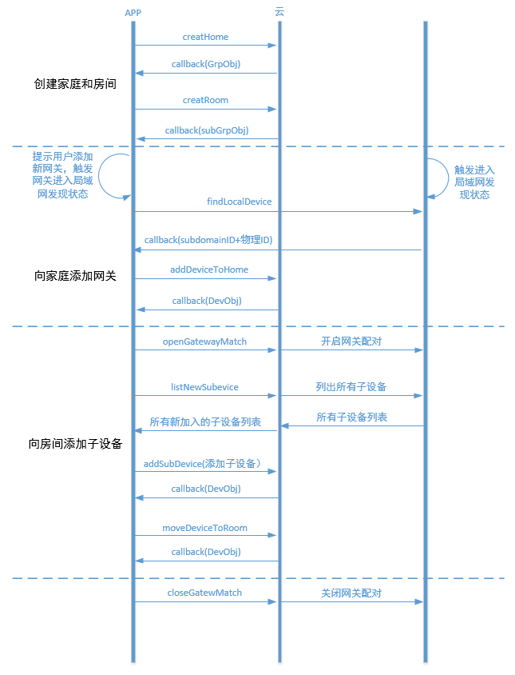

#开发环境配置
安卓开发的环境配置参考[reference-安卓-开发环境配置](../reference/android.md#开发环境配置)

#帐号管理
建议的用户交互流程见 [用户交互-帐号管理](../user_interaction.md#账号管理)

##1、普通帐号注册


获取账号管理对象

```java
    ACAccountMgr accountMgr=AC.accountMgr();
```

普通帐号注册流程

1、检查手机号是否已注册

```java
	AC.accountMgr().checkExist(phone, new PayloadCallback<Boolean>() {
        @Override
        public void success(Boolean isExist) {
            if (!isExist) {
                //发送验证码
            } else {
                //提示手机号已被注册 
            }
        }
        @Override
        public void error(ACException e) {
            //网络错误或其他，根据e.getErrorCode()做不同的提示或处理
        }
	});
```


2、发送验证码

```java
	AC.accountMgr().sendVerifyCode(phone, 1, new VoidCallback() {
        @Override
        public void success() {
            //检测验证码
        }
        @Override
        public void error(ACException e) {
            //网络错误或其他，根据e.getErrorCode()做不同的提示或处理
        }
	});
```

3、检测验证码正确性

```java
	AC.accountMgr().checkVerifyCode(phone，code, new PayloadCallback<Boolean>() {
        @Override
        public void success(Boolean result) {
            if (result) {
                //注册
            } else {
                //提示验证码错误 
            }
        }
        @Override
        public void error(ACException e) {
            //网络错误或其他，根据e.getErrorCode()做不同的提示或处理
        }
	});
```

4、注册

```java
	AC.accountMgr().register("", phone, password, name, verifyCode, new PayloadCallback<ACUserInfo>() {
        @Override
        public void success(ACUserInfo userInfo) {
            //获得用户userId和nickName，进入主页或设备管理
        }	
        @Override
        public void error(ACException e) {
            //网络错误或其他，根据e.getErrorCode()做不同的提示或处理
        }
	});
```
 
##2、第三方登录
 


1、直接使用第三方登录

```java
	//APP端在完成OAuth认证登陆之后获取openId和accessToken
	AC.accountMgr().loginWithOpenId(ACThirdPlatform.QQ, openId, accessToken, new PayloadCallback<ACUserInfo>() {
        @Override
        public void success(ACUserInfo userInfo) {
            //获得用户userId和nickName，进入主页或设备管理
        }	
        @Override
        public void error(ACException e) {
            //网络错误或其他，根据e.getErrorCode()做不同的提示或处理
        }
	});
	//绑定一个未被注册的普通帐号
	AC.accountMgr().bindWithAccount( email, phone, password, nickName, verifyCode, new VoidCallback() {
        @Override
        public void success() {
            //绑定账号成功
        }
        @Override
        public void error(ACException e) {
            //网络错误或其他，根据e.getErrorCode()做不同的提示或处理
        }
	});
```

2、在已有普通账号登录时绑定第三方账号

```java
	AC.accountMgr().bindWithAccount( email, phone, password, nickName, verifyCode, new VoidCallback() {
        @Override
        public void success() {
            //绑定第三方账号成功
        }
        @Override
        public void error(ACException e) {
            //网络错误或其他，根据e.getErrorCode()做不同的提示或处理
        }
	});
```

##三、添加帐号扩展属性
使用账号扩展属性需要先到AbleCloud官网平台上的用户管理添加附加属性

####1、获取账号管理器
```java
accountMgr=AC.accountMgr();
```

####2、设置用户自定义扩展属性
```java
ACObject userProfile = new ACObject();
//注意此处put进去的key需要跟官网添加的附加属性key值一致
userProfile.put("c1", "北京");
userProfile.put("c2", "生日");
accountMgr.setUserProfile(userProfile, new VoidCallback() {
    @Override
    public void success() {
         //附加属性设置成功
    }

    @Override
    public void error(ACException e) {
        //网络错误或其他，根据e.getErrorCode()做不同的提示或处理
    }
});
```

####3、获取用户自定义扩展属性
```java
accountMgr.getUserProfile(new PayloadCallback<ACObject>() {
     @Override
     public void success(ACObject object) {
         //可通过object.toString()查看扩展属性信息
     }

     @Override
     public void error(ACException e) {
         //网络错误或其他，根据e.getErrorCode()做不同的提示或处理
     }
});
```


#设备管理
##独立设备

用户登录/注册后，需要绑定设备才能够使用。对于没有二维码的设备，绑定设备时，首先需在APP上给出配置设备进入Smartconfig状态的提示。然后填写当前手机连接的WiFi的密码，调用startAbleLink将WiFi密码广播给设备，设备拿到WiFi密码后连接到云端然后开始局域网广播自己的subdomainID。App拿到这些信息后调用bindDevice接口绑定设备。


###一．绑定设备

###wifi设备

####1.获取ACDeviceActivator激活器
Ablecloud提供了ACDeviceActivator激活器供你使用，具体使用步骤如下：
```java
ACDeviceActivator deviceActivator=AC.deviceActivator(AC.DEVICE_HF);
```
<font color="red">注</font>：AC.DEVICE_HF表示汉枫的开发板，如果用的是其它的开发板，则需要改成相对应的
目前支持的开发板有AC.Device_MTK、AC.Device_MX、AC.Device_MARVELL、AC.Device_MURATA、AC.Device_WM、AC.Device_RAK

####2.获取wifi ssid
```java
deviceActivator. getSSID()
```

####3.激活设备
app通过startAbleLink广播自己的wifi密码，设备成功连上云之后通过广播通知app同时获取设备物理id和subDomainId（用来区分设备类型）。当前只支持配置手机当前连接的wifi

```java
deviceActivator.startAbleLink(ssid, password,  AC.DEVICE_ACTIVATOR_DEFAULT_TIMEOUT, new PayloadCallback<List<ACDeviceBind>>() {
    @Override
    public void success(List<ACDeviceBind> deviceBinds) {
        //成功后得到已激活设备的列表，从列表中得到物理id后进行绑定
    }

    @Override
    public void error(ACException e) {
        //e.getErrorCode为错误码，e.getMessage为错误信息
    }
});
```

####4.绑定设备
在成功激活设备后的回调方法中，通过物理id绑定设备
```java
AC.bindMgr().bindDevice(subDomain, physicalDeviceId, deviceName, new PayloadCallback<ACUserDevice>() {
    @Override
    public void success(ACUserDevice userDevice) {
        //绑定成功后返回设备信息
    }

    @Override
    public void error(ACException e) {
        //e.getErrorCode为错误码，e.getMessage为错误信息
    }
});
```

###gprs设备


**<font color="red">注</font>：gprs设备无需激活流程，在设备连上云端之后即可以直接进入绑定设备**
建议通过扫二维码的形式获取物理id进行绑定
```java
AC.bindMgr().bindDevice(subDomain, physicalDeviceId, deviceName, new PayloadCallback<ACUserDevice>() {
    @Override
    public void success(ACUserDevice userDevice) {
        //绑定成功后返回设备信息
    }

    @Override
    public void error(ACException e) {
        //e.getErrorCode为错误码，e.getMessage为错误信息
    }
});
```
<font color="red">建议流程</font>：可提示用户根据设备上是否连接上ablecloud云端的指示灯，在用户点击开始绑定之后，建议通过CountDownTimer每隔2s钟绑定一次设备，在连续绑定几次之后再提示用户失败或成功。

###二．分享设备
**第一种分享方式不需要用户做任何操作，管理员把设备分享给用户后即直接拥有控制权；第二种方式为管理员分享二维码后，用户再通过扫码的形式绑定设备才拥有控制权，推荐使用第二种分享机制。**

####1、管理员直接分享设备给普通用户
```java
bindMgr.bindDeviceWithUser(subDomain, deviceId, account, new VoidCallback() {
    @Override
    public void success() {
         //成功分享设备给account用户
    }

    @Override
    public void error(ACException e) {
         //e.getErrorCode为错误码，e.getMessage为错误信息
    }
});
```

####2、管理员通过分享设备二维码的形式分享设备
```java
//管理员获取分享码
bindMgr.getShareCode(subDomain, deviceId, new PayloadCallback<String>() {
    @Override
    public void success(String shareCode) {
         //成功获取分享码
    }

    @Override
    public void error(ACException e) {
         //e.getErrorCode为错误码，e.getMessage为错误信息
    }
});
//普通用户通过分享码绑定设备
bindMgr.bindDeviceWithShareCode(shareCode, new PayloadCallback<ACUserDevice>() {
    @Override
    public void success(ACUserDevice userDevice) {
         //成功绑定管理员分享的设备
    }

    @Override
    public void error(ACException e) {
         //e.getErrorCode为错误码，e.getMessage为错误信息
    }
});
```

###三．设备解绑

####1、管理员或普通用户解绑设备
如果是管理员解绑设备，那么其他绑定该设备的普通成员也会失去该设备的绑定权
```java
bindMgr.unbindDevice(subDomain, deviceId, new VoidCallback() {
    @Override
    public void success() {
        //解绑成功
    }

    @Override
    public void error(ACException e) {
        //e.getErrorCode为错误码，e.getMessage为错误信息
    }
});
```

####2、管理员取消其他普通成员对该设备的控制权
```java
bindMgr.unbindDeviceWithUser(subDomain, userId, deviceId, new VoidCallback() {
    @Override
    public void success() {
        //解绑成功
    }

    @Override
    public void error(ACException e) {
        //e.getErrorCode为错误码，e.getMessage为错误信息
    }
});
```  


##网关设备
网关的绑定流程和WiFi设备是一样的。网关绑定以后绑定子设备的建议流程如下：


该流程只是建议流程的一种。其中openGatewayMatch和closeGatewayMatch接口都是为了方便软件开启配对而开发的接口。如果使用硬件上的操作（如网关上有按钮等）完成网关和子设备的配对，则不需要用到这两个接口。

###一．绑定网关

###wifi网关

####1.获取ACDeviceActivitor激活器
AbleCloud提供了ACDeviceActivitor激活器供你使用
```java
ACDeviceActivator deviceActivator=AC.deviceActivator(AC.DEVICE_HF);
```
<font color="red">注</font>：AC.DEVICE_HF表示汉枫的开发板，如果用的是其它的开发板，则需要修改。
目前支持的开发板有AC.Device_MTK、AC.Device_MX、AC.Device_MARVELL、AC.Device_MURATA、AC.Device_WM、AC.Device_RAK

####2.得到wifi ssid
```java
deviceActivator. getSSID()
```
####3.激活网关
app通过startAbleLink广播自己的wifi密码，设备成功连上云之后通过广播通知app同时获取设备物理id和subDomainId（用来区分设备类型）。当前只支持配置手机当前连接的wifi
```java
deviceActivator.startAbleLink(ssid, password,  AC.DEVICE_ACTIVATOR_DEFAULT_TIMEOUT, new PayloadCallback<List<ACDeviceBind>>() {
    @Override
    public void success(List<ACDeviceBind> deviceBinds) {
        //成功后得到已激活设备的列表，从列表中得到物理id后进行绑定
    }

    @Override
    public void error(ACException e) {
        //e.getErrorCode为错误码，e.getMessage为错误信息
    }
});
```
####4.绑定网关
在成功激活设备后的回调方法中，通过物理id绑定网关
```java
AC.bindMgr().bindGateway(subDomain, physicalDeviceId, deviceName, new PayloadCallback<ACUserDevice>() {
    @Override
    public void success(ACUserDevice userDevice) {
        //绑定成功后返回设备信息
    }

    @Override
    public void error(ACException e) {
        //e.getErrorCode为错误码，e.getMessage为错误信息
    }
});
```

###以太网网关
**<font color="red">注</font>：以太网网关无需激活流程，在网关插上网线连上云端之后即可以直接进入绑定设备**
建议通过扫码的形式获取网关物理id进行绑定
```java
AC.bindMgr().bindGateway(subDomain, physicalDeviceId, deviceName, new PayloadCallback<ACUserDevice>() {
    @Override
    public void success(ACUserDevice userDevice) {
        //绑定成功后返回设备信息
    }

    @Override
    public void error(ACException e) {
        //e.getErrorCode为错误码，e.getMessage为错误信息
    }
});
```

###二．绑定子设备

####1．开启网关接入配对
```java
AC.bindMgr().openGatewayMatch(subDomain, gatewayDeviceId, AC.DEVICE_ACTIVATOR_DEFAULT_TIMEOUT, new VoidCallback(){
    @Override
    public void success() {
        //由于子设备接入网关是一个异步的过程，所以建议在这里new一个timer去定时获取新加入的子设备列表
        new Timer().schedule(new TimerTask() {
            @Override
            public void run() {
                //列举所有新加入的子设备列表     
            }
        }, 0, 10000);
    }

    @Override
    public void error(ACException e) {
        //e.getErrorCode为错误码，e.getMessage为错误信息，此处一般为网络错误
    }
});
```

####2．列举所有新加入的子设备列表
```java
AC.bindMgr().listNewDevices(subDomain, gatewayDeviceId, new PayloadCallback<List<ACDeviceBind>>() {
  @Override
    public void success(List<ACDeviceBind> deviceBinds) {
        //建议此处更新新加入子设备列表的界面
    }
    @Override
    public void error(ACException e) {
        //e.getErrorCode为错误码，e.getMessage为错误信息，此处一般为网络错误
    }
});
```

####3．绑定子设备
通过上一步获取的子设备列表获取physicalDeviceId进行绑定。
如有用户确认过程的话，则在用户点击确认之后循环调用此接口把用户选择的子设备列表绑定
```java
AC.bindMgr().addSubDevice(subDomain, gatewayDeviceId, physicalDeviceId, devcieName, new PayloadCallback<ACUserDevice>() {
    @Override
    public void success(ACUserDevice acUserDevice) {
        //成功绑定该子设备
    }

    @Override
    public void error(ACException e) {
        //e.getErrorCode为错误码，e.getMessage为错误信息
    }
});
```
<font color="red">注</font>：在绑定子设备addSubDevice的success回调里只是成功绑定该physicalDeviceId 的单个设备，建议在成功绑定所有子设备之后再提示绑定成功。


##home模型

说明参见[基本介绍-功能介绍-home模型](../introduction.md#功能介绍##home模型)

建议的用户交互参见[用户交互-home模型](../user_interaction.md#home模型)


创建家庭绑定WiFi设备的建议流程如下图：


创建家庭然后绑定以太网或者GPRS设备的建议流程如下图：


创建家庭然后绑定WiFi网关和Zigbee子设备的建议流程如下图：




创建家庭，然后绑定以太网网关和Zigbee子设备的建议流程如下图：


###一、创建Home
####1、获取home模型管理器
```java
ACGroupMgr groupMgr = AC.groupMgr();
```
 
####2、创建Home
```java
groupMgr.createHome(name, new PayloadCallback<ACHome>() {
    @Override
    public void success(ACHome home) {
         //成功创建一个home
    }

    @Override
    public void error(ACException e) {
         //e.getErrorCode为错误码，e.getMessage为错误信息
    }
});
```

####3、创建Room
```java
groupMgr.createRoom(homeId, name, new PayloadCallback<ACRoom>() {
    @Override
    public void success(ACRoom room) {
         //成功创建homeId下的一个room
    }

    @Override
    public void error(ACException e) {
         //e.getErrorCode为错误码，e.getMessage为错误信息
    }
});
```

###二、添加或移动设备到分组里


><font color="red">特别注意</font>：
>1、绑定设备流程，建议独立设备在激活设备之后绑定设备把bindDevice换成addDeviceToHome，gprs设备或以太网网关则直接调addDeviceToHome
>2、不能跨级移动设备；比如独立设备要移到room里，则需要先把它移动到home，再移动到room

####添加设备到Home里
创建完分组之后，需要添加绑定设备，绑定流程见上篇独立设备或网关开发指导，把bingDevice改成如下接口即可
```java
groupMgr.addDeviceToHome(subDomain, physicalDeviceId, homeId, deviceName, new PayloadCallback<ACUserDevice>() {
    @Override
    public void success(ACUserDevice userDevice) {
         //成功绑定设备并添加到分组Home里
    }

    @Override
    public void error(ACException e) {
         //e.getErrorCode为错误码，e.getMessage为错误信息
    }
});
```

####移动设备到Room里
```java
groupMgr.moveDeviceToRoom(deviceId, homeId, roomId, new VoidCallback() {
    @Override
    public void success() {
         //成功绑定设备并添加到分组Home里
    }

    @Override
    public void error(ACException e) {
         //e.getErrorCode为错误码，e.getMessage为错误信息
    }
});
```


##设备扩展属性
**<font color="red">注意</font>：设备扩展属性需要先进入到控制台产品管理-->产品列表-->管理-->产品属性-->附加属性-->新建属性，建立完附加属性列表后才能使用如下接口**

####一、设置或者更新设备扩展属性
```java
ACObject deviceProfile = new ACObject();
//这里的key值需要与控制台里新建列表的属性标识保持一致
deviceProfile.put("String", "北京");
deviceProfile.put("Integer", 10);
deviceProfile.put("Float", 10.1f);
deviceProfile.put("Bool", true);
bindMgr.setDeviceProfile(subDomain, deviceId, deviceProfile, new VoidCallback() {
    @Override
    public void success() {
         //设置成功               
    }

    @Override
    public void error(ACException e) {
         //e.getErrorCode为错误码，e.getMessage为错误信息
    }
});
```

####二、获取设备扩展属性
```java
bindMgr.getDeviceProfile(subDomain, deviceId, new PayloadCallback<ACObject>() {
    @Override
    public void success(ACObject object) {
         //成功获取并查看设备扩展属性信息
         LogUtil.i("TAG",object.toString());
    }

    @Override
    public void error(ACException e) {
         //e.getErrorCode为错误码，e.getMessage为错误信息
    }
});
```


#OTA
说明参见[基本介绍-功能介绍-OTA](../introduction.md#功能介绍##OTA)

建议的用户交互参见[用户交互-OTA](../user_interaction.md#OTA)


若使用场景为开启app之后自动检测升级，建议把检测升级过程放在application里，并维护一个deviceId和ACOTAUpgradeInfo的映射关系，通过static修饰放到内存里，在进入OTA升级页面后可以直接取出来显示，如想实现用户取消升级之后不再提示功能，则可以自己维护一个变量记录。
####一.获取OTA管理器对象
```java
ACOTAMgr otaMgr = AC.otaMgr();
```
####二. 检查升级
1.检查设备是否有新的OTA版本，同时获取升级日志
```java
otaMgr.checkUpdate(subDomain, deviceId, new PayloadCallback<ACOTAUpgradeInfo>() {
    @Override
    public void success(ACOTAUpgradeInfo info) {
        /**
         * 通过判断info.getOldVersion()和info.getNewVersion()是否相等判断是否有新版本更新
         * 
         * info.getOldVersion为老版本，info.getNewVersion为新版本，info.getUpgradeLog为升级日志
         */
    }
    @Override
    public void error(ACException e) {
        //e.getErrorCode为错误码，e.getMessage为错误信息
    }
});
```

####三．确认升级
```java
otaMgr.confirmUpdate(subDomain,deviceId, newVersion, new VoidCallback() {
    @Override
    public void success() {
         //确认升级     
    }
    @Override
    public void error(ACException e) {
         //e.getErrorCode为错误码，e.getMessage为错误信息
    }
});
```


#推送

AbleCloud的推送使用友盟的服务，在开发进行之前，现需要进行一些配置。

开发前的配置工作参考[reference-安卓-推送开发准备](../framework/android#推送开发准备)


><font color="red">注意</font>

>1、调试的时候若开发环境配置有变化的话尽量手动卸载app之后再重新安装

>2、推荐通过登录友盟推送的后台进行推送测试，若能收到推送通知即代表流程通过，最后再与uds服务进行下一步测试

>3、推荐通过友盟推送后台的工具，通过设备状态查询（通过接口获取）或者设备别名查询（即登录成功之后的userId）确认是否成功注册推送，若注册成功之后仍没有收到通知消息的话，建议再检查下开发环境配置。

###一、开发环境配置
如果想使用推送服务，需要先配置AndroidManifest.xml环境变量
####1、在`<manifest>`标签下添加权限：
```java
<!-- 必选 -->
<uses-permission android:name="android.permission.READ_PHONE_STATE"/>
<uses-permission android:name="android.permission.WRITE_EXTERNAL_STORAGE"/>
<uses-permission android:name="android.permission.WAKE_LOCK"/>
<uses-permission android:name="android.permission.VIBRATE"/>
<uses-permission android:name="android.permission.WRITE_SETTINGS"/>
<uses-permission android:name="android.permission.RECEIVE_BOOT_COMPLETED"/>
<!-- 用以设置前台是否显示通知-->
<uses-permission android:name="android.permission.GET_TASKS"/>
<!-- 可选  -->
<uses-permission android:name="android.permission.BROADCAST_PACKAGE_ADDED"/>
<uses-permission android:name="android.permission.BROADCAST_PACKAGE_CHANGED"/>
<uses-permission android:name="android.permission.BROADCAST_PACKAGE_INSTALL"/>
<uses-permission android:name="android.permission.BROADCAST_PACKAGE_REPLACED"/>
<uses-permission android:name="android.permission.RESTART_PACKAGES"/>
<uses-permission android:name="android.permission.GET_ACCOUNTS"/>;
```
####2、在`<application>`标签下添加组件：
<font color="red">注意</font>：添加组件时需要将【应用包名】替换为你自己应用的包名。
```java
<!-- 监听通知点击或者忽略处理的广播 -->
<receiver
    android:name="com.umeng.message.NotificationProxyBroadcastReceiver"
    android:exported="false" >
</receiver>

<!-- 监听开机运行、网络连接变化、卸载的广播 -->
<receiver
    android:name="com.umeng.message.SystemReceiver"
    android:process=":push" >
    <intent-filter>
        <action android:name="android.intent.action.BOOT_COMPLETED" />
    </intent-filter>
    <intent-filter>
        <action android:name="android.net.conn.CONNECTIVITY_CHANGE" />
    </intent-filter>
    <intent-filter>
        <action android:name="android.intent.action.PACKAGE_REMOVED" />
        <data android:scheme="package" />
    </intent-filter>
</receiver>

<!-- 监听消息到达的广播 -->
<receiver
    android:name="com.umeng.message.MessageReceiver"
    android:process=":push" >
    <intent-filter>
        <action android:name="org.agoo.android.intent.action.RECEIVE" />
    </intent-filter>
</receiver>

<!-- 监听宿主选举的广播 -->
<receiver
    android:name="com.umeng.message.ElectionReceiver"
    android:process=":push" >
    <intent-filter>
        <action android:name="org.agoo.android.intent.action.ELECTION_RESULT_V4" />
        <category android:name="umeng" />
    </intent-filter>
</receiver>

<!-- 监听注册的广播 -->
<!-- 【应用包名】字符串需要替换成本应用的应用包名 -->
<receiver
    android:name="com.umeng.message.RegistrationReceiver"
    android:exported="false" >
    <intent-filter>
        <action android:name="【应用包名】.intent.action.COMMAND" />
    </intent-filter>
</receiver>
<receiver android:name="com.umeng.message.UmengMessageBootReceiver" >
    <intent-filter>
        <action android:name="android.intent.action.BOOT_COMPLETED" />
    </intent-filter>
</receiver>
```
可以根据需要自行设置 android:label 中的服务名 ：
```java
<!-- Umeng的长连服务，用来建立推送的长连接的 -->
<!-- 【应用包名】字符串需要替换成本应用的应用包名 -->
<service
    android:name="com.umeng.message.UmengService"
    android:label="PushService"
    android:exported="true"
    android:process=":push" >
    <intent-filter>
        <action android:name="【应用包名】.intent.action.START" />
    </intent-filter>
    <intent-filter>
        <action android:name="【应用包名】.intent.action.COCKROACH" />
    </intent-filter>
    <intent-filter>
        <action android:name="org.agoo.android.intent.action.PING_V4" />
    <category android:name="umeng" />
    </intent-filter>
</service>

<!-- Umeng的消息接收服务 -->
<service android:name="com.umeng.message.UmengIntentService" 
    android:process=":push" />

<!-- Umeng的消息路由服务 -->
<service 
    android:name="com.umeng.message.UmengMessageIntentReceiverService"
    android:process=":push" 
    android:exported="true" >
    <intent-filter>
        <action android:name="org.android.agoo.client.MessageReceiverService" />
    </intent-filter>
    <intent-filter>
        <action android:name="org.android.agoo.client.ElectionReceiverService" />
    </intent-filter>
</service>

<!-- v2.4.1添加的Service，Umeng的消息接收后的处理服务 -->
<service android:name="com.umeng.message.UmengMessageCallbackHandlerService" 
    android:exported="false">
    <intent-filter>
        <action android:name="com.umeng.messge.registercallback.action" />
    </intent-filter>
    <intent-filter>
        <action android:name="com.umeng.message.unregistercallback.action"/>
    </intent-filter>
    <intent-filter>
        <action android:name="com.umeng.message.message.handler.action"/>
    </intent-filter>
    <intent-filter>
        <action android:name="com.umeng.message.autoupdate.handler.action"/>
    </intent-filter>
</service>
```

####3、添加 AppKey 和 Umeng Message Secret
```java
<!-- V1.3.0添加的service，负责下载通知的资源 -->
<service android:name="com.umeng.message.UmengDownloadResourceService" />

<!-- 添加 AppKey 和 Umeng Message Secret -->
<meta-data
    android:name="UMENG_APPKEY"
    android:value="xxxxxxxxxxxxxxxxxxxxxxxxxxxx" >
</meta-data>
<meta-data
    android:name="UMENG_MESSAGE_SECRET"
    android:value="xxxxxxxxxxxxxxxxxxxxxxxxxxxx" >
</meta-data>
<!-- 用Channel ID来标识APP的推广渠道，作为推送消息时给用户分组的一个维度，若不设置，则使用Unknown作为Channel ID -->
<meta-data
    android:name="UMENG_CHANNEL"
    android:value="Channel ID" >
</meta-data>
```

###二、开启推送服务
在SDK端提供了相应的接口（封装了友盟的部分接口），定义如下：
####1、获取推送管理器
```java
ACNotificationMgr notificationMgr=AC.notificationMgr();
```
####2、在应用的主Activity onCreate() 函数中开启推送服务
```java
notificationMgr.init();
```

####3、在登录成功之后添加推送别名
```java
notificationMgr.addAlias(info.getUserId(), new VoidCallback() {
    @Override
    public void success() {
        //别名添加成功
    }
    @Override
    public void error(ACException e) {
        //别名添加失败，检查前面步骤的配置是否有问题
    } 	
});
```

####4、设置友盟的消息处理
```java
notificationMgr.setMessageHandler(new UmengMessageHandler() {
    /**
     * 参考集成文档的1.6.3
     * http://dev.umeng.com/push/android/integration#1_6_3
     */
    @Override
    public void dealWithCustomMessage(final Context context, final UMessage msg) {
         new Handler().post(new Runnable() {
             @Override
             public void run() {
                 // TODO Auto-generated method stub
                 Toast.makeText(context, msg.custom, Toast.LENGTH_LONG).show();
                 // 对自定义消息的处理方式，点击或者忽略
                 boolean isClickOrDismissed = true;
                 if (isClickOrDismissed) {
                     //自定义消息的点击统计
                     UTrack.getInstance(getApplicationContext()).trackMsgClick(msg);
                 } else {
                     //自定义消息的忽略统计
                     UTrack.getInstance(getApplicationContext()).trackMsgDismissed(msg);
                 }
             }
         });
    }
    /**
     * 参考集成文档的1.6.4
     * http://dev.umeng.com/push/android/integration#1_6_4
     */
    @Override
    public Notification getNotification(Context context, UMessage msg) {
        //接收到Notification消息处理
        switch (msg.builder_id) {
            case 1:
                NotificationCompat.Builder builder = new NotificationCompat.Builder(context);
                RemoteViews myNotificationView = new RemoteViews(context.getPackageName(), R.layout.notification_view);
                myNotificationView.setTextViewText(R.id.notification_title, msg.title);
                myNotificationView.setTextViewText(R.id.notification_text, msg.text);
                myNotificationView.setImageViewBitmap(R.id.notification_large_icon, getLargeIcon(context, msg));
                myNotificationView.setImageViewResource(R.id.notification_small_icon, getSmallIconId(context, msg));
                builder.setContent(myNotificationView);
                builder.setAutoCancel(true);
                Notification mNotification = builder.build();
                //由于Android v4包的bug，在2.3及以下系统，Builder创建出来的Notification，并没有设置RemoteView，故需要添加此代码
                mNotification.contentView = myNotificationView;
                return mNotification;
            default:
                //默认为0，若填写的builder_id并不存在，也使用默认。
                return super.getNotification(context, msg);
        }
    }
});
```
####5、在退出登录之后移除掉旧的别名
```java
notificationMgr.removeAlias(userId, new VoidCallback() {
    @Override
    public void success() {
         //别名注销成功
    }
    @Override
    public void error(ACException e) {
         //别名注销失败
    }
});
```


#和云端通信

说明参见[基本介绍-功能介绍-和云端通信](../introduction.md#功能介绍##云端通信)

建议的用户交互参见[用户交互-和云端通信](../user_interaction.md#云端通信)


##一、发送消息到设备
###1、KLV格式
**在新建产品的时候选择klv通讯协议，并填写数据点与数据包**
**例如**：以开启设备为例,协议如下:
>+  数据点：key:1  value:int8(0为关闭，1为开启)
>+ 数据包：code:68  
```java
ACKLVObject req = new ACKLVObject();
//只需要告诉设备指令，而不需要payload时，传null
req.put(1, 1);
//AC.LOCAL_FIRST代表优先走局域网，局域网不通的情况下再走云端
bindMgr.sendToDeviceWithOption(subDomain, deviceId, new ACKLVDeviceMsg(68, req), AC.LOCAL_FIRST, new PayloadCallback<ACKLVDeviceMsg>() {
    @Override
    public void success(ACKLVDeviceMsg deviceMsg) {
        ACKLVObject resp = deviceMsg.getKLVObject();
        //发送成功并接收设备的响应消息
    }

    @Override
    public void error(ACException e) {
        //e.getErrorCode为错误码，e.getMessage为错误信息
    }
});
```
###2、二进制格式
**例如**：以开启设备为例,协议如下:
>**数据包** 
>+ code:68 
>+ req:{1,0,0,0}
>+ resp:{1,0,0,0}
####1)、设置序列化器
```java
bindMgr.setDeviceMsgMarshaller(new ACDeviceMsgMarshaller() {
    @Override
    public byte[] marshal(ACDeviceMsg msg) throws Exception {
        return (byte[]) msg.getContent();
    }

    @Override
    public ACDeviceMsg unmarshal(int msgCode, byte[] payload) throws Exception {
        return new ACDeviceMsg(msgCode, payload);
    }
});
```
####2)、发送到设备
```java
bindMgr.sendToDeviceWithOption(subDomain, deviceId, new ACDeviceMsg(68, new byte[]{1, 0, 0, 0}), AC.LOCAL_FIRST, new PayloadCallback<ACDeviceMsg>() {
    @Override
    public void success(ACDeviceMsg deviceMsg) {
        byte[] resp = (byte[]) deviceMsg.getContent();
        if(resp[0] == 1 && resp[1] == 0 && ...){
            //开灯成功
        } else {
            //开灯失败
        }
    }

    @Override
    public void error(ACException e) {
        //e.getErrorCode为错误码，e.getMessage为错误信息
    }
});
```
###3、json格式
**例如**：以开启设备为例,协议如下:
> **数据包** 
>+ code:68 
>+ req:{"switch","open"}
>+ resp:{"result",1}
####1、设置序列化器
```java
bindMgr.setDeviceMsgMarshaller(new ACDeviceMsgMarshaller() {
    @Override
    public byte[] marshal(ACDeviceMsg msg) throws Exception {
        return ACObjectMarshaller.marshal((ACObject)msg.getContent());
    }

    @Override
    public ACDeviceMsg unmarshal(int msgCode, byte[] payload) throws Exception {
        ACObject resp = new ACObject();
        ACObjectMarshaller.unmarshal(resp, payload);
        return new ACDeviceMsg(msgCode, resp);
    }
});
```
####2、发送到设备
```java
ACObject req = new ACObject();
req.put("switch", "open");
bindMgr.sendToDeviceWithOption(subDomain, deviceId, new ACDeviceMsg(68, req), AC.LOCAL_FIRST, new PayloadCallback<ACDeviceMsg>() {
    @Override
    public void success(ACDeviceMsg deviceMsg) {
        ACObject resp = (ACObject) deviceMsg.getContent();
        long result = resp.get("result");
        if (result == 1) {
            //开灯成功
        } else {
            //开灯失败
        }
    }

    @Override
    public void error(ACException e) {
        //e.getErrorCode为错误码，e.getMessage为错误信息
    }
});
```

##二、发送消息到服务
**<font color="red">注意</font>：serviceName对应服务管理里UDS服务里的服务名称，务必保持一致，进入版本管理之后，查看已上线版本，serviceVersion为主版本号，比如1-0-0，则version为1**

```java
ACMsg req = new ACMsg();
req.setName("queryData");
req.put("deviceId", deviceId);
req.put("startTime", 0);
req.put("endTime", System.currentTimeMillis());
AC.sendToService(subDomain, serviceName, serviceVersion, req, new PayloadCallback<ACMsg>() {
    @Override
    public void success(ACMsg resp) {
        //发送成功并接收服务的响应消息
    }

    @Override
    public void error(ACException e) {
        //e.getErrorCode为错误码，e.getMessage为错误信息
    }
});
```
##三、实时消息

实时消息第一版的设计与store数据集直接相关，当数据表格的存储有发生变化时，如创建、更新、添加、删除操作时才会下发数据到app


cloud_syn.png

####1、获取实时消息管理器
```java
pushMgr = AC.pushMgr();
```
####2、创建与服务器的连接
```java
pushMgr.connect(new VoidCallback() {
    @Override
    public void success() {
        //连接成功，可以开始订阅数据
    }
    @Override
    public void error(ACException e) {
        //网络错误，连接失败
    }
});
```

####3、订阅实时数据
```java
//实例化ACPushTable对象
ACPushTable table = new ACPushTable();
//设置订阅的表名
table.setClassName("test_class");
//设置订阅的columns行
table.setColumes(new String[]{"status", "pm25"});
//设置监听主键，此处对应添加数据集时的监控主键
ACObject primaryKey = new ACObject();
primaryKey.put("deviceId", "10000");
table.setPrimaryKey(primaryKey);
//设置监听类型，如以下为只要发生创建、删除、替换、更新数据集的时候即会推送数据
table.setOpType(ACPushTable.OPTYPE_CREATE | ACPushTable.OPTYPE_DELETE | ACPushTable.OPTYPE_REPLACE | ACPushTable.OPTYPE_UPDATE);
pushMgr.watch(table, new VoidCallback() {
    @Override
    public void success() {
        //订阅成功
    }
    @Override
    public void error(ACException e) {
        //订阅失败e.getErrorCode为错误码，e.getMessage为错误信息
    }
});
```
####4、接收已订阅的实时数据
```java
pushMgr.onReceive(new PayloadCallback<ACPushReceive>() {
    @Override
    public void success(ACPushReceive pushReceive) {
        //pushReceive.getClassName() 表名
        //pushReceive.getOpType() 接收类型，如ACPushTableOpType.CREATE
        //pushReceive.getPayload() 接收数据ACObject格式
    }

    @Override
    public void error(ACException e) {
    //永远不会执行
    }
});
```
####5、取消订阅
建议在退出订阅的activity之后调用，避免造成流量浪费
```java
//实例化ACPushTable对象
ACPushTable table = new ACPushTable();
//设置订阅的表名
table.setClassName("test_class");
//设置监听主键
ACObject primaryKey = new ACObject();
primaryKey.put("deviceId", "10000");
table.setPrimaryKey(primaryKey);
pushMgr.unwatch(table, new VoidCallback() {
    @Override
    public void success() {
        //取消订阅成功
    }
    @Override
    public void error(ACException e) {
        //取消订阅失败e.getErrorCode为错误码，e.getMessage为错误信息
    }
});
```


#局域网通信
说明参见[基本介绍-功能介绍-局域网通信](../introduction.md#功能介绍##局域网通信)

建议的用户交互参见[用户交互-局域网通信](../user_interaction.md#局域网通信)


#局域网通信

获取设备列表（在网络环境差的情况下如果获取不到设备列表会从本地缓存里取设备列表）
```java
bindMgr.listDevicesWithStatus(new PayloadCallback<List<ACUserDevice>>() {
    @Override
    public void success(List<ACUserDevice> deviceList) {
        For(ACUserDevice device:deviceList){
            /**
              * 设备在线状态(listDeviceWithStatus时返回，listDevice不返回该值)
              * 0不在线 1云端在线 2局域网在线 3云端和局域网同时在线
              */
            device.getStatus();
        }
    }

    @Override
    public void error(ACException e) {
    //网络错误且之前从来没有获取过设备列表时返回
    }
});
```
因为局域网通讯要求设备与app处于同一个wifi下，若网络环境变化，如切换wifi时，直连的状态会发生改变，所以需要监听网络环境变化
```java
//监听网络变化
ACNetworkChangeReceiver.addEventHandler(new NetEventHandler() {
    @Override
    public void onNetChange() {
        //当手机网络环境变化时，更新局域网状态或者重新获取设备列表
        getDeviceList();
    }
});
```
此外，由于网络环境较差，使得在获取直连设备时有可能会出现丢包情况，所以若需要准确实时的获取局域网状态，则需要增加手动刷新局域网状态
```java
//当设备掉线或网络环境不稳定导致获取局域网显示状态不准确时，需要手动刷新设备列表与局域网状态
AC.findLocalDevice(1000, new PayloadCallback<List<ACDeviceFind>>() {
    @Override
    public void success(List<ACDeviceFind> acDeviceFinds) {
        //发现局域网设备，更新局域网状态或者重新获取设备列表
        getDeviceList();
    }

    @Override
    public void error(ACException e) {
        //没有局域网设备，更新局域网状态或者重新获取设备列表
        getDeviceList();
    }
});
```

#定时任务

####获取定时管理器
#####使用默认时区
```java
ACTimerMgr timerMgr=AC.timerMgr();
```
#####使用自定义时区
```java
ACTimerMgr timerMgr=AC.timerMgr(timeZone);
```
####添加定时任务
>**<font color="red">注意</font>：**

>**1、若与设备之间的通讯为二进制或json格式，则需要先设置序列化器（与发送到设备相同），若为klv格式则不需要设置，具体参考与云端通讯中的发送到设备**

>**2、timePoint的格式为`"yyyy-MM-dd HH:mm:ss"`，否则会失败**

>**3、timeCycle需要在timePoint时间点的基础上,选择循环方式**

>+ **"once":**单次循环

>+ **"min":**在每分钟的**`ss`**时间点循环执行

>+ **"hour":**在每小时的**`mm:ss`**时间点循环执行

>+ **"day":**在每天的**`HH:mm:ss`**时间点循环执行

>+ **"month":**在每月的**`dd HH:mm:ss`**时间点循环执行

>+ **"year":**在每年的**`MM-dd HH:mm:ss`**时间点循环执行


>+ **"week[0,1,2,3,4,5,6]":**在每星期的**`HH:mm:ss`**时间点循环执行(如周一，周五重复，则表示为"week[1,5]")

```java
//设置序列化器
AC.bindMgr().setDeviceMsgMarshaller(new ACDeviceMsgMarshaller() {
    @Override
    public byte[] marshal(ACDeviceMsg msg) throws Exception {
         return (byte[]) msg.getContent();
    }

    @Override
    public ACDeviceMsg unmarshal(int msgCode, byte[] payload) throws Exception {
         //跟定时任务无关
         return null;
    }
});
```

```java
//若为二进制或klv格式，则msg需要先经过序列化器进行序列化
timerMgr.addTask(deviceId, name, timePoint, timeCycle, description, msg, new VoidCallback() {
     @Override
     public void success() {
          //成功添加定时任务，创建后默认为开启状态
     }

     @Override
     public void error(ACException e) {
          //e.getErrorCode为错误码，e.getMessage为错误信息
     }
});
```

####修改定时任务
接口为modifyTask，其他参数与定义与创建定时任务相同

####开启定时任务
```java
timerMgr.openTask(deviceId, taskId, new VoidCallback() {
     @Override
     public void success() {
          //开启定时任务成功
     }

     @Override
     public void error(ACException e) {
          //e.getErrorCode为错误码，e.getMessage为错误信息
     }
});
```

####关闭定时任务
```java
timerMgr.closeTask(deviceId, taskId, new VoidCallback() {
     @Override
     public void success() {
          //关闭定时任务
     }

     @Override
     public void error(ACException e) {
          //e.getErrorCode为错误码，e.getMessage为错误信息
     }
});
```

####删除定时任务
```java
timerMgr.deleteTask(deviceId, taskId, new VoidCallback() {
     @Override
     public void success() {
          //删除定时任务
     }

     @Override
     public void error(ACException e) {
          //e.getErrorCode为错误码，e.getMessage为错误信息
     }
});
```

####获取定时任务列表
```java
timerMgr.listTasks(deviceId, new PayloadCallback<List<ACTimerTask>>(){
     @Override
     public void success(List<ACTimerTask> timerTasks) {
          //通过logcat查看获取到的定时任务列表进行显示或下一步操作
          for (ACTimerTask timerTask : timerTasks){
              LogUtil.i("TAG", timerTask.toString());
          }
     }

     @Override
     public void error(ACException e) {
          //e.getErrorCode为错误码，e.getMessage为错误信息
     }
});
```


#文件存储
><font color="red">注意</font>：

>1、下载文件到sdcard或者从sdcard上传文件到云端需要在 **application** 标签下增加如下权限


>```java
><uses-permission android:name="android.permission.WRITE_EXTERNAL_STORAGE"/>
>```


>2、上传下载支持断点续传功能


##一、获取文件管理器
```java
ACFileMgr fileMgr = AC.fileMgr();
```
##二、下载文件
###1、获取下载url
```java
ACFileInfo fileInfo = new ACFileInfo(bucket, bucketType, name);
fileMgr.getDownloadUrl(fileInfo, new PayloadCallback<String>() {
    @Override
    public void success(String url) {
         //成功获取文件url
    }

    @Override
    public void error(ACException e) {
         //没有权限或其他网络错误
    }
});
```
###2、根据url下载文件
####1)、下载文件到sdcard
```java
ACUtils.createSDDir("myDir");
File file = null;
try {
     file = ACUtils.createSDFile("myDir/" + name);
} catch (IOException e) {
}
fileMgr.downloadFile(file, url, new ProgressCallback() {
    @Override
    public void progress(double progress) {
         //用于显示进度条，百分比，如99.99；如果没有显示进度条的需求则传null
    }
}, new VoidCallback() {
    @Override
    public void success() {
        //下载成功
    }

    @Override
    public void error(ACException e) {
         //e.getErrorCode为错误码，e.getMessage为错误信息
    }
});
```

####2)、下载文件到内存，比如头像下载
```java
fileMgr.downloadFile(url, new ProgressCallback() {
    @Override
    public void progress(double progress) {
         //用于显示进度条，百分比，如99.99；此处一般为小文件下载，所以不需要显示进度条的时候传null
    }
}, new PayloadCallback<byte[]>() {
    @Override
    public void success(byte[] bytes) {
         //下载成功
    }

    @Override
    public void error(ACException e) {
         //e.getErrorCode为错误码，e.getMessage为错误信息
    }
});
```

##三、上传文件

###1、设置上传文件的权限管理
```java
//acl为权限管理
ACACL acl = new ACACL();
//设置所有人可读，黑名单除外(或者设置所有人不可读，白名单除外)
acl.setPublicReadAccess(true);
//设置所有人可写，黑名单除外(或者设置所有人不可写，白名单除外)
acl.setPublicWriteAccess(true);
//设置黑名单，userId为1的用户没有读的权限
acl.setUserDeny(ACACL.OpType.READ, 1);
//设置白名单，userId为1的用户有写的权限
acl.setUserAccess(ACACL.OpType.WRITE, 1);
```
###2、上传文件
####1)、上传sdcard文件
```java
ACFileInfo fileInfo = new ACFileInfo(bucket, bucketType, name);
//设置acl
fileInfo.setACL(acl);
//设置上传文件的sdcard路径
fileInfo.setFile(new File(Environment.getExternalStorageDirectory() + "/myDir/" + name));
fileMgr.uploadFile(fileInfo, new ProgressCallback() {
    @Override
    public void progress(double progress) {
         //用于显示进度条，百分比，如99.99；如果没有显示进度条的需求则传null
    }
}, new VoidCallback() {
    @Override
    public void success() {
         //上传成功
    }

    @Override
    public void error(ACException e) {
         //e.getErrorCode为错误码，e.getMessage为错误信息
    }
});
```
####2)、上传小文件，比如头像
```java
ACFileInfo fileInfo = new ACFileInfo(bucket, bucketType, name);
//设置acl
fileInfo.setACL(acl);
//比如头像比特流数组
fileInfo.setData(bytes);
fileMgr.uploadFile(fileInfo, new ProgressCallback() {
    @Override
    public void progress(double progress) {
         //用于显示进度条，百分比，如99.99；此处一般为小文件上传，所以不需要显示进度条的时候传null
    }
}, new VoidCallback() {
    @Override
    public void success() {
         //上传成功
    }

    @Override
    public void error(ACException e) {
         //e.getErrorCode为错误码，e.getMessage为错误信息
    }
});
```
