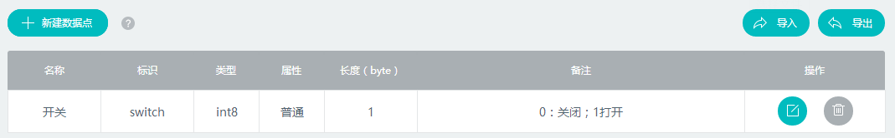
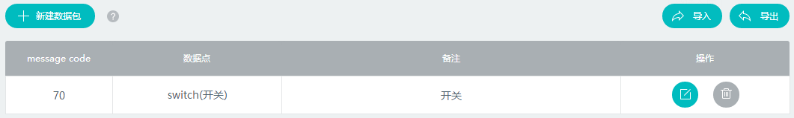
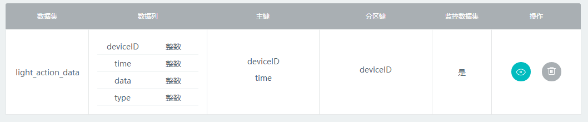

#安卓客户端开发指导

#开发环境配置
##SDK发布库
ablcloud发布的android端SDK为[`ac-service-android.jar`](https://www.ablecloud.cn/download/SDK&Demo/ac-service-android-SDK-1.0.1.zip)


><font color="red">注意:</font>

>1、若您设备的wifi模块为MTK，则需要添加MTK文件夹下的文件到libs目录下;若使用庆科MX模块，则需要添加MX文件夹下的jar包到libs目录下；其他模块由sdk内部集成

>2、若需要使用友盟的推送服务，则需要添加Umeng文件夹下的文件到libs目录下

##开发环境设置
以下为 AbleCloud Android SDK 需要的所有的权限，请在你的AndroidManifest.xml文件里的`<manifest>`标签里添加
```java
<uses-permission android:name="android.permission.INTERNET"/>
<uses-permission android:name="android.permission.ACCESS_WIFI_STATE"/>
<uses-permission android:name="android.permission.ACCESS_NETWORK_STATE" />
<uses-permission android:name="android.permission.CHANGE_WIFI_STATE" />
<uses-permission android:name="android.permission.CHANGE_NETWORK_STATE"/>
```
##应用程序初始化
在你的应用使用AbleCloud服务之前，你需要在代码中对AbleCloud SDK进行初始化。
继承`Application`类，并且在`onCreate()`方法中调用此方法来进行初始化

**国内环境**
开发阶段，请初始化**测试环境**
```java
AC.init(this, MajorDomain, MajorDomainId, AC.TEST_MODE);
```
在完成测试阶段之后，需要迁移到**正式环境**下
```java
AC.init(this, MajorDomain, MajorDomainId);
```
**国外环境**
开发阶段，请初始化**测试环境**
```java
AC.init(this, MajorDomain, MajorDomainId, AC.TEST_MODE, AC.REGIONAL_SOUTHEAST_ASIA);
```
在完成测试阶段之后，需要迁移到**正式环境**下
```java
AC.init(this, MajorDomain, MajorDomainId, AC.PRODUCTION_MODE, AC.REGIONAL_SOUTHEAST_ASIA);
```
#帐号管理

##一、普通帐号注册
功能介绍参考： [功能说明-功能介绍-帐号管理](../features/functions.md#_1)


###获取账号管理对象

```java
    ACAccountMgr accountMgr=AC.accountMgr();
```

###普通帐号注册流程

####1、检查手机号是否已注册

```java
	AC.accountMgr().checkExist(phone, new PayloadCallback<Boolean>() {
        @Override
        public void success(Boolean isExist) {
            if (!isExist) {
                //发送验证码
            } else {
                //提示手机号已被注册 
            }
        }
        @Override
        public void error(ACException e) {
            //网络错误或其他，根据e.getErrorCode()做不同的提示或处理
        }
	});
```


####2、发送验证码

```java
	AC.accountMgr().sendVerifyCode(phone, 1, new VoidCallback() {
        @Override
        public void success() {
            //检测验证码
        }
        @Override
        public void error(ACException e) {
            //网络错误或其他，根据e.getErrorCode()做不同的提示或处理
        }
	});
```

####3、检测验证码正确性

```java
	AC.accountMgr().checkVerifyCode(phone，code, new PayloadCallback<Boolean>() {
        @Override
        public void success(Boolean result) {
            if (result) {
                //注册
            } else {
                //提示验证码错误 
            }
        }
        @Override
        public void error(ACException e) {
            //网络错误或其他，根据e.getErrorCode()做不同的提示或处理
        }
	});
```

####4、注册

```java
	AC.accountMgr().register("", phone, password, name, verifyCode, new PayloadCallback<ACUserInfo>() {
        @Override
        public void success(ACUserInfo userInfo) {
            //获得用户userId和nickName，进入主页或设备管理
        }	
        @Override
        public void error(ACException e) {
            //网络错误或其他，根据e.getErrorCode()做不同的提示或处理
        }
	});
```
 
##二、第三方登录
 


####1、直接使用第三方登录

```java
	//APP端在完成OAuth认证登录之后获取openId和accessToken
	AC.accountMgr().loginWithOpenId(ACThirdPlatform.QQ, openId, accessToken, new PayloadCallback<ACUserInfo>() {
        @Override
        public void success(ACUserInfo userInfo) {
            //获得用户userId和nickName，进入主页或设备管理
        }	
        @Override
        public void error(ACException e) {
            //网络错误或其他，根据e.getErrorCode()做不同的提示或处理
        }
	});
	//绑定一个未被注册的普通帐号
	AC.accountMgr().bindWithAccount( email, phone, password, nickName, verifyCode, new VoidCallback() {
        @Override
        public void success() {
            //绑定账号成功
        }
        @Override
        public void error(ACException e) {
            //网络错误或其他，根据e.getErrorCode()做不同的提示或处理
        }
	});
```

####2、在已有普通账号登录时绑定第三方账号

```java
	AC.accountMgr().bindWithAccount( email, phone, password, nickName, verifyCode, new VoidCallback() {
        @Override
        public void success() {
            //绑定第三方账号成功
        }
        @Override
        public void error(ACException e) {
            //网络错误或其他，根据e.getErrorCode()做不同的提示或处理
        }
	});
```
<<<<<<< HEAD
><font color=red>注</font>：该接口需要在使用普通账户登陆之后才可以调用

=======
><font color=red>注</font>：该接口需要在使用普通账户登录之后才可以调用

>>>>>>> 936e8bb8c13eab2a6cc4af17f3f95d7614cbf5d0
##三、添加帐号扩展属性

使用账号扩展属性需要先到AbleCloud官网平台上的用户管理添加扩展属性

**步骤**：登录AbleCloud平台-->用户管理-->扩展属性-->新建

####1、获取账号管理器
```java
accountMgr=AC.accountMgr();
```

####2、设置用户自定义扩展属性
```java
ACObject userProfile = new ACObject();
//注意此处put进去的key与value类型对应新建扩展属性时填写的属性标识与属性类型
userProfile.put("city"， "北京")
userProfile.put("birthday", "1989-10-13")
accountMgr.setUserProfile(userProfile, new VoidCallback() {
    @Override
    public void success() {
         //扩展属性设置成功
    }

    @Override
    public void error(ACException e) {
        //网络错误或其他，根据e.getErrorCode()做不同的提示或处理
    }
});
```

####3、获取用户自定义扩展属性
```java
accountMgr.getUserProfile(new PayloadCallback<ACObject>() {
     @Override
     public void success(ACObject object) {
         //可通过object.toString()查看扩展属性信息
         String city = object.get("city");
         String birthday= object.get("birthday");
     }

     @Override
     public void error(ACException e) {
         //网络错误或其他，根据e.getErrorCode()做不同的提示或处理
     }
});
```


#设备管理

##独立设备

功能介绍参见 [功能说明-功能介绍-独立设备管理](../features/functions.md#_3)

用户登录/注册后，需要绑定设备才能够使用。对于wifi设备，绑定设备时，首先需在APP上给出配置设备进入Smartconfig状态的提示；然后填写当前手机连接的WiFi的密码，调用startAbleLink将WiFi密码广播给设备，设备拿到WiFi密码后连接到云端然后开始局域网广播自己的物理Id和subdomainID，APP拿到这些信息后调用bindDevice接口绑定设备。对于GPRS设备，则无需以上设备激活的流程，通过扫码或其他方式获取物理Id后调用bindDevice进行绑定。


###一．绑定设备

###WiFi设备


####1.获取ACDeviceActivator激活器
Ablecloud提供了ACDeviceActivator激活器供你使用，具体使用步骤如下：
```java
ACDeviceActivator deviceActivator=AC.deviceActivator(AC.DEVICE_HF);
```
><font color="red">注</font>：`AC.DEVICE_HF`表示汉枫的wifi模块，如果用的是其它的wifi模块，则需要改成相对应的值。
目前支持的wifi模块有`AC.DEVICE_MTK(MTK模块)`、`AC.DEVICE_MX（庆科模块）`、`AC.DEVICE_MARVELL（MARVELL模块）`、`AC.DEVICE_MURATA（村田模块）`、`AC.DEVICE_WM（联盛德模块）`、`AC.DEVICE_RAK（RAK模块）`。

####2.获取WiFi SSID
```java
deviceActivator. getSSID()
```

####3.激活设备
APP通过startAbleLink广播自己的WiFi密码，设备成功连上云之后通过广播通知APP同时获取设备物理Id和subDomainId（用来区分设备类型）。只支持配置手机当前连接的WiFi。

```java
deviceActivator.startAbleLink(ssid, password,  AC.DEVICE_ACTIVATOR_DEFAULT_TIMEOUT, new PayloadCallback<List<ACDeviceBind>>() {
    @Override
    public void success(List<ACDeviceBind> deviceBinds) {
        //成功后得到已激活设备的列表，从列表中得到物理id后进行绑定
    }

    @Override
    public void error(ACException e) {
        //根据e.getErrorCode()做不同的提示或处理，此处一般为1993配置超时错误
    }
});
```

设备无法激活时，请检查以下问题：

- 1.确认WIFI密码是否输入正确。
- 2.确认路由器的广播功能有没有被禁用。
- 3.设备的秘钥可能存在问题。

####4.绑定设备
通过获取到的subdomainID匹配subdomian，然后在成功激活设备后的回调方法中，通过subdomian和物理Id绑定设备。
```java
AC.bindMgr().bindDevice(subDomain, physicalDeviceId, deviceName, new PayloadCallback<ACUserDevice>() {
    @Override
    public void success(ACUserDevice userDevice) {
        //绑定成功后返回设备信息
    }

    @Override
    public void error(ACException e) {
        //网络错误或其他，根据e.getErrorCode()做不同的提示或处理
    }
});
```
设备无法绑定时，请检查以下问题：

- 1.设备已经被其他人绑定过了。
- 2.设备的domain和subdomain信息有误。
- 3.电源供电是否正常，建议更换电源。
- 4.确保设备的天线正常。
- 5.确保网络环境不是公共环境。

绑定成功后，通过listdevice 接口可以列出已经绑定的设备列表。如果无法列出设备列表，请检查以下问题：

- 1.设备电源供电不足造成断网。
- 2.WIFI信号不好造成断网。
- 3.路由器断网。

###GPRS设备
**<font color="red">注</font>：GPRS设备无需激活流程，设备连接到GPRS后会自动连接云端完成激活。因此设备上电后就可以直接进入绑定流程。**建议通过扫二维码的形式获取物理Id进行绑定。

```java
AC.bindMgr().bindDevice(subDomain, physicalDeviceId, deviceName, new PayloadCallback<ACUserDevice>() {
    @Override
    public void success(ACUserDevice userDevice) {
        //绑定成功后返回设备信息
    }

    @Override
    public void error(ACException e) {
        //网络错误或其他，根据e.getErrorCode()做不同的提示或处理
    }
});
```
><font color="red">建议流程</font>：若设备上有是否连接上AbleCloud云端的指示灯，则可以提示用户在指示灯亮起的时候绑定设备。若无指示灯，则可在用户点击开始绑定之后，建议通过CountDownTimer每隔2s钟绑定一次设备，在连续绑定几次之后再提示用户失败或成功。

###二．分享设备

+ **第一种分享方式是管理员输入用户的帐号（手机号）直接把设备分享给用户**
+ **第二种方式为管理员分享二维码后，用户再通过扫码的形式绑定设备获得设备的使用权。推荐使用第二种分享机制。**

####1、管理员直接分享设备给已注册的普通用户
```java
bindMgr.bindDeviceWithUser(subDomain, deviceId, account, new VoidCallback() {
    @Override
    public void success() {
         //成功分享设备给account用户
    }

    @Override
    public void error(ACException e) {
         //网络错误或其他，根据e.getErrorCode()做不同的提示或处理
    }
});
```


####2、管理员通过分享设备二维码的形式分享设备
```java
//管理员获取分享码
bindMgr.getShareCode(subDomain, deviceId, new PayloadCallback<String>() {
    @Override
    public void success(String shareCode) {
         //成功获取分享码
    }

    @Override
    public void error(ACException e) {
         //网络错误或其他，根据e.getErrorCode()做不同的提示或处理
    }
});
//普通用户通过分享码绑定设备
bindMgr.bindDeviceWithShareCode(shareCode, new PayloadCallback<ACUserDevice>() {
    @Override
    public void success(ACUserDevice userDevice) {
         //成功绑定管理员分享的设备
    }

    @Override
    public void error(ACException e) {
         //网络错误或其他，根据e.getErrorCode()做不同的提示或处理
    }
});
```

<font color ="red"> 注：</font>管理员分享的二维码有有效期。默认为一个小时。调用getShareCode接口时开发者可以自定义有效时间。具体使用方法请参考[Reference->客户端-安卓->SDK接口列表->设备管理](../reference/android/#_7)

###三．设备解绑

####1、管理员或普通用户解绑设备
```java
bindMgr.unbindDevice(subDomain, deviceId, new VoidCallback() {
    @Override
    public void success() {
        //解绑成功
    }

    @Override
    public void error(ACException e) {
        //网络错误或其他，根据e.getErrorCode()做不同的提示或处理
    }
});
```
><font color=red>注意：</font>如果是管理员解绑设备，那么其他绑定该设备的普通成员也会失去该设备的绑定权。

####2、管理员取消其他普通成员对该设备的控制权
```java
bindMgr.unbindDeviceWithUser(subDomain, userId, deviceId, new VoidCallback() {
    @Override
    public void success() {
        //解绑成功
    }

    @Override
    public void error(ACException e) {
        //网络错误或其他，根据e.getErrorCode()做不同的提示或处理
    }
});
```


##网关型设备

功能介绍参见 [功能说明-功能介绍-网关型设备管理](../features/functions.md#_6)

网关的绑定流程和WiFi设备是一样的。网关绑定以后绑定子设备的建议流程如下：


该流程只是建议流程的一种。其中openGatewayMatch和closeGatewayMatch接口都是为了方便软件开启配对而开发的接口。如果使用硬件上的操作（如网关上有按钮等）完成网关和子设备的配对，则不需要用到这两个接口。

###一．绑定网关

###WiFi网关

####1.获取ACDeviceActivitor激活器
AbleCloud提供了ACDeviceActivitor激活器供你使用。
```java
ACDeviceActivator deviceActivator=AC.deviceActivator(AC.DEVICE_HF);
```
<font color="red">注</font>：AC.DEVICE_HF表示汉枫的wifi模块，如果用的是其它的wifi模块，则需要修改。
目前支持的wifi模块有AC.Device_MTK、AC.Device_MX、AC.Device_MARVELL、AC.Device_MURATA、AC.Device_WM、AC.Device_RAK。

####2.得到WiFi SSID
```java
deviceActivator. getSSID()
```

####3.激活网关
APP通过startAbleLink广播自己的WiFi密码，设备成功连上云之后通过广播通知APP同时获取设备物理Id和subDomainId（用来区分设备类型）。只支持配置手机当前连接的WiFi。
```java
deviceActivator.startAbleLink(ssid, password,  AC.DEVICE_ACTIVATOR_DEFAULT_TIMEOUT, new PayloadCallback<List<ACDeviceBind>>() {
    @Override
    public void success(List<ACDeviceBind> deviceBinds) {
        //成功后得到已激活设备的列表，从列表中得到物理id后进行绑定
    }

    @Override
    public void error(ACException e) {
        //根据e.getErrorCode()做不同的提示或处理，此处一般为1993配置超时错误
    }
});
```

####4.绑定网关
在成功激活设备后的回调方法中，通过物理Id绑定网关。
```java
AC.bindMgr().bindGateway(subDomain, physicalDeviceId, deviceName, new PayloadCallback<ACUserDevice>() {
    @Override
    public void success(ACUserDevice userDevice) {
        //绑定成功后返回设备信息
    }

    @Override
    public void error(ACException e) {
        //网络错误或其他，根据e.getErrorCode()做不同的提示或处理
    }
});
```

###以太网网关
**<font color="red">注</font>：以太网网关无需激活流程，在网关插上网线连上云端之后即可以直接进入绑定设备的流程。**建议通过扫码的形式获取网关物理Id进行绑定。
```java
AC.bindMgr().bindGateway(subDomain, physicalDeviceId, deviceName, new PayloadCallback<ACUserDevice>() {
    @Override
    public void success(ACUserDevice userDevice) {
        //绑定成功后返回设备信息
    }

    @Override
    public void error(ACException e) {
        //网络错误或其他，根据e.getErrorCode()做不同的提示或处理
    }
});
```

###二．绑定子设备

####1．开启网关接入配对
```java
AC.bindMgr().openGatewayMatch(subDomain, gatewayDeviceId, AC.DEVICE_ACTIVATOR_DEFAULT_TIMEOUT, new VoidCallback(){
    @Override
    public void success() {
        //由于子设备接入网关是一个异步的过程，所以建议在这里new一个Timer去定时获取新加入的子设备列表，在activity退出时停止Timer
        new Timer().schedule(new TimerTask() {
            @Override
            public void run() {
                //列举所有新加入的子设备列表     
            }
        }, 0, 10000);
    }

    @Override
    public void error(ACException e) {
        //网络错误或其他，根据e.getErrorCode()做不同的提示或处理，此处一般为设备问题
    }
});
```

####2．列举所有新加入的子设备列表
```java
AC.bindMgr().listNewDevices(subDomain, gatewayDeviceId, new PayloadCallback<List<ACDeviceBind>>() {
    @Override
    public void success(List<ACDeviceBind> deviceBinds) {
        //建议此处更新新加入子设备列表的界面
    }
    @Override
    public void error(ACException e) {
        //网络错误或其他，根据e.getErrorCode()做不同的提示或处理，此处一般为设备问题
    }
});
```
<font color-"red">注:</font>该接口可以在APP端列出所有当前被网关扫描出来的但之前尚未被添加到该网关的子设备。也就是，列表中的设备都可以直接调用addSubDevice接口添加到网关。

####3．绑定子设备
通过上一步获取的子设备列表获取子设备的subdomain和physicalDeviceId进行绑定。

如有用户确认过程的话，则在用户点击确认之后循环调用此接口绑定用户选择的子设备（即该接口每次只能绑定一个子设备。

```java
AC.bindMgr().addSubDevice(subDomain, gatewayDeviceId, physicalDeviceId, devcieName, new PayloadCallback<ACUserDevice>() {
    @Override
    public void success(ACUserDevice acUserDevice) {
        //成功绑定该子设备
    }

    @Override
    public void error(ACException e) {
        //网络错误或其他，根据e.getErrorCode()做不同的提示或处理
    }
});
```

<font color="red">注</font>：在绑定子设备addSubDevice的success回调里只是成功绑定该physicalDeviceId的单个设备，建议在成功绑定所有子设备之后再提示绑定成功。

若无法添加子设备时，请检查是否有以下问题：
1. 网关掉线
1. 子设备已经被其他人绑定
1. 子设备subdomain填写错误
2. 子设备和网关的连接断开了

##Home模型

功能介绍参见 [功能说明-功能介绍-Home模型](../features/functions.md#home)


创建Home，然后绑定WiFi设备的建议流程如下图：


创建Home，然后绑定以太网或者GPRS设备的建议流程如下图：


创建Home，然后绑定WiFi网关，再向网关添加Zigbee子设备的建议流程如下图：


创建Home，然后绑定以太网网关，再向网关添加Zigbee子设备的建议流程如下图：


###一、创建Home
####1、获取home模型管理器
```java
ACGroupMgr groupMgr = AC.groupMgr();
```
 
####2、创建Home
```java
groupMgr.createHome(name, new PayloadCallback<ACHome>() {
    @Override
    public void success(ACHome home) {
         //成功创建一个home
    }

    @Override
    public void error(ACException e) {
         //网络错误或其他，根据e.getErrorCode()做不同的提示或处理，此处一般为网络错误
    }
});
```


####3、创建Room
```java
groupMgr.createRoom(homeId, name, new PayloadCallback<ACRoom>() {
    @Override
    public void success(ACRoom room) {
         //成功创建homeId下的一个room
    }

    @Override
    public void error(ACException e) {
         //网络错误或其他，根据e.getErrorCode()做不同的提示或处理
    }
});
```

###二、添加或移动设备到Home里

><font color="red">特别注意</font>：

>1、添加设备到Home的流程与独立设备和网关型设备的绑定流程相同，均要求设备是已经激活（在线）的状态。建议独立设备在激活设备之后通过addDeviceToHome直接添加设备到home里；GPRS设备或以太网网关则直接使用addDeviceToHome添加设备。

>2、不能跨home移动设备。比如独立设备要移到room里，则需要先把它移动到home，再移动到room，不允许直接移动设备到room里。

####添加设备到Home里
创建完Home之后，需要添加绑定设备，绑定流程见上篇独立设备或网关开发指导，把bindDevice改成如下接口即可。
```java
groupMgr.addDeviceToHome(subDomain, physicalDeviceId, homeId, deviceName, new PayloadCallback<ACUserDevice>() {
    @Override
    public void success(ACUserDevice userDevice) {
         //成功绑定设备并添加到分组Home里
    }

    @Override
    public void error(ACException e) {
         //网络错误或其他，根据e.getErrorCode()做不同的提示或处理
    }
});
```

####移动设备到Room里
```java
groupMgr.moveDeviceToRoom(deviceId, homeId, roomId, new VoidCallback() {
    @Override
    public void success() {
         //成功绑定设备并添加到分组Home里
    }

    @Override
    public void error(ACException e) {
         //网络错误或其他，根据e.getErrorCode()做不同的提示或处理
    }
});
```
<font color-"red">注:</font>若出现错误，请检查该Room和Deivce是否在同一Home下。

##设备扩展属性

功能介绍参见 [功能说明-功能介绍-设备扩展属性](../features/functions.md#_11)

**<font color="red">注意</font>：设备扩展属性需要先进入到控制台：产品管理->选择产品点管理->产品属性->扩展属性->新建属性，建立完扩展属性列表后才能使用如下接口。**

####一、设置或者更新设备扩展属性
```java
ACObject deviceProfile = new ACObject();
//这里的key值需要与控制台里新建列表的属性标识保持一致
deviceProfile.put("city", "北京");
deviceProfile.put("isBound", true);
bindMgr.setDeviceProfile(subDomain, deviceId, deviceProfile, new VoidCallback() {
    @Override
    public void success() {
         //设置成功               
    }

    @Override
    public void error(ACException e) {
         //网络错误或其他，根据e.getErrorCode()做不同的提示或处理，此处一般为参数错误，请对照平台申请的key与value类型
    }
});
```

####二、获取设备扩展属性
```java
bindMgr.getDeviceProfile(subDomain, deviceId, new PayloadCallback<ACObject>() {
    @Override
    public void success(ACObject object) {
         //成功获取并查看设备扩展属性信息
         LogUtil.i("TAG",object.toString());
         String city = object.get("city");
         Boolean isBound = object.get("isBound");
         ...
    }

    @Override
    public void error(ACException e) {
         //网络错误或其他，根据e.getErrorCode()做不同的提示或处理
    }
});
```


#和云端通信

功能介绍参见 [功能说明-功能介绍-和云端通信](../features/functions.md#_12)

<font color="red">说明</font>在设备尚未开发完成时，在管理后台可以启动虚拟设备用于APP的调试。虚拟设备和真实设备使用方法相同，需要先绑定再使用。虚拟设备能够显示APP发到设备的指令，上报数据到云端、填入数据供APP查询。

##一、发送消息到设备
###KLV格式

KLV协议介绍请参考：[reference-设备-KLV协议介绍](../reference/device.md#klv)。

**在新建产品的时候选择klv通讯协议，并填写功能点里的数据点与数据包。**
这里创建的数据点和数据包如下所示：

【数据点】


【数据包】


**例如**：以开关设备为例,协议如下:
```
//请求数据包
{ 69 ：[
     //数据点[key：value(int8)]
     //关灯
     { 1 : 0 },
     //开灯      
     { 1 : 1 }
]}
//响应数据包  
{ 60 ：[
     //数据点[key：value(int8)]
     //失败
     { 1 : false },
     //成功      
     { 1 : true }
]}
```
截取开灯代码，如下:
```java
ACKLVObject req = new ACKLVObject();
//对应数据点里的key，value；只需要告诉设备指令，而不需要payload时，value传null
req.put(1, 1);
//AC.LOCAL_FIRST代表优先走局域网，局域网不通的情况下再走云端
bindMgr.sendToDeviceWithOption(subDomain, deviceId, new ACKLVDeviceMsg(69, req), AC.LOCAL_FIRST, new PayloadCallback<ACKLVDeviceMsg>() {
    @Override
    public void success(ACKLVDeviceMsg deviceMsg) {
        ACKLVObject resp = deviceMsg.getKLVObject();
        //发送成功并接收设备的响应消息
        boolean result = resp.get(1);
        if(result) {
            //开灯成功
        } else {
            //开灯失败
        }
    }

    @Override
    public void error(ACException e) {
        //网络错误或其他，根据e.getErrorCode()做不同的提示或处理，此处一般为设备问题
    }
});
```


###二进制格式

**在新建产品的时候选择数据格式为二进制，然后在功能点里面创建了数据包**

这里创建的数据点和数据包如下所示：

【数据点】


【数据包】


**例如**：以开关设备为例,协议如下:

```
//请求数据包
{ 68 ：[
     //关灯(二进制流，由厂商自己解析)
     { 0 , 0 , 0 , 0 },
     //开灯(二进制流，由厂商自己解析)   
     { 1 , 0 , 0 , 0 }
]}
//响应数据包  
{ 102 ：[
     //失败(二进制流，由厂商自己解析)
     { 0 , 0 , 0 , 0 },
     //成功(二进制流，由厂商自己解析)        
     { 1 , 0 , 0 , 0 }
]}
```
截取开灯代码，如下:
####1、设置序列化器
```java
bindMgr.setDeviceMsgMarshaller(new ACDeviceMsgMarshaller() {
    /**
     * 因为与设备的通讯以二进制流的形式进行，所以需要全局设置一个序列化与反序列化器
     * 序列化器
     *
     * @param deviceMsg 对应sendToDeviceWithOption里的deviceMsg参数，
     * @return 调用sendToDeviceWithOption时消息需要先经过这里序列化成byte数组
     */
    @Override
    public byte[] marshal(ACDeviceMsg msg) throws Exception {
        return (byte[]) msg.getContent();
    }

    /**
     * 反序列化器
     *
     * @param msgCode 开发商基于AbleCloud框架自定义的协议，此处为与设备通讯的msgCode
     * @param payload 此处为接收到设备响应的原始byte数组，设备返回数据后先经过这里进行反序列化
     * @return 反序列化后返回ACDeviceMsg对象，此处对应sendToDeviceWithOption里callback的success回调
     */
    @Override
    public ACDeviceMsg unmarshal(int msgCode, byte[] payload) throws Exception {
        return new ACDeviceMsg(msgCode, payload);
    }
});
```
####2、发送到设备
```java
bindMgr.sendToDeviceWithOption(subDomain, deviceId, new ACDeviceMsg(68, new byte[]{1, 0, 0, 0}), AC.LOCAL_FIRST, new PayloadCallback<ACDeviceMsg>() {
    @Override
    public void success(ACDeviceMsg deviceMsg) {
        byte[] resp = (byte[]) deviceMsg.getContent();
        if(resp[0] == 1 && resp[1] == 0 && ...){
            //开灯成功
        } else {
            //开灯失败
        }
    }

    @Override
    public void error(ACException e) {
        //网络错误或其他，根据e.getErrorCode()做不同的提示或处理，此处一般为设备问题
    }
});
```
###3、json格式

**在新建产品的时候选择数据格式为JSON，并填写功能点里的数据点与数据包。**

这里创建的数据点和数据包如下所示：

【数据点】


【数据包】



**例如**：以开关设备为例,协议如下:
```
//请求数据包
{ 70 ：[
     //关灯
     {"switch", 0}
     //开灯
     {"switch", 1}
]}
//响应数据包  
{ 102 ：[
     //失败
     {"result", false},
     //成功   
     {"result", true}
]}
```
####1、设置序列化器
```java
bindMgr.setDeviceMsgMarshaller(new ACDeviceMsgMarshaller() {
    @Override
    public byte[] marshal(ACDeviceMsg msg) throws Exception {
        return ACObjectMarshaller.marshal((ACObject)msg.getContent());
    }

    @Override
    public ACDeviceMsg unmarshal(int msgCode, byte[] payload) throws Exception {
        ACObject resp = new ACObject();
        ACObjectMarshaller.unmarshal(resp, payload);
        return new ACDeviceMsg(msgCode, resp);
    }
});
```
####2、发送到设备
```java
ACObject req = new ACObject();
req.put("switch", 1);
bindMgr.sendToDeviceWithOption(subDomain, deviceI d, new ACDeviceMsg(68, req), AC.LOCAL_FIRST, new PayloadCallback<ACDeviceMsg>() {
    @Override
    public void success(ACDeviceMsg deviceMsg) {
        ACObject resp = (ACObject) deviceMsg.getContent();
        boolean result = resp.get("result");
        if (result) {
            //开灯成功
        } else {
            //开灯失败
        }
    }

    @Override
    public void error(ACException e) {
        //网络错误或其他，根据e.getErrorCode()做不同的提示或处理，此处一般为设备问题
    }
});
```

##二、发送消息到服务
<font color="red">注意</font>：serviceName对应服务管理里UDS服务里的**服务名称**，务必保持一致。进入版本管理之后，查看已上线版本。serviceVersion为**主版本号**，比如1-0-0，则version为1。

```java
ACMsg req = new ACMsg();
req.setName("queryData");
req.put("deviceId", deviceId);
req.put("startTime", 0);
req.put("endTime", System.currentTimeMillis());
AC.sendToService(subDomain, serviceName, serviceVersion, req, new PayloadCallback<ACMsg>() {
    @Override
    public void success(ACMsg resp) {
        //发送成功并接收服务的响应消息
    }

    @Override
    public void error(ACException e) {
        //网络错误或其他，根据e.getErrorCode()做不同的提示或处理，此处一般为UDS云端问题，可到AbleCloud平台查看log日志
    }
});
```

##三、实时消息

实时消息第一版的设计与store数据集直接相关，当数据表格的存储有发生变化时，如创建、更新、添加、删除操作时才会下发数据到APP。也就是说，如果要APP上实时显示数据变化，需要在管理后台创建数据集，并指定是否监控该数据集。然后写云端自定义服务，将需要实时显示的数据存储到该数据集中。这样当该数据集有变化时，APP端才能够实时显示对应的数据变化。


####1、获取实时消息管理器
```java
pushMgr = AC.pushMgr();
```

####2、创建与服务器的连接
```java
pushMgr.connect(new VoidCallback() {
    @Override
    public void success() {
        //连接成功，可以开始订阅数据
    }
    @Override
    public void error(ACException e) {
        //网络错误，连接失败
    }
});
```

####3、订阅实时数据
以如下数据集为例：



```java
//实例化ACPushTable对象
ACPushTable table = new ACPushTable();
//设置订阅的表名
table.setClassName("light_action_data");
//设置订阅的columns行
table.setColumes(new String[]{"time", "type", "action"});
//设置监听主键，此处对应添加数据集时的监控主键(监控主键必须是数据集主键的子集)
ACObject primaryKey = new ACObject();
//订阅deviceId为1的数据变化
primaryKey.put("deviceId", 1);
table.setPrimaryKey(primaryKey);
//设置监听类型，如以下为只要发生创建、删除、替换、更新数据集的时候即会推送数据
table.setOpType(ACPushTable.OPTYPE_CREATE | ACPushTable.OPTYPE_DELETE | ACPushTable.OPTYPE_REPLACE | ACPushTable.OPTYPE_UPDATE);
//可以多次调用以下此方法watch多个table
pushMgr.watch(table, new VoidCallback() {
    @Override
    public void success() {
        //订阅成功
    }
    @Override
    public void error(ACException e) {
        //订阅失败，请自行检查参数类型，表名，columns以及监听主键是否与AbleCloud平台新建的数据集监听主键一致等是否有误。
    }
});
```

####4、接收已订阅的实时数据
```java
pushMgr.onReceive(new PayloadCallback<ACPushReceive>() {
    @Override
    public void success(ACPushReceive pushReceive) {
        //pushReceive.getClassName() 表名
        //pushReceive.getOpType() 接收类型，如ACPushTableOpType.CREATE
        //pushReceive.getPayload() 接收数据ACObject格式
        ACObject object = pushReceive.getPayload();
        Long action = object.get("action");
        Long time = object.get("time");
        Long type = object.get("type");
        ...
    }

    @Override
    public void error(ACException e) {
        //永远不会执行
    }
});
```

####5、取消订阅
建议在退出订阅的activity之后调用，避免造成流量浪费。
```java
//实例化ACPushTable对象
ACPushTable table = new ACPushTable();
//设置订阅的表名
table.setClassName("light_action_data");
//设置监听主键
ACObject primaryKey = new ACObject();
primaryKey.put("deviceId", 1);
table.setPrimaryKey(primaryKey);
pushMgr.unwatch(table, new VoidCallback() {
    @Override
    public void success() {
        //取消订阅成功
    }
    @Override
    public void error(ACException e) {
        //取消订阅失败，请自行检查参数类型，表名以及监听主键是否与AbleCloud平台新建的数据集监听主键一致等是否有误。
    }
});
```

#局域网通信

功能说明参见[功能说明-局域网通信](../features/functions.md#_28)。

获取设备列表（在网络环境差的情况下如果获取不到设备列表会从本地缓存里取设备列表）。
```java
bindMgr.listDevicesWithStatus(new PayloadCallback<List<ACUserDevice>>() {
    @Override
    public void success(List<ACUserDevice> deviceList) {
        for(ACUserDevice device:deviceList){
            /**
              * 设备在线状态(listDeviceWithStatus时返回，listDevice不返回该值)
              * 0不在线 1云端在线 2局域网在线 3云端和局域网同时在线
              * 若只选择直连的通讯方式，则只有在2和3的状态下才能往设备发送成功
              */
            device.getStatus();
        }
    }

    @Override
    public void error(ACException e) {
        //网络错误且之前从来没有获取过设备列表时返回
    }
});
```
因为局域网通讯要求设备与APP处于同一个WiFi下，若网络环境变化，如切换WiFi时，直连的状态会发生改变，所以需要监听网络环境变化。
```java
//监听网络变化
ACNetworkChangeReceiver.addEventHandler(new NetEventHandler() {
    @Override
    public void onNetChange() {
        //当手机网络环境变化时，根据具体需求更新界面上的局域网状态或者不做处理或者重新获取设备列表
        getDeviceList();
    }
});
```
此外，由于网络环境较差或其他原因，使得在获取直连设备时有可能会超时丢包导致更新失败，所以若需要准确实时的获取局域网状态，则需要增加手动刷新局域网状态的功能。
```java
//当设备掉线或网络环境不稳定导致获取局域网显示状态不准确时，需要手动刷新设备列表与局域网状态
AC.findLocalDevice(1000, new PayloadCallback<List<ACDeviceFind>>() {
    @Override
    public void success(List<ACDeviceFind> acDeviceFin****ds) {
        //发现局域网设备，根据ACDeviceFind更新局域网在线状态或者重新获取设备列表
        getDeviceList();
    }

    @Override
    public void error(ACException e) {
        //没有局域网设备，更新局域网在线状态或者重新获取设备列表
        getDeviceList();
    }
});
```
最后，至于如何通过直连方式给设备发消息，详情见[和云端通讯](#_19)部分。


#定时任务

功能介绍参见 [功能说明-功能介绍-定时任务](../features/functions.md#_19)


## <span class="skip">||SKIP||</span>

####获取定时管理器
**使用默认时区**
```java
ACTimerMgr timerMgr=AC.timerMgr();
```
**使用自定义时区**
```java
ACTimerMgr timerMgr=AC.timerMgr(timeZone);
```
####添加定时任务
>**<font color="red">注意</font>：**

>**1、若与设备之间的通讯为二进制或json格式，则需要先设置序列化器（与发送到设备相同），若为klv格式则不需要设置，具体参考与云端通讯中的发送到设备。**

>**2、timePoint的格式为`"yyyy-MM-dd HH:mm:ss"`，否则会失败。**

>**3、timeCycle需要在timePoint时间点的基础上,选择循环方式。**

>+ **"once":**单次循环

>+ **"min":**在每分钟的**`ss`**时间点循环执行

>+ **"hour":**在每小时的**`mm:ss`**时间点循环执行

>+ **"day":**在每天的**`HH:mm:ss`**时间点循环执行

>+ **"month":**在每月的**`dd HH:mm:ss`**时间点循环执行

>+ **"year":**在每年的**`MM-dd HH:mm:ss`**时间点循环执行


>+ **"week[0,1,2,3,4,5,6]":**在每星期的**`HH:mm:ss`**时间点循环执行(如周一，周五重复，则表示为"week[1,5]")

```java
//设置序列化器，若为klv格式类型，则无需此步骤
AC.bindMgr().setDeviceMsgMarshaller(new ACDeviceMsgMarshaller() {
    @Override
    public byte[] marshal(ACDeviceMsg msg) throws Exception {
         return (byte[]) msg.getContent();
    }

    @Override
    public ACDeviceMsg unmarshal(int msgCode, byte[] payload) throws Exception {
         //跟定时任务无关
         return null;
    }
});
```

```java
//若为二进制或json格式，则msg需要先经过序列化器进行序列化
timerMgr.addTask(deviceId, name, timePoint, timeCycle, description, msg, new VoidCallback() {
     @Override
     public void success() {
          //成功添加定时任务，创建后默认为开启状态
     }

     @Override
     public void error(ACException e) {
          //网络错误或其他，根据e.getErrorCode()做不同的提示或处理，此处一般为参数类型错误，请仔细阅读注意事项
     }
});
```

####修改定时任务
接口为modifyTask，其他参数与定义与创建定时任务相同。

####开启定时任务
```java
timerMgr.openTask(deviceId, taskId, new VoidCallback() {
     @Override
     public void success() {
          //开启定时任务成功
     }

     @Override
     public void error(ACException e) {
          //参数无误下一般为网络错误
     }
});
```

####关闭定时任务
```java
timerMgr.closeTask(deviceId, taskId, new VoidCallback() {
     @Override
     public void success() {
          //关闭定时任务
     }

     @Override
     public void error(ACException e) {
          //参数无误下一般为网络错误
     }
});
```

####删除定时任务
```java
timerMgr.deleteTask(deviceId, taskId, new VoidCallback() {
     @Override
     public void success() {
          //删除定时任务
     }

     @Override
     public void error(ACException e) {
          //参数无误下一般为网络错误
     }
});
```

####获取定时任务列表
```java
timerMgr.listTasks(deviceId, new PayloadCallback<List<ACTimerTask>>(){
     @Override
     public void success(List<ACTimerTask> timerTasks) {
          //通过logcat查看获取到的定时任务列表进行显示或下一步操作
          for (ACTimerTask timerTask : timerTasks){
              LogUtil.i("TAG", timerTask.toString());
          }
     }

     @Override
     public void error(ACException e) {
          //参数无误下一般为网络错误
     }
});
```


#OTA

功能介绍参见 [功能说明-功能介绍-OTA](../features/functions.md#ota)

## <span class="skip">||SKIP||</span>


说明参见[功能说明-OTA](../introduction.md#ota)。

若使用场景为开启APP之后自动检测升级，建议把检测升级过程放在application里，并维护一个deviceId和ACOTAUpgradeInfo的映射关系，通过static修饰放到内存里，在进入OTA升级页面后可以直接取出来显示。如想实现用户取消升级之后不再提示功能，则可以自己维护一个变量记录。

####一.获取OTA管理器对象

```java
ACOTAMgr otaMgr = AC.otaMgr();
```

####二. 检查升级

检查设备是否有新的OTA版本，同时获取升级日志。
```java
otaMgr.checkUpdate(subDomain, deviceId, new PayloadCallback<ACOTAUpgradeInfo>() {
    @Override
    public void success(ACOTAUpgradeInfo info) {
        /**
         * 通过判断info.getOldVersion()和info.getNewVersion()是否相等判断是否有新版本更新
         * 
         * info.getOldVersion为老版本，info.getNewVersion为新版本，info.getUpgradeLog为升级日志
         */
    }
    @Override
    public void error(ACException e) {
        //网络错误或其他，根据e.getErrorCode()做不同的提示或处理
    }
});
```

####三．确认升级
```java
otaMgr.confirmUpdate(subDomain,deviceId, newVersion, new VoidCallback() {
    @Override
    public void success() {
         //确认升级     
    }
    @Override
    public void error(ACException e) {
         //网络错误或其他，根据e.getErrorCode()做不同的提示或处理
    }
});
```


#推送


功能介绍参见 [功能说明-功能介绍-和云端通信](../features/functions.md#20)


AbleCloud的推送使用[友盟](http://www.umeng.com/)的服务，在开发功能之前，现需要进行一些配置。

##推送开发准备

下面以友盟推送为例，介绍开发推送功能前需要做的准备工作。

首先，需要创建友盟推送账号，并创建应用（安卓和iOS版本需要单独创建），如下图所示。

 

记录“应用信息”中的AppKey和App Master Secret，将其填写到test.ablecloud.cn中。AbleCloud和友盟已经达成合作协议，服务器IP地址一项不需要填写。

 

友盟平台配置完成后，到AbleCloud的管理后台的推送管理页面填写对应信息即可使用AbleCloud提供的推送服务。


在AbleCloud平台中添加应用，并填写App Key和App Master Secret

><font color="red">注意</font>

>1、调试的时候若开发环境配置有变化的话尽量手动卸载APP之后再重新安装。

>2、推荐先登录友盟推送的后台进行推送测试，若能收到推送通知即代表流程通过，最后再与UDS服务进行下一步测试。

>3、推荐先使用友盟推送后台的设备状态查询（通过接口获取）或者设备别名查询（即登录成功之后的userId）等工具确认是否成功注册推送服务。若注册成功之后仍没有收到通知消息，再检查一下开发环境配置。


##一、推送开发环境配置

如果想使用推送服务，需要先配置AndroidManifest.xml环境变量。

####1、在`<manifest>`标签下添加权限：
```java
<!-- 必选 -->
<uses-permission android:name="android.permission.READ_PHONE_STATE"/>
<uses-permission android:name="android.permission.WRITE_EXTERNAL_STORAGE"/>
<uses-permission android:name="android.permission.WAKE_LOCK"/>
<uses-permission android:name="android.permission.VIBRATE"/>
<uses-permission android:name="android.permission.WRITE_SETTINGS"/>
<uses-permission android:name="android.permission.RECEIVE_BOOT_COMPLETED"/>
<!-- 用以设置前台是否显示通知-->
<uses-permission android:name="android.permission.GET_TASKS"/>
<!-- 可选  -->
<uses-permission android:name="android.permission.BROADCAST_PACKAGE_ADDED"/>
<uses-permission android:name="android.permission.BROADCAST_PACKAGE_CHANGED"/>
<uses-permission android:name="android.permission.BROADCAST_PACKAGE_INSTALL"/>
<uses-permission android:name="android.permission.BROADCAST_PACKAGE_REPLACED"/>
<uses-permission android:name="android.permission.RESTART_PACKAGES"/>
<uses-permission android:name="android.permission.GET_ACCOUNTS"/>;
```
####2、在`<application>`标签下添加组件：
<font color="red">注意</font>：添加组件时需要将【应用包名】替换为你自己应用的包名。
```java
<!-- 监听通知点击或者忽略处理的广播 -->
<receiver
    android:name="com.umeng.message.NotificationProxyBroadcastReceiver"
    android:exported="false" >
</receiver>

<!-- 监听开机运行、网络连接变化、卸载的广播 -->
<receiver
    android:name="com.umeng.message.SystemReceiver"
    android:process=":push" >
    <intent-filter>
        <action android:name="android.intent.action.BOOT_COMPLETED" />
    </intent-filter>
    <intent-filter>
        <action android:name="android.net.conn.CONNECTIVITY_CHANGE" />
    </intent-filter>
    <intent-filter>
        <action android:name="android.intent.action.PACKAGE_REMOVED" />
        <data android:scheme="package" />
    </intent-filter>
</receiver>

<!-- 监听消息到达的广播 -->
<receiver
    android:name="com.umeng.message.MessageReceiver"
    android:process=":push" >
    <intent-filter>
        <action android:name="org.agoo.android.intent.action.RECEIVE" />
    </intent-filter>
</receiver>

<!-- 监听宿主选举的广播 -->
<receiver
    android:name="com.umeng.message.ElectionReceiver"
    android:process=":push" >
    <intent-filter>
        <action android:name="org.agoo.android.intent.action.ELECTION_RESULT_V4" />
        <category android:name="umeng" />
    </intent-filter>
</receiver>

<!-- 监听注册的广播 -->
<!-- 【应用包名】字符串需要替换成本应用的应用包名 -->
<receiver
    android:name="com.umeng.message.RegistrationReceiver"
    android:exported="false" >
    <intent-filter>
        <action android:name="【应用包名】.intent.action.COMMAND" />
    </intent-filter>
</receiver>
<receiver android:name="com.umeng.message.UmengMessageBootReceiver" >
    <intent-filter>
        <action android:name="android.intent.action.BOOT_COMPLETED" />
    </intent-filter>
</receiver>
```
可以根据需要自行设置 android:label 中的服务名 ：
```java
<!-- Umeng的长连服务，用来建立推送的长连接的 -->
<!-- 【应用包名】字符串需要替换成本应用的应用包名 -->
<service
    android:name="com.umeng.message.UmengService"
    android:label="PushService"
    android:exported="true"
    android:process=":push" >
    <intent-filter>
        <action android:name="【应用包名】.intent.action.START" />
    </intent-filter>
    <intent-filter>
        <action android:name="【应用包名】.intent.action.COCKROACH" />
    </intent-filter>
    <intent-filter>
        <action android:name="org.agoo.android.intent.action.PING_V4" />
    <category android:name="umeng" />
    </intent-filter>
</service>

<!-- Umeng的消息接收服务 -->
<service android:name="com.umeng.message.UmengIntentService" 
    android:process=":push" />

<!-- Umeng的消息路由服务 -->
<service 
    android:name="com.umeng.message.UmengMessageIntentReceiverService"
    android:process=":push" 
    android:exported="true" >
    <intent-filter>
        <action android:name="org.android.agoo.client.MessageReceiverService" />
    </intent-filter>
    <intent-filter>
        <action android:name="org.android.agoo.client.ElectionReceiverService" />
    </intent-filter>
</service>

<!-- v2.4.1添加的Service，Umeng的消息接收后的处理服务 -->
<service android:name="com.umeng.message.UmengMessageCallbackHandlerService" 
    android:exported="false">
    <intent-filter>
        <action android:name="com.umeng.messge.registercallback.action" />
    </intent-filter>
    <intent-filter>
        <action android:name="com.umeng.message.unregistercallback.action"/>
    </intent-filter>
    <intent-filter>
        <action android:name="com.umeng.message.message.handler.action"/>
    </intent-filter>
    <intent-filter>
        <action android:name="com.umeng.message.autoupdate.handler.action"/>
    </intent-filter>
</service>
<!-- V1.3.0添加的service，负责下载通知的资源 -->
<service android:name="com.umeng.message.UmengDownloadResourceService" />
```

####3、添加 AppKey 和 Umeng Message Secret
```java
<!-- 添加 AppKey 和 Umeng Message Secret -->
<meta-data
    android:name="UMENG_APPKEY"
    android:value="xxxxxxxxxxxxxxxxxxxxxxxxxxxx" >
</meta-data>
<meta-data
    android:name="UMENG_MESSAGE_SECRET"
    android:value="xxxxxxxxxxxxxxxxxxxxxxxxxxxx" >
</meta-data>
<!-- 用Channel ID来标识APP的推广渠道，作为推送消息时给用户分组的一个维度，若不设置，则使用Unknown作为Channel ID -->
<meta-data
    android:name="UMENG_CHANNEL"
    android:value="Channel ID" >
</meta-data>
```

##二、开启推送服务

AbleCloud在SDK中提供了与推送服务相关的接口（封装了友盟的部分接口），定义如下：

####1、获取推送管理器
```java
ACNotificationMgr notificationMgr=AC.notificationMgr();
```

####2、在应用的主Activity onCreate() 函数中开启推送服务
```java
notificationMgr.init();
```

####3、在登录成功之后添加推送别名
```java
notificationMgr.addAlias(userId, new VoidCallback() {
    @Override
    public void success() {
        //别名添加成功
    }
    @Override
    public void error(ACException e) {
        //别名添加失败，检查前面步骤的配置是否有问题
    } 	
});
```

####4、设置友盟的消息处理
```java
notificationMgr.setMessageHandler(new UmengMessageHandler() {
    /**
     * 参考集成文档的1.6.3
     * http://dev.umeng.com/push/android/integration#1_6_3
     */
    @Override
    public void dealWithCustomMessage(final Context context, final UMessage msg) {
         new Handler().post(new Runnable() {
             @Override
             public void run() {
                 // TODO Auto-generated method stub
                 Toast.makeText(context, msg.custom, Toast.LENGTH_LONG).show();
                 // 对自定义消息的处理方式，点击或者忽略
                 boolean isClickOrDismissed = true;
                 if (isClickOrDismissed) {
                     //自定义消息的点击统计
                     UTrack.getInstance(getApplicationContext()).trackMsgClick(msg);
                 } else {
                     //自定义消息的忽略统计
                     UTrack.getInstance(getApplicationContext()).trackMsgDismissed(msg);
                 }
             }
         });
    }
    /**
     * 参考集成文档的1.6.4
     * http://dev.umeng.com/push/android/integration#1_6_4
     */
    @Override
    public Notification getNotification(Context context, UMessage msg) {
        //接收到Notification消息处理
        switch (msg.builder_id) {
            case 1:
                NotificationCompat.Builder builder = new NotificationCompat.Builder(context);
                RemoteViews myNotificationView = new RemoteViews(context.getPackageName(), R.layout.notification_view);
                myNotificationView.setTextViewText(R.id.notification_title, msg.title);
                myNotificationView.setTextViewText(R.id.notification_text, msg.text);
                myNotificationView.setImageViewBitmap(R.id.notification_large_icon, getLargeIcon(context, msg));
                myNotificationView.setImageViewResource(R.id.notification_small_icon, getSmallIconId(context, msg));
                builder.setContent(myNotificationView);
                builder.setAutoCancel(true);
                Notification mNotification = builder.build();
                //由于Android v4包的bug，在2.3及以下系统，Builder创建出来的Notification，并没有设置RemoteView，故需要添加此代码
                mNotification.contentView = myNotificationView;
                return mNotification;
            default:
                //默认为0，若填写的builder_id并不存在，也使用默认。
                return super.getNotification(context, msg);
        }
    }
});
```

####5、设置收到通知后的点击处理事件
```java
AC.notificationMgr().setNotificationClickHandler(new UmengNotificationClickHandler(){
    //对应 打开应用
    @Override
    public void launchApp(Context context, UMessage uMessage) {
         super.launchApp(context, uMessage);
    }
    //对应 打开指定的activity
    @Override
    public void openActivity(Context context, UMessage uMessage) {
         super.openActivity(context, uMessage);
    }
    //对应 打开指定网页
    @Override
    public void openUrl(Context context, UMessage uMessage) {
         super.openUrl(context, uMessage);
    }
    //对应 自定义行为
    @Override
    public void dealWithCustomAction(Context context, UMessage uMessage) {
         super.dealWithCustomAction(context, uMessage);
    }
});
```
> **注意**

> + 以上代码需在Application的onCreate()中调用使用以下接口，而不是在Activity 中调用。如果在Activity中调用此接口，若应用进程关闭，则设置的接口会无效。请参考： [demo 应用代码](http://bbs.umeng.com/thread-9694-1-1.html)

> + 该Handler是在BroadcastReceiver中被调用。因此若需启动Activity，需为Intent添加Flag：`Intent.FLAG_ACTIVITY_NEW_TASK`，否则无法启动Activity。

> + 若开发者想自己处理打开网页、打开APP、打开Activity，可重写相应的函数来实现。

####6、在退出登录之后移除掉旧的别名
```java
notificationMgr.removeAlias(userId, new VoidCallback() {
    @Override
    public void success() {
         //别名注销成功
    }
    @Override
    public void error(ACException e) {
         //别名注销失败
    }
});
```

#文件存储

功能介绍参见 [功能说明-功能介绍-文件存储](../features/functions.md#_21)

><font color="red">注意</font>：

>1、下载文件到sdcard或者从sdcard上传文件到云端需要在 **application** 标签下增加如下权限

> ```
> <uses-permission android:name="android.permission.WRITE_EXTERNAL_STORAGE"/>
> ```

>2、使用文件存储需导入jar包`android-async-http-1.4.8`和`qiniu-android-sdk-7.0.7`到libs目录下

>3、上传下载支持断点续传功能


##一、获取文件管理器
```java
ACFileMgr fileMgr = AC.fileMgr();
```
##二、下载文件
###1、获取下载url
```java
ACFileInfo fileInfo = new ACFileInfo(bucket, name);
//0代表url链接有效时间为长期有效
fileMgr.getDownloadUrl(fileInfo, 0 ，new PayloadCallback<String>() {
    @Override
    public void success(String url) {
         //成功获取文件url
    }

    @Override
    public void error(ACException e) {
         //没有权限或其他网络错误
    }
});
```
###2、根据url下载文件
####1)、下载文件到sdcard
```java
ACUtils.createSDDir("myDir");
File file = null;
try {
     file = ACUtils.createSDFile("myDir/" + name);
} catch (IOException e) {
}
fileMgr.downloadFile(file, url, new ProgressCallback() {
    @Override
    public void progress(double progress) {
         //用于显示进度条，百分比，如99.99；如果没有显示进度条的需求则传null
    }
}, new VoidCallback() {
    @Override
    public void success() {
        //下载成功
    }

    @Override
    public void error(ACException e) {
         //支持断点续传，所以此处无网络错误，在恢复网络连接之后会继续下载
    }
});
```

####2)、下载文件到内存，比如头像下载
```java
fileMgr.downloadFile(url, new ProgressCallback() {
    @Override
    public void progress(double progress) {
         //用于显示进度条，百分比，如99.99；此处一般为小文件下载，所以不需要显示进度条的时候传null
    }
}, new PayloadCallback<byte[]>() {
    @Override
    public void success(byte[] bytes) {
         //下载成功
    }

    @Override
    public void error(ACException e) {
         //支持断点续传，所以此处无网络错误，在恢复网络连接之后会继续下载
    }
});
```

##三、上传文件

###1、设置上传文件的权限管理
如果对文件的管理有权限管理方面的需求的话，则需要使用到以下接口；如不设置情况下则默认所有用户都有读取权限，只有上传者本人有修改写文件的权限。
```java
//acl为权限管理
ACACL acl = new ACACL();
//设置所有人可读，黑名单除外(或者设置所有人不可读，白名单除外)
acl.setPublicReadAccess(true);
//设置所有人可写，黑名单除外(或者设置所有人不可写，白名单除外)
acl.setPublicWriteAccess(true);
//设置黑名单，userId为1的用户没有读的权限
acl.setUserDeny(ACACL.OpType.READ, 1);
//设置白名单，userId为1的用户有写的权限
acl.setUserAccess(ACACL.OpType.WRITE, 1);
```
<font color="red">**规则**：</font>优先判断黑名单，黑名单命中后其他设置无效，其次判断白名单，最后判断全局设置属性。例如同时设置userId为1的用户为黑名单和白名单，则设置的白名单无效。
 
###2、上传文件
####1)、上传sdcard文件
```java
ACFileInfo fileInfo = new ACFileInfo(bucket, name);
//设置acl
fileInfo.setACL(acl);
//设置上传文件的sdcard路径
fileInfo.setFile(new File(Environment.getExternalStorageDirectory() + "/myDir/" + name));
fileMgr.uploadFile(fileInfo, new ProgressCallback() {
    @Override
    public void progress(double progress) {
         //用于显示进度条，百分比，如99.99；如果没有显示进度条的需求则传null
    }
}, new VoidCallback() {
    @Override
    public void success() {
         //上传成功
    }

    @Override
    public void error(ACException e) {
         //支持断点续传，所以此处无网络错误，在恢复网络连接之后会继续上传
    }
});
```
####2)、上传小文件，比如头像
```java
ACFileInfo fileInfo = new ACFileInfo(bucket, name);
//设置acl
fileInfo.setACL(acl);
//比如头像比特流数组
fileInfo.setData(bytes);
fileMgr.uploadFile(fileInfo, new ProgressCallback() {
    @Override
    public void progress(double progress) {
         //用于显示进度条，百分比，如99.99；此处一般为小文件上传，所以不需要显示进度条的时候传null
    }
}, new VoidCallback() {
    @Override
    public void success() {
         //上传成功
    }

    @Override
    public void error(ACException e) {
         //支持断点续传，所以此处无网络错误，在恢复网络连接之后会继续上传
    }
});
```

#Error Code
参考[reference-Error Code](../reference/error_code.md)

>+ **建议在调用AbleCloud云服务接口之前先判断网络处于可访问状态之后再调用相关接口，可以省去对error回调里网络错误的处理。**
>+ **调试阶段，可通过`e.getErrorCode()`获取错误码，`e.getMessage()`获取错误信息。**
