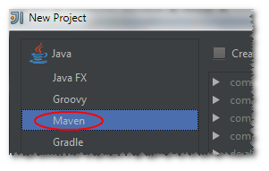
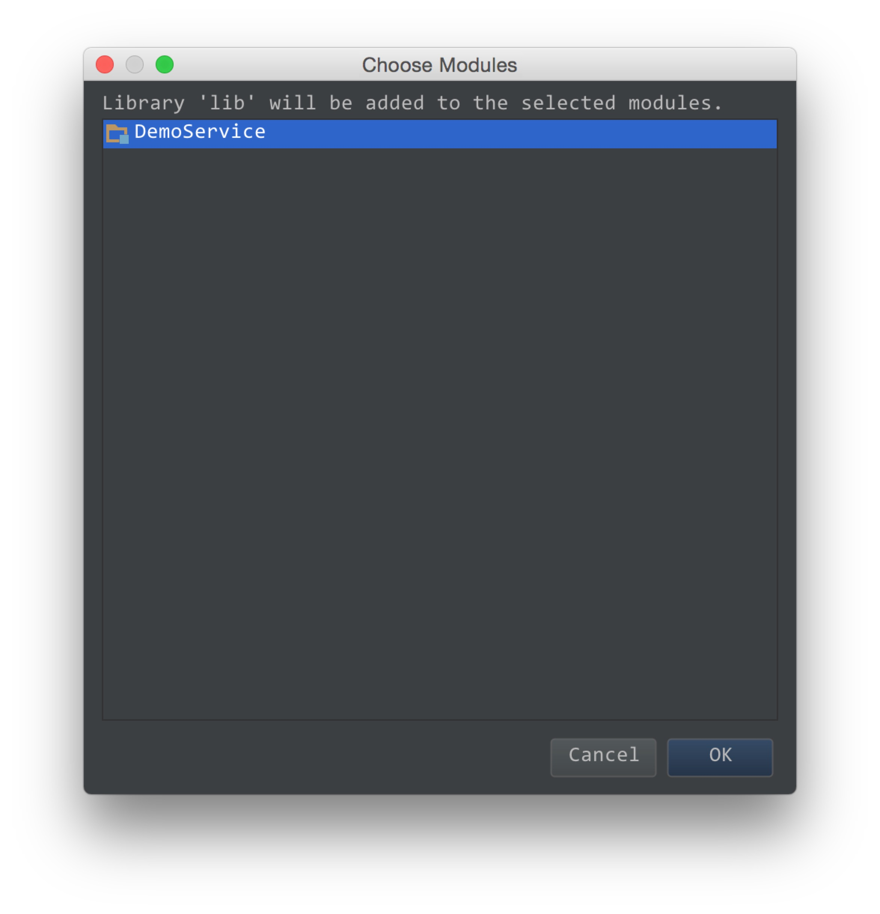

#云端自定义服务开发指导

#开发准备

本章先介绍UDS（User Defined Service）在AbleCloud平台上的发布要求，然后以官网上发布的DemoService为基础，介绍如何在本地运行UDS服务，以及如何开发自己的UDS服务。

##UDS发布说明
开发者可通过AbleCloud开发者管理控制台提交、运行UDS。提交和运行UDS时，要求其目录结构与AbleCloud发布的java版本服务开发框架一致，如下所示。
```java
/config
	/cloudservice-conf.xml
/lib
	/ablecloud-framework-1.1.0.jar
    /ac-java-api-1.0.0.jar
	/commons-collections-3.2.1.jar
    /commons-configuration-1.10.jar
    /commons-lang-2.6.jar
    /slf4j-api-1.7.7.jar
    /...
start.sh
start.cmd
```

><font color=red>注意事项：</font>

>1. 所有依赖的第三方jar包，均放在lib文件夹下。其中包括AbleCloud的服务框架`ablecloud-framework-1.1.0.jar`和`ac-java-api-1.0.0.jar`。根据AbleCloud的发行状态，各jar包的版本号可能不同。

>1. 开发者开发的自定义服务也编译成jar包，并置于lib文件夹下。同时，还要在pom.xml里的`<additionalClasspathElement>`标签下添加测试依赖。

>1. 按上述目录结构将所有文件压缩、打包成一个ZIP文件（文件名可自取）。要求ZIP文件解压缩后能直接得到上述目录或文件，不能存在其它中间层次的目录。

>1. 在开发者管理控制台中提交压缩后的ZIP文件，之后即可通过“上线”/“下线”功能管理UDS的运行状态。

##本机运行UDS

**本机运行UDS要求已安装Java的运行时环境JRE（推荐1.7或更新版本）。**

1、首先，从AbleCloud官网下载栏目下载DemoService.zip，解压后进入package目录，修改config文件夹下的cloudservice-conf.xml文件。
```xml
<?xml version="1.0" encoding="UTF-8"?>
<configuration>
	<developer>
		<!-- 对应“个人信息->个人信息->开发者ID” -->
		<id>4</id>
	</developer>

	<authentication>
		<!-- 对应“密钥对管理->全部密钥对”，选择已启用的任意一对。 -->
		<access-key>33df24a54054067e80af49d939b429c2</access-key>
		<secret-key>5e2fec3440e23c5e807910b13b672015</secret-key>
	</authentication>

	<service>
		<!-- 此处为本机启动的端口号 -->
		<port>8080</port>
		<!-- 对应“产品管理->产品列表->主域名” -->
		<major-domain>ablecloud</major-domain>
		<!-- 对应“产品管理->产品列表->子域” -->
		<sub-domain>demo</sub-domain>
	</service>
</configuration>
```
	
><font color="brown">**注：**开发者ID，access-key，secret-key等信息，均能登录AbleCloud网站（开发者管理控制台）获取。其它项不需要修改。</font>

2、随后，通过开发者管理控制台提供的界面新建数据集“light-action-data”。数据集的结构如下所示：


3、接下来就可以在本地启动服务并进行测试。

<b>*linux*</b>下在终端运行如下命令启动服务：
```sh
sh start.sh
```
<b>*windows*</b>下在cmd中运行如下命令启动服务：
```cmd
start.cmd 
```

本地启动成功后，可使用curl命令进行开灯测试。

<b>*linux*</b>下使用curl命令：
```curl
curl -v -X POST -H "Content-Type:application/x-zc-object"  -H "X-Zc-Major-Domain:ablecloud" -H "X-Zc-Sub-Domain:test" -H "X-Zc-User-Id:1" -d '{"deviceId":1,"action":"on"}' 'http://localHost:8080/controlLight'
```
<b>*windows*</b>下使用curl命令请求：
```curl
curl -v -X POST -H "Content-Type:application/x-zc-object" -H "X-Zc-Major-Domain:ablecloud" -H "X-Zc-Sub-Domain:test" -H "X-Zc-User-Id:1" --data-ascii "{\"deviceId\":1,\"action\":\"on\"}" "http://localHost:8080/controlLight"
```
><font color="red">**注：**</font>

>1. 请按实际情况修改`X-Zc-Major-Domain`、`X-Zc-Sub-Domain`、`X-Zc-User-Id`和`deviceId`的值。
`X-Zc-Major-Domain`是开发者帐号的主域的名字；`X-Zc-Sub-Domain`是要访问的服务所关联的子域的名字；`deviceId`是要被控制的设备的逻辑ID；`X-Zc-User-Id`是对设备发起控制指令的用户的ID。
前两个参数是开发者在AbleCloud平台开通开发者帐号，并创建产品后就生成的信息。后两个参数要求有用户绑定了开发者所提供的产品。

>2. 例子中访问的controlLight方法需要参数`X-Zc-User-Id`和`deviceId`，但这两个参数并不是访问所有方法都必须的。需要根据开发者的UDS的具体实现提供不同的参数。

##开发工具设置

熟悉上述流程之后，可以开始开发自己的UDS程序。以下从新建maven工程开始逐步介绍开发步骤。

####系统准备
在进行开发前，需要对系统以及环境进行设置。目前框架只支持java语言，因此系统准备基本都是和java相关，如JDK、maven等。

+ **JDK** 

	安装JDK，建议采用1.7版本JDK。
    
+ **maven**

	安装maven，建议采用3.2以上版本。
    
+ **AbleCloud SDK**

	下载ablecloud-framework-1.1.0.zip。

####Intellij
1. **新建工程**
	
    选择新建maven工程，JDK选择正确的版本。
    
    
    
    选择**maven**工程。
    
    
    
    注意JDK版本选择安装的1.7。点击**next**即可。
    
    
    
    进入下一个页面，根据情况填写groupid/artifactid/version等信息。
    
    
    
    填好后点击**next**，进入下一步，填写工程名以及存放路径。
    
    
    
    然后点击**finish**完成新建工程向导。
    
    
    
    至此，新建工程完成。
    
1. **布署AbleCloud框架便于本机测试以及提交版本**
    
    新建package目录，将ablecloud-framework-1.1.0.zip解压到package目录下。
   
1. **设置工程**

	按照步骤1完成了工程的新建，还需对工程属性进行一些设置以方便后续的编译、单测。
    点击**File** -> **Project Structure...**
    
    
    
    首先设置工程所使用的JDK版本1.7和语言级别7.0。
    
    
    
    设置开发服务所要依赖的AbleCloud框架包：同上，打开**Project Structure...**,然后选择**Libraries**，点击右边的**+**号，选择**Java**，如下图所示。
    
    
    
    在弹出的对话框中选择下载并解压后的AbleCloud中的lib目录，并点击**OK**。
    
    
    
    回到上一个窗口后再次点击**OK**确认。
    
    
    
    这个过程中，我们可以对添加的lib库重命名（可选），例如这里重命名为**ablecloud-libs**。点击**OK**完成添加。
    
    
    
    完成上述步骤后，我们将在工程视图里面看到新添加的该目录，如下：
    
    )
    
    至此，UDS开发所依赖的AbleCloud开发框架库添加成功。
    
1. **修改pom.xml文件**

	下面是一个示例服务的完整pom.xml文件：
    
		<?xml version="1.0" encoding="UTF-8"?>
		<project xmlns="http://maven.apache.org/POM/4.0.0"
         	xmlns:xsi="http://www.w3.org/2001/XMLSchema-instance"
         	xsi:schemaLocation="http://maven.apache.org/POM/4.0.0 http://maven.apache.org/xsd/maven-4.0.0.xsd">
    		<modelVersion>4.0.0</modelVersion>

    		<groupId>com.ablecloud.demo</groupId>
            <artifactId>DemoService</artifactId>
            <version>1.1.0</version>

            <properties>
                <ablecloud.lib.dir>./package/lib</ablecloud.lib.dir>
            </properties>

    		<build>
	        	<plugins>
	            	<plugin>
	                	<!--this plugin and dependency jars are used for testing-->
	                	<groupId>org.apache.maven.plugins</groupId>
	                	<artifactId>maven-surefire-plugin</artifactId>
	                	<version>2.18.1</version>
                        <dependencies>
                    		<dependency>
                        		<groupId>org.apache.maven.surefire</groupId>
                        		<artifactId>surefire-junit47</artifactId>
                        		<version>2.18.1</version>
                    		</dependency>
                		</dependencies>
	                	<configuration>
	                    	<additionalClasspathElements>
    	                    	<additionalClasspathElement>${ablecloud.lib.dir}/ablecloud-framework-1.1.0.jar</additionalClasspathElement>
                                <additionalClasspathElement>${ablecloud.lib.dir}/ac-java-api-1.0.0.jar</additionalClasspathElement>
        	                	<additionalClasspathElement>${ablecloud.lib.dir}/slf4j-log4j12-1.7.7.jar</additionalClasspathElement>
            	            	<additionalClasspathElement>${ablecloud.lib.dir}/slf4j-api-1.7.7.jar</additionalClasspathElement>
                	        	<additionalClasspathElement>${ablecloud.lib.dir}/log4j-1.2.17.jar</additionalClasspathElement>
                    	    	<additionalClasspathElement>${ablecloud.lib.dir}/junit-4.11.jar</additionalClasspathElement>
                                <additionalClasspathElement>${ablecloud.lib.dir}/hamcrest-core-1.3.jar</additionalClasspathElement>
                        		<additionalClasspathElement>${ablecloud.lib.dir}/commons-configuration-1.10.jar</additionalClasspathElement>
                        		<additionalClasspathElement>${ablecloud.lib.dir}/commons-collections-3.2.1.jar</additionalClasspathElement>
                        		<additionalClasspathElement>${ablecloud.lib.dir}/commons-lang-2.6.jar</additionalClasspathElement>
	                        	<additionalClasspathElement>${ablecloud.lib.dir}/commons-logging-1.1.1.jar</additionalClasspathElement>
    	                    	<additionalClasspathElement>${ablecloud.lib.dir}/jetty-all-9.2.10.v20150310.jar</additionalClasspathElement>
        	                	<additionalClasspathElement>${ablecloud.lib.dir}/jackson-core-2.3.2.jar</additionalClasspathElement>
            	            	<additionalClasspathElement>${ablecloud.lib.dir}/jackson-annotations-2.3.2.jar</additionalClasspathElement>
                	        	<additionalClasspathElement>${ablecloud.lib.dir}/jackson-databind-2.3.2.jar</additionalClasspathElement>
                    		</additionalClasspathElements>
	                	</configuration>
	            	</plugin>
	            	<plugin>
    	            	<groupId>org.apache.maven.plugins</groupId>
            	    	<artifactId>maven-compiler-plugin</artifactId>
                        <version>3.3</version>
        	        	<configuration>
                	    	<source>1.7</source>
                    		<target>1.7</target>
                    		<encoding>UTF-8</encoding>
                    		<compilerArguments>
	                        	<extdirs>${ablecloud.lib.dir}</extdirs>
    	                	</compilerArguments>
        	        	</configuration>
            		</plugin>
            		<plugin>
                		<groupId>org.apache.maven.plugins</groupId>
                		<artifactId>maven-jar-plugin</artifactId>
                        <version>2.6</version>
                		<executions>
	                    	<execution>
	    	                    <phase>package</phase>
    	    	                <goals>
        	    	                <goal>jar</goal>
            	    	        </goals>
                	    	</execution>
                		</executions>
                		<configuration>
                    		<outputDirectory>${ablecloud.lib.dir}</outputDirectory>
                		</configuration>
            		</plugin>
        		</plugins>
    		</build>
		</project>

    完整拷贝该示例pom.xml文件内容，其中绝大部分内容都无须修改，开发者仅需修改如下几个配置项即可：
    
    	<project>
    		<groupId>your service group id</groupId>
       		<artifactId>your service artifact id</artifactId>
       		<version>your service version</version>
    	</project>
        
    注意其他配置项**一定不能修改**，否则单测将无法通过。开发者不用担心该配置项，线上环境该配置项自动失效。
        
1. **修改配置文件**


	配置文件位于AbleCloud发行库的config文件夹下，名字为cloudservice-conf.xml。
    
		<?xml version="1.0" encoding="UTF-8"?>
		<configuration>
	    	<developer>
                <!-- 对应“个人信息->个人信息->开发者ID” -->
        		<id>4</id>
    		</developer>

    		<authentication>
                <!-- 对应“密钥对管理->全部密钥对”，选择已启用的任意一对即可。 -->
        		<access-key>33df24a54054067e80af49d939b429c2</access-key>
        		<secret-key>5e2fec3440e23c5e807910b13b672015</secret-key>
        		<timeout>5000</timeout>
	    	</authentication>

    		<framework>
        		<router>test.ablecloud.cn:5000</router>
    		</framework>

    		<service>
                <!-- 此处为继承ACService的类的名称以及其相对路径 -->
        		<name>DemoService</name>
        		<class>com.ablecloud.demo.DemoService</class>
                <!-- 此处为本机启动的端口号 -->
        		<port>8080</port>
                <!-- 对应“产品管理->产品列表->主域名” -->
        		<major-domain>ablecloud</major-domain>
                <!-- 对应“产品管理->产品列表->子域” -->
        		<sub-domain>demo</sub-domain>

                <!-- 以下为主版本号，副版本号，修订版本号 -->
        		<major-version>1</major-version>
        		<minor-version>0</minor-version>
        		<patch-version>0</patch-version>
    		</service>
		</configuration>
	
    
    ><font color="brown">**注:**</font>开发者ID，access-key，secret-key等信息，均能登录AbleCloud网站（开发者管理控制台）获取。除了**service.class**配置项在本地测试环境和AbleCloud云端环境均生效外，其它配置项只在本地测试环境有效，而AbleCloud云端环境将忽略这些配置项。
    
	至此，即完成了新建一个工程所需的所有准备工作以及环境配置，接下来可以开始UDS的业务逻辑开发。
    
1. **新建Class并继承ACService**

    参照DemoService或者[云端服务开发参考](../reference/cloud.md)里关于ACSevice的介绍。
    
1. **编译单测**

	在IDE的终端（terminal）或系统终端中运行命令`mvn package`即可完整的执行编译、单元测试（如果写了单测代码的话）。
    
1. **本地运行**

	如果编译、单测都没有问题，则将编译出来的服务jar包（在服务工程主目录下的target/lib目录下）拷贝到AbleCloud框架的lib目录下。之后，在AbleCloud的框架主目录执行AbleCloud提供的脚本`sh start.sh`或`start.cmd`，即可在您的开发机上启动您编写好的服务程序。
    
	><font color="brown">**注：**</font>服务启动所需的参数，如域名、版本、端口等信息均在xml的配置文件中设置。
    
1. **提交到平台**

	将AbleCloud的config目录、lib目录（含编译好的UDS服务jar包），以及start.sh文件等压缩、打包为一个zip文件，通过AbleCloud的Web管理控制台提交。

####Eclipse
1. **新建工程**

	选择**File-->New-->Project...**。
    
    
    
    选择**maven**工程。
    
    
    
    点击**Next**进入下一步。
    
    
    
    填写groupId,artifactId,version等信息，并点击**Finish**完成新建工程。
    
    
    
1. **设置工程**
	在工程视窗右键点击步骤1中新建的工程进行工程设置。或者点击菜单栏**Project-->Properties**进行设置。
    
    
    
    首先设置工程对AbleCloud发行库的依赖。如图选择**Java Build Path**的**Libaries**标签页，点击**Add Library...**。
    
    
    
    在**Add Library**页选择**User Library**。
    
    
    
    继续点击**User Libraries...**按钮。
    
    
    
    然后点击**New...**新建一个用户library文件夹。
    
    
    
    这里可以给该用户lib重命名，如图中命名为ablecloud-libs，点击**OK**完成。
    
    
    
    回到**User Libraries**页面，点击右方的**Add External JARs...**按钮，选择下载并解压的AbleCloud发行库中的**lib**目录，将该目录中所有的jar文件添加到新建的user library中。
    
    
    
    勾选上新建的user library，并点击**Finish**将AbleCloud的jar文件添加到新建的工程中。
    
    
    
    下面进行java语言的设置，类似上面的设置，先进入**Properties**窗口，选择**Java Compiler**，**去掉**默认的*Use compliance from execution environment...*，并且选择*Compiler compliance level*为**1.7**。
    
    
    
1. **修改pom.xml文件**

	同**intellij**章节。
    
1. **修改配置文件**

	同**intellij**章节。

1. **编译单测**

	TBD

1. **本地运行**

	同**intellij**章节。
    
1. **提交到平台**

	同**intellij**章节。
   


#UDS Demo
这里我们以一个完整的demo程序做示例，通过真实代码介绍如何基于ACService开发用户自己的服务程序。demo场景不一定完全符合常识，其目的是为了尽量简单而全面的演示服务框架提供的功能。
##场景介绍
本示例场景有一智能灯，可以通过手机端向云端发消息远程控制灯的开/关，云端服务把这些APP发来的控制行为记录到AbleCloud提供的云存储中。同时，智能灯也可能由用户通过机械开关起停，智能灯将这类开/关事件也主动汇报到服务端，我们写的服务程序将这类主动汇报的开/关数据也存到云存储中。所有存储在云存储中的数据，可提供给APP查询，比如可用于统计用户的作息习惯等。
##实现步骤
先简单分析下需求，然后梳理出实现步骤。

>1. 要开发服务程序，需从`ACService`派生子类来实现自己的服务框架。本示例中，`DemoService`就是继承自`ACService`的子类；
>1. 服务要接收来自APP对灯的远程控制命令，也会接收来自APP的数据查询请求，因此必须为`handleMsg`提供具体的实现handler；
>1. 服务要向智能灯发送控制命令，因此我们需要和灯以及APP端定义具体的控制消息格式`LightMsg`；
>1. 【使用KLV通讯格式则跳过此步骤】在步骤3定义好了消息格式后，我们还需要根据`ACDeviceMsgMarshaller`实现具体的消息序列化/反序列化器`LightMsgMarshaller`；最后重载`ACService`的`init`接口，将序列化器设置到`ac`框架中；
>1. 服务要接收智能灯汇报的开/关消息，因此必须为`handleDeviceMsg`提供具体的实现handler。

##具体实现
###DemoService
`DemoService`为自定义服务的主要逻辑处理类，通过`handleMsg`处理APP端发来的消息，通过`handleDeviceMsg`处理设备上报上来的消息。
当前为了简单，在`DemoService`中实现了两个具体的处理函数`handleControlLight`和`handleQueryData`。在`DemoService`中只实现了一个具体的处理函数`handleLightReport`。开发者可以根据业务需求任意扩展handler。
```java
package com.ablecloud.demo;

import com.ablecloud.common.*;
import com.ablecloud.service.ACDeviceStub;
import com.ablecloud.service.ACService;
import org.slf4j.Logger;
import org.slf4j.LoggerFactory;
import java.util.List;

public class DemoService extends ACService {
    private static final Logger logger = LoggerFactory.getLogger(DemoService.class);
    private static final String DATA_CLASS_NAME = "light_action_data";


    /**
     * 重载init函数。
     * 因为我们的服务要处理和设备交互的消息，因此在该函数中将序列化/反序列化器设置到ac框架中。
     *
     * @throws Exception
     */
    public void init() throws Exception {
        ac.setDeviceMsgMarshaller(new LightMsgMarshaller());
    }

    /**
     * 处理来自APP或其它service发来消息的入口函数
     *
     * @param req  请求消息
     * @param resp 响应消息
     * @throws Exception
     */
    public void handleMsg(ACMsg req, ACMsg resp) throws Exception {
        String name = req.getName();
        if (name != null) {
            switch (name) {
                case "controlLight":
                    handleControlLight(req, resp);
                    break;
                case "queryData":
                    handleQueryData(req, resp);
                    break;
                default:
                    logger.warn("got an invalid request, method[" + name + "] is not implemented.");
            }
        } else {
            logger.warn("got an invalid request, method name is empty.");
        }
    }

    /**
     * 处理来自设备上报消息的入口函数
     *
     * @param context          上下文信息，在设备联动情况下，可能会跨子域访问
     * @param deviceId         设备的逻辑id
     * @param physicalDeviceId 设备的物理id
     * @param req              设备上报消息
     * @throws Exception
     */
    public void handleDeviceMsg(ACContext context, long deviceId, String physicalDeviceId, ACDeviceMsg req) throws Exception {
        Integer msgCode = req.getCode();
        switch (msgCode) {
            case LightMsg.REPORT_CODE:
                handleLightReport(context, deviceId, req);
                break;
            default:
                logger.warn("got an unknown report, opcode[" + msgCode + "]");
        }
    }

    //////////////////////////////////////
    // 具体的私有handler

    /**
     * 处理来自APP端的智能灯控制命令，再将命令发往具体的设备
     * <p/>
     * 实际上，厂商在实现后端服务的时候，通常情况下自定义服务不用处理APP端发来的设备控制请求也
     * 能实现远程控制。因为ablecloud在云端提供了设备管理服务，APP通过APP端的sendToDevice
     * 接口可以将控制命令远程发往ablecloud的设备管理服务，设备管理服务再将控制命令发给设备。
     * <p/>
     * 本示例在开发者自定义的这个服务中实现对灯的控制，一方面是为了展示后端服务的灵活性，可以作
     * 各种事情，包括对设备的控制，比如后端服务在多设备联动的时候，可能会主动往设备发控制命令。
     *
     * @param req  请求消息
     * @param resp 响应消息
     * @throws Exception
     */
    private void handleControlLight(ACMsg req, ACMsg resp) throws Exception {
        Long lightId = req.get("deviceId");
        String action = req.get("action");
        byte deviceAction;
        if (action.equalsIgnoreCase("on")) {
            deviceAction = LightMsg.ON;
        } else
            deviceAction = LightMsg.OFF; 
        //使用二进制通讯格式
        ACDeviceMsg deviceReqMsg = new ACDeviceMsg(LightMsg.CODE, new LightMsg(deviceAction, LightMsg.FROM_APP));
        /*
        //使用KLV通讯格式
        ACKLVObject object = new ACKLVObject();
        object.put(Scheme.KEY_ACTION, deviceAction);
        ACDeviceMsg deviceReqMsg = new ACDeviceMsg(LightMsg.CODE, object);
        ACDeviceMsg deviceRespMsg;
        ACDeviceMsg deviceRespMsg;
        */
        try {
            // 通过ac框架的sendToDevice接口，向灯发送控制命令
            deviceRespMsg = ac.bindMgr(req.getContext()).sendToDevice(req.getContext().getSubDomainName(), lightId, deviceReqMsg);
            // 获取控制开关结果【二进制通讯格式】
            byte result = (Byte) deviceRespMsg.getContent();
            /*
            // 获取控制开关结果【KLV通讯格式】
            ACKLVObject result = (ACKLVObject) deviceRespMsg.getContent();
            */
            resp.put("result", result == 1 ? "success" : "fail");
            resp.setAck();
            logger.info("handle control light ok, action[" + action + "].");
        } catch (ACServiceException e) {
            resp.setErr(e.getErrorCode(), e.getErrorMsg());
            logger.error("send to device[" + lightId + "] error:", e);
        }
    }

    /**
     * 处理智能灯汇报的消息，在该函数中，服务还将收到的汇报数据写入ablecloud提供的云端存储中。
     *
     * @param context  汇报设备的上下文数据，包括主域/子域等。
     * @param deviceId 汇报设备的逻辑id
     * @param req      汇报的消息
     * @throws Exception
     */
    private void handleLightReport(ACContext context, long deviceId, ACDeviceMsg req) throws Exception {
        try {
            LightMsg lightMsg = (LightMsg) req.getContent();
            byte onOff = lightMsg.getLedOnOff();
            byte type = lightMsg.getType();
            long timestamp = System.currentTimeMillis();
            // 通过ac框架，将智能灯汇报的数据存入云端存储
            ac.store(DATA_CLASS_NAME, context)
                    .create("deviceId", deviceId, "time", timestamp)
                    .put("action", onOff)
                    .put("type", type)
                    .execute();
        } catch (ACServiceException e) {
            logger.error("handle light report error:", e);
        }
    }

    /**
     * 处理APP端发来的数据查询，并将查询到的智能等开/关记录数据返回
     *
     * @param req  请求消息
     * @param resp 响应消息
     * @throws Exception
     */
    private void handleQueryData(ACMsg req, ACMsg resp) throws Exception {
        Long lightId = req.get("deviceId");
        Long startTime = req.get("startTime");
        Long endTime = req.get("endTime");
        try {
            List<ACObject> zos = ac.store(DATA_CLASS_NAME, req.getContext())
                    .scan("deviceId", lightId)
                    .start("time", startTime)
                    .end("time", endTime)
                    .execute();
            if (zos != null) {
                resp.put("actionData", zos);
            }
            resp.setAck();
        } catch (ACServiceException e) {
            resp.setErr(e.getErrorCode(), e.getErrorMsg());
            logger.error("handle query data error:", e);
        }
    }
}
```

###LightMsg
`LightMsg`是控制灯开/关的消息（命令），需要设备/APP/服务三方共同确定。如果服务需要和其它类型的智能设备交互，则再定义其它的message即可。
```java
package com.ablecloud.demo;

class LightMsg {
    public static final int CODE = 68;
    public static final int RESP_CODE = 102;
    public static final int REPORT_CODE = 203;

    //0代表关，1代表开
    public static final byte ON = 1;
    public static final byte OFF = 0;
    //控制类型，0代表app控制，1代表物理开关控制
    public static final byte FROM_APP = 0;
    public static final byte FROM_SWITCH = 1;

    private byte ledOnOff;
    private byte type;

    public LightMsg(byte ledOnOff, byte type) {
        this.ledOnOff = ledOnOff;
        this.type = type;
    }

    public byte getLedOnOff() {
        return ledOnOff;
    }

    public byte getType() {
        return type;
    }
}
```

###LightMsgMarshaller
该序列化/反序列化器用于序列化智能灯控制消息，如果一个服务会和多类智能设备交互，则在你自定义的marshaller中可以对多种设备消息进行序列化/反序列化操作。
```java
package com.ablecloud.demo;

import com.ablecloud.common.ACDeviceMsg;
import com.ablecloud.common.ACDeviceMsgMarshaller;

import java.nio.ByteBuffer;
import org.slf4j.Logger;
import org.slf4j.LoggerFactory;

public class LightMsgMarshaller implements ACDeviceMsgMarshaller {
    private static final Logger logger = LoggerFactory.getLogger(LightMsgMarshaller.class);

    /**
     * 将具体的ACDeviceMsg序列化成字节数组，用于控制灯时通过网络传输给灯
     *
     * @param msg 设备消息
     * @return 序列化后的字节数组
     * @throws Exception
     */
    public byte[] marshal(ACDeviceMsg msg) throws Exception {
        int msgCode = msg.getCode();
        ByteBuffer bb;
        switch (msgCode) {
            case LightMsg.CODE:
                LightMsg lightMsg = (LightMsg) msg.getContent();
                bb = ByteBuffer.allocate(4);
                bb.put(lightMsg.getLedOnOff());
                byte[] pad = new byte[3];
                bb.put(pad);
                return bb.array();
            default:
                logger.warn("got an unknown msgCode[" + msgCode + "]");
                return null;
        }
    }

    /**
     * 将通过网络收到的字节数组数据，反序列化成具体的消息，以便从消息中提取各个字段。
     *
     * @param msgCode 消息码，ablecloud也称为操作码opCode
     * @param payload 设备消息序列化后的字节数组
     * @return 设备消息
     * @throws Exception
     */
    public ACDeviceMsg unmarshal(int msgCode, byte[] payload) throws Exception {
        ByteBuffer bb;
        switch (msgCode) {
            case LightMsg.RESP_CODE:
                bb = ByteBuffer.wrap(payload);
                byte result = bb.get();
                return new ACDeviceMsg(msgCode, result);
            case LightMsg.REPORT_CODE:
                bb = ByteBuffer.wrap(payload);
                byte ledOnOff = bb.get();
                byte ledType = bb.get();
                byte[] pad = new byte[2];
                bb.get(pad);
                return new ACDeviceMsg(msgCode, new LightMsg(ledOnOff, ledType));
            default:
                logger.warn("got an unknown msgCode[" + msgCode + "]");
                return null;
        }
    }
}
```

前文的代码实现了本示例的全部功能。在终端运行`mvn package`即可编译成jar包。你可以开发更多好玩的逻辑，比如多设备联动：当某些设备上报的数据达到设置的规则时，触发另外的设备做出响应。
对该服务的测试见后文的相关章节。

# 后台任务Demo
本小结介绍一个AbleCloud云端定时任务示例。

一个完整的云端定时任务由两部分组成：

1. **定时规则**：定义任务的执行时间。

1. **定时任务可执行程序**

其中，定时规则是由开发者在AbleCloud控制台中创建定时任务时设置。本小结介绍的示例是开发定时任务的可执行程序。

### 场景介绍
本示例的可执行程序完成的任务仅是打印一条日志：任务执行的实际时间。

在AbleCloud控制台中创建该定时任务时，设置的定时规则是“\*/2 \* \* \* \*”，表示每隔2分钟执行一次本任务。

### 实现思路
1. 按要求从ACCronJob派生子类型，在派生类中实现父类定义的抽象方法ACCronJob::run；
1. 通过AbleCloud控制台创建定时任务，设置任务的定时规则；
1. 通过AbleCloud控制台上传任务的可执行程序，创建定时任务的版本，然后“上线”该版本以启动该定时任务。

### 可执行程序的具体实现
下文示例中，DemoCronJob是ACCronJob的派生类型，并且实现了父类定义的抽象方法ACCronJob::run。
~~~
package  com.ablecloud.demo;

import com.ablecloud.service.ACCronJob;
import org.slf4j.Logger;
import org.slf4j.LoggerFactory;

public class DemoCronJob extends ACCronJob {
	// 日志工具
    private static final Logger logger = LoggerFactory.getLogger(DemoCronJob.class);

    @Override
    public int run() throws Exception {
    	// 在日志中记录任务的执行时间
        logger.info("任务执行时间：" + new java.util.Date().toString() + "。");
        return 0;	// 返回状态码0,表示任务执行成功。
    }
}
~~~

#测试简介
上一章节，我们一步步开发了一个完整的服务程序`DemoService`。代码是写完了，如何验证我们写的代码是否正常工作呢，比如自定义的`LightMsgMarshaller`逻辑是否正确，`DemoService`能否正确处理APP的请求，能否正确控制智能灯，能否正确接收智能灯的汇报消息，能否将汇报数据写入云端存储等，都少不了测试。测试根据阶段分为多种，比如单元测试、模块测试、集成测试等。考虑到后端服务的复杂性，AbleCloud提供了多种测试方案，下面会一一介绍。

##单元测试
准备工作做好后，就可以开始我们的测试了，我们的单元测试采用org.apache.maven.surefire插件结合junit来完成。
###测试LighMsgMarshaller
该测试很简单，不与任何后端服务交互，纯粹的测试计算逻辑，用于测试序列化/反序列化逻辑正确与否。
```java
package com.ablecloud.demo;

import com.ablecloud.common.ACDeviceMsg;

import org.junit.After;
import org.junit.Before;
import org.junit.Test;
import static org.junit.Assert.*;

public class LightMsgMarshallerTest {
    @Before
    public void setUp() throws Exception {
    }

    @After
    public void tearDown() throws Exception {
    }

    @Test
    public void testLightMsg() {
        LightMsg msg = new LightMsg(LightMsg.ON, LightMsg.FROM_APP);
        LightMsgMarshaller marshaller = new LightMsgMarshaller();
        ACDeviceMsg deviceMsg = new ACDeviceMsg(LightMsg.CODE, msg);
        byte[] req = null;
        try {
            req = marshaller.marshal(deviceMsg);
            assertNotNull(req);
            assertEquals(4, req.length);
        } catch (Exception e) {
            System.out.println("marshal light msg error: " + e.toString());
            fail("test marshal light msg fail");
        }

        try {
            byte[] resp = new byte[]{LightMsg.ON, 0, 0, 0};
            ACDeviceMsg respDeviceMsg = marshaller.unmarshal(LightMsg.RESP_CODE, resp);
            assertEquals(LightMsg.RESP_CODE, respDeviceMsg.getCode());
            byte result = (Byte) (respDeviceMsg.getContent());
            assertEquals(1, result);
        } catch (Exception e) {
            System.out.println("unmarshal light msg error: " + e.toString());
            fail("test unmarshal light msg fail");
        }
    }
}
```

><font color="red">**注：**测试用例的执行，也是通过`mvn package`来驱动并查看测试结果。在AbleCloud提供的示例pom.xml中，配置了该命令除了将开发的服务打包成jar文件外，也会执行单元测试代码——如果开发者编写了单元测试代码。</font>

###测试DemoService
具体的服务代码测试相对复杂，一方面其依赖的云端服务比较多；另一方面作为服务框架，在没有client，没有设备的情况下驱动测试，需要一些技巧。为此，AbleCloud为开发者提供了一系列便于测试用的功能，详细介绍如下。

####测试demo
通过前面的介绍，UDS的大部分功能是由`handleMsg`或`handleDeviceMsg`的各个handler提供的，因此测试工作也集中于对各个handler的测试。在单元测试过程中，无须通过任何client工具驱动，即可完成自动化的单元测试。

这里通过一个完整的测试代码演示如何对DemoService进行测试。测试代码中有详细的注释。
```java
package com.ablecloud.demo;

import com.ablecloud.common.*;
import com.ablecloud.service.AC;
import com.ablecloud.service.ACStore;
import org.junit.AfterClass;
import org.junit.BeforeClass;
import org.junit.FixMethodOrder;
import org.junit.runners.MethodSorters;
import org.junit.Test;

import java.util.List;

import static org.junit.Assert.assertEquals;
import static org.junit.Assert.fail;

/**
 * Created by chenpeng on 15-1-18.
 */
@FixMethodOrder(MethodSorters.NAME_ASCENDING)
public class DemoServiceTest {
    // 我们会在多个测试case中用到以下的成员，并且只需要初始化一次，
    // 因此我们定义为static的
    private static ACConfiguration config;  // 测试过程的配置信息，在cloudservice-conf.xml中配置
    private static AC ac;                   // 测试用的AC框架，正式环境由框架初始化，开发者不用关注
    private static DemoService demoService; // 我们开发的服务
    private static ACAccount account;       // 用于保存测试的帐号信息
    private static ACUserDevice light;          // 用于保存测试的设备信息

    // 在所有的test case执行前初始化一次
    @BeforeClass
    public static void setUp() throws Exception {
        try {
            // 这里初始化config对象，必须指定测试环境配置文件的绝对路径，否则会找不到配置文件
            config = new ACConfiguration("cloudservice-conf.xml");
            ac = AC.getTestAc(config);          // 通过AC的接口获取用于测试的ac框架

            demoService = new DemoService();
            demoService.setEnv(ac, config);     // 需要调用该接口，将框架ac赋予demoService
            demoService.init();                 // 初始化demoService，将marshshaller设置给ac

            // 使用开发者权限创建一个测试账号
            account = ac.accountMgrForTest(ac.newContext()).register("test@ablecloud.cn", "13100000000", "pswd");
            // 使用注册的测试账号绑定一个虚拟的测试设备
            light = ac.bindMgrForTest(ac.newContext(account.getUid())).bindDevice("11111111", "light1");
        } catch (Exception e) {
            e.printStackTrace();
            fail("set up fail");
        }
    }


    @AfterClass
    public static void tearDown() throws Exception {
        // 执行完test后，需要解绑setUp绑定的测试设备，同时注销测试账号，确保下次单测能顺利通过
        ac.bindMgrForTest(ac.newContext(account.getUid())).unbindDevice(light.getId());
        // 注意，这里需要传入开发者context
        ac.accountMgrForTest(ac.newContext()).deleteAccount("13100000000");
        // 清除store开关记录的所有数据
        ac.storeForTest(ac.newContext()).clearClass("light_action_data")
                .execute();
    }

    @Test
    public void test1ControlLight() throws Exception {
        try {
            // 创建一个用户的context
            ACContext context = ac.newContext(account.getUid());
            // 添加一个灯的桩
            demoService.addDeviceStub(config.getSubDomain(), new LightStub());

            // 下面构造client发送的请求参数
            ACMsg req = new ACMsg();
            req.setContext(context);            // 将上面用户的context传入
            req.setName("controlLight");        // 设置请求消息的名字
            req.put("deviceId", light.getId()); // 设置要控制灯的逻辑id
            req.put("action", "on");            // "on"表示开灯

            // 构造响应消息，用于接收服务端返回的消息
            ACMsg resp = new ACMsg();
            // 这里直接调用服务的处理handler，驱动测试
            demoService.handleMsg(req, resp);
            // 服务发送消息给设备后，设备会将处理结果代码返回
            // 在我们实现的LightStub中，比较结果是否正确
            assertEquals("success", resp.get("result"));
            // 成功打开灯之后，模拟设备进行数据上报
            try {
                ACDeviceMsg deviceMsg = new ACDeviceMsg(LightMsg.REPORT_CODE, new LightMsg(LightMsg.ON, LightMsg.FROM_APP));
                // 这里直接调用服务的设备消息处理handler，驱动测试
                // 这里由于设备汇报的消息中context没有用户id信息，随便填一个大于0的id即可
                demoService.handleDeviceMsg(ac.newContext(), light.getId(), light.getPhysicalId(), deviceMsg);
            } catch (Exception e) {
                e.printStackTrace();
                fail("test light report fail");
            }
        } catch (Exception e) {
            e.printStackTrace();
            fail("test control light fail");
        }
    }

    @Test
    public void test2LightReportAndQuery() throws Exception {
        // 先测试智能灯上报消息，将上报数据写入云端存储中
        try {
            LightMsg lightMsg = new LightMsg(LightMsg.ON, LightMsg.FROM_SWITCH);  // 1--on
            ACDeviceMsg acDeviceMsg = new ACDeviceMsg(LightMsg.REPORT_CODE, lightMsg);
            // 这里直接调用服务的设备消息处理handler，驱动测试
            // 这里由于设备汇报的消息中context没有用户id信息，随便填一个大于0的id即可
            demoService.handleDeviceMsg(ac.newContext(1), light.getId(), light.getPhysicalId(), acDeviceMsg);
        } catch (Exception e) {
            e.printStackTrace();
            fail("test light report fail");
        }

        // 这里用上面写入云端存储的数据来驱动测试app发来的数据查询请求处理handler
        try {
            ACMsg req = new ACMsg();
            ACMsg resp = new ACMsg();
            // 这里是模拟用户发的查询请求，因此需要设置用户的context
            req.setContext(ac.newContext(account.getUid()));
            req.setName("queryData");
            req.put("deviceId", light.getId());
            req.put("startTime", 0L);
            req.put("endTime", System.currentTimeMillis());
            // 这里直接调用服务的消息处理handler，驱动测试
            demoService.handleMsg(req, resp);
            List<ACObject> zos = resp.get("actionData");
            assertEquals(2, zos.size());
            for (ACObject zo : zos) {
                System.out.println("device[" + zo.get("deviceId") + "] time[" + zo.get("time") +
                        "] action[" + zo.get("action") + "]");
            }
        } catch (Exception e) {
            e.printStackTrace();
            fail("test query data fail");
        }
    }
}

```

><font color="red">**注意：**</font>可以看到，所有的单元测试用例均是直接调用`handleMsg`或`handleDeviceMsg`驱动测试，无需编写或使用client工具。

>此外，非常重要的一点，我们需要使用4.11及以上的junit，并且使用标签**@FixMethodOrder(MethodSorters.NAME_ASCENDING)**固定测试用例的执行顺序，因为我们的用例可能前后依赖。比如在test1ControlLight中写入数据，在后面的test case中会读取。因此，在为测试函数命名的时候，如果有前后依赖关系，需要考虑按ASCII字典序的命名规则。

####测试桩
从前面的场景分析我们知道，开发的DemoService会和灯交互，但是我们在开发服务的过程，很可能智能灯也在研发之中，还没有发布硬件产品。我们后端服务开发者不需要也不应该等待硬件设备开发完毕才做相应的功能测试。为此，AbleCloud在服务开发框架中定义了设备桩`ACDeviceStub`的接口，开发者只需要依照此接口实现具体的设备桩即可。
示例的桩处理很简单，实际上你可以任意扩展，比如在桩中模拟灯的各种状态。示例代码如下：
```java
package com.ablecloud.demo;

import com.ablecloud.service.ACDeviceMsg;
import com.ablecloud.service.ACDeviceStub;
import org.slf4j.Logger;
import org.slf4j.LoggerFactory;

public class LightStub extends ACDeviceStub {
    private static final Logger logger = LoggerFactory.getLogger(LightStub.class);

    public void handleControlMsg(String majorDomain, String subDomain,
                                 ACDeviceMsg req, ACDeviceMsg resp) throws Exception {
        int code = req.getCode();
        if (code != LightMsg.CODE) {
            logger.warn("got an incorrect opcode[" + code + "]");
            return;
        }
        resp.setCode(LightMsg.RESP_CODE);
        LightMsg reqMsg = (LightMsg) req.getContent();
        resp.setContent((byte) 1);
    }
}
```

##集成测试
单元测试通过后，我们还需要进行集成测试，因为单元测试的过程，我们并没有真正启动开发的服务，某些场景或代码路径不一定覆盖全，比如网络通信部分、服务框架部分等。
由于大部分逻辑在单元测试阶段均做了，因此集成测试相对简单，大致步骤如下：

###在本地机器或任意开发机上启动服务
按照[本机启动DemoService](#uds_1)小结的说明，通过运行`start.cmd`或`start.sh`启动服务。

<font color="red">**注意**</font>

1、运行`start.cmd`或`start.sh`的条件。执行启动命令的目录的子目录的结构要求如下所示：
```
/config
	/cloudservice-conf.xml
/lib
	/ablecloud-framework-1.1.0.jar
    /ac-java-api-1.0.0.jar
	/commons-collections-3.2.1.jar
    /commons-configuration-1.10.jar
    /commons-lang-2.6.jar
    /slf4j-api-1.7.7.jar
    /...
start.sh
start.cmd
```
2、服务启动成功后，会在根目录下生成`log`的文件夹，进入该文件夹查看`service.log`文件。若能看到如下日志，说明服务已经启动成功，可以进入下一个步骤了。
```
2015-09-08 17:37:47,047 INFO main:1 [ACServer.java:41:main] - Starting service...
2015-09-08 17:37:47,047 INFO main:1 [ACConfiguration.java:331:dumpConfig] - get config item[mode] value[test]
...
2015-09-08 17:37:47,047 INFO main:1 [Log.java:178:initialized] - Logging initialized @147ms
2015-09-08 17:37:47,047 INFO main:1 [Server.java:301:doStart] - jetty-9.1.5.v20140505
2015-09-08 17:37:47,047 INFO main:1 [AbstractConnector.java:266:doStart] - Started ServerConnector@4b27ad{HTTP/1.1}{0.0.0.0:8080}
2015-09-08 17:37:47,047 INFO main:1 [Server.java:350:doStart] - Started @206ms
2015-09-08 17:37:47,047 INFO main:1 [ACServer.java:80:main] - Start service teddy ok.
```

###用任意客户端发送http请求
使用任意客户端发送http请求测试自己的接口正确性，例如用curl或自己开发的客户端都可以。以下详细介绍如何使用curl命令进行进一步测试。
><font color="brown">**注：**AbleCloud提供的多种服务，其client和service之间的通信，底层采用http协议，方法为POST，因此任何能发送http请求的工具均可以用作服务测试的客户端。</font>

如：向我们开发的`DemoService`发送开灯命令：

####linux下使用curl命令
```curl
curl -v -X POST -H "Content-Type:application/x-zc-object"  -H "X-Zc-Major-Domain:ablecloud" -H "X-Zc-Sub-Domain:test" -H "X-Zc-User-Id:1" -d '{"deviceId":1,"action":"on"}' 'http://localHost:8080/controlLight'
```
####windows下使用curl命令请求
```curl
curl -v -X POST -H "Content-Type:application/x-zc-object" -H "X-Zc-Major-Domain:ablecloud" -H "X-Zc-Sub-Domain:test" -H "X-Zc-User-Id:1" --data-ascii "{\"deviceId\":1,\"action\":\"on\"}" "http://localHost:8080/controlLight"
```

其中`-H`指定头域ACContext的信息；`-d`指定的内容，是构造的ACMsg中的请求参数；`http://localHost:8080/controlLight`中的`ip:port`是你启动DemoService的主机和端口号；`controlLight`即为具体的方法，对应ACMsg设置的名字。
><font color="red">**注：**若在handleMsg接口的处理中使用`req.getContext()`获取请求的用户信息，则在构造http请求的时候，需要使用`-H`增加如下三个头域：`X-Zc-Major-Domain`、`X-Zc-Sub-Domain`、`X-Zc-User-Id`</font>。


#Store存储接口示例
以数据集`test_data`为例，假定其分区键为`deviceId`（字符串型）；主键为`deviceId`（字符串型）和`timestamp`（整型）；其他字段包括`status`（字符串型）、`mode`（字符串型）、`speed`（整型）和`pm25`（浮点型）等。

##Create
###方式一：显示地传入primary keys的k-v对
```java
ac.store("test_data", context).create("deviceId", "12345", "timestamp", 1L)	// 这里是k-v对
                    .put("status", "run")
                    .put("mode", "auto")
                    .put("speed", 45L)
                    .put("pm25", 35.5)
                    .execute();
```
###方式二：传入primary keys的对象
```java
ACObject pk = new ACObject();
pk.put("deviceId", "12345");
pk.put("timestamp", 1L);
ac.store("test_data", context).create(pk)	// 这里是primary keys的对象
                    .put("status", "run")
                    .put("mode", "auto")
                    .put("speed", 45L)
                    .put("pm25", 35.5)
                    .execute();
```
##Find
```java
ACObject ao = ac.store("test_data", context)
                    .find("deviceId", "12345", "timestamp", 1L)
                    .execute();
String status = ao.get("status");
String mode = ao.get("mode");
Long speed = ao.get("speed");
```
##Scan
由于是分区数据集，在Scan时需要传入分区键值对，这里是`deviceId`及其值。注意如果是非分区的数据集，则调用scan接口时不需要传入参数，如`ac.store("test_data", context).scan()...`

><font color=red>务必注意</font>：
1.存储服务为了保证服务整体可用性，限制单次查询最多返回1000条结果。
2.scan在使用orderBy,groupBy,sum,count,filter,max,min等操作符时，最好设定start和end，否则容易造成性能问题

###示例一：设定start和limit，由start开始正向扫描，返回limit数量的结果集，其中各数据记录按主键自然正序排列
```java
ac.store("test_data", context).scan("deviceId", "12345")
                    .start("timestamp", 1L)
                    .limit(10)
                    .execute();
```

###示例二：设定start和end，由start开始正向扫描到end，返回start和end之间的结果集，其中各数据记录按主键自然正序排列
```java
ac.store("test_data", context).scan("deviceId", "12345")
                    .start("timestamp", 1L)
                    .end("timestamp", 10L)
                    .execute();
```

###示例三：设定end和limit，由end开始逆向扫描，返回limit数量的数据集，注意其中各数据记录按主键倒序排列。
><font color="brown">**注：**我们经常遇到的获取设备最新的n条数据的需求就可以用这个接口组合来实现。</font>
```java
ac.store("test_data", context).scan("deviceId", "12345")
                    .end("timestamp", 10L)
                    .limit(10)
                    .execute();
```

###示例四：指定查询过滤器进行查询。
```java
// 查询条件1：状态是正在运行并且转速大于等于300
ACFilter f1 = ac.filter().whereEqualTo("status", "running")
                    .whereGreaterThanOrEqualTo("speed", 300L);

// 查询条件2：状态是已停止并且PM2.5监控值小于50.0
ACFilter f2 = ac.filter().whereEqualTo("status", "stopped")
                    .whereLessThan("pm25", 50.0);

// 查询设备ID为"12345"的设备在一段时间内所有满足条件1或条件2的数据记录
ac.store("test_data", context).scan("deviceId", "12345")
                    .start("timestamp", 1L)
                    .end("timestamp", 10L)
                    .where(f1)
                    .or(f2)
                    .execute();
```

###示例五：指定查询过滤器进行查询并排序，注意排序的各字段之间有优先级关系，在参数列表中越靠前优先级越高。
```java
// 查询条件：状态是正在运行
ACFilter f = ac.filter().whereEqualTo("status", "running");

// 查询设备ID为"12345"的设备在一段时间内所有满足条件的数据记录并按照转速（正序）、PM2.5监控值（倒序）以及时间戳（倒序）排序
// 本示例的意图为：查询设备ID为"12345"的设备在"1L"到"10L"这段时间内所有正在运转时上报的数据，同时进行排序，转速越低越靠前，转速相同的PM2.5越高越靠前，PM2.5也相同的时间越近越靠前
ac.store("test_data", context).scan("deviceId", "12345")
                    .start("timestamp", 1L)
                    .end("timestamp", 10L)
                    .where(f)
                    .orderByAsc("speed")
                    .orderByDesc("pm25", "timestamp")
                    .execute();
```

###示例六：分组并进行简单的数值统计。
```java
/*
 将设备ID为"12345"的设备在一段时间内的数据记录按照运行状态和控制模式分组，假设有四种情况：
 -------------------------
 | status    |    mode   |
 -------------------------
 | running   |    auto   |
 -------------------------
 | running   |    manual |
 -------------------------
 | stopped   |    auto   |
 -------------------------
 | stopped   |    manual |
 -------------------------
 本示例的意图为：统计设备ID为"12345"的设备在"1L"到"10L"这段时间内所有上报的数据，按照"status"和"mode"分组，统计每个分组的记录总数、合计转速、平均转速和平均PM2.5以及最大转速和最大PM2.5.
*/
ac.store("test_data", context).scan("deviceId", "12345")
                    .start("timestamp", 1L)
                    .end("timestamp", 10L)
                    .groupBy("status", "mode")
                    .count()
                    .sum("speed")
                    .avg("speed", "pm25")
                    .max("speed", "pm25")
                    .execute();
```

###示例七：复杂示例，各接口之间限制比较少，可以灵活组合来满足需求。
```java
// 将设备ID为"12345"的设备在一段时间内满足查询条件的数据记录进行分组、排序和聚合
ACFilter f1 = ac.filter().whereGreaterThan("speed", 0L)
                    .whereLessThan("speed", 50L);
ACFilter f2 = ac.filter().whereGreaterThanOrEqualTo("speed", 300L);
ACFilter f3 = ac.filter().whereLessThan("pm25", 30.0);
ac.store("test_data", context).scan("deviceId", "12345")
                    .start("timestamp", 1L)
                    .end("timestamp", 100L)
                    .where(f1)
                    .or(f2)
                    .or(f3)
                    .groupBy("status", "mode")
                    .orderByAsc("status", "mode")
                    .count()
                    .max("speed")
                    .min("speed", "pm25")
                    .execute();
```
##FullScan

<font color= "red">注意：</font>fullscan会对数据库产生很大的压力，因此只允许在后台任务中使用。严禁在UDS中调用该接口。如果要在UDS中使用类似功能，请使用“scan”接口。

分区数据集还可以调用FullScan接口得到全表扫描的Iterator，每次调用Iterator的next()方法得到下一个有数据记录存在的分区中的数据，注意各分区间不保证有序！
同时注意全表扫描过程中Iterator会自动跳过没有数据的分区，整个扫描结束的条件是next()方法的返回值为空（null）。
```java
// 延续Scan示例七中的查询条件进行全表所有分区的扫描
ACFilter f1 = ac.filter().whereGreaterThan("speed", 0L)
                    .whereLessThan("speed", 50L);

ACFilter f2 = ac.filter().whereGreaterThanOrEqualTo("speed", 300L);

ACFilter f3 = ac.filter().whereLessThan("pm25", 30.0);

ACIterator it = ac.store("test_data", context).fullScan()
                    .start("timestamp", 1L)
                    .end("timestamp", 100L)
                    .where(f1)
                    .or(f2)
                    .or(f3)
                    .groupBy("status", "mode")
                    .orderByAsc("status", "mode")
                    .count()
                    .max("speed")
                    .min("speed", "pm25")
                    .execute();

List<ACObject> zos;
while((zos = it.next()) != null) {
	// 处理当前分区中的数据
        ...
}
```

##BatchDelete
分区或者非分区的数据集都可以使用BatchDelete接口来批量删除数据记录。对于分区数据集，类似scan接口，每次的批量删除操作也是在某个分区键的范围内进行的，同时可以定义一个或几个ACFilter作为删除的条件；对于非分区数据集，同样类似于scan接口，batchDelete接口也是无参的，同时必须定义一个或几个ACFilter进行条件删除。
```java
ACFilter f1 = ac.filter().whereGreaterThan("speed", 0L)
                    .whereLessThan("speed", 50L);

ACFilter f2 = ac.filter().whereGreaterThanOrEqualTo("speed", 300L);

ACFilter f3 = ac.filter().whereLessThan("pm25", 30.0);

ac.store("test_data", context).batchDelete("deviceId", "12345")
                    .where(f1)
                    .or(f2)
                    .or(f3)
                    .execute();
```
##SimpleFullScan和Scan
**基于SimpleFullScan和Scan的全表分页浏览**

<font color= "red">注意：</font>SimpleFullScan会对数据库产生很大的压力，因此只允许在后台任务中使用。严禁在UDS中调用该接口。如果要在UDS中使用类似功能，请使用“scan”接口。

全表的分页浏览也是一个重要的需求。本需求可以通过SimpleFullScan和Scan接口来实现，下面分别给出分区数据集和非分区数据集的实现示例。

###非分区数据集
```java
// limit是每个分页的最大数据条数，举例为50
int limit = 50;
List<ACObject> zos;

// 第一次调用scan，由非分区表的起始向下扫描limit+1条数据。注意每次多取一条，呈现前limit条，最后一条用作下一次取数据的start；同时注意非分区数据集的scan不需要传分区键
zos = ac.store("test_data", context)
	.scan()
	.limit(limit + 1)
	.execute();

// 后续调用scan接口，start使用上一次扫描的结果数据集的最后一条
while (zos.size() >= limit + 1) {
	zos = ac.store("test_data", context)
		.scan()
		.start(zos.get(limit))
		.limit(limit + 1)
		.execute();
}

```
###分区数据集
```java
// limit是每个分页的最大数据条数，举例为50
int limit = 50;

// 可以定义一些查询条件的过滤器
ACFilter f1 = ac.filter().whereGreaterThan("speed", 0L)
                    .whereLessThan("speed", 50L);

ACFilter f2 = ac.filter().whereGreaterThanOrEqualTo("speed", 300L);

ACFilter f3 = ac.filter().whereLessThan("pm25", 30.0);

ACRowIterator it = ac.store(TEST_CLASS, context)
		.simpleFullScan()
		.where(f1)
		.and(f2)
		.or(f3)
		.execute();

// 注意这里可以直接使用每次期望获取的数据条数limit，不需要传入limit+1;同时每次迭代给定的limit可以不同
List<ACObject> zos;
while ((zos = it.next(limit)) != null) {
	// 处理本次迭代取到的数据集
        ...
}
```
##其它
`delete/update/replace`的接口使用请参见上面的接口说明，使用方式类似，这里不一一举例了。

#UDS访问外网示例
UDS运行于AbleCloud云端的内部环境中，可以使用AbleCloud提供的正向代理服务（由类ACHttpClient提供访问接口）访问外部网络。
##GET
```java
@Test
public void testGet() {
	ACHttpClient client = null;
    try {
        //获取访问外网的ACHttpClient客户端
        client = ac.getHttpClient("http://apis.baidu.com/apistore/aqiservice/aqi?city=%E5%8C%97%E4%BA%AC");
        //默认为GET方法
        client.setRequestMethod("GET");
        //默认超时时间为5000
        client.setConnectTime(5000);
        //设置访问外网头域
        client.setHeader("apikey", "caf46348383a17f6070e0bda0e361a28");
        //连接url
        client.connect();
        //AbleCloud签名认证失败
        if (client.getResponseCode() == HttpURLConnection.HTTP_OK) {
            assertEquals(client.getResponseMessage(), "OK");
            //通过getData()或getInputStream()获取response,不能同时一起调用
        }
        client.disconnect();
    } catch (IOException e) {
    	if (client != null)
    		client.disconnect();
        fail(e.toString());
    }
}
```
##POST
```java
@Test
public void testPost() {
	ACHttpClient client = null;
    try {
        String body = "fromdevice=pc&clientip=10.10.10.0&detecttype=LocateRecognize&languagetype=CHN_ENG&imagetype=1&image=/9j/4AAQSkZJRgABAQEAYABgAAD/2wBDABMNDxEPDBMREBEWFRMXHTAfHRsbHTsqLSMwRj5KSUU+RENNV29eTVJpU0NEYYRiaXN3fX59S12Jkoh5kW96fXj/2wBDARUWFh0ZHTkfHzl4UERQeHh4eHh4eHh4eHh4eHh4eHh4eHh4eHh4eHh4eHh4eHh4eHh4eHh4eHh4eHh4eHh4eHj/wAARCAAfACEDAREAAhEBAxEB/8QAGAABAQEBAQAAAAAAAAAAAAAAAAQDBQb/xAAjEAACAgICAgEFAAAAAAAAAAABAgADBBESIRMxBSIyQXGB/8QAFAEBAAAAAAAAAAAAAAAAAAAAAP/EABQRAQAAAAAAAAAAAAAAAAAAAAD/2gAMAwEAAhEDEQA/APawEBAQEBAgy8i8ZTVV3UY6V1eU2XoWDDZB19S646Gz39w9fkKsW1r8Wm2yo1PYis1be0JG9H9QNYCAgc35Cl3yuVuJZl0cB41rZQa32dt2y6OuOiOxo61vsLcVblxaVyXD3hFFjL6La7I/sDWAgICAgICB/9k=";
        //获取访问外网的ACHttpClient客户端
        client = ac.getHttpClient("http://apis.baidu.com/apistore/idlocr/ocr");
        //默认为GET方法
        client.setRequestMethod("POST");
        //默认超时时间为5000
        client.setConnectTime(5000);
        //设置访问外网头域
        client.setHeader("Content-Type", "application/x-www-form-urlencoded");
        client.setHeader("apikey", "caf46348383a17f6070e0bda0e361a28");
        //连接url
        client.connect();
        //设置访问外网消息体
        client.setEntity(body.getBytes("UTF-8"));
        //获取服务器返回的数据
        if (client.getResponseCode() == HttpURLConnection.HTTP_OK) {
            assertEquals(client.getResponseMessage(), "OK");
            //通过getData()或getInputStream()获取response,不能同时一起调用
        }
        client.disconnect();
    } catch (IOException e) {
    	if (client != null)
            client.disconnect();
        e.printStackTrace();
    }
}
```


#Error Code
参考[Reference - Error Code](../reference/error_code.md)。
