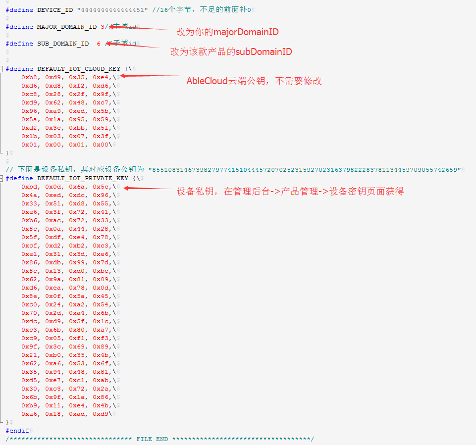

#开发准备

在进行设备开发前，需要先做以下准备：

1. 在管理后台创建产品，选择产品的数据类型。创建以后，会获得该款产品的subdomianID。
1. 在产品管理页面的功能点设置页面设置产品的数据点和数据包。设备和云端通信时，都要按照定义的数据包进行通信。
1. 在设备密钥页面选择设备和云端通信采用的加密方式。AbleCloud的环境分为开发使用的test环境和正式生产使用的生成环境。test环境下，可以不加密。正式环境中，必须加密。


需要厂商烧制到设备中的信息包括：

- 	设备版本：4字节
- 	设备密钥（RSA256）：112字节（需要和提供给Ablecloud的公钥保持一致）
- 	设备ID：16字节，可使用WiFi模块的MAC地址
- 	设备域信息：（两个字节的domain加上6个字节的subdomain）


#配置设备基本信息
打开工程里的ac_cfg.h文件，将上述申请到的主域id更新到MAJOR_DOMAIN_ID，子域id更新到SUB_DOMAIN_ID，设备物理id更新到DEVICE_ID

如果使用WIFI的MAC地址作为DEVICE_ID，DEVICE_ID可以不填写。
如下图所示：



#设备激活

在设备管理部分，设备首先需要实现的功能是设备激活。设备激活以后，才能够进行绑定、控制等操作。

##通过WiFi连接到云的设备（包括独立设备和网关)

WiFi模块和MCU之间的采用自定义的通信协议，通信协议的具体描述参见：[reference-设备-设备应用开发框架](../reference/device.md#设备应用开发框架) 

WiFi设备启动后用户触发设备进入Smartconfig状态，然后通过手机给设备配置WiFi密码，WiFi密码配置成功后，设备连接到云端进行设备激活然后局域网广播设备物理ID。这个过程中，设备MCU和WiFi模块的交互流程如下图所示。

 


**上电配置进入Smartconfig状态**

设备在两种场景下会进入Smartconfig状态：

1)	用户首次绑定配置家庭路由器的密码
2)	更新路由器密码

这里智能灯演示系统是通过MCU按键进入Smartconfig状态，其示例如下：

```c
void KeyIntHandle(void)
{
    unsigned long ulStatus;
    ulStatus = GPIOIntStatus(GPIO_PORTF_BASE, true); 
    GPIOIntClear(GPIO_PORTF_BASE, ulStatus); 
    if (ulStatus & GPIO_PIN_0) //
    {
        SysCtlDelay(SysCtlClockGet() / 1000 / 3);//10ms      
        AC_SendRestMsg(NULL);//调用AbleCloud接口，给WiFi模块发送重置WiFi指令
        while (GPIOPinRead(GPIO_PORTF_BASE, GPIO_PIN_0) == 0x00); 
        SysCtlDelay(SysCtlClockGet() / 3); // 延时约10ms，消除松键抖动
    }
}
```

**云端激活**

设备进入Smartconfig状态后WiFi模块会等待APP在局域网广播来的WiFi密码，获取到WiFi密码模块连接到路由器后会给MCU发送WiFi连接成功的通知。
云端激活需要MCU处理WiFi模块的相应通知，当MCU收到WiFi连接成功的消息时，它需要把设备的注册信息(包括设备域信息，设备密钥，设备ID，设备版本)发给WiFi模块，WiFi模块之后会启动连接云的流程，WiFi连接到云端后，会给设备发送连接云端成功的通知消息，其处理Demo Code如下：

```c
void AC_DealNotifyMessage(AC_MessageHead *pstruMsg, AC_OptList *pstruOptList, u8 *pu8Playload)
{
    
    //处理wifi模块的通知类消息
    switch(pstruMsg->MsgCode)
    {
        case AC_CODE_EQ_DONE://wifi模块启动通知
        AC_StoreStatus(WIFIPOWERSTATUS , WIFIPOWERON);
        AC_ConfigWifi();
        AC_Printf("Wifi Power On!\n");
        break;
        case AC_CODE_WIFI_CONNECTED://wifi连接成功通知
        AC_SendDeviceRegsiter(NULL, g_u8EqVersion,g_u8ModuleKey,g_u64Domain,g_u8DeviceId);
        AC_Printf("Wifi Connect!\n");
        break;
        case AC_CODE_CLOUD_CONNECTED://云端连接通知
        AC_StoreStatus(CLOUDSTATUS,CLOUDCONNECT);
        AC_Printf("Cloud Connect!\n");
        break;
        case AC_CODE_CLOUD_DISCONNECTED://云端断链通知
        AC_StoreStatus(CLOUDSTATUS,CLOUDDISCONNECT);
        AC_Printf("Cloud DisConnect!\n");
        break;
    }
}
```


##通过蜂窝网络连接到云端的设备


蜂窝网络判断用户打开数据并且获取到IP地址，设备就可以将注册信息发送给GPRS模块，启动连接云端流程。


##通过以太网连接到云端的设备


以太网判断本地网络已连接并且获取到IP地址，设备就可以将注册信息发送给GPRS模块，启动连接云端流程。


#设备绑定管理

对于WiFi设备，在连接到云端成功以后会在局域网中自动广播设备的subdomainID和物理ID。客户端（APP）接收到这些信息后调用绑定接口，完成和用户的绑定。

对于通过蜂窝网络连接到云端的设备，无法通过局域网将设备的信息广播给客户端（APP），所以，需要在设备上印刷二维码进行绑定。

对于通过以太网连接到云端的设备，设备连接到云端成功以后，同样可以在局域网中广播设备的subdomian和物理ID。

对于使用微信客户端控制的设备，设备的绑定只能够通过使用微信扫描二维码实现。因此，设备上必须要有包含设备subdomian和物理ID的二维码。微信的开发准备工作请参考：[开发指导-第三方云对接-微信](third_proxy.md#微信)


##子设备的绑定
###云端设备和网关设备交互流程


 
###网关网络打开
云端首先调用AC_CODE_GATEWAY_CTRL消息请求网关打开对应的网络供子设备接入，该消息执行成功需要给回应AC_CODE_ACK消息，失败回应AC_CODE_ERR消息

消息格式定义如下：
```c 
    typedef struct
    {   

        u32 timeWindows;//打开网络，时间窗的单位和含义开发者自己定义

    }AC_GateWay_Ctrl;
```

参考代码如下：

```c

    void AC_MgmtPermitJoin(AC_MessageHead *pstruMsg, AC_OptList *pstruOptList, u8 *pu8Playload)
    {
       /*打开网络*/
       zAddrType_t dstAddr; 
       u8 duration = 0;
       dstAddr.addr.shortAddr = 0xfffc;
       dstAddr.addrMode = AddrBroadcast;
       if(AC_NtoHl(*(u32 *)pu8Playload)>255)
       {
           duration = 0xff;
       }
       else
       {
           duration = AC_NtoHl(*(u32 *)pu8Playload);
       }
       /*调用网关接口打开网络*/
       NLME_PermitJoiningRequest(duration);
       ZDP_MgmtPermitJoinReq( &dstAddr, duration, TRUE, FALSE);
       /*给云端回响应*/
       AC_SendAckMsg(pstruOptList,pstruMsg->MsgId);
    }

```
###查询子设备列表
 云端调用AC_CODE_LIST_SUBDEVICES_REQ消息，请求网关发送子设备列表给网关, 网关收到AC_CODE_LIST_SUBDEVICES_REQ后，发送AC_CODE_LIST_SUBDEVICES_RSP并携带所有子设备的信息给云端。

消息格式定义如下：
```c
   
    typedef struct
    {
        u8 DomainId[AC_DOMAIN_LEN]; //用户ID，定长ZC_HS_DEVICE_ID_LEN（8字节），子设备域名信息   
        u8 DeviceId[AC_HS_DEVICE_ID_LEN];//用户ID，定长ZC_HS_DEVICE_ID_LEN（16字节），子设备id
    }ZC_SubDeviceInfo;

    typedef struct
    {       
        u8 u8ClientNum;	//子设备数目  
        u8 u8Pad[3];  
        ZC_SubDeviceInfo StruSubDeviceInfo[0];
    }ZC_SubDeviceList;

```

参考代码如下：

```c

    void AC_ListSubDevices(AC_MessageHead *pstruMsg, AC_OptList *pstruOptList, u8 *pu8Playload)
    {
    
        u8 *pu8Msg = osal_mem_alloc(sizeof(AC_MessageHead) + sizeof(ZC_SubDeviceList) + g_struDeviceStatus.num*    (sizeof(ZC_SubDeviceInfo)));
        ZC_SubDeviceList *pu8DeviceListInfo = (ZC_SubDeviceList *)(pu8Msg + sizeof(AC_MessageHead));
        ZC_SubDeviceInfo *pu8SubDeviceInfo = (ZC_SubDeviceInfo *)(pu8Msg + sizeof(AC_MessageHead) + sizeof(ZC_SubDeviceList));
        u16 u16DataLen;
        u16 u16PayloadLen;
        u8 i = 0;
        memset(pu8DeviceListInfo,0,sizeof(ZC_SubDeviceList));
        /*查询子设备列表*/
        for(i=0;i<g_struDeviceStatus.num;i++)
        {
            if(g_struDeviceStatus.struSubDeviceInfo[i].u8IsOnline)
            {
                osal_memset(pu8SubDeviceInfo,0,sizeof(ZC_SubDeviceInfo));
                osal_memcpy(pu8SubDeviceInfo->DomainId,g_u8Domain,AC_DOMAIN_LEN);
                osal_revmemcpy(pu8SubDeviceInfo->DeviceId + 8,g_struDeviceStatus.struSubDeviceInfo[i].ExtAddr,Z_EXTADDR_LEN);
                pu8SubDeviceInfo++;
                pu8DeviceListInfo->u8ClientNum++;
            }
        }
        /*构造消息并发送设备列表*/
        u16PayloadLen = sizeof(ZC_SubDeviceList) + pu8DeviceListInfo->u8ClientNum*sizeof(ZC_SubDeviceInfo);
        AC_BuildMessage(AC_CODE_LIST_SUBDEVICES_RSP,pstruMsg->MsgId,
                        (u8*)pu8DeviceListInfo, u16PayloadLen,
                        NULL, 
                        pu8Msg, &u16DataLen);
        AC_SendMessage(pu8Msg, u16DataLen);
        osal_mem_free(pu8Msg);
    }

```

###云端查询子设备是否在线。

消息格式定义如下：
云端下发到网关，查询子设备是否在线。
```c

    typedef struct
    {
        u8 DomainId[AC_DOMAIN_LEN]; //用户ID，定长ZC_HS_DEVICE_ID_LEN（8字节），子设备域名信息
        u8 DeviceId[AC_HS_DEVICE_ID_LEN];//用户ID，定长ZC_HS_DEVICE_ID_LEN（16字节），子设备id
    }ZC_SubDeviceInfo;
```

网关响应到云端子设备在线信息。
```c

    typedef struct
    {
        u8 u8DeviceOnline;	//在线状态，1：在线，0：不在线
        u8 u8Pad[3];
    }ZC_DeviceOnline;

```
参考代码如下：
```c

    void AC_GetDeviceStatus(AC_MessageHead *pstruMsg, AC_OptList *pstruOptList, u8 *pu8Playload)
    {
    
        u8 *pu8Msg = osal_mem_alloc(sizeof(AC_MessageHead) + sizeof(ZC_DeviceOnline));
        ZC_DeviceOnline DeviceStatus = {0};
        u16 u16DataLen;
        u8 i = 0;
        /*查询子设备是否在线*/
        for(i=0;i<g_struDeviceStatus.num;i++)
        {
            if(osal_revmemcmp(((ZC_SubDeviceInfo*) pu8Playload)->DeviceId+8,g_struDeviceStatus.struSubDeviceInfo[i].ExtAddr,Z_EXTADDR_LEN))
            {
                if(g_struDeviceStatus.struSubDeviceInfo[i].u8IsOnline)
                {
                    DeviceStatus.u8DeviceOnline = 1;
                    break;
                }
            }
        }
        /*构造消息并发送设备列表*/    
        AC_BuildMessage(AC_CODE_IS_DEVICEONLINE_RSP,pstruMsg->MsgId,
                        (u8*)&DeviceStatus, sizeof(DeviceStatus),
                        NULL, 
                        pu8Msg, &u16DataLen);
        AC_SendMessage(pu8Msg, u16DataLen);
        osal_mem_free(pu8Msg);
    }

```

##子设备解除绑定

云端调用AC_CODE_LEAVE_DEVICE消息请求网关将子设备移除网络，该消息执行成功需要给回应AC_CODE_ACK消息，失败回应AC_CODE_ERR消息

消息格式定义如下：

```c

    typedef struct
    {    
        u8 DomainId[AC_DOMAIN_LEN]; //用户ID，定长ZC_HS_DEVICE_ID_LEN（8字节），子设备域名信息    
        u8 DeviceId[AC_HS_DEVICE_ID_LEN];//用户ID，定长ZC_HS_DEVICE_ID_LEN（16字节），子设备id
    }ZC_SubDeviceInfo;

```

参考代码如下：

```c

    void AC_LeaveDevice(AC_MessageHead *pstruMsg, AC_OptList *pstruOptList, u8 *pu8Playload)
    {
    
        NLME_LeaveReq_t req;
        ZStatus_t ret;
        req.rejoin = true;
        req.silent = false;
        req.removeChildren= false;
        osal_revmemcpy(req.extAddr,((ZC_SubDeviceInfo *)pu8Playload)->DeviceId+8,Z_EXTADDR_LEN);
        /*网关移除子设备*/
        ret = NLME_LeaveReq(&req );
        /*发送执行结果/  
        if(ZSuccess==ret)
        {
            AC_SendAckMsg(pstruOptList,pstruMsg->MsgId);
        }
        else
        {
            AC_SendErrMsg(pstruOptList,pstruMsg->MsgId);
        }
    }

```


#OTA
##设备与云端交互流程


##OTA启动消息
OTA 文件传输启动请求，该消息需要给回应AC_CODE_ACK消息，失败回应AC_CODE_ERR消息。

消息格式如下：

```c

    typedef struct
    {
        u8 u8FileNum;//用以指示本次升级时文件个数。文件类型在该消息体之后，按字节依次排列。
        u8 u8Pad[3];
    }AC_OtaBeginReq;
```

参考代码如下:

```c

    void AC_HandleOtaBeginMsg(AC_MessageHead *pstruMsg, AC_OptList *pstruOptList, u8 *pu8Playload)
    {
        /*本例只升级本地设备，因而不记录文件数目*/
        AC_SendAckMsg(pstruOptList, pstruMsg->MsgId);  
    }

```

##OTA文件传输消息
OTA 文件传输启动请求，该消息需要给回应AC_CODE_ACK消息，失败回应AC_CODE_ERR消息。
  
消息格式如下：

```c

    typedef struct
    {
       u8  u8FileType;//文件类型
       u8  u8FileVersion;//文件版本号
       u16 u16TotalFileCrc;//整个文件的CRC
       u32 u32FileTotalLen;//文件长度
    }AC_OtaFileBeginReq;
```

参考代码如下:

```c

    void AC_HandleOtaFileBeginMsg(AC_MessageHead *pstruMsg, AC_OptList *pstruOptList, u8 *pu8Playload)
    {
        u32 ret =0;
        u32 i = 0;
        u32 blocklen = 0;
        /*存储文件信息*/
        AC_OtaFileBeginReq *pstruOta = (AC_OtaFileBeginReq *)(pu8Playload);
        g_struOtaInfo.u32RecvOffset = 0;
        g_struOtaInfo.u32TotalLen = AC_HTONL(pstruOta->u32FileTotalLen);
        g_struOtaInfo.u8Crc[0] = pstruOta->u8TotalFileCrc[0];
        g_struOtaInfo.u8Crc[1] = pstruOta->u8TotalFileCrc[1];
        /*擦除OTA区域*/
        blocklen =  (g_struOtaInfo.u32TotalLen + 4 + BLOCK_SIZE - 1)&(~(BLOCK_SIZE - 1));//include length + data
        for(i = 0;i<blocklen/BLOCK_SIZE;i++ )           
        {
            ret = FlashErase(g_ui32OtaFlagAddr +i*BLOCK_SIZE );
            if(ret!= 0)
            break;
        }
       /*烧入升级文件长度*/
        ret =  FlashProgram(&g_struOtaInfo.u32TotalLen, (g_ui32TransferFileLenAddress) , 4);
        /*回响应*/                     
        AC_SendAckMsg(pstruOptList, pstruMsg->MsgId);
    }

```
##OTA文件块传输消息

OTA 文件块传输请求，该消息需要给回应AC_CODE_ACK消息，失败回应AC_CODE_ERR消息。整个升级文件后，会被拆分成若干文件块进行传输。一次升级会有若干文件块。

消息格式如下：

```c

    typedef struct
    {
        u32 u32Offset;//文件块传输偏移
    }AC_OtaFileChunkReq;
```

参考代码如下:

```c

    void AC_HandleOtaFileChunkMsg(AC_MessageHead *pstruMsg, AC_OptList *pstruOptList, u8 *pu8Playload)
    {
        u32 u32RetVal = AC_RET_OK;
        ZC_OtaFileChunkReq *pstruOta = (ZC_OtaFileChunkReq *)(pu8Playload);   
        u32 u32FileLen = AC_HTONS(pstruMsg->Payloadlen) - sizeof(ZC_OtaFileChunkReq);
        u32 u32RecvOffset = AC_HTONL(pstruOta->u32Offset);
        /*判断云端下发的参数是否正确*/
        /*check para*/
        if ((u32RecvOffset != g_struOtaInfo.u32RecvOffset)
            || ((u32RecvOffset + u32FileLen) > g_struOtaInfo.u32TotalLen)
          || (u32FileLen > AC_OTA_MAX_CHUNK_LEN))
        {
            AC_Printf("Ota File Chunk\n");
            AC_SendErrMsg(pstruOptList,pstruMsg->MsgId, NULL, 0);
            return;
        }
        /*将固件版本烧写到flash中*/
        u32RetVal = AC_FirmwareUpdate((u8*)(pstruOta + 1), u32RecvOffset, u32FileLen);
        //u32RetVal = ZC_RET_OK;
        AC_Printf("offset = %d, len = %d\n", u32RecvOffset, u32FileLen);
    
        if (AC_RET_OK != u32RetVal)
        {
            AC_Printf("OTA Fail\n");
            AC_SendErrMsg(pstruOptList, pstruMsg->MsgId, NULL, 0);
            return;
        }
    
        /*更新文件偏移*/
        g_struOtaInfo.u32RecvOffset = g_struOtaInfo.u32RecvOffset + u32FileLen;
        /*回响应*/ 
        AC_SendAckMsg(pstruOptList, pstruMsg->MsgId);
    }

```
##OTA文件传输结束消息

OTA升级文件传输结束消息，该消息需要给回应AC_CODE_ACK消息，失败回应AC_CODE_ERR消息。无消息体

参考代码如下:

```c

    void AC_HandleOtaFileEndMsg(AC_MessageHead *pstruMsg, AC_OptList *pstruOptList, u8 *pu8Playload)
    {
        /*回响应*/
        AC_Printf("Ota File End\n");
        AC_SendAckMsg(pstruOptList, pstruMsg->MsgId);
    }
```
##OTA结束消息

无消息体，该消息需要回应AC_CODE_ACK消息，失败回应AC_CODE_ERR消息。

参考代码如下:

```c

    void AC_HandleOtaEndMsg(AC_MessageHead *pstruMsg, AC_OptList *pstruOptList, u8 *pu8Playload)
    {
         u32 u32RetVal = AC_RET_OK;
         u16 u16DataLen;
         u32 u32OtaFlag = 0xAA55AA55;
         AC_Printf("Ota End\n");
     
         /*回响应*/ 
         if (AC_RET_OK == u32RetVal)
         {
             AC_SendAckMsg(pstruOptList, pstruMsg->MsgId);
             
     
         }
         else
         {
             AC_SendErrMsg(pstruOptList, pstruMsg->MsgId, NULL, 0);
         }
    } 
     
```

##OTA确认升级消息

无消息体，收到该消息设备侧启动更新固件流程，该消息需要回应AC_CODE_ACK消息，失败回应AC_CODE_ERR消息。

参考代码如下:

```c

    void AC_HandleOtaConfirmMsg(AC_MessageHead *pstruMsg, AC_OptList *pstruOptList, u8 *pu8Playload)
    {
        u32 u32RetVal = AC_RET_OK;
        u16 u16DataLen;
        u32 u32OtaFlag = 0xAA55AA55;
        AC_Printf("Ota Confirm\n");
    
        /*更新ota升级标志位*/
        u32RetVal =  FlashProgram(&u32OtaFlag, (g_ui32OtaFlagAddr) , 4);
        /*回响应,跳转到boot区域启动ota升级流程*/
        if (AC_RET_OK == u32RetVal)
        {
            AC_SendAckMsg(pstruOptList, pstruMsg->MsgId);
            sleep(10);
            AC_JumpToBootLoader();
        }
        else
        {
            AC_SendErrMsg(pstruOptList, pstruMsg->MsgId, NULL, 0);
        }
    
    }
     
```


#和云端通信
##设备上报消息
设备可以在定时或者根据外界条件触发的情况下将设备数据和状态主动上报到云端。其中上报的消息号必须大于等于200。

下面的例子是上报demo灯状态到云端。


###二进制
参考代码如下：

```c    
    
    void AC_SendStatus2Server()
    {
        /*上报demo灯的状态*/
        STRU_LED_ONOFF struRsp;
        u16 u16DataLen;
        /*读取demo灯状态*/
        struRsp.u8LedOnOff = GPIOPinRead(GPIO_PORTF_BASE, GPIO_PIN_2);
        struRsp.u8LedOnOff = struRsp.u8LedOnOff>>2;
        /*构造消息*/
        AC_BuildMessage(AC_CODE_BINARY_REPORT,0,
                        (u8*)&struRsp, sizeof(STRU_LED_ONOFF),
                        NULL, 
                        g_u8MsgBuildBuffer, &u16DataLen);
        /*发送消息*/
        AC_SendMessage(g_u8MsgBuildBuffer, u16DataLen);
    }
```
###KLV格式
参考代码如下：

```c    
    
    void AC_SendStatus2Server()
    {
         /*上报demo灯的状态*/
         u8 u8LedOnOff ;
         /*KLV协议内存分配*/
         AC_KLV *pOut = AC_CreateObj();
         /*读取demo灯状态*/
         u8LedOnOff = GPIOPinRead(GPIO_PORTF_BASE, GPIO_PIN_2);
         u8LedOnOff = u8LedOnOff>>2;
         /*构造KLV消息*/
         AC_SetKeyValue(pOut,KEY_LED_ON_OFF,sizeof(u8LedOnOff),INT8_TYPE,&u8LedOnOff);
         /*上报KLV消息*/
         AC_ReportKLVMessage(AC_CODE_KLV_REPORT, NULL, pOut);
         /*KLV协议内存释放*/
         AC_FreeObj(pOut);
    }
```
###JSON格式
JSON格式用户调用第三方源码构造json格式的消息体。AC_BuildMessage构造消息。
    
```c    
    
    void AC_SendLedStatus2Server()
    {
         /*上报demo灯的状态*/
        cJSON *root;
        char *out;
        u8 u8LedOnOff;
        u16 u16DataLen;
         /*JSON协议内存分配*/
        root=cJSON_CreateObject();
        u8LedOnOff = GPIOPinRead(GPIO_PORTF_BASE, GPIO_PIN_2);
        u8LedOnOff = u8LedOnOff>>2;
         /*构造JSON消息体*/
        cJSON_AddNumberToObject(root,"led",		u8LedOnOff);
        out=cJSON_Print(root);	
        cJSON_Delete(root);
        /*构造消息*/
        AC_BuildMessage(AC_CODE_JSON_REPORT,0,
                        (u8*)out, strlen(out),
                        NULL, 
                        g_u8MsgBuildBuffer, &u16DataLen);
        /*发送消息*/
        AC_SendMessage(g_u8MsgBuildBuffer, u16DataLen);	
         /*JSON协议内存释放*/
        free(out);
    }

```
##设备接收云端指令

设备接收云端指令可以控制设备，并返回执行结果，其中控制指令和响应指令的消息号必须大于64且小于200。

设备接收云端指令可以查询设备，并返回查询结果，其中查询指令和响应指令的消息号必须大于64且小于200。

设备接收到云端指令必须回响应。

下面的例子是云端下发控制demo灯开关状态，收到指令回应响应。

###二进制

```c    

    void AC_DealLed(AC_MessageHead *pstruMsg, AC_OptList *pstruOptList, u8 *pu8Playload)
    {
        u16 u16DataLen;
        u8 test[] = "hello";

        switch (((STRU_LED_ONOFF *)pu8Playload)->u8LedOnOff)
        {
            case 0://处理开关消息
            case 1:        
                AC_BlinkLed(((STRU_LED_ONOFF *)pu8Playload)->u8LedOnOff);
                break;            
        
        }
        /*构造消息,接口含义详见下节接口定义*/
        AC_BuildMessage(CLIENT_SERVER_OK,pstruMsg->MsgId,
                        (u8*)test, 5,
                        pstruOptList, 
                        g_u8MsgBuildBuffer, &u16DataLen);
        /*发送消息,接口含义详见下节接口定义*/
        AC_SendMessage(g_u8MsgBuildBuffer, u16DataLen);    
    }
```
###KLV格式
```c    

    void AC_DealLed(AC_MessageHead *pstruMsg, AC_OptList *pstruOptList, u8 *pu8Playload)
    {
        /*KLV协议内存申请,接口含义详见下节接口定义*/
        AC_KLV *pOut = AC_CreateObj();
        u8 u8LedOnOff= 0;
        u16 u16length = 0;
        u8 u8Type = 0;
        AC_GetKeyValue(pu8Playload,AC_HtoNs(pstruMsg->Payloadlen),KEY_LED_ON_OFF,&u8LedOnOff,&u16length,&u8Type);
        switch (u8LedOnOff)
        {
            case 0://处理开关消息
            case 1:        
                AC_BlinkLed(u8LedOnOff);
                break;            
        
        }
        /*构造KLV消息,接口含义详见下节接口定义*/
        AC_SetKeyValue(pOut,KEY_LED_ON_OFF,sizeof(u8LedOnOff),INT8_TYPE,&u8LedOnOff);
        /*发送响应消息，用户自定义,接口含义详见下节接口定义*/
        AC_SendKLVMessage(pstruMsg, pstruOptList,pOut);
         /*KLV协议内存释放,接口含义详见下节接口定义*/
        AC_FreeObj(pOut);    
    }
```
###JSON格式

```c  
  
    void AC_DealJsonMessage(AC_MessageHead *pstruMsg, AC_OptList *pstruOptList, u8 *pu8Playload)
    {   
        /*处理设备自定义控制消息*/
        u16 u16DataLen;
        u32 u32LedOnOff;
        char *out;
        /*解析收到的JSON数据*/
        cJSON *root = cJSON_Parse(pu8Playload);
        /*JSON协议内存分配*/
        root=cJSON_CreateObject();
        cJSON *format = cJSON_GetObjectItem(root,"ledctl");
    	u32LedOnOff = cJSON_GetObjectItem(format,"led")->valueint;
        switch (u32LedOnOff)
        {
            case 0://处理开关消息
            case 1:        
                AC_BlinkLed(u32LedOnOff);
                break;
        }
        /*构造JSON消息*/
        cJSON_AddStringToObject(root,"status",		"ok");
        out=cJSON_Print(root);	
        cJSON_Delete(root);
        /*发送JSON消息,接口含义详见下节接口定义*
        AC_BuildMessage(MSG_SERVER_CLIENT_GET_LED_STATUS_RSP,0,
                        (u8*)out, strlen(out),
                        NULL, 
                        g_u8MsgBuildBuffer, &u16DataLen);
        AC_SendMessage(g_u8MsgBuildBuffer, u16DataLen);	
         /*释放JSON消息,接口含义详见下节接口定义*
        free(out);   
     }
```
##接口定义

###数据发送接口

函数定义

void AC_SendMessage(u8 *pu8Msg, u16 u16DataLen);

参数

|字段|类型|说明|
|----|----|----|
|pu8Msg|u8 *|待发送的数据缓存|
|u16DataLen|u16|待发送的数据长度|

说明
###协议消息组包接口

函数定义

void AC_BuildMessage(u8 u8MsgCode, u8 u8MsgId, 
    u8 *pu8Payload, u16 u16PayloadLen,
    AC_OptList *pstruOptList,
    u8 *pu8Msg, u16 *pu16Len);

参数

|字段	|类型	|说明|
|----|----|----|
|u8MsgCode|	u8	|消息类型|
|u8MsgId|	u8	|消息ID|
|pu8Payload|	u8	|消息实际内容|
|u16PayloadLen|	u16|	消息实际长度|
|pstruOptList	|AC_OptList *|	Option项列表|
|pu8Msg|	u8 *	|组好的消息数据的存储buffer|
|pu16Len|	u8 *	|组好的数据长度|
###KLV协议解析包接口
函数定义

s8 AC_GetKeyValue(u8 *pu8Playload, u16 u16PayloadLen, u8 u8Key,void *pValue,u16 *pu16Length,u8 *pu8Type)

参数

|字段|类型|说明|
| ----|----|----|
|pu8Playload|u8 *|待解析的消息|
| u16PayloadLen|u16|待解析的消息长度|
| u8Key|u8|传入的关键字|
| pValue|void *|该关键字对应的数据|
|pu16Length|u16 *|该关键字对应的数据长度|
|  pu8Type|u8 *|该关键字对应的数据类型|

###KLV协议内存分配接口
函数定义

AC_KLV * AC_CreateObj()

返回值： 申请出来的内存指针
###KLV协议内存释放接口
函数定义

参数：需要释放的内存指针

void AC_FreeObj(AC_KLV * pOut);
###KLV协议组包接口
函数定义


s8 AC_SetKeyValue(AC_KLV *pOut,u8 u8Key,u16 u16Length,u8 u8Type, void *pValue);

参数

| 字段|类型|说明|
| ----|----|----|
| pOut|AC_KLV *|待组包数据的消息|
| u8Key|u8|传入的关键字|
| pu16Length|u16 *|该关键字对应的数据长度|
| pu8Type|u8 *|该关键字对应的数据类型|
| pValue|void *|该关键字对应的数据|


#局域网通信
WiFi设备和以太网设备可以和客户端（APP）进行局域网通信。
AbleCloud的SDK已经封装好了局域网通信的协议和加密格式。因此设备端不需要专门针对局域网功能进行开发即可和客户端（APP）在局域网进行通信。


