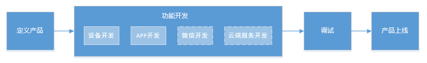
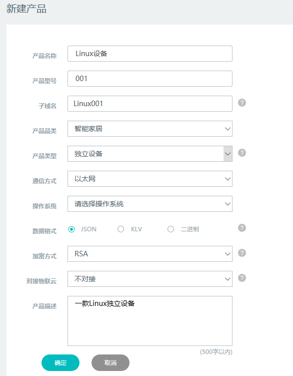
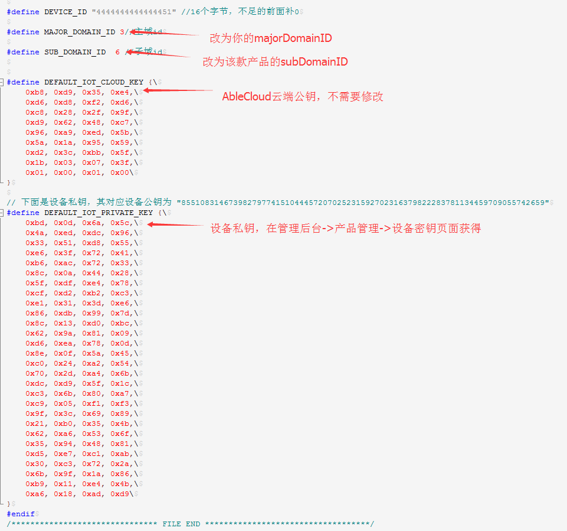
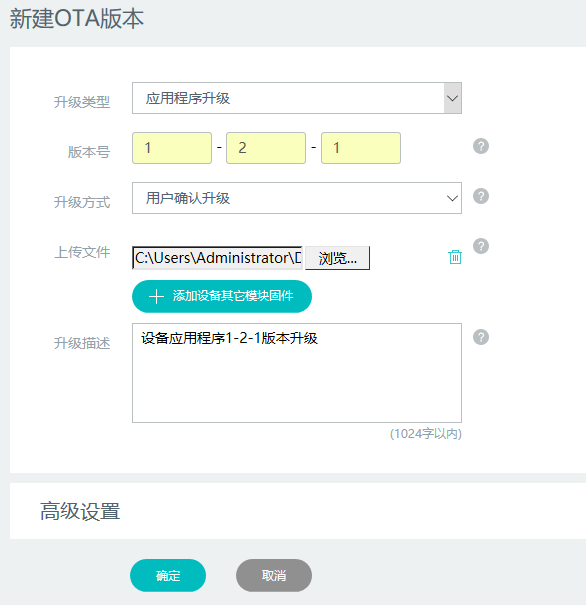

#Linux设备开发指导

Linux设备指的是操作系统为Linux的设备。

设备连接网络的形式为WiFi、以太网或者移动蜂窝网络。

对于使用WiFi连接网络的设备，如果设备有操作界面，则配置网络可以直接通过用户交互界面选择WiFi热点输入WiFi密码进行。如果设备没有操作界面，配置网络可以通过类似于嵌入式设备的SmartConfig方法进行。

对于使用以太网或者移动蜂窝网连接网络的设备，认为设备可以自动连接网络。

设备和云端交互以JSON格式或二进制的数据进行交互。

给用户提供服务的是Linux系统上运行的应用程序。

设备可以是独立设备也可以是一个网关，一般很少作为网关的子设备。

AbleCloud提供开发设备上应用程序所需要的SDK，该SDK可用于开发独立设备和网关。

SDK中封装了设备到云端的加密握手协议。开发者不需要关心具体协议方式，只需要调用上层接口开发功能即可。

SDK中集成了设备和客户端绑定、设备向云端上报消息，设备接收云端消息、设备OTA、设备定时任务、文件存储、局域网通信等功能。
# 开发准备

基于AbleCloud云平台的设备开发流程如下图所示。



首先需要在管理控制台定义产品，包括定义产品的名称、型号、功能点、密钥等信息。

然后进行设备和和APP、微信或WEB客户端开发。对于自定义功能，还需要开发云端服务。

测试部分，AbleCloud提供了虚拟设备功能，虚拟设备可以模拟设备接收控制指令和上报消息，用来辅助客户端的功能开发。

产品开发在测试环境进行，测试通过之后，需要向AbleCloud提交上线申请，申请通过后会获得正式环境帐号。

将产品由测试环境转移到正式环境的详细操作步骤详见[产品上线操作说明](https://www.ablecloud.cn/download/%E4%BA%A7%E5%93%81%E4%B8%8A%E7%BA%BF%E6%93%8D%E4%BD%9C%E8%AF%B4%E6%98%8E.pdf)
##管理控制台
###新建产品

AbleCloud云平台分为测试环境和正式环境。测试环境用户开发测试，开发测试完成后再将产品转移到正式环境。

测试环境控制台登录地址为：http://test.ablecloud.cn/login.php

开发前，首先需要在管理控制台创建产品，产品操作系统选择Linux。对于Linux设备，云端和设备的数据交互我们建议采用JSON格式。通信方式根据具体情况填写。一个典型的Linux独立设备新建产品的表单如下图所示：



如果是Linux网关，产品类型部分填：“网关”。


###定义功能点
在设备功能开发前，需要在开发管理控制台定义设备端的数据点和数据包。其中数据点对应设备上的功能点，数据包是设备和云端数据交互的数据单元，一个数据包中包括一个或者多个数据点。

需要单独说明的是，从云端像设备发送的消息的数据包的message code的范围是65~199；设备向云端上报的消息的message code的范围是200~255。


###创建密钥
在“产品管理->密钥管理”页面管理产品密钥。

有两种密钥管理方式：默认密钥设设备独立密钥入库。

* **默认密钥**：本产品的所有设备使用相同密钥，可以系统生成公私钥对也可以手动填入公钥。优势是生产方便，设备秘钥可以直接写死在固件中，不需要独立烧写。安全性上只要私钥不泄露，产品也是绝对安全的。如果设备私钥泄漏，则设备可以被伪造，进而对云端数据和服务发起攻击，但设备不会被恶意控制。
* **设备独立秘钥**：每台设备使用独立的秘钥，需要开发者将设备物理ID和公钥的对应关系入库。需要每台设备烧写独立的秘钥，生产复杂。相比所有设备使用默认秘钥安全性更高。
# 软件开发配置

* **1.Linux 操作系统**
* **2.gcc 编译器**
* **3.Ablecloud 基础SDK(必选)**
* **4.libcurl（可选，文件存储SDK基础库）**
* **5.openssl（可选，文件存储SDK基础库）**
* **6.Ablecloud 文件存储SDK（可选，http方式OTA或文件存储功能）**
需要厂商配置以下信息到SDK中：

 设备版本：4字节。
 设备密钥（RSA256）：112字节（需要和提供给Ablecloud的公钥保持一致）。
 设备域信息：两个字节的domain加上6个字节的subdomain。打开工程里的ac_cfg.h文件，将从管理控制申请到的主域id更新到MAJOR_DOMAIN_ID，子域id更新到SUB_DOMAIN_ID。如下图所示：


# Linux独立设备
##绑定管理
###说明
绑定指的是Linux设备和APP客户端的绑定。

若Linux设备带有用户交互界面，建议绑定采取APP扫码形式进行。设备屏幕显示二维码，使用客户端APP扫描二维码进行绑定。

建议Linux设备在首次连接到云端握手成功后，屏幕显示由设备subdomain+物理生成的二维码。然后使用APP扫描该二维码进行解析，调用bindDevice接口绑定设备。第一个绑定的用户成为该设备管理员，之后的用户再次使用该二维码绑定时会绑定失败。因此之后的用户需要从管理员那里扫描管理员分享的二维码进行设备绑定。

需要增加绑定模式，之后绑定的人再次扫描二维码绑定的时候给管理员发送推送，等待管理员同意后绑定成功。

对于没有用户交互界面的Linux设备，根据通信方式不同采取不同的绑定方式。
* 若设备通信方式为WiFi,可以采用和WiFi设备相同的SmartConfig方式进行配网和设备绑定。
* 若设备通信方式为以太网，可以采用客户端APP局域网发现的形式，设备连接云端后在局域网广播设备的subdomian和物理ID，客户端APP收到该消息后向云端绑定设备。
* 若设备通信方式为移动蜂窝网络，则需要设备上印刷包括设备subdomian和物理ID的二维码，通过客户端APP扫描二维码进行绑定。


设备端有强制解绑接口，设备可以调用该接口将设备的所有用户强制全部解绑。强制解绑后再次绑定时，第一个绑定的人成为设备管理员。同时，强制解绑再次绑定后，设备会被分配新的逻辑ID，设备之前产生的所有历史数据记录在之前的逻辑ID上，使用新的逻辑ID无法查看。

##接收云端消息

Linux设备的SDK集成了和云端的长连接。设备的功能APP无论在前台还是后台运行都可以收到云端发送的消息。因此，开发者对云端消息接口进行实现即可。

为了更好的体验，我们建议消息处理接口中，设备将云端指令执行完成后将最新的设备状态作为响应信息返回云端。

设备和云端的交互消息需要在管理控制台的产品管理中进行定义。需要定义功能点里的数据点和数据包。其中数据点对应设备上的功能点，数据包是设备和云端数据交互的数据单元，一个数据包中包括一个或者多个数据点。

需要单独说明的是，从云端像设备发送的消息的数据包的message code的范围是65~199

###开发示例
以开关灯为例，协议如下：

二进制格式

    控制数据包=code:68 
    typedef struct tag_STRU_LED_ONOFF
    {       
        u8       u8LedOnOff ; // 0:关，1：开
        u8       u8ControlStatus;//控制消息忽略
        u8       u8Pad[2];       
    }STRU_LED_ONOFF;

    响应数据包=code:102 
    byte0:（1：命令执行成功，0：命令执行错误）byte1-3(忽略)
    void AC_DealLed(AC_MessageHead *pstruMsg, AC_OptList *pstruOptList, u8 *pu8Playload)
    {
        u16 u16DataLen;
        u8 resp[4] = {0};

        switch (((STRU_LED_ONOFF *)pu8Playload)->u8LedOnOff)
        {
            case 0://处理开关消息
            case 1:        
                resp[0]=AC_BlinkLed(((STRU_LED_ONOFF *)pu8Playload)->u8LedOnOff);
                break;            

        }
        /*构造消息,接口含义详见下节接口定义*/
        AC_BuildMessage(102,pstruMsg->MsgId,
                        (u8*)resp, sizeof(resp),
                        pstruOptList, 
                        g_u8MsgBuildBuffer, &u16DataLen);
        /*发送消息,接口含义详见下节接口定义*/
        AC_SendMessage(g_u8MsgBuildBuffer, u16DataLen);    
    }

JSON格式

    ```
    //请求数据包
    { 70 ：[
         //关灯
         {"switch", 0}
         //开灯
         {"switch", 1}
    ]}
    //响应数据包  
    { 102 ：[
         //失败
         {"result", false},
         //成功   
         {"result", true}
    ]}
     void AC_DealJsonMessage(AC_MessageHead *pstruMsg, AC_OptList *pstruOptList, u8 *pu8Playload)
    {   
        /*处理设备自定义控制消息*/
         u16 u16DataLen;
         u32 u32LedOnOff;
         bool result = false;
         char *out;
         cJSON *root;
        /*解析收到的JSON数据*/
        cJSON *format = cJSON_Parse(pu8Playload);

        if(format)
        {
            u32LedOnOff = cJSON_GetObjectItem(format,"switch")->valueint;
            switch (u32LedOnOff)
            {
                case 0://处理开关消息
                case 1:        
                result = AC_BlinkLed(u32LedOnOff);
                break;
            }
            cJSON_Delete(format);
        }
        /*JSON内存申请/*
        root=cJSON_CreateObject();
        /*构造JSON消息*/
        cJSON_AddBoolToObject(root,"result",result);
        out=cJSON_Print(root);  
        cJSON_Delete(root);
        /*发送JSON消息,接口含义详见下节接口定义*/
        AC_BuildMessage(102,0,
                        (u8*)out, strlen(out),
                        NULL, 
                        g_u8MsgBuildBuffer, &u16DataLen);
        AC_SendMessage(g_u8MsgBuildBuffer, u16DataLen); 
        /*释放JSON消息,接口含义详见下节接口定义*/
        free(out);   
     }
   ```
##向云端上报消息
###说明

设备可以在定时或者根据外界条件触发的情况下将设备数据和状态主动上报到云端。

设备和云端的交互消息需要在管理控制台的产品管理中进行定义。需要定义功能点里的数据点和数据包。其中数据点对应设备上的功能点，数据包是设备和云端数据交互的数据单元，一个数据包中包括一个或者多个数据点。

其中上报的消息号(message code)必须大于等于200。

###开发示例
参考代码如下：

用户可调用第三方源码构造JSON格式的消息体。

二进制格式：

    上报数据包=code:203 + req:{1,0,0,0}

    typedef struct tag_STRU_LED_ONOFF
    {       
        u8       u8LedOnOff ; // 0:关，1：开
        u8       u8ControlStatus;//0为APP控制开关，1为按键控制开关   
        u8       u8Pad[2];       
    }STRU_LED_ONOFF;

    void AC_SendStatus2Server(u8 u8control)
    {
        /*上报demo灯的状态*/
        STRU_LED_ONOFF struReport;
        u16 u16DataLen;
        /*读取demo灯状态*/
        struReport.u8LedOnOff = GPIOPinRead(GPIO_PORTF_BASE, GPIO_PIN_2);
        struReport.u8LedOnOff = struRsp.u8LedOnOff>>2;
        struReport.u8ControlStatus = u8control;
        /*构造消息*/
        AC_BuildMessage(203,0,
                        (u8*)&struReport, sizeof(STRU_LED_ONOFF),
                        NULL, 
                        g_u8MsgBuildBuffer, &u16DataLen);
        /*发送消息*/
        AC_SendMessage(g_u8MsgBuildBuffer, u16DataLen);
    }

JSON格式

```
//请求数据包
{ 203 ：[
     //关灯
     {"switch", 0}
     //开灯
     {"switch", 1}
]
[
     //APP控制开关
     {"controltype", 0},
     //按键控制开关  
     {"controltype", 1}
]}
```

    void AC_SendLedStatus2Server(u8 controltype)
    {
        /*上报demo灯的状态*/
        cJSON *root;
        char *out;
        u8 u8LedOnOff;
        u16 u16DataLen;
         /*JSON协议内存分配*/
        root=cJSON_CreateObject();
        u8LedOnOff = GPIOPinRead(GPIO_PORTF_BASE, GPIO_PIN_2);
        u8LedOnOff = u8LedOnOff>>2;
         /*构造JSON消息体*/
        cJSON_AddNumberToObject(root,"action",      u8LedOnOff);
        cJSON_AddNumberToObject(root,"controltype",     controltype);
        out=cJSON_Print(root);  
        cJSON_Delete(root);
        /*构造消息*/
        AC_BuildMessage(203,0,
                        (u8*)out, strlen(out),
                        NULL, 
                        g_u8MsgBuildBuffer, &u16DataLen);
        /*发送消息*/
        AC_SendMessage(g_u8MsgBuildBuffer, u16DataLen); 
         /*JSON协议内存释放*/
        free(out);
    }
##实时消息同步
###说明

实时消息同步指的是APP和设备之间消息和状态的实时同步。比如在APP打开时，设备上的开关发生变化，APP页面上的设备开关状态显示跟着实时变化而不需要进行刷新操作。

消息可以在APP和APP、APP和设备之间实时同步。

AbleCloud的实时消息同步基于存储实现，因此对于需要进行实时消息同步的功能点需要在控制台创建相应的存储。数据源（一般是设备）向该数据集写入数据，然后需要进行实时消息同步的客户端订阅该存储的列。

##OTA
###说明

Linux设备OTA用于对Linux设备上的应用程序进行升级。

进行OTA需要以下几个步骤：
1. 开发者在管理控制台发布新的OTA版本。
2. Linux设备以轮询的方式向云端检查升级。云端发布OTA后，设备会检查到有新的升级信息。
3. 设备根据升级信息里的下载链接去下载OTA文件并完成校验。下载完成后通知云端OTA文件下载完成。
4. 设备自己控制新的功能的安装，安装完成后通知云端新的版本安装完成。

升级方式可以为用户确认的升级、静默升级和强制升级三种。

* **用户确认的升级**：在控制台发布OTA后，设备或者APP端会收到新的升级通知，用户确认之后才进行升级。
* **静默升级**：在控制台发布OTA后，设备会自动下载升级文件并完成升级。
* **强制升级**：在控制台发布OTA后，设备或者APP端会收到新的升级通知，且用户只能确认进行升级不能取消。

AbleCloud提供了OTA的高级设置。

高级设置中，可以选择升级的源版本、渠道和批次。其中渠道和批次需要在控制台入库或者通过设备/APP上报到云端才可以使用。

为方便测试，高级设置中提供定向发布。新版OTA开发完成后可以先针对特定几台设备进行升级测试。


###用户确认升级开发示例

控制台发布OTA表单样例如下图所示




AbleCloud实现了两种OTA方式。

* **TCP长连接下载OTA文件**
TCP长连接下载OTA文件只支持下载当前程序运行文件，如果程序运行文件大于2M建议使用HTTP方式下载，TCP长连接下载OTA文件流程ablecloud固件已经实现。开发者需要将版本切换脚本放在/etc/init.d/目录，供ota下载完文件本地升级版本调用。
注意：由于云端 linux设备默认只支持HTTP方式下载OTA文件，如果需要支持该方式，需要选择FreeRTOS或其它嵌入式系统。

* **HTTP方式下载OTA文件**
ablecloud默认支持的方式，支持多文件和大文件版本下载，需要基于libcurl和openssl链接选项，升级本地版本开发者可以参照上面的脚本文件实现，典型的链接选项是：-lcurl -lssl -lcrypto -lm

###开发示例
```c
    
    void main()
    {

        int ret =0;
        AC_OtaFileInfo fileInfo[MAX_OTAFILENUM];
        char otadescription[64];
        int otamode = 1;//system update
        int otadowloadfilenum = 0;
        int  i= 0;
        ret = AC_DeviceServiceInit(MAJOR_DOMAIN,SUB_DOMAIN,DEVICE_ID,DEVICE_VERSION); //初始化环境变量

        if(0 != ret)
        {
            printf("AC_DeviceServiceInit errror=%d\n",ret);
        }
        else
        {
            ret = AC_OtaUpdate(otamode,"//tmp",fileInfo,&otadowloadfilenum,otadescription);//ota升级文件，如果返回0，代表下载文件成功，返回其它值代码没有ota文件或下载出错
            if(CURLE_OK == ret)
            {
                for(i=0; i<otadowloadfilenum ;i++)
                {
                    printf("ota filename =%s\n",fileInfo[i].chName);
                    printf("ota IntFileType =%d\n",fileInfo[i].IntFileType);
                    printf("ota IntChecksum =%d\n",fileInfo[i].IntChecksum);
                }
                printf("ota Description = %s\n",otadescription);
                system("/etc/init.d/AbleCloud restart");
            }

        }
    }

##定时任务
###说明

定时任务使用云端定时。

云端定时指的是APP或者设备将定时任务信息发送到云端，云端记下来任务触发的时间。在到达触发时间后，云端将控制指令发送给设备。云端定时要求在任务触发时设备一定是在线的，否则执行失败。云端定时只适用于长连接的设备。

由于云端定时从设备看来只是执行了一条云端发来的普通指令，因此设备端不需要进行针对开发。
##文件存储
文件存储是AbleCloud提供的非结构化存储功能。可以用来存储头像、文件等大的数据块。单个文件最大支持4G。
###下载文件
下载文件接口也是基于libcurl和openssl开发的，编译时需要增加链接选项

```c     
     int AC_DownloadFile(const char *bucketName,char *remotefilename,char *localfilepath)；

|字段|类型|说明|
| ----|----|----|
|bucketName|const char *|云端bucket名|
| remotefilename|char *|下载的云端文件名|
| localfilename|char *|存储本地文件完整路径名|

###上传文件
```c
      int AC_UploadFile(const char *bucketName, char *remotefilename, char *localfilepath)；

|字段|类型|说明|
| ----|----|----|
|bucketName|const char *|云端bucket名|
| remotefilename|char *|上传的云端文件名|
| localfilename|char *|存储本地文件完整路径名|
###开发示例
```c
    
    void main()
    {

        int ret =0;
        AC_OtaFileInfo fileInfo[MAX_OTAFILENUM];
        char otadescription[64];
        int otamode = 1;//system update
        int otadowloadfilenum = 0;
        int  i= 0;
        char deviceid[]="6666666666666666";//建议开发者采用mac地址，前面补0000，一共16个字节
        ret = AC_DeviceServiceInit(MAJOR_DOMAIN,SUB_DOMAIN,deviceid,DEVICE_VERSION); //初始化环境变量

        if(0 != ret)
        {
            printf("AC_DeviceServiceInit errror=%d\n",ret);
        }
        else
        {
           ret = AC_UploadFile("test","1","cJSON.c");
           if(0 != ret)
           {
               printf("AC_UploadFile errror=%d\n",ret);
               return;
           }
           ret =  AC_DownloadFile("test","1","test.c");
           if(0 != ret)
           {
               printf("AC_DownloadFile errror=%d\n",ret);
               return;
           }
        }
    }

##局域网通信

###说明

局域网通信是指设备和设备、APP和设备在一个局域网内时，不通过云端直接进行通信。

局域网通信能够保证在外网异常断开情景下的的设备的正常使用。同时在局域网环境时提供设备之间的高速访问能力及关联控制功能。

建议在云端和局域网都在线的情况下，用户的交互和设备的数据上报仍然走云端。只有在外网异常断开，只有局域网的时候，才切换到只使用局域网的状态。因为这样能完整记录用户的行为数据和设备的历史数据，使云端数据分析的结果更可靠。

设备的SDK中封装了对客户端查询设备局域网在线状态的响应，APP的SDK提供的接口能够直接获取到当前设备的在线状态：云端和局域网在线、云端在线、局域网在线、云端和局域网都不在线。因此开发人员可以根据设备的在线情况调用相关的处理接口，使用户感受不到网络的切换。

？？1、从云端发的消息还是局域网的消息是否有区分？

从云端发过来的的消息有option项，里面携带连接app的clientid，设备端收到消息，只需要把对应的option填充到sdk调用即可。

？？2、是否需要设备发现设备局域网在线？

需要APP定时查询是否与设备在同一局域网环境中


