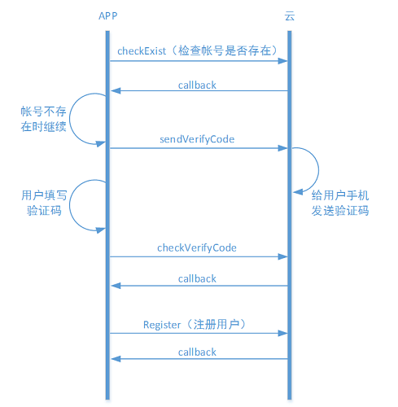
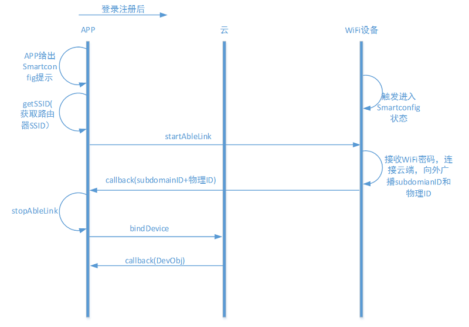

#iOS客户端开发指导

#开发环境设置
##系统准备

在进行开发前，需要对系统以及环境进行设置。目前框架支持Objective-C、C语言，因此系统准备基本都是和iOS开发相关，如Mac OS X、Xcode等。 + OS X 系统建议采用Mac OS X 10.8以上的版本 + Xcode 安装Xcode，建议采用6.0以上版本 + ablecloud 下载ablecloud开发框架并解压

Xcode

新建工程 选择新建iOS Application，根据需要选择，建议选择Single View Application。 点击Next进入下一个页面，根据情况填写Product Name/Organization Name/Organization Identifier等信息。 填好后点击Next，进入下一步，填写好存放路径。 至此，新建工程完成。
导入AbleCloudLib 按照步骤1完成了工程的新建，接下来需要将AbleCloudLib导入到工程中。 右键点击工程中想要导入的Group选择 Add Files to "your project name"... 选择AbleCloudLib的路径，勾选Copy items if needed，点击Add添加。 完成上述步骤后，我们将在工程视图里面看到该目录。 至此，开发者开发服务所以来的ablecloud开发框架库添加成功。
本地运行 Xcode下直接Command + R运行。
注：如果是模拟器运行请导入模拟器的静态库，如果是真机运行则导入真机静态库，否则在编译的过程中会失败。

##配置开发参数

```
@interface ACloudLib : NSObject

/**
 * 设置云端服务的接入地址，测试环境为test.ablecloud.cn:5000, 线上环境为production.ablecloud.cn:5000
 */
+ (void)setHost:(NSString *)host;
+ (NSString *)getHost;

/**
 * 设置访问云端服务的超时时间，根据开发者服务的性能合理定义，单位是秒
 */
+ (void)setHttpRequestTimeout:(NSString *)timeout;
+ (NSString *)getHttpRequestTimeout;

/**
 * 设置APP所属开发者帐号的主域信息，通过控制台进行查看帐号的主域等私密信息
 */
+ (void)setMajorDomain:(NSString *)majorDomain;
+ (NSString *)getMajorDomain;

@end
```


#帐号管理
<<<<<<< HEAD
功能介绍参考： [功能说明-功能介绍-帐号管理](../features/functions.md#账号管理)
=======
建议的用户交互流程见 [功能说明-帐号管理](../features/functions.md#_11)
>>>>>>> 2419e5f25e739caceaac28f18f8939ff347ef0e9

##1、普通帐号注册



<font color="red">**补充开发指导**</font>	

**获取账号管理对象**

```ObjC
    
```

**普通帐号注册流程**

1、检查手机号是否已注册


```ObjC

```


2、发送验证码

```ObjC

```

3、检测验证码正确性

```ObjC

```

4、注册

```ObjC

```
 
##2、第三方登录
 


<font color="red">**补充开发指导**</font>	

1、直接使用第三方登录

```ObjC

```

2、在已有普通账号登录时绑定第三方账号

```ObjC

```

#设备管理

<<<<<<< HEAD
=======
说明参见[功能说明-设备管理](../features/functions.md#_12)

>>>>>>> 2419e5f25e739caceaac28f18f8939ff347ef0e9
##独立设备

功能介绍参见 [功能说明-功能介绍-独立设备管理](../features/functions.md#_3)

用户登录/注册后，需要绑定设备才能够使用。对于没有二维码的设备，绑定设备时，首先需在APP上给出配置设备进入Smartconfig状态的提示。然后填写当前手机连接的WiFi的密码，调用startAbleLink将WiFi密码广播给设备，设备拿到WiFi密码后连接到云端然后开始局域网广播自己的subdomainID。App拿到这些信息后调用bindDevice接口绑定设备。



<font color="red">**补充开发指导**</font>

##网关设备

功能介绍参见 [功能说明-功能介绍-网关型设备管理](../features/functions.md#_6)

网关的绑定流程和WiFi设备是一样的。网关绑定以后绑定子设备的建议流程如下：


该流程只是建议流程的一种。其中openGatewayMatch和closeGatewayMatch接口都是为了方便软件开启配对而开发的接口。如果使用硬件上的操作（如网关上有按钮等）完成网关和子设备的配对，则不需要用到这两个接口。

<font color="red">**补充开发指导**</font>


##home模型
功能介绍参见 [功能说明-功能介绍-Home模型](../features/functions.md#home)

###home模型下添加独立设备

建议的流程如下：


<font color="red">**补充开发指导**</font>

###home模型下添加网关型设备且网关没有二维码

网关没有二维码时，一般是网管在连接云端以后在局域网广播自己的物理ID。APP接收广播然后绑定设备。


<font color="red">**补充开发指导**</font>

###home模型下添加网关型设备且网关有二维码

网关有二维码时，不需要通过接收广播来获取设备物理ID。流程如下：


<font color="red">**补充开发指导**</font>

##设备附加属性

功能介绍参见 [功能说明-功能介绍-设备附加属性](../features/functions.md#_11)


#和云端通信

功能介绍参见 [功能说明-功能介绍-和云端通信](../features/functions.md#和云端通信)

##1、发送到设备

<font color="red">**补充开发指导**</font>

##2、发送到服务

<font color="red">**补充开发指导**</font>


#局域网通信

说明参见[功能说明-局域网通信](../features/functions.md#_28)

<font color="red">**补充开发指导**</font>

#定时任务

说明参见[功能说明-定时任务](../features/functions.md#_29)


#OTA

说明参见[功能说明-OTA](../introduction.md#ota)


<font color="red">**补充开发指导**</font>	

开发OTA之前需要在开发环境中配置友盟的推送服务，配置方法参见：[开发框架-安卓-环境配置](../framework/android#环境配置)

1、在应用的主Activity onCreate() 函数中开启推送服务

```ObjC

```


2、在登录成功之后添加推送别名
```ObjC

```

3、设置友盟的消息处理
```ObjC

```
4、在退出登录之后移除掉旧的别名
```ObjC

```


#推送

说明参见[功能说明-OTA](../features/functions.md#_30)

见[开发框架-开发环境配置](../framework/android#开发环境配置)

<font color="red">**补充开发指导**</font>

#实时消息

<font color="red">**补充开发指导**</font>


#Error Code
参考[reference-Error Code](../reference/error_code.md)