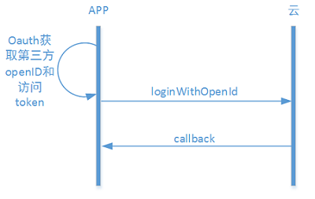

#iOS客户端开发指导
**iOS的开发的环境配置参考[开发框架-iOS-开发环境配置](../framework/iOS#开发环境配置)**

#帐号管理
建议的用户交互流程见 [功能说明-帐号管理](../features.md#_11)

##1、普通帐号注册


<font color="red">**补充开发指导**</font>	

**获取账号管理对象**

```ObjC
    
```

**普通帐号注册流程**

1、检查手机号是否已注册


```ObjC

```


2、发送验证码

```ObjC

```

3、检测验证码正确性

```ObjC

```

4、注册

```ObjC

```
 
##2、第三方登录
 


<font color="red">**补充开发指导**</font>	

1、直接使用第三方登录

```ObjC

```

2、在已有普通账号登录时绑定第三方账号

```ObjC

```

#设备管理

说明参见[功能说明-设备管理](../features.md#_12)

##独立设备

用户登录/注册后，需要绑定设备才能够使用。对于没有二维码的设备，绑定设备时，首先需在APP上给出配置设备进入Smartconfig状态的提示。然后填写当前手机连接的WiFi的密码，调用startAbleLink将WiFi密码广播给设备，设备拿到WiFi密码后连接到云端然后开始局域网广播自己的subdomainID。App拿到这些信息后调用bindDevice接口绑定设备。


<font color="red">**补充开发指导**</font>

##网关设备

网关的绑定流程和WiFi设备是一样的。网关绑定以后绑定子设备的建议流程如下：


该流程只是建议流程的一种。其中openGatewayMatch和closeGatewayMatch接口都是为了方便软件开启配对而开发的接口。如果使用硬件上的操作（如网关上有按钮等）完成网关和子设备的配对，则不需要用到这两个接口。

<font color="red">**补充开发指导**</font>


##home模型


###home模型下添加独立设备

建议的流程如下：


<font color="red">**补充开发指导**</font>

###home模型下添加网关型设备且网关没有二维码

网关没有二维码时，一般是网管在连接云端以后在局域网广播自己的物理ID。APP接收广播然后绑定设备。


<font color="red">**补充开发指导**</font>

###home模型下添加网关型设备且网关有二维码

网关有二维码时，不需要通过接收广播来获取设备物理ID。流程如下：


<font color="red">**补充开发指导**</font>


#和云端通信

说明参见[功能说明-和云端通信](../introduction.md#_22)

##1、发送到设备

<font color="red">**补充开发指导**</font>

##2、发送到服务

<font color="red">**补充开发指导**</font>


#局域网通信

说明参见[功能说明-局域网通信](../features.md#_28)

<font color="red">**补充开发指导**</font>

#定时任务

说明参见[功能说明-定时任务](../features.md#_29)


#OTA

说明参见[功能说明-OTA](../introduction.md#ota)


<font color="red">**补充开发指导**</font>	

开发OTA之前需要在开发环境中配置友盟的推送服务，配置方法参见：[开发框架-安卓-环境配置](../framework/android#环境配置)

1、在应用的主Activity onCreate() 函数中开启推送服务

```ObjC

```


2、在登录成功之后添加推送别名
```ObjC

```

3、设置友盟的消息处理
```ObjC

```
4、在退出登录之后移除掉旧的别名
```ObjC

```


#推送

说明参见[功能说明-OTA](../features.md#_30)

见[开发框架-开发环境配置](../framework/android#开发环境配置)

<font color="red">**补充开发指导**</font>

#实时消息

<font color="red">**补充开发指导**</font>


#Error Code
参考[reference-Error Code](../reference/error_code.md)