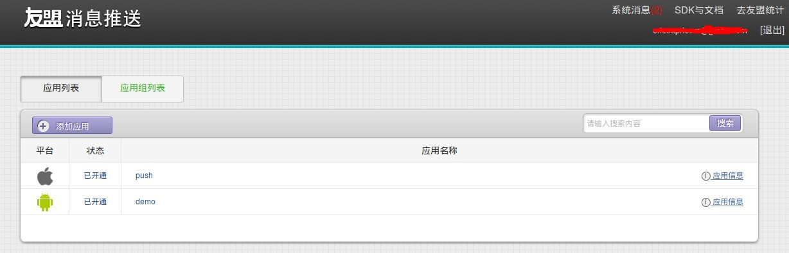

#IOS客户端开发指导

#开发环境设置
####系统准备
在进行开发前，需要对系统以及环境进行设置。目前框架支持Objective-C、C语言，因此系统准备基本都是和iOS开发相关，如Mac OS X、Xcode等。
+ **OS X**
系统建议采用Mac OS X 10.11以上的版本
+ **Xcode**
安装Xcode，建议采用7.0以上版本
+ **ablecloud**
下载ablecloud开发框架并解压

####Xcode

1. **新建工程**
选择新建iOS Application，根据需要选择，建议选择Single View Application。
点击**Next**进入下一个页面，根据情况填写Product Name/Organization Name/Organization Identifier等信息。
填好后点击**Next**，进入下一步，填写好存放路径。
至此，新建工程完成。
2. **导入AbleCloudLib**
按照步骤1完成了工程的新建，接下来需要将AbleCloudLib导入到工程中。
右键点击工程中想要导入的Group选择 **Add Files to "your project name"...**
选择AbleCloudLib的路径，勾选**Copy items if needed**，点击**Add**添加。
完成上述步骤后，我们将在工程视图里面看到该目录。
至此，开发者开发服务所以来的ablecloud开发框架库添加成功。
3. **添加依赖库** SDK依赖`libicucore.tbd` `libresolv.tbd` `libz.tbd`, 请分别添加进自己的工程。
4. **本地运行**
Xcode下直接**Command + R**运行。


####应用程序初始化
在你的应用使用AbleCloud服务之前，你需要在代码中对AbleCloud SDK进行初始化。
建议在APP启动方法`didFinishLaunchingWithOptions:`中调用此方法来进行初始化

```objc

- (BOOL)application:(UIApplication *)application didFinishLaunchingWithOptions:(NSDictionary *)launchOptions {
    
    [ACloudLib setMajorDomain:<#主域名#> majorDomainId:<#主域ID#>];
    
    return YES;
}

```

开发阶段，请初始化**测试环境**
在完成测试阶段之后，需要迁移到**正式环境**下

```objc
/**
//********MODE*******
//测试环境
extern NSString *const ACLoudLibModeTest;
//正式环境
extern NSString *const ACloudLibModeRouter;
//*******REGION******
//中国
extern NSString *const ACLoudLibRegionChina;
//东南亚
extern NSString *const ACLoudLibRegionSouthEastAsia;
//欧洲
extern NSString *const ACLoudLibRegionCentralEurope;
//美洲
extern NSString *const ACLoudLibRegionNorthAmerica;
*/

[ACloudLib setMode:ACloudLibModeRouter Region:ACLoudLibRegionChina];
```


#帐号管理

功能介绍参考： [功能说明-功能介绍-帐号管理](../features/functions.md#_1)

用户调用登录接口成功之后，会在app本地存储一个token，下次启动app时即默认app已经登录，无需再进行登录，从v1.09版本之后，这个token具有有效期，在长期未使用app的情况下会过期，这个时候需要进行重新登录处理，所以建议在主页获取设备列表的错误回调里对3516的错误码进行单独处理，返回登录页让用户重新登录。

##一、普通帐号注册


###账号管理类
```objc
@interface ACAccountManager : NSObject
```
###普通帐号注册流程

####1、检查手机号是否已注册
```objc
[ACAccountManager checkExist:phoneNum callback:^(BOOL exist, NSError *error) {
     if(error){
      //返回失败信息，根据error做不同的提示或者处理}else{
         if (exist) {
         //提示手机号已经存在
         }else{
         //发送验证码
         }
      }
}];
```


####2、发送验证码
```objc
//1代表Ablecloud短信内容的模版，具体开发需要先把短信内容模版提交到Ablecloud再获取对应的参数
[ACAccountManager sendVerifyCodeWithAccount:phoneNum template:1 callback:^(NSError *error) {

         if (!error) {
             //校验验证码
         }else{
            //获取失败，根据error做不同的提示或者处理
         }

}];
```


####3、检测验证码正确性
```objc
//phone和email可任选其一
[ACAccountManager checkVerifyCodeWithAccount:phoneNum verifyCode:verifyCode callback:^(BOOL valid, NSError *error) {
           if(error){
            //返回失败信息，根据error做不同的提示或者处理
           }else{
                if (valid) {
                    //注册
                }else{
                //提示验证码错误
                }
            }
}];

```
####4、注册
```objc
[ACAccountManager registerWithNickName:userName phone:self.phoneNum email:nil password:passwd verifyCode:self.verifyCode callback:^(ACUserInfo *user, NSError *error) {

          if (error == nil) {
           //获得用户user.userId和user.nickName，进入主页或设备管理
          }else {
          //用户不合法
          }
}];

```

##二、第三方登录


####1、直接使用第三方登录
```objc
[ACAccountManager loginWithOpenId:openID provider:provider accessToken:accessToken callback:^(ACUserInfo *user, NSError *error) {
            if(!error){
            //获得用户userId和nickName，进入主页或设备管理
            }else{
            //网络错误或其他，根据e.getErrorCode()做不同的提示或处理
            }
}];

//绑定一个未被注册的普通帐号；emai和phone可以任选其一;nickName为可选项，没有时传空字符串
[ACAccountManager registerWithNickName:userName phone:self.phoneNum email:nil password:passwd verifyCode:self.verifyCode callback:^(ACUserInfo *user, NSError *error)
{
             if(error){
             //返回失败信息，根据error做不同的提示或者处理
             }else{
             //绑定账号成功
             }
}];

```

####2、在已有普通账号登录时绑定第三方账号
```objc
[ACAccountManager registerWithNickName:userName phone:self.phoneNum email:nil password:passwd verifyCode:self.verifyCode callback:^(ACUserInfo *user, NSError *error)
{
           if(error){
           //返回失败信息，根据error做不同的提示或者处理
            }else{
            //绑定第三方账号成功
            }
}];
```


##三、添加帐号扩展属性

使用账号扩展属性需要先到AbleCloud官网平台上的用户管理添加扩展属性

####1、使用类
```objc
@interface ACAccountManager : NSObject
```

####2、设置用户自定义扩展属性
```objc

/**
* 修改帐号扩展属性
*注意此处put进去的key与value类型需要跟平台添加的附加属  性一致
*如：ACObject * profile = [[ACObject alloc]init];
*[profile putValue:@"a" forKey:@"北京"];
*[profile putValue:@"b" forKey:@"生日"];
*/

[ACAccountManager setUserProfile:acObj callback:^(NSError *error) {
            if(error){
             //返回失败信息，根据error做不同的提示或者处理
             }else{
            //修改成功
             }   
}];
```

####3、获取用户自定义扩展属性
```objc
[ACAccountManager getUserProfile:^(ACObject *profile, NSError *error)
{ 
             if(error){
            //返回失败信息，根据error做不同的提示或者处理
             }else{
            //获取成功
              } 
}
```

#设备管理

##独立设备

功能介绍参见 [功能说明-功能介绍-设备管理](../features/functions.md#_2)

**用户登录/注册后，需要绑定设备才能够使用。对于wifi设备，绑定设备时，首先需在APP上给出配置设备进入Smartconfig状态的提示；然后填写当前手机连接的WiFi的密码，调用startAbleLink将WiFi密码广播给设备，设备拿到WiFi密码后连接到云端然后开始局域网广播自己的物理Id和subdomainID，APP拿到这些信息后调用bindDevice接口绑定设备。对于GPRS设备，则无需以上设备激活的流程，通过扫码或其他方式获取物理Id后调用bindDevice进行绑定。**


###一．绑定设备

###WiFi设备

####1.ACWifiLinkManager类

Ablecloud提供了ACWifiLinkManager类激活器供你使用

>注: 模拟器不能使用该类, 如需要绑定设备, 请使用真机测试

```objc

@interface ACWifiLinkManager : NSObject

- (id)initWithLinkerName:(NSString *)linkerName;
```

><font color="red">注</font>：linkerName表示开发板型号，如果用的是其它的开发板，则需要改成相对应的值。
目前支持的开发板有`smartlink(汉枫)`、`oneshot(联胜德)`、`easyconfig(RAK)`、`easylink(庆科)`、`smartconfig(MTK)`、`esptouch(乐鑫)`、`realtek(瑞昱)`。

####2.获取WiFi SSID
```objc
NSString * ssid = [ACWifilinkManager getCurrentSSID];
```

####3.激活设备
APP通过startAbleLink广播自己的WiFi密码，设备成功连上云之后通过广播通知APP同时获取设备物理Id和subDomainId（用来区分设备类型）。当前只支持配置手机当前连接的WiFi。

```objc
//ssid是Wi-Fi名字 pwd是Wi-Fi密码
[wifiManager sendWifiInfo:ssid password:pwd timeout:timeout callback:^(NSArray *localDevices, NSError *error) {
        if(error){
        //返回失败信息，根据error做不同的提示或者处理，此处一般为1993配置超时错误
        }else{
        //成功后得到已激活设备的列表，从列表中得到物理id后进行绑定
        }  
}];
```
设备无法激活时，请检查以下问题：

- 1.确认WIFI密码是否输入正确。
- 2.确认路由器的广播功能有没有被禁用。
- 3.设备的秘钥可能存在问题。

####4.绑定设备
通过获取到的subdomainID匹配subdomian，然后在成功激活设备后的回调方法中，通过subdomian和物理Id绑定设备。

```objc
[ACBindManager bindDeviceWithSubDomain:subdomain physicalDeviceId:tmpdevice.deviceId
name:[deviceNames objectAtIndex:i] callback:^(ACUserDevice *userDevice, NSError *error)
{
        if(error){
        //返回失败信息，根据error做不同的提示或者处理
        }else{
        //绑定成功后返回设备信息
        }  
}];
```
设备无法绑定时，请检查以下问题：

- 1.设备已经被其他人绑定过了。
- 2.设备的domain和subdomain信息有误。
- 3.电源供电是否正常，建议更换电源。
- 4.确保设备的天线正常。
- 5.确保网络环境不是公共环境。

绑定成功后，通过listdevice 接口可以列出已经绑定的设备列表。

###GPRS设备
**<font color="red">注</font>：GPRS设备无需激活流程，设备连接到GPRS后会自动连接云端完成激活。因此设备上电后就可以直接进入绑定流程。**建议通过扫二维码的形式获取物理Id进行绑定。

```objc
[ACBindManager bindDeviceWithSubDomain:subdomain physicalDeviceId:tmpdevice.deviceId
name:[deviceNames objectAtIndex:i] callback:^(ACUserDevice *userDevice, NSError *error)
{
        if(error){
        //返回失败信息，根据error做不同的提示或者处理
        }else{
        //绑定成功后返回设备信息
        }  
}];
```

><font color="red">建议流程</font>：若设备上有是否连接上AbleCloud云端的指示灯，则可以提示用户在指示灯亮起的时候绑定设备。若无指示灯，则可在用户点击开始绑定之后，建议通过Timer每隔2s钟绑定一次设备，在连续绑定几次之后再提示用户失败或成功。

###二．分享设备

+ **第一种分享方式是管理员输入用户的帐号（手机号）直接把设备分享给用户**
+ **第二种方式为管理员分享二维码后，用户再通过扫码的形式绑定设备获得设备的使用权。推荐使用第二种分享机制。**

####1、管理员直接分享设备给普通用户
```objc
[ACBindManager bindDeviceWithUserSubdomain:subdomain deviceId:deviceId account:acount callback:^(NSError *error) {
          if(error){
          //返回失败信息，根据error做不同的提示或者处理
          }else{
          //成功分享设备给account用户
          }
}];
```


####2、管理员通过分享设备二维码的形式分享设备
```objc
[ACBindManager getShareCodeWithSubDomain:subDmoain deviceId:deviceId timeout:timeout callback:^(NSString *shareCode, NSError *error) {
          if(error){
          //返回失败信息，根据error做不同的提示或者处理
          }else{
          //成功获取分享吗
          }
}];

//普通用户通过分享码绑定设备
[ACBindManager bindDeviceWithShareCode:shareCode callback:^(ACUserDevice *userDevice, NSError *error) {
          if(error){
         //返回失败信息，根据error做不同的提示或者处理
         }else{
         //成功绑定管理员分享的设备
         }
}];
```
<font color ="red"> 注：</font>管理员分享的二维码有有效期。默认为一个小时。调用getShareCodeWithSubDomain接口时开发者可以自定义有效时间。具体使用方法请参考[Reference->客户端-iOS->SDK接口列表->设备管理](../reference/iOS/#_8)

###三．设备解绑

####1、管理员或普通用户解绑设备
<font color=red>注意：</font>如果是管理员解绑设备，那么其他绑定该设备的普通成员也会失去该设备的绑定权。

```objc
[ACBindManager unbindDeviceWithSubDomain:subDomian deviceId:deviceId callback:^(NSError *error) {
         if(error){
         //返回失败信息，根据error做不同的提示或者处理
         }else{
         //解绑成功
        }
}];
```

####2、管理员取消其他普通成员对该设备的控制权
```objc
[ACBindManager unbindDeviceWithUserSubDomain:subDomain userId:userId deviceId:deviceId callback:^(NSError *error) {
         if(error){
         //返回失败信息，根据error做不同的提示或者处理
         }else{
         //解绑成功
         }
}];
```


##网关型设备


功能介绍参见 [功能说明-功能介绍-设备管理](../features/functions.md#_2)

网关的绑定流程和WiFi设备是一样的。网关绑定以后绑定子设备的建议流程如下：


该流程只是建议流程的一种。其中openGatewayMatch和closeGatewayMatch接口都是为了方便软件开启配对而开发的接口。如果使用硬件上的操作（如网关上有按钮等）完成网关和子设备的配对，则不需要用到这两个接口。

###一．绑定网关

###WiFi网关

####1.获取ACWifiLinkManager激活器
AbleCloud提供了ACWifiLinkManager激活器供你使用。

```objc
@interface ACWifiLinkManager : NSObject
ACWifiLinkManager * wifiManager = [[ACWifiLinkManager alloc] initWithLinkerName:@"easylink"];
```

<font color="red">注</font>：linkerName表示开发板的型号，如果用的是其它的开发板，则需要修改。
目前支持的开发板有`smartlink(汉枫)`、`oneshot(联胜德)`、`easyconfig(RAK)`、`easylink(庆科)`、`smartconfig(MTK)`、`esptouch(乐鑫)`、`realtek(瑞昱)`。

####2.得到WiFi SSID
```objc
NSString * ssid = [ACWifiLinkManager  getCurrentSSID ];
```


####3.激活网关
APP通过startAbleLink广播自己的WiFi密码，设备成功连上云之后通过广播通知APP同时获取设备物理Id和subDomainId（用来区分设备类型）。当前只支持配置手机当前连接的WiFi。

```objc
[wifiManager sendWifiInfo:ssid password:pwd timeout:timeout callback:^(NSArray *localDevices, NSError *error) {
          if(error){
          //返回失败信息，根据error做不同的提示或者处理，此处一般为1993配置超时错误
          }else{
          //成功后得到已激活设备的列表，从列表中得到物理id后进行绑定
         }  
}];
```

####4.绑定网关
在成功激活设备后的回调方法中，通过物理Id绑定网关。

```objc
[ACBindManager bindGatewayWithSubDomain:subDomain physicalDeviceId:physicalDeviceId name:name  callback:^(ACUserDevice *device, NSError *error) {
          if(error){
           //返回失败信息，根据error做不同的提示或者处理
          }else{
          //绑定成功后返回设备信息
         }  
}];
```

###以太网网关

<font color="red">注</font>：以太网网关无需激活流程，在网关插上网线连上云端之后即可以直接进入绑定设备的流程。建议通过扫码的形式获取网关物理Id进行绑定。

```objc
[ACBindManager bindGatewayWithSubDomain:subDomain physicalDeviceId:physicalDeviceId name:name  callback:^(ACUserDevice *device, NSError *error) {
        if(error){
        //返回失败信息，根据error做不同的提示或者处理
        }else{
        //绑定成功后返回设备信息
        }  
}];
```

###二．绑定子设备

####1．开启网关接入配对
```objc
//由于子设备接入网关是一个异步的过程，所以建议在这里new一个Timer去定时获取新加入的子设备列表，在activity退出时停止Timer
[ACBindManager openGatewayMatchWithSubDomain:subDomain gatewayDeviceId:gatewayDeviceId time:time callback:^(NSError *error) {
           if(error){
           //返回失败信息，根据error做不同的提示或者处理
           }else{
           //列举所有新加入的子设备列表 
           }   
}];
```

####2．列举所有新加入的子设备列表
```objc
[ACBindManager listSubDevicesWithSubDomain:subDomain gatewayDeviceId:deviceId callback:^(NSArray *devices, NSError *error) {
           if(error){
           //返回失败信息，根据error做不同的提示或者处理
           }else{
           //获取新加入的子设备列表成功
            } 
}];
```

<font color-"red">注:</font>该接口可以在APP端列出所有当前被网关扫描出来的但之前尚未被添加到该网关的子设备。也就是，列表中的设备都可以直接调用addSubDevice接口添加到网关。

####3．绑定子设备
通过上一步获取的子设备列表获取physicalDeviceId进行绑定。
如有用户确认过程的话，则在用户点击确认之后循环调用此接口绑定用户选择的子设备。

```objc
[ACBindManager addSubDeviceWithSubDomain:subDomain gatewayDeviceId:deviceId physicalDeviceId:physicalDeviceId name:name  callback:^(ACUserDevice *device, NSError *error) {
           if(error){
           //返回失败信息，根据error做不同的提示或者处理
           }else{
           //添加子设备成功
          }  
}];
```

<font color="red">注</font>：在绑定子设备addSubDevice的success回调里只是成功绑定该physicalDeviceId的单个设备，建议在成功绑定所有子设备之后再提示绑定成功。

若无法添加子设备时，请检查是否有以下问题：
1. 网关掉线
1. 子设备已经被其他人绑定
1. 子设备subdomain填写错误
2. 子设备和网关的连接断开了

##Home模型

功能介绍参见 [功能说明-功能介绍-设备管理](../features/functions.md#_2)


创建Home，然后绑定WiFi设备的建议流程如下图：


创建Home，然后绑定以太网或者GPRS设备的建议流程如下图：


创建Home，然后绑定WiFi网关，再向网关添加Zigbee子设备的建议流程如下图：


创建Home，然后绑定以太网网关，再向网关添加Zigbee子设备的建议流程如下图：


###一、创建Home

 
####1、创建Home
```objc
[ACGroupManager createHomeWithName:name callback:^(ACHome *home, NSError *error) {
        if (!error) {
            //成功创建一个home模型
        } else {
            //错误处理
        }
    }];
```


####2、创建Room

```objc
    [ACGroupManager createRoomWithHomeId:homeId name:name callback:^(ACRoom *room, NSError *error) {
        if (!error) {
            //成功创建一个room模型
        } else {
            //错误处理
        }
    }];
```

###二、添加或移动设备到Home里

><font color="red">特别注意</font>：

>1、添加设备到Home的流程与独立设备和网关型设备的绑定流程相同，均要求设备是已经激活（在线）的状态。建议独立设备在激活设备之后通过addDeviceToHome直接添加设备到home里；GPRS设备或以太网网关则直接使用addDeviceToHome添加设备。

>2、不能跨home移动设备。比如独立设备要移到room里，则需要先把它移动到home，再移动到room，不允许直接移动设备到room里。

####添加设备到Home里
创建完Home之后，需要添加绑定设备，绑定流程见上篇独立设备或网关开发指导，把bindDevice改成如下接口即可。

```objc
    //旧设备
    [ACGroupManager addDeviceToHomeWithSubDomain:subDomain deviceId:deviceId homeId:homeId name:name callback:^(BOOL isSuccess, NSError *error) {
        if (!error) {
            if (isSuccess) {
                //添加设备成功
            }
        } else {
            //错误处理
        }
    }];
    //新设备
    [ACGroupManager addDeviceToHomeWithSubDomain:subDomain physicalDeviceId: physicalDeviceId homeId:homeId name:name callback:^(BOOL isSuccess, NSError *error) {
        if (!error) {
            if (isSuccess) {
                //添加设备成功
            }
        } else {
            //错误处理
        }
    }];
```

####移动设备到Room里
```objc
[ACGroupManager moveDeviceToRoomWithDeviceId:devideId homeId:homeId roomId:roomId callback:^(BOOL isSuccess, NSError *error) {
        if (!error) {
            if (isSuccess) {
                //移动设备成功
            }
        } else {
            //错误处理
        }
    }];
```
<font color-"red">注:</font>若出现错误，请检查该Room和Deivce是否在同一Home下。

##设备扩展属性

功能介绍参见 [功能说明-功能介绍-设备管理](../features/functions.md#_2)

**<font color="red">注意</font>：设备扩展属性需要先进入到控制台产品管理-->产品列表-->管理-->产品属性-->扩展属性-->新建属性，建立完扩展属性列表后才能使用如下接口。**

####一、设置或者更新设备扩展属性
```objc
[ACBindManager setDeviceProfileWithSubDomain:subDomain deviceId:deviceId profile:acobj  callback:^(NSError *error) {
            if(error){
            //返回失败信息，根据error做不同的提示或者处理
            }else{
            //修改设备扩展属性成功
            }  
}];
```


####二、获取设备扩展属性
```objc
[ACBindManager getDeviceProfileWithSubDomain:subDomain deviceId:deviceId callback:^(ACObject *profile, NSError *error) {
            if(error){
            //返回失败信息，根据error做不同的提示或者处理
            }else{
            //获得设备扩展属性成功
            }  
}];
```


#云端通信

功能介绍参见 [功能说明-功能介绍-云端通信](../features/functions.md#_12)

**说明**：在设备尚未开发完成时，在管理后台可以启动虚拟设备用于APP的调试。虚拟设备和真实设备使用方法相同，需要先绑定再使用。虚拟设备能够显示APP发到设备的指令，上报数据到云端、填入数据供APP查询。

##一、发送消息到设备

###二进制格式

**在新建产品的时候选择数据格式为二进制，然后在功能点里面创建了数据包**

【数据包】


**例如**：以开关设备为例,协议如下:

```
//请求数据包
{ 68 ：
    //开关灯(二进制流，由厂商自己解析)，其中0代表关灯，1代表开灯
    [ 0/1 , 0 , 0 , 0 ]
}
//响应数据包  
{ 102 ：
    //结果(二进制流，由厂商自己解析)，其中0代表失败，1代表成功
    [ 0/1 , 0 , 0 , 0 ]
}
```
截取开灯代码，如下:

```objc
ACDeviceMsg *msg = [[ACDeviceMsg alloc]init];
msg.msgCode = 68;
Byte content[] = {1 , 0, 0, 0};
msg.payload = [NSData dataWithBytes:content length:sizeof(content)];
//LOCAL_FIRST表示先走局域网，局域网不通的情况下再走云端
[ACBindManager sendToDeviceWithOption:LOCAL_FIRST SubDomain:subDomian deviceId:deviceId msg:msg callback:^(ACDeviceMsg *responseMsg, NSError *error) {
     if(!error){
         //开灯成功
     }else{
         //开灯失败
     }
}];
```
###json格式

**在新建产品的时候选择数据格式为JSON，并填写功能点里的数据点与数据包。**

这里创建的数据点和数据包如下所示：

【数据点】


【数据包】


**例如**：以开关设备为例,协议如下:

```objc
//请求数据包
{ 70 ：
    {
        //开关灯，其中0代表关灯，1代表开灯
        "switch" : 0/1
    }
}
//响应数据包  
{
     //结果，其中false代表失败，1代表成功
     "result" : false/true
}
```

```objc
ACMsg *req = [[ACMsg alloc] init];
[req putInteger:@"switch" value:1];
ACDeviceMsg * msg = [[ACDeviceMsg alloc]init];
msg.msgCode = 68;
//json -> NSdata 序列化
msg.payload = [req marshal];
//LOCAL_FIRST代表优先走局域网，局域网不通的情况下再走云端
[ACBindManager sendToDeviceWithOption:LOCAL_FIRST SubDomain:subDomian deviceId:deviceId msg:msg callback:^(ACDeviceMsg *responseMsg, NSError *error) {
    if(!error){
        //开灯成功
    }else{
        //开灯失败
    }
}];
```

###KLV格式

KLV协议介绍请参考：[功能介绍-KLV协议介绍](../features/functions.md#klv)。

**在新建产品的时候选择klv通讯协议，并填写功能点里的数据点与数据包。**
这里创建的数据点和数据包如下所示：

【数据点】


【数据包】


**例如**：以开关设备为例,协议如下:

```objc
//请求数据包
{ 69 ：[
//数据点[key：value(int8)]，其中0代表关灯，1代表开灯
{ 1 : 0/1 }
]}
//响应数据包  
{ 60 ：[
//数据点[key：value(boolean)]，其中false为失败，true为成功
{ 1 : false/true }
]}
```

定义如下:

```objc

@interface ACKLVObject : NSObject

/**
* 获取一个参数值
* @param name	参数名
* @return		参数值
*/
- (ACKLVValue *)getValueForKey:(u_int16_t)key;
- (NSNull *)get:(u_int16_t)key;
- (BOOL)getBool:(u_int16_t)key;
- (Byte)getByte:(u_int16_t)key;
- (short)getShort:(u_int16_t)key;
- (int)getInt:(u_int16_t)key;
- (long)getLong:(u_int16_t)key;
- (float)getFloat:(u_int16_t)key;
- (double)getDouble:(u_int16_t)key;
- (NSString *)getString:(u_int16_t)key;
- (NSData *)getData:(u_int16_t)key;

/**
* 设置一个参数
* @param name	参数名
* @param value	参数值
* @return
*/
- (void)put:(u_int16_t)key;
- (void)putBool:(u_int16_t)key value:(BOOL)value;
- (void)putByte:(u_int16_t)key value:(Byte)value;
- (void)putShort:(u_int16_t)key value:(short)value;
- (void)putInt:(u_int16_t)key value:(int)value;
- (void)putLong:(u_int16_t)key value:(long)value;
- (void)putFloat:(u_int16_t)key value:(float)value;
- (void)putDouble:(u_int16_t)key value:(double)value;
- (void)putString:(u_int16_t)key value:(NSString *)value;
- (void)putData:(u_int16_t)key value:(NSData *)value;

- (BOOL)contains:(u_int16_t)key;
- (NSIndexSet *)getKeys;

- (BOOL)hasObjectData;
- (NSDictionary *)getObjectData;
- (void)setObjectData:(NSDictionary *)data;
```


##二、发送消息到服务

####访问普通UDS服务
<font color="red">注意</font>：serviceName对应服务管理里UDS服务里的**服务名称**，务必保持一致。进入版本管理之后，查看已上线版本。serviceVersion为**主版本号**，比如1-0-0，则version为1。

```objc
ACMsg * msg = [[ACMsg alloc] init];
msg.context = [ACContext generateContextWithSubDomain:[CommonInfo getSubDomain]];
[msg setName:@"createDeviceInitState"];
[msg putLong:@"deviceId" value:userDevice.deviceId];
[msg putLong:@"subDomainId" value:userDevice.subDomainId];
ACServiceClient *serviceClient = [[ACServiceClient alloc]initWithHost:[CommonInfo getHost] service:[CommonInfo getServiceName] version:1];
[serviceClient sendToService:msg callback:^(ACMsg *responseObject, NSError *error)
{
            if (!error) {
            //发送成功并接受服务的响应消息
            } else {
            //网络错误或其他,根据error.code作出不同提示和处理,此处一般为UDS云端问题,可到AbleCloud平台查看log日志
            }
}];
```
####匿名访问UDS服务

```objc
ACMsg *msg = [[ACMsg alloc]init];
msg.name = @"自定义";
+[ACServiceClient sendToServiceWithoutSignWithSubDomain:@"子域" ServiceName:@"服务名字" ServiceVersion:1 Req:req Callback:^(ACMsg *responseMsg, NSError *error) {
            if (!error) {
            //发送成功并接收服务的响应消息
            } else {
            //网络错误或其他,根据error.code作出不同提示和处理,此处一般为UDS云端问题,可到AbleCloud平台查看log日志
            }
}];
```

##三、实时消息

实时消息第一版的设计与store数据集直接相关，当数据表格的存储有发生变化时，如创建、更新、添加、删除操作时才会下发数据到APP。也就是说，如果要APP上实时显示数据变化，需要在管理后台创建数据集，并指定是否监控该数据集。然后写云端自定义服务，将需要实时显示的数据存储到该数据集中。这样当该数据集有变化时，APP端才能够实时显示对应的数据变化。

注:使用前先导入`libicucore.tbd`系统库


####1、获取实时消息管理器

```objc
#import "ACPushManager.h"
ACPushManager * pushManager = [[ACPushManager alloc] init];
```

####2、创建与服务器的连接
```objc
[pushManager connectWithCallback:^(NSError *error) {
            if (!error) {
            //连接成功，可以订阅数据 
            }else{
            //连接失败，网络错误 
            }
}];
```

####3、订阅实时数据
以如下数据集为例：


```objc
//实例化ACPushTable对象
ACPushTable *table = [[ACPushTable alloc] init];
//设置订阅的表名
table.className = @"<#name#>";
//设置订阅的columns行
table.cloumns = [NSMutableArray arrayWithObjects:@"<#obj#>", nil];
//设置监听类型，如以下为只要发生创建、删除、替换、更新数据集的时候即会推送数据
table.opType =  OPTYPE_CREATE |OPTYPE_DELETE | OPTYPE_REPLACE | OPTYPE_UPDATE;
//设置监听主键，此处对应添加数据集时的监控主键(监控主键必须是数据集主键的子集)
ACObject * primaryKey = [[ACObject alloc] init];
[primaryKey putInteger:@"deviceId" value:<#value#>];
table.primaryKey = primaryKey;
//可以多次调用以下此方法watch多个table
[pushManager watchWithTable:table Callback:^(NSError *error) {
             if (!error) {
             //订阅成功
             }else{
             //订阅失败，请自行检查参数类型，表名，columns以及监听主键是否与AbleCloud平台新建的数据集监听主键一致等是否有误。
             }
}];
```

####4、接收已订阅的实时数据

```objc
[pushManager onReceiveWithCallback:^(ACPushReceive *pushReceive, NSError *error) {
             if (!error) {
             //pushReceive.className 表名
             //pushReceive.opType 接收类型，如ACPushTableOpType.CREATE
             //pushReceive.Payload 接收数据ACObject格式
             ACObject * obj = pushReceive.payload;
             long speed = [obj getLong:@"windSpeed"];
             }
}];
```

####5、取消订阅
建议在退出订阅的activity之后调用，避免造成流量浪费。

```objc
//实例化ACPushTable对象
ACPushTable *table  = [[ACPushTable alloc] init];
//设置订阅的表名
table.className = @"BramcDeviceManager";
//设置监听主键
ACObject * primaryKey = [[ACObject alloc] init];
[primaryKey putInteger:@"deviceId" value:100001];
table.primaryKey =primaryKey;

[pushManager unWatchWithPushTable:table Callback:^(NSError *error) {
             if (!error) {
             //取消订阅成功
            }else{
            //取消订阅失败，请自行检查参数类型，表名以及监听主键是否与AbleCloud平台新建的数据集监听主键一致等是否有误。
            }
}];
```


#局域网通信

功能介绍参见 [功能说明-功能介绍-局域网通信](../features/functions.md#_18)

获取设备列表（在网络环境差的情况下如果获取不到设备列表会从本地缓存里取设备列表）。

```objc
[ACBindManager listDevicesWithStatusCallback:^(NSArray *devices, NSError *error) {
         if (!error) {
             for (ACUserDevice * device  in devices) 
             {
                    /**
                     * 设备在线状态(listDeviceWithStatus时返回，listDevice不返回该值)
                     * 0不在线 1云端在线 2局域网在线 3云端和局域网同时在线
                     * 若只选择直连的通讯方式，则只有在2和3的状态下才能往设备发送成功
                     */
                //设备在线状态
                NSInteger status = device.status;
             }
        }else{
        //网络错误且之前从来没有获取过设备列表时返回
        }

}];
```
><font color=red>注意</font>：app启动初始化AbleCloud时会自动获取局域网设备，由于获取局域网设备是一个异步过程（默认时间为2s），用户可在自定义设置超时的timeout(建议为闪屏页的时间)，所以建议在启动app到打开设备列表页面之间根据实际情况增加一个闪屏页面。

因为局域网通讯要求设备与APP处于同一个WiFi下，若网络环境变化，如切换WiFi时，或者设备掉线时，直连的状态会发生改变，所以建议在设备页通过定时器手动定时更新局域网状态。

```objc
//手动调用局域网发现 subDomainId:子域ID(传0即可) timeout:(根据实际需求自定义设置)
ACloud * cloud = [[ACloud alloc]init];
[cloud findDeviceTimeout:3 SudDomainId:subDomainId callback:^(NSArray *deviceList, NSError *error) {
         if (!error) {
         //发现局域网设备,根据更新局域网在线状态或者重新获取设备列表
          }else{
          //没有局域网设备，更新局域网在线状态或者重新获取设备列表
          }
}];
```
><font color=red>注意</font>：使用定时器时建议放于主线程处理
最后，至于如何通过直连方式给设备发消息，详情见[和云端通讯](#_19)部分。


#定时任务

功能介绍参见 [功能说明-功能介绍-定时任务](../features/functions.md#_19)


## <span class="skip">||SKIP||</span>

####获取定时管理器－－ACTimerManager类
**使用默认时区**

```objc

ACTimerManager ＊ timerMgr=［［ACTimerManager alloc］ init］;
```

**使用自定义时区**

```objc
- (id)initWithTimeZone:(NSTimeZone *)timeZone {
       self = [super init];
       if (self) {
       self.timeZone = timeZone;
        }
        return self;
}
```

####添加定时任务
>**<font color="red">注意</font>：**

>**1、timePoint的格式为`"yyyy-MM-dd HH:mm:ss"`，否则会失败。**

>**2、timeCycle需要在timePoint时间点的基础上,选择循环方式。**

>+ **"once":**单次循环

>+ **"hour":**在每小时的**`mm:ss`**时间点循环执行

>+ **"day":**在每天的**`HH:mm:ss`**时间点循环执行

>+ **"month":**在每月的**`dd HH:mm:ss`**时间点循环执行

>+ **"year":**在每年的**`MM-dd HH:mm:ss`**时间点循环执行


>+ **"week[0,1,2,3,4,5,6]":**在每星期的**`HH:mm:ss`**时间点循环执行(如周一，周五重复，则表示为"week[1,5]")

####添加定时任务
```objc
ACDeviceMsg * msg = [[ACDeviceMsg alloc] init];
msg.msgCode = 68;
//payload根据厂商而定，此处只是示例
Byte content[] = {1 , 0, 0, 0};
msg.payload = [NSData dataWithBytes:content length:sizeof(content)];
[timerMgr addTaskWithdeviceId:self.upDeviceId name:nameStr timePoint:resultString timeCycle:weekStr deviceMsg:msg callback:^( NSError *error) {
    if (error)
    {
        NSLog(@"添加定时失败");
    }
    else
    {
        NSLog(@"添加定时成功");
    }
}];
```

####修改定时任务
接口为modifyTask，其他参数与定义与创建定时任务相同。

####开启定时任务
```objc
[timerMgr openTaskWithDeviceId:self.upDeivceId taskId:acTask.taskId callback:^(NSError *error) {

        if (error) { 
        NSLog(@"预约开失败－－%@",error);
        }else{
        NSLog(@"预约开成功");
        }
}];
```

####关闭定时任务
```objc
[DeviceMsg closeTaskWithDeviceId:self.upDeivceId taskId:acTask.taskId callback:^(NSError *error) {
         if (error){
         NSLog(@"预约关失败－－%@",error);
         }else{
         NSLog(@"预约关成功");
         }
}];

```

####删除定时任务
```objc
[timerMgr deleteTaskWithDeviceId:self.upDeivceId taskId:ac.taskId callback:^(NSError *error){
          if (error){
          //删除定时失败，处理error
          }else{
          //删除定时成功
          }
}];
```

####获取定时任务列表
```objc
[timerMgr listTasksWithDeviceId:deviceId callback:^(NSArray *timerTaskArray, NSError *error) {

         if (error)
          {
          NSLog(@"获取定时信息失败%@",error);
           }
          else
          {
          //获取定时任务成功
           }
}];
```


#OTA

功能介绍参见 [功能说明-功能介绍-OTA](../features/functions.md#ota)


## <span class="skip">||SKIP||</span>


##普通设备OTA (非蓝牙设备OTA)


若使用场景为开启APP之后自动检测升级，建议把检测升级过程放在application里，并维护一个deviceId和ACOTAUpgradeInfo的映射关系，通过static修饰放到内存里，在进入OTA升级页面后可以直接取出来显示。如想实现用户取消升级之后不再提示功能，则可以自己维护一个变量记录。

####一.获取OTA管理器对象--ACOTAManager类

```objc
@interface ACOTAManager : NSObject
```

####二. 检查升级

检查设备是否有新的OTA版本

```objc
- (void)wifiDownload {
    ACOTACheckInfo *checkInfo = [ACOTACheckInfo checkInfoWithDeviceId:<#deviceId#> otaType:ACOTACheckInfoTypeSystem];
    [ACOTAManager checkUpdateWithSubDomain:<#subDomain#> OTACheckInfo:checkInfo callback:^(ACOTAUpgradeInfo *checkInfo, NSError *error) {
        NSLog(@"资源:%@---meta:%@",checkInfo, checkInfo.meta);
        if (!checkInfo.update) {
            NSLog(@"不需要升级");
            return;
        }
       //调用确认升级接口
    }];
}

```

####三．确认升级
```objc
[ACOTAManager confirmUpdateWithSubDomain:subDomain deviceId:deviceId newVersion:newVersion callback:^(NSError *error) {
          if(error) {
          //返回失败信息，根据error.code做不同的提示或者处理
          } else {
          //确认升级
         }
}];
```

##蓝牙设备OTA

####一、获取OTA管理器对象
```objc
@interface ACOTAManager : NSObject
```

####二、查询OTA新版本信息

```objc
- (IBAction)checkUpdate:(id)sender {
    ACOTACheckInfo *checkInfo = [ACOTACheckInfo checkInfoWithPhysicalDeviceId:<#PhysicalDeviceId#> version:<#version#>];
    
    [ACOTAManager checkUpdateWithSubDomain:<#subDomain#>
                              OTACheckInfo:checkInfo
                                  callback:^(ACOTAUpgradeInfo *checkInfo, NSError *error) {
                                  if (error) {
                                          //错误处理
                                          return;
                                      }
                                      if (!checkInfo.update) {
                                          //不需要升级
                                          return;
                                      }
                                      //提示是否下载ota文件
        UIAlertView *alert = [[UIAlertView alloc] initWithTitle:@"提示"
                                                        message:@"是否下载OTA文件"
                                                       delegate:self
                                              cancelButtonTitle:@"取消"
                                              otherButtonTitles:@"确认", nil];
                                      [alert show];
    }];
}
```

####下载OTA文件

```objc

- (void)downloadOTA:(ACOTAUpgradeInfo *)checkInfo {
	//获取文件管理器对象
    ACFileManager *manager = [[ACFileManager alloc] init];
    [manager downFileWithsession:checkInfo.meta.downloadUrl checkSum:checkInfo.meta.checksum callBack:^(float progress, NSError *error) {
    //进度回调
        NSLog(@"%f---error:%@", progress, error);
    } CompleteCallback:^(NSString *filePath) {
        NSLog(@"下载完成:%@", filePath);
    }];
}
```


#推送

功能介绍参见 [功能说明-功能介绍-推送](../features/functions.md#20)


AbleCloud的推送使用[友盟](http://www.umeng.com/)的服务，在开发功能之前，现需要进行一些配置。

##推送开发准备

下面以友盟推送为例，介绍开发推送功能前需要做的准备工作。

首先，需要创建友盟推送账号，并创建应用（安卓和iOS版本需要单独创建），如下图所示。

 

记录“应用信息”中的AppKey和App Master Secret，将其填写到test.ablecloud.cn中。AbleCloud和友盟已经达成合作协议，服务器IP地址一项不需要填写。

 

友盟平台配置完成后，到AbleCloud的管理后台的推送管理页面填写对应信息即可使用AbleCloud提供的推送服务。


在AbleCloud平台中添加应用，并填写App Key和App Master Secret

><font color="red">注意</font>

>1、调试的时候若开发环境配置有变化的话尽量手动卸载APP之后再重新安装。

>2、推荐先登录友盟推送的后台进行推送测试，若能收到推送通知即代表流程通过，最后再与UDS服务进行下一步测试。

>3、推荐先使用友盟推送后台的设备状态查询（通过接口获取）或者设备别名查询（即登录成功之后的userId）等工具确认是否成功注册推送服务。若注册成功之后仍没有收到通知消息，再检查一下开发环境配置。


##一、推送准备

####添加 AppKey 和 Umeng Message Secret


##二、开启推送服务

AbleCloud在SDK中提供了与推送服务相关的接口（封装了友盟的部分接口），定义如下：

####1、获取推送管理器－－ACNotificationManager类
```objc
@interface ACNotificationManager : NSObject
```

####2、在应用的启动函数中开启推送服务
```objc
- (BOOL)application:(UIApplication *)application didFinishLaunchingWithOptions:(NSDictionary *)launchOptions 
{
        [ACNotificationManager       startWithAppkey:@"您的appKey" launchOptions:launchOptions];
}
```

####3、在登录成功之后添加推送别名
```objc
[ACNotificationManager addAliasWithUserId:user.userId callback:^(NSError *error) {
         if(error){
         NSLog(@"推送添加别名失败");
         }else{
         //成功
         }
}];
```

####4、在退出登录之后移除掉旧的别名
```objc
[ACNotificationManager removeAliasWithUserId:uid callback:^(NSError *error){
           if(error){
             //移除失败，处理错误信息
            }else{
            //移除成功
            }
}
```


#文件存储

功能介绍参见 [功能说明-功能介绍-文件存储](../features/functions.md#_21)

><font color="red">注意</font>：

>1、iOS权限原因，下载文件上传文件的操作只能在本应用的沙盒中操作

>2、文件下载功能是基于系统自带的NSURLSession框架实现

>3、上传下载支持断点续传功能


##一、获取文件管理器
```objc
ACFileManager *fileManager = [[ACFileManager alloc] init];
```
##二、下载文件
###1、获取下载url
```objc
//0代表URL链接的有效时间为长期有效
[fileManager getDownloadUrlWithfile:fileInfo ExpireTime:0 payloadCallback:^(NSString *urlString, NSError *error)
{
          if(error ){
           //获取URL失败，根据error作出不同的处理
           }else{
           //下载文件
            }
}
```
###2、根据url下载文件
```objc
[fileManager downFileWithsession:urlString callBack:^(float progress, NSError *error) {
     
       if(!error){
      //下载成功，返回下载进度
      }

} CompleteCallback:^(NSString *filePath) {
//返回下载文件沙盒中的路径
}];
```
##三、上传文件
如果对文件的管理有权限管理方面的需求的话，则需要使用到以下接口；如果不设置情况下则默认所有用户都有读取权限，只有上传者本人有修改写文件的权限
###1、设置上传文件的权限管理
```objc
/**
* 设置全局可读访问权限，不设置则默认为所有人可读
* @param allow 是否全局可读
*/
-(void)setPublicReadAccess:(BOOL)allow;

/**
* 设置全局可写访问权限，不设置则默认为除自己外的所有人不可写
* @param allow 是否全局可写
*/
-(void)setPublicWriteAccess:(BOOL)allow;

/**
* 设置用户可访问权限（白名单）
* @param opType 权限类型，OpType.READ为可读权限，OpType.WRITE为可写权限
* @param userId 被设置用户Id
*/
-(void)setUserAccess:(OpType)optype userId:(long)userId;

/**
* 设置用户访问权限（黑名单）
* @param opType 权限类型，OpType.READ为可读权限，OpType.WRITE为可写权限
* @param userId 被设置用户Id
*/
-(void)setUserDeny:(OpType)optype userId:(long)userId;
```

<font color="red">**规则**：</font>优先判断黑名单，黑名单命中后其他设置无效，其次判断白名单，最后判断全局设置属性。例如同时设置userId为1的用户为黑名单和白名单，则设置的白名单无效。

###2、上传文件
####1)、设置上传文件信息－－ACFileInfo类
```objc
@interface ACFileInfo : NSObject
//上传文件名字
@property (copy,nonatomic) NSString * name;

//上传文件路径，支持断点续传
@property (copy,nonatomic) NSString * filePath;

//文件访问权限 如果不设置 则默认
@property (retain,nonatomic) ACACL  * acl;

//crc校验使用
@property (nonatomic,unsafe_unretained) NSInteger checksum;

//文件存储的空间   用户自定义   如名字为Image或者text的文件夹下
@property (copy,nonatomic) NSString * bucket;

-(id)initWithName:(NSString *)name bucket:(NSString *)bucket  ;
-(id)initWithName:(NSString *)name bucket:(NSString *)bucket Checksum:(NSInteger)checksum;
+ (instancetype)fileInfoWithName:(NSString *)name bucket:(NSString *)bucket ;
```
####2)、上传
```objc
ACFileInfo * fileInfo = [[ACFileInfo alloc] initWithName:@"3.jpg" bucket:@"jpg"];
fileInfo.filePath = [self getPath];
fileInfo.acl = [[ACACL alloc] init];
upManager = [[ACFileManager alloc] init];
[upManager uploadFileWithfileInfo:fileInfo progressCallback:^(float progress)｛
     if(error){
      //支持断点续传，所以此处若发生网络错误，会在网络恢复之后继续上传
     }else{
     //上传成功
     }
}


/**
* //取消上传
* @param subDomain     用户subDmomain
* @param fileInfo      文件信息
*/
-(void)cancleUploadWithfileInfo:(ACFileInfo *)fileInfo;
```


#辅助功能
SDK提供了一些额外的辅助功能

##获取室外天气
SDK可以获取到室外的pm2.5, AQI(空气质量)以及天气状况.

###1. 使用类

```
@interface ACWeatherManager : NSObject
```

###2. 代码示例

####PM25

```
///  获取最近n天的pm25值
///
///  @param area        支持到地级市, area填写中文如: "北京"
///  @param days        0表示7天
///  @param callback    pm25模型数组
- (void)getLastDaysPM25 {
    [ACWeatherManager getLastDaysPM25WithArea:_area days:3 callback:^(NSArray *pm25List, NSError *error) {
        [pm25List enumerateObjectsUsingBlock:^(ACPM25 *pm25, NSUInteger idx, BOOL * _Nonnull stop) {
            NSLog(@"%@", pm25);
        }];
    }];
}
```

####AQI

```
///  获取最近n天的aqi值
///
///  @param area        支持到地级市, area填写中文如: "北京"
///  @param days        0表示7天
///  @param callback    aqi模型数组
- (void)getLastDaysAQI {
    [ACWeatherManager getLastDaysAqiWithArea:_area days:3 callback:^(NSArray *aqiList, NSError *error) {
       [aqiList enumerateObjectsUsingBlock:^(id  _Nonnull obj, NSUInteger idx, BOOL * _Nonnull stop) {
           NSLog(@"%@", obj);
       }];
    }];
}
```
####weather

```
///  获取最近n天的weather
///
///  @param area        支持到地级市, area填写中文如: "北京"
///  @param days        0表示7天
///  @param callback    weather模型数组
- (void)getLastDaysWeather {
    [ACWeatherManager getLastDaysWeatherWithArea:_area days:5 callback:^(NSArray *weatherList, NSError *error) {
        [weatherList enumerateObjectsUsingBlock:^(id  _Nonnull obj, NSUInteger idx, BOOL * _Nonnull stop) {
            NSLog(@"%@", obj);
        }];
    }];
}
```


##用户意见反馈
AbleCloud提供APP端的用户意见反馈接口。开发者可以开发用户提交意见的页面。用户意见反馈可以反馈的项由开发者自己定义。
使用意见反馈前,需要先在控制台设置反馈项参数


###一 建议的开发流程
参考以下代码示例, 如果不需要上传图片等资源, 只需要调用第四步. 

如果需要上传图片资源, 请按下以下顺序调用接口

流程如下:

1. 初始化`ACFileInfo`，设置图片上传到云端的目录`bucket`、文件名`name`、文件等

2. 根据`ACFileInfo`将要反馈的图片信息上传到云端

3. 上传成功后根据`ACFileInfo`获取图片下载的urlString

4. 将反馈信息和第三步获取到的URLString作为参数填入意见反馈接口对应的value位置


###二 代码示例

####1. 设置要上传图片的fileInfo
```objc
    ACFileManager *manager = [[ACFileManager alloc] init];
    ACFileInfo *fileInfo = [ACFileInfo fileInfoWithName:<#fileName#> bucket:<#bucket#> CheckSum:0];
    //开发者自行选择以下两种上传方式
    //大文件, 提供filePath, 支持断点续传
    fileInfo.filePath = [[NSBundle mainBundle] pathForResource:@"xxx.jpg" ofType:nil];
    //小文件, 提供data, 不支持断点续传
    fileInfo.data = <#data#>;
```
####2. 调用上传接口
```objc
    [manager uploadFileWithfileInfo:fileInfo progressCallback:^(float progress) {
        NSLog(@"%f", progress);
    } voidCallback:^(ACMsg *responseObject, NSError *error) {
        if (error) {
            //错误处理
            return;
        }
        NSLog(@"%@", responseObject.name);
    }];
```
####3. 获取上传的图片的url
```objc
    //建议ExpireTime=0，url永久有效
    [manager getDownloadUrlWithfile:fileInfo ExpireTime:0 payloadCallback:^(NSString *urlString, NSError *error) {
        if (error) {
            //错误处理
            return;
        }
        NSLog(@"%@", urlString);
    }];
```
####4. 提交用户反馈信息
```objc  
    ACFeedBack *feedback = [[ACFeedBack alloc] init];
    //这里的键值对需要跟自己在后台定义的一致
    [feedback addFeedBackWithKey:@"description" value:@"descriptionValue"];
    [feedback addFeedBackWithKey:@"telephoneNumber" value:@"130xxxxxxxx"];
    //将上面获取到的 urlStringg放到对应的value
    [feedback addFeedBackPictureWithKey:@"pictures" value:<#urlString#>];
    
    [ACFeedBackManager submitFeedBack:feedback callback:^(BOOL isSuccess, NSError *error) {
        if (error) {
            //错误处理
            return;
        }
        //提交成功
    }];
```
#Error Code
参考[reference-Error Code](../reference/error_code.md)

>+ **建议在调用AbleCloud云服务接口之前先判断网络处于可访问状态之后再调用相关接口，可以省去对error回调里网络错误的处理。**
>+ **调试阶段，可通过返回的ACMsg 调用- (NSInteger)getErrCode;
和- (NSString *)getErrMsg;获取错误信息。**

