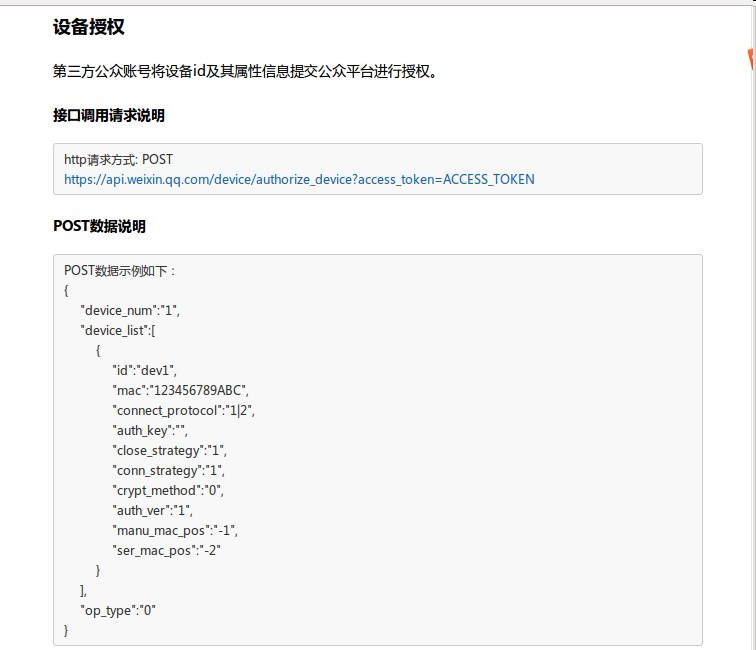

#京东

#微信开发前准备工作

# 1.申请微信公众号
由于公众号属于各个厂商，因此，申请公众号这个步骤由厂商完成。申请好后，会拿到微信公众平台分配的appID和appsecret，如下图所示：

微信公众号需要为服务号，并开启硬件设备，如下图：

# 2.准备服务器

**当前，AbleCloud暂时还未提供主机代理服务，因此需要厂商准备机器，并配置外网ip，最好申请一个域名。由于微信方的要求，现在该后台服务只能使用80端口。按照微信配置公众号的要求配置好，js接口安全域名，和网页授权获取用户基本信息的授权回调页域名**

#3.微信设备添加授权
**参考微信相关文档（http://iot.weixin.qq.com/document-2_6.html），对设备进行授权。**

**AbleCloud的设备物理id为16位。需要更改id和mac根据设备的实际情况进行填写，connect_protocol改为4为wifi设备。auth_ver改为0，不进行加密。其它参数不需要更改。**

##4.微信公众号添加菜单

**微信公众号创建菜单，微信官方参考文档（http://mp.weixin.qq.com/wiki/13/43de8269be54a0a6f64413e4dfa94f39.html）**

##5.调起微信的airkiss页面

**参考微信硬件平台jssdk文档（http://iot.weixin.qq.com/document-3_2.html），以及微信jssdk说明文档（http://mp.weixin.qq.com/wiki/7/aaa137b55fb2e0456bf8dd9148dd613f.html）**

##6.修改配置文件
**在php sdk的ablecloud目录下有ACConfig.php这个文件，需要修改其中的配置项。相关配置项内容需要开发者登陆AbleCloud的后台去获取相信息。**