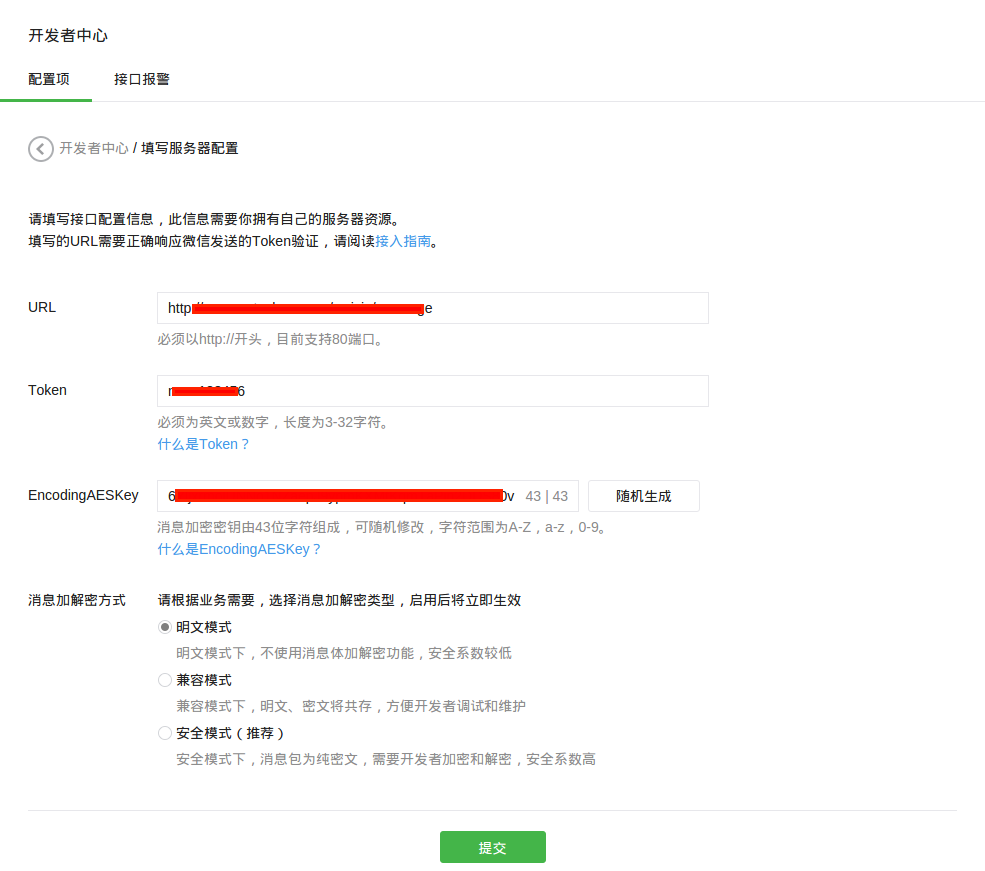
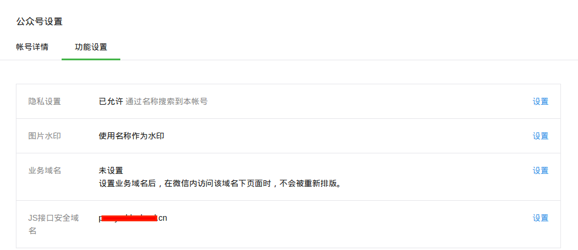
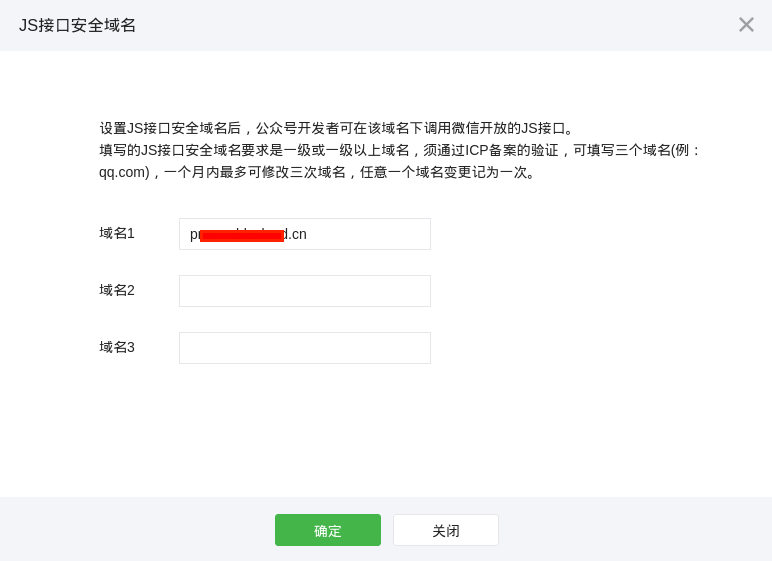
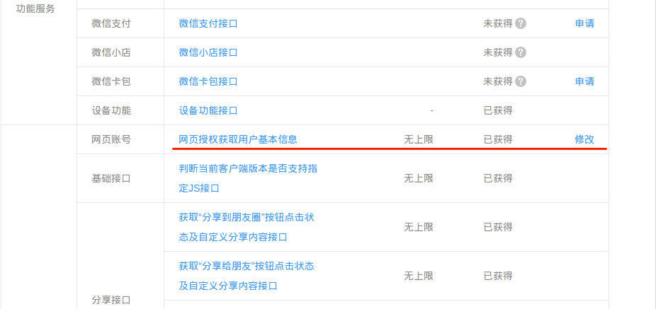
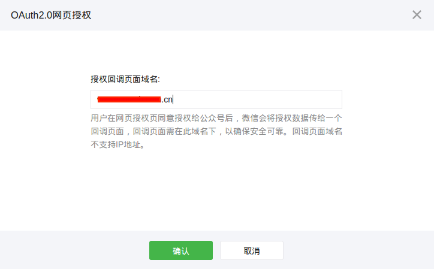
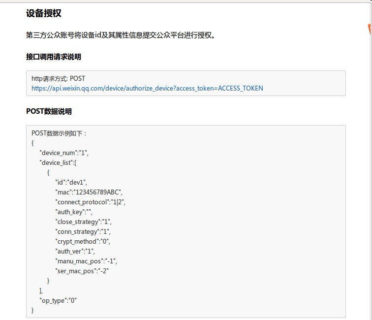
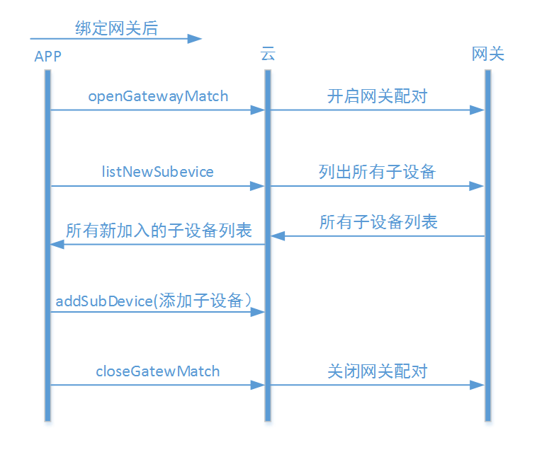

#微信客户端开发指导

#开发准备#

### (1) 申请微信公众号 ###
开发者首先需要申请开通带设备功能的微信公众服务号。微信公众号是属于各个厂商的，因此，申请公众号这个步骤由厂商完成。申请好后，会得到微信公众平台分配的appID和appsecret。如下图所示：

微信公众号需要为**服务号**，并开启**设备功能**，如下图：


微信公众号申请地址：[https://mp.weixin.qq.com/](https://mp.weixin.qq.com/)

开发、测试阶段，厂商也可申请微信公众平台接口测试帐号：[http://mp.weixin.qq.com/debug/cgi-bin/sandbox?t=sandbox/login](http://mp.weixin.qq.com/debug/cgi-bin/sandbox?t=sandbox/login)。
测试号需要开发者手工开启设备功能。

### (2) 准备服务器 ###

当前，AbleCloud不提供主机代理服务，因此需要厂商准备机器，配置外网ip，并且申请域名。微信公众号正式上线时需要设置域名（JS接口安全域名及用户网页授权等配置项要求使用域名），并且使用服务器的80端口提供服务。


此外，还需按照微信公众号的要求配置好JS接口安全域名，网页授权获取用户基本信息的授权回调页域名等配置项。如下两图是JS接口安全域名的配置入口及界面。



如下两图是网页授权获取用户基本信息的授权回调页域名的配置入口接界面。



关于准备使用微信公众号的详细说明请参考[微信公众平台开发者文档-接入指南](http://mp.weixin.qq.com/wiki/17/2d4265491f12608cd170a95559800f2d.html)。

### (3) 设备授权及二维码 ###

**设备授权**

在销售或使用设备之前需要在微信硬件平台完成设备授权（请参考[微信硬件平台-设备授权](http://iot.weixin.qq.com/document-2_6.html)），也需要在AbleCloud平台完成设备入库。下图是在微信硬件平台设备授权接口的使用说明。



上述参数中，需要注意的几项包括：

+ id

    设备的物理ID。AbleCloud要求非蓝牙设备的物理ID为16个字符，而蓝牙设备的物理ID为10个字符。
    
+ auth_key, crypt_method, auth_ver

    用于指定设备与微信客户端或微信平台通信时采用的认证及数据加密方法。
    对于通过AbleCloud平台与微信对接的设备（蓝牙设备除外），其身份认证与数据通信过程均由AbleCloud平台负责实施，采用AbleCloud平台的通信保密协议（已经集成在AbleCloud平台的WIFI固件中）。
    因此，如无特殊需求，上述三个参数可分别取值为""，"0"及"0"，表示不加密。

其它参数请根据实际情况配置。

在AbleCloud平台执行设备入库（目前仅要求WIFI设备）的目的是注册设备的公钥，用于设备接入的安全认证。开发者可以登录AbleCloud的管理控制平台执行设备入库操作。

**设备的二维码**

为了方便用户绑定、使用WIFI设备，厂商需要使用“[微信硬件平台-获取设备二维码](http://iot.weixin.qq.com/document-2_5.html)”提供的接口，创建AbleCloud要求的具有长度为16个字节的物理ID的设备二维码。

### (4) 配置微信公众号菜单 ###

创建微信公众号菜单可参考[微信公众平台开发者文档-自定义菜单创建接口](http://mp.weixin.qq.com/wiki/13/43de8269be54a0a6f64413e4dfa94f39.html)。

### (5) 开发微信公众号功能 ###

在AbleCloud提供的PHP语言的微信公众号SDK中，类ACBridgeWeChat封装了AbleCloud与微信同步用户、用户与设备的绑定关系，及设备工作状态的方法；类ACClient及其关联类则封装了AbleCloud云端服务的API。
本文档中的代码示例均以PHP语言为例。PHP SDK的API详细说明请参见SDK下载包中附带的文档。

开发微信公众号功能时，开发者应按照其在AbleCloud平台注册的开发者帐号信息，修改PHP SDK提供的配置文件ACConfig.php中的配置项。这些配置项包括：
```php
/**
 * AbleCloud服务配置信息。
 */
class ACConfig {
    public static $RuntimeMode = 'test';    // 运行模式：test（测试模式）；production（生产模式）。
    public static $DeveloperId = 0;         // AbleCloud开发者帐号ID。整数。
    public static $AccessKey   = '';        // 开发者的AK/SK密钥对中的AK。字符串。
    public static $SecretKey   = '';        // 开发者的AK/SK密钥对中的SK。字符串。
    public static $MajorDomain = '';        // 本地服务对应的主域的名字。
    public static $SubDomain   = '';        // 本地服务对应的子域的名字。
    public static $RouterUrl   = 'http://test.ablecloud.cn:5000';   // AbleCloud远程服务的访问入口地址，如：http://test.ablecloud.cn:5000。
}
```


#帐号管理#

##用户登录##

对AbleCloud平台来说，微信用户是来自第三方平台的用户。可以使用微信用户的OpenID登录AbleCloud平台，从而成为开发者所提供服务的使用者。
该“登录”操作的目的一般是获取用户在AbleCloud平台对应的帐号信息，以方便通过AbleCloud平台提供的接口访问云端或设备提供的服务。
使用用户的OpenID第一次登录AbleCloud平台时，平台会自动为该用户分配ID。后续再使用这个OpenID时，平台将返回相同的帐号信息。

通过ACBridgeWeChat类直接登录，获取ACUser对象。
```php
// 实例化ACBridgeWeChat对象
// 参数$accessToken是微信公众号的Access Token。注意：微信的Access Token是有时效性的。
// 参数$jsTicket是微信公众号的JS API Ticket。注意：微信的JS API Ticket也是有时效性的。
$wxBridge = new ACBridgeWeChat($accessToken, $jsTicket);
// 使用用户的OpenID登录
$user = $wxBridge->getUser($openId);
```

通过ACCountService提供的方法登录，获取ACUser对象。
```php
// 实例化ACAccountService对象
$accountServcie = ACClient::getAccountService();
// 使用微信用户的OpenID登录。参数$openId是微信用户的OpenID；'weixin'用于标记第三方用户来自微信平台。
$user = $accountService->getUserByOpenId($openId, 'weixin');
```

##绑定手机号##

AbleCloud平台只能获取用户的微信OpenID信息。关于用户的其它信息需要开发者或用户额外提供。
如为安全起见，可以验证并绑定用户的手机。

1.向用户的手机发送验证码

```php
// 获取账号管理对象
$accountServcie = ACClient::getAccountService();
// 发送验证码
// 参数$phone为字符串，是用户的手机号。
$accountServcie->sendVerifyCode($phone);
```

**注：**向用户发送手机验证码时，要求开发者在AbleCloud平台已经配置了手机短信息模板等参数。同时也有向同一用户发送手机短信息的频次限制。

2.根据验证码绑定用户的手机

```php
// 实例化ACBridgeWeChat对象
// 参数$accessToken是微信公众号的Access Token。注意：微信的Access Token是有时效性的。
// 参数$jsTicket是微信公众号的JS API Ticket。注意：微信的JS API Ticket也是有时效性的。
$wxBridge = new ACBridgeWeChat($accessToken, $jsTicket);
// 提交验证码，绑定手机号
// 参数$verifyCode是字符串，表示用户修改手机号码的验证码。
// 参数$openId为字符串，是微信用户的OpenID,开发者需要参考微信官方文档去获取OpenID。
$wxBridge->setPhone($openId, $phone, $verifyCode)；
```

##用户帐号的扩展属性##

###获取用户帐号的扩展属性###

```php
// 实例化ACAccountService对象
$accountService = ACClient::getAccountService();
// 获取用户的扩展属性
$keyValues = $accountService->getUserProfile($user);
```

###设置用户帐号的扩展属性###

设置帐号的扩展属性之前，应通过开发者管理控制台定义帐号的扩展属性列。
```php
// 实例化ACAccountService对象
$accountService = ACClient::getAccountService();
// 设置帐号的扩展属性。扩展属性以键值对组成的关联数组保存，记为$profile。
$accountService->setUserProfile($user, $profile);
```

##获取用户的微信OpenId##

在已知用户在AbleCloud平台上的ID的条件下，可以获取用户在微信平台上对应的OpenId。

通过ACBridgeWeChat类提供的方法获取用户的OpenID。
```php
// 实例化ACBridgeWeChat对象
$wxBridge = new ACBridgeWeChat($accessToken, $jsTicket);
// 获取用户的OpenID
$openId = $wxBridge->getUserOpenId($userId);
```

通过ACCountService类提供的方法获取用户的OpenID。
```php
// 实例化ACAccountService对象
$accountService = ACClient::getAccountService();
// 获取用户的OpenID。参数$userId是用户在AbleCloud平台上的ID；'weixin'用于标记第三方用户来自微信平台。
$openId = $accountService->getUserOpenId($userId, 'weixin');
```

#设备管理#

说明参见[功能说明-设备管理](../features/functions.md#_12)。

##微信平台与AbleCloud平台##

微信硬件平台与AbleCloud平台都要求用户与设备建立绑定关系后采用使用设备，不过两个平台使用不用的策略来管理设备及其用户。

首先，AbleCloud平台区分设备的管理员用户与非管理员用户。第一个绑定设备的用户就是设备的管理员用户。其他用户要绑定设备需要得到管理员用户的授权，比如通过管理员发放的分享码来绑定设备。
普通用户可以也仅可以主动解除自己与设备的绑定关系。管理员用户可以解除任意用户（包括其自己）与设备的绑定关系。而且，如果管理员用户解除了自己与设备的绑定关系，那么同时也会解除设备与其他所有用户的绑定关系。
微信平台不区分设备用户的角色，任何人都可以平等的绑定或解绑设备。

其次，AbleCloud支持采用分组模型（即后文所述的Home模型）来批量管理设备及其用户。设备（或用户）加入某一个分组时，即表示与组中所有的用户（或设备）建立绑定关系。
此时无论是之前加入的还是新加入的设备，其管理员用户都是创建该分组的用户（即分组的管理员用户）。设备（或用户）被移出分组时，即表示与分组中的所有用户（或设备）解除了绑定关系。
微信平台没有分组模型。

最后，AbleCloud平台区分网关设备及子设备。用户直接绑定网关设备，子设备则需要先接入网关设备，并经由网关设备接入AbleCloud平台，从而与用户绑定。而且，子设备被确认接入网关后会与所有绑定了网关设备的用户建立绑定关系。
同样，将子设备从网关设备中移除时，也会将其与网关设备的所有用户解除绑定。
子设备的这种处理流程不经过微信平台，微信平台也不区分网关设备与子设备。

如上所述，AbleCloud平台比微信平台提供了更丰富的设备管理策略，因此在特定情况下要求开发者执行必要的操作通知微信平台与AbleCloud平台同步设备与其用户的信息。需要通知微信平台同步信息的场景包括：

1. 采用非微信扫描二维码功能绑定设备后需要通知微信平台同步信息。

    使用微信终端时，推荐使用微信的“扫一扫”功能扫描设备的二维码（可以附加AbleCloud平台设备的管理员用户生成的分享码）来绑定设备。此时，微信平台会先完成设备绑定，然后推送消息给开发者的公众号后台。
    开发者可调用**ACBridgeWeChat::onDeviceEventBind**来处理该事件。该方法会调用AbleCloud平台的相关接口通知AbleCloud平台绑定用户与设备，开发者无需额外通知双方平台通许信息。
    但是如果直接调用了AbleCloud平台提供的API绑定了设备，如子设备接入了网关、将设备加入了Home分组等，则需要通知微信平台同步信息。此时可调用**ACBridgeWeChat::syncBindingsByDevice**来同步信息。
    该方法是要求微信平台同步关于指定设备的信息。

2. 调用AbleCloud平台的接口解除设备与用户的绑定关系后需要通知微信平台同步信息。

    如前问所述，如果管理员用户解除了与设备的绑定关系，那么AbleCloud平台会自动解除设备与其他用户的绑定关系。无论何时调用了AbleCloud平台提供的接口（如ACDeviceService::unbindDevice等）解除了用户与设备的绑定关系后，都需要调用**ACBridgeWeChat::syncBindingsByDevice**来同步信息。
    如ACBridgeWeChat::onDeviceEventUnbind调用了解除绑定的接口，同时也调用了syncBindingsByDevice方法来同步信息。

3. 绑定或解邦网关设备后需要通知微信平台同步信息。

    网关设备首次被用户绑定时除外（这时网关设备还没有接入子设备或者接入的子设备还没得到用户的确认），其他用户绑定网关设备时，会自动与网关所附带的子设备建立绑定关系。用户解除与网关的绑定关系时，也会自动解除与子设备的绑定关系。
    此时需调用**ACBridgeWeChat::syncBindings**来同步信息。该方法是要求微信平台同步关于指定用户的信息。如ACBridgeWeChat::onDeviceEventBind及onDeviceEventUnbind均调用了该方法来同步信息。
    
4. 确认网关子设备接入网关后或者从网关中删除子设备后需要通知微信平台同步信息。

    子设备加入网关或从网关中删除子设备时，会自动建立或解除与网关设备的所有用户的绑定关系。此时要调用**ACBridgeWeChat::syncBindingsByDevice**来同步信息。
    
5. 使用分组模型管理设备时，将设备添加进Home或者从Home中移除后需要通知微信平台同步信息。

    在这两种场景下，被操作的设备会自动与分组中的用户建立或解除绑定关系。开发者需要调用**ACBridgeWeChat::syncBindingsByDevice**来同步信息。

6. 使用分组模型管理设备时，将用户添加进Home或者从Home中移除后需要通知微信平台同步信息。

    在这两种场景下，用户会自动与Home内的设备建立或解除绑定关系。开发者需要调用**ACBridgeWeChat::syncBindings**来同步信息。
    
7. 使用分组模型管理设备时，删除Home对象后需要通知微信平台同步信息。

    删除Home对象时会批量解除设备与用户的绑定关系。开发者应直接调用**ACBridgeWeChat::deleteHome**来执行删除Home的操作，而不是调用ACDeviceService::deleteHome。
    
此外，微信平台会定期向开发者的公众号后台推送消息"device_event" - "subscribe_status"来查询设备的连接状态（仅针对WiFi设备）。开发者可以调用**ACBridgeWeChat::onDeviceEventSubscribeStatus**来处理该事件。
微信平台推送消息"device_event" - "unsubscribe_status"时，开发者可调用**ACBridgeWeChat::onDeviceEventUnsubscribeStatus**来处理该事件。上述两个方法均调用了**ACBridgeWeChat::syncBindings**同步当前用户的信息。

开发者也可根据实际需求调用**ACBridgeWeChat::syncBindings**及**ACBridgeWeChat::syncBindingsByDevice**方法来同步信息。

##独立设备##

设备绑定的交互流程如下图所示：


###设备绑定###

1.微信设备授权及设备二维码

参考[微信硬件平台-设备授权](http://iot.weixin.qq.com/document-2_6.html)对硬件设备进行授权。

授权完成后调用[微信硬件平台-获取设备二维码](http://iot.weixin.qq.com/document-2_5.html)接口获取设备的二维码。PHP SDK也封装了该接口，其调用方式如下：

```php
// 实例化ACBridgeWeChat对象
$wxBridge = new ACBridgeWeChat($accessToken, $jsTicket);
// 获取设备的二维码串
$qrCode = $wxBridge->getDeviceQRCode($physicalId, FALSE, $openId);
// 之后可使用相关工具将码串转换为二维码图片。
```

2.处理用户扫描二维码的事件

微信用户扫描设备的二维码后，微信公众号平台会向厂商的公众号后台推送两条事件消息："event"-"subscribe"及"device_event"-"bind"，分别表示用户关注公众号，以及用户绑定了指定设备。
如果用户之前已经关注过公众号，则仅推送第二条消息。

处理事件"event"-"subscribe"：
```php
// 实例化ACBridgeWeChat对象
$wxBridge = new ACBridgeWeChat($accessToken, $jsTicket);
$user = $wxBridge->onEventSubscribe($xmlMsg);  // $xmlMsg是微信推送的完整XML消息内容。
// 其它处理逻辑
```
方法ACBridgeWeChat::onEventSubscribe实现的主要功能是识别用户的OpenID，在AbleCloud平台上将该用户登记为开发者所提供服务的使用者。

处理事件"device_event"-"bind"：
```php
// 实例化ACBridgeWeChat对象
$wxBridge = new ACBridgeWeChat($accessToken, $jsTicket);
$device = $wxBridge->onDeviceEventBind($xmlMsg, $deviceName, FALSE);   // $xmlMsg是微信推送的完整XML消息内容。
// 其它处理逻辑
```
方法ACBridgeWeChat::onDeviceEventBind实现的主要功能是识别用户及设备信息，在AbleCloud平台中同步用户与设备的绑定关系。

AbleCloud将第一个绑定设备的用户作为该设备的管理员用户。其他用户只能在管理员用户的授权下才能绑定该设备。管理员可以提供设备的分享码，允许其它用户绑定设备。这个分享码可以作为扩展属性附属在微信的原始设备二维码中方便用户扫码提取。
方法ACBridgeWeChat::onDeviceEventBind能自动处理用户扫描包含/不包含分享码的设备二维码来绑定设备的情况。
   
###设备激活###

此处，“设备激活”是指为WIFI设备配置WIFI网络，使设备连网，连接云端，从而提供在线服务能力。

对于接入微信硬件平台的设备，可以调用微信的AirKiss页面配置设备的WIFI网络。
在手机连上WIFI的情况下，在AirKiss页面输入WIFI密码，等待设备连接网络。AirKiss的具体信息请参考[微信硬件平台文档](http://iot.weixin.qq.com/document-0_1.html)。

###设备分享###

设备分享是指以设备的管理员用户的身份调用AbleCloud平台的接口生成设备的分享码，其它用户凭借该分享码绑定设备。

```php
// 实例化ACBridgeWeChat对象
$wxBridge = new ACBridgeWeChat($accessToken, $jsTicket);
// 获取包含分享码的二维码串
$qrCode = $wxBridge->getDeviceQRCode($physicalId, TRUE, $openId, 300);
// 将码串$qrCode转换为二维码图片。其他用户使用微信扫描该二维码就可绑定设备。
```

###设备解绑###

需要在AbleCloud平台及微信平台中同步解除用户与设备的绑定关系。可以首先调用AbleCloud平台的设备解邦API，然后再执行AbleCloud平台与微信平台的信息同步操作。
AbleCloud平台区分设备的管理员用户及非管理员用户。如果管理员用户解除了与设备的绑定关系，那么AbleCloud将自动解除其他用户与设备的绑定关系。而微信硬件平台不区分用户的角色，所以某用户解绑设备后，需要通知微信硬件平台对照AbleCloud平台的信息检查相关设备与用户的绑定关系。
```php
// 实例化ACBridgeWeChat对象
$wxBridge = new ACBridgeWeChat($accessToken, $jsTicket);
// 获取用户信息
$user = $wxBridge->getUser($openId);
// 实例化ACDeviceService
$deviceService = ACClient::getDeviceService();
// 获取设备的逻辑ID
$deviceId = $deviceService->getDeviceId($physicalId);
// 解绑设备
$deviceService->unbindDevice($deviceId, $user);
// 通知微信硬件平台同步设备的绑定信息。
// 参数$deviceType是微信公众号所关联的设备的类型，目前就是“微信公众账号原始ID”。
$wxBridge->syncBindingsByDevice($physicalId, $deviceType);
```

##网关型设备##

###绑定网关###

网关的绑定操作流程和独立设备是一样的，如下图：


绑定网关设备的实现过程也与独立设备一致，只是最后调用方法ACBridgeWeChat::onDeviceEventBind的参数不一样。

1.微信设备授权及设备二维码

参考[微信硬件平台-设备授权](http://iot.weixin.qq.com/document-2_6.html)对硬件设备进行授权。

授权完成后调用[微信硬件平台-获取设备二维码](http://iot.weixin.qq.com/document-2_5.html)接口获取设备的二维码。PHP SDK也封装了该接口，其调用方式如下：

```php
// 实例化ACBridgeWeChat对象
$wxBridge = new ACBridgeWeChat($accessToken, $jsTicket);
// 获取设备的二维码串
$qrCode = $wxBridge->getDeviceQRCode($physicalId, FALSE, $openId);
// 之后可使用相关工具将码串转换为二维码图片。
```

2.处理用户扫描二维码的事件

微信用户扫描设备的二维码后，微信公众号平台会向厂商的公众号后台推送两条事件消息："event"-"subscribe"及"device_event"-"bind"，分别表示用户关注公众号，以及用户绑定了指定设备。
如果用户之前已经关注过公众号，则仅推送第二条消息。

处理事件"event"-"subscribe"：
```php
// 实例化ACBridgeWeChat对象
$wxBridge = new ACBridgeWeChat($accessToken, $jsTicket);
$user = $wxBridge->onEventSubscribe($xmlMsg);  // $xmlMsg是微信推送的完整XML消息内容。
// 其它处理逻辑
```
方法ACBridgeWeChat::onEventSubscribe实现的主要功能是识别用户的OpenID，，在AbleCloud平台上将该用户登记为开发者的用户。

处理事件"device_event"-"bind"：
```php
// 实例化ACBridgeWeChat对象
$wxBridge = new ACBridgeWeChat($accessToken, $jsTicket);
$device = $wxBridge->onDeviceEventBind($xmlMsg, $deviceName, TRUE);   // $xmlMsg是微信推送的完整XML消息内容。
// 其它处理逻辑
```
方法ACBridgeWeChat::onDeviceEventBind实现的主要功能是识别用户及设备信息，在AbleCloud平台中同步用户与设备的绑定关系。其第三个参数用来标记该设备是否为网关设备。

###网关激活###

网关设备的激活方法与独立设备一致。

###分享网关设备###

分享网关设备的实现方式与独立设备一致。

###绑定子设备###

网关绑定成功以后，绑定子设备的流程如下图：



总体来说，其步骤是：

1. 开启网关接入功能；

2. 查询新接入的子设备；

3. 绑定新接入的子设备，并通知微信硬件平台同步设备的绑定关系；

4. 关闭网关接入功能。

代码示例如下：
```php
// 实例化ACBridgeWeChat对象
$wxBridge = new ACBridgeWeChat($accessToken, $jsTicket);
// 实例化ACDeviceService
$deviceService = ACClient::getDeviceService();
// 开启网关接入功能
$deviceService->openGatewayMatch($gatewayId, $user, $timeout);
// 列举网关设备上新接入的子设备（尚未绑定）
$newSubDevices = $deviceService->listNewSubDevicesFromGateway($user, $gatewayId);
// 绑定新子设备
foreach ($newSubDevices as $dev) {
    $d = $deviceService–>addSubDeviceToGateway($user, $gatewayId, $dev->getPhysicalId(), $name);
    if ($d != NULL) {
        // 绑定子设备成功，需要通知微信平台同步设备的绑定关系。
        $wxBridge->syncBindingsByDevice($dev->getPhysicalId(), $deviceType);  // 参数$deviceType是微信公众号所关联的设备的类型，目前就是“微信公众账号原始ID”。
    }
}
// 关闭网关接入功能
$deviceService ->closeGatewayMatch($gatewayId, $user);
```

###设备解绑###

#### 1.解绑网关 ####

解绑网关设备的过程与解绑独立设备一致，也需要通知微信平台同步设备与用户的绑定关系。
```php
// 实例化ACBridgeWeChat对象
$wxBridge = new ACBridgeWeChat($accessToken, $jsTicket);
// 获取用户信息
$user = $wxBridge->getUser($openId);
// 实例化ACDeviceService
$deviceService = ACClient::getDeviceService();
// 获取设备的逻辑ID
$deviceId = $deviceService->getDeviceId($physicalId);
// 解绑设备
$deviceService->unbindGateway($deviceId, $user);
// 通知微信硬件平台同步设备的绑定信息。
// 参数$deviceType是微信公众号所关联的设备的类型，目前就是“微信公众账号原始ID”。
$wxBridge->syncBindingsByDevice($physicalId, $deviceType);
```
方法ACBridgeWeChat::unbindDevice第三个参数用于标记所操作的设备是否为网关设备。

#### 2.解绑子设备 ####

解绑子设备是指从网关设备中删除子设备。同样也需要通知微信平台同步设备与用户的绑定关系。
```php
// 实例化ACBridgeWeChat对象
$wxBridge = new ACBridgeWeChat($accessToken, $jsTicket);
// 获取用户信息
$user = $wxBridge->getUser($openId);
// 实例化ACDeviceService
$deviceService = ACClient::getDeviceService();
// 获取设备的逻辑ID
$subDeviceId = $deviceService->getDeviceId($physicalId);
// 解邦子设备
$deviceService->deleteSubDeviceFromGateway($user, $subDeviceId);
// 通知微信硬件平台同步设备的绑定信息。
// 参数$deviceType是微信公众号所关联的设备的类型，目前就是“微信公众账号原始ID”。
$wxBridge->syncBindingsByDevice($physicalId, $deviceType);
```

##Home模型##

针对微信公众号这种应用环境，在Home模型下，创建“Home”、“Room”并绑定设备的交互流程与Android设备的流程几乎一致，可参考[Android设备的Home模型](android.md#home)。
需要说明的是，微信平台中没有设备分组管理的概念。AbleCloud平台提供的Home分组模型便于批量管理用户和设备。

###创建Home及Room###

```php
// 实例化ACDeviceService对象
$deviceService = ACClient::getDeviceService();
// 创建名字为$homeName的Home
$home = $deviceService->createHome($user, $homeName);
// ......
// 创建名字为$roomName的Room
$room = $deviceService->createRoom($user, $home->ownerId, $roomName);
```

###删除Room或Home###

删除Home中的Room不影响设备与用户的绑定关系。示例代码如下：
```php
// 实例化ACDeviceService对象
$deviceService = ACClient::getDeviceService();
// 删除Room
$deviceService->deleteRoom($user, $homeId, $roomId);
```

删除Home本身时，会批量解除Home中所有设备与所有用户之间的绑定关系，并且需要额外通知微信平台从AbleCloud平台更新相关设备与用户的绑定关系。
为此，ACBridgeWeChat类封装了方法deleteHome()来完成删除Home对象、通知微信平台更新相关数据的操作。示例代码如下：
```php
// 实例化ACBridgeWeChat对象
$wxBridge = new ACBridgeWeChat($accessToken, $jsTicket);
// 删除Home对象，同时通知微信平台更新相关信息。
// 参数$openId是发起本次删除操作的用户的微信OpenId。
// 参数$homeId则是要被删除的Home的ID。
$wxBridge->deleteHome($openId, $homeId);
```


###添加用户至分组中###

Home的管理员用户（创建Home的用户）可以通过发放分享码的方式将其他用户添加至Home中来。用户加入Home之后即与Home中已有的设备建立绑定关系。此时需要通知微信平台从AbleCloud平台更新用户与设备的绑定关系。
```php
// 实例化ACDeviceService对象
$deviceService = ACClient::getDeviceService();
// 取分享码
$shareCode = $deviceService->getHomeShareCode($user, $homeId, $timeout);
// 其他用户使用分享码加入Home
$deviceService->joinHomeWithShareCode($user2, $shareCode);  // 用户$user2加入Home
// 通知微信平台更新用户$user2与设备的绑定关系。
$wxBridge = new ACBridgeWeChat($accessToken, $jsTicket);
$openId = $wxBridge->getUserOpenId($user2->getId());    // 取用户$user2的OpenId
$wxBridge->syncBindings($openId);                       // 同步信息
```

###从分组中移除用户###

Home的管理员用户（创建Home的用户）也可以从Home中移除指定用户。被移除的用户将被解除与Home中设备的绑定关系。此时需要通知微信平台从AbleCloud平台更新用户与设备的绑定关系。
```php
// 实例化ACDeviceService对象
$deviceService = ACClient::getDeviceService();
// 从Home中移除用户。参数$userId即表示要被移除的用户的ID。
$deviceService->removeUserFromHome($adminUser, $homeId, $userId);
// 通知微信平台更新用户$userId与设备的绑定关系。
$wxBridge = new ACBridgeWeChat($accessToken, $jsTicket);
$openId = $wxBridge->getUserOpenId($userId);    // 取用户$userId对应的OpenId
$wxBridge->syncBindings($openId);               // 同步信息
```

###添加或移动设备到分组中###

用户通过ACDeviceService::bindDevice或ACDeviceService::bindGateway方法绑定的设备可以通过ACDeviceService::addDeviceToHome添加至Home中。
在通过其它方法绑定设备之前，也可直接调用ACDeviceService::addDeviceToHome方法完成绑定、添加设备到Home中的操作。
将设备添加至Home中之后，需要通知微信平台从AbleCloud平台更新设备与用户的绑定关系。同样，若从Home中删除了指定设备，也需要通知微信平台同步信息。

只有Home中的设备才能通过ACDeviceService::moveDeviceToRoom方法将其添加至Room中。

添加设备到Home中：
```php
// 实例化ACDeviceService对象
$deviceService = ACClient::getDeviceService();
// 添加设备到Home中：$homeId是Home的ID；$physicalId（设备的物理ID）或$deviceId（设备的逻辑ID）任意提供一个即可。
$device = $deviceService->addDeviceToHome($user, $homeId, $name, $physicalId, $deviceId);
// 通知微信平台同步信息
$wxBridge = new ACBridgeWeChat($accessToken, $jsTicket);
$wxBridge->syncBindingsByDevice($physicalId, $deviceType);  // 参数$deviceType是微信公众号所关联的设备的类型，目前就是“微信公众账号原始ID”。
```

在Home中移动设备到Room中：
```php
// 实例化ACDeviceService对象
$deviceService = ACClient::getDeviceService();
// 移动Home中的设备到Room中
$deviceService->moveDeviceToRoom($user, $deviceId, $roomId, $homeId);
```
设备被添加至Home中时，已经与Home中的用户建立了绑定关系。再将设备移动至Room内时，不更改其与用户的绑定关系，因此不用额外通知微信或AbleCloud平台同步信息。
同样，从Room中移出设备时，也不改变设备与用户的绑定关系，因此也不用额外同步信息。

###从分组中移除设备###

用户可以调用方法ACDeviceService::removeDeviceFromRoom从Room中移除设备，此时该设备仍然属于Home，并且不改变设备与Home中用户的绑定关系。
也可以调用方法ACDeviceService::deleteDeviceFromHome从Home中删除设备，此时将解除该设备与Home中所有用户的绑定关系。此操作过后，需要通知微信平台更新设备与用户的绑定关系。

从Room中移除设备：
```php
// 实例化ACDeviceService对象
$deviceService = ACClient::getDeviceService();
// 从Room中移除指定设备
$deviceService->removeDeviceFromRoom($user, $deviceId, $roomId, $homeId);
```

从Home中删除设备——需要通知微信平台同步信息：
```php
// 实例化ACDeviceService对象
$deviceService = ACClient::getDeviceService();
// 从Home中删除设备
$deviceService->deleteDeviceFromHome($user, $homeId, $deviceId);
// 通知微信平台同步设备与用户的绑定信息。参数$physicalId是设备$deviceId对应的物理ID。
$wxBridge = new ACBridgeWeChat($accessToken, $jsTicket);
$wxBridge->syncBindingsByDevice($physicalId, $deviceType);  // 参数$deviceType是微信公众号所关联的设备的类型，目前就是“微信公众账号原始ID”。
```

##设备的扩展属性##

###获取设备的扩展属性###

```php
// 实例化ACDeviceService
$deviceService = ACClient::getDeviceService();
// 获取设备的扩展属性
$keyValues = $deviceService->getDeviceProfile($deviceId);
```

###设置设备的扩展属性###

设置设备的扩展属性之前，应通过开发者管理控制台定义设备的扩展属性列。
```php
// 实例化ACDeviceService
$deviceService = ACClient::getDeviceService();
// 设置设备的扩展属性。扩展属性以键值对组成的关联数组保存，记为$profile。
$deviceService->setDeviceProfile($user, $deviceId, $profile);
```

#和云端通信#

##访问云端服务##
PHP SDK中的类ACClient定义了方法sendToService，用于访问运行在AbleCloud云端的开发者的UDS服务。
```php
// 实例化ACRequest对象
$request = new ACRequest($serviceName, $methodName, $serviceVersion);
// 设置参数：通过addParameter方法添加的参数，将以查询字符串的方式置于访问远程服务的URL中传递给远程服务。
$request->addParameter($key, $value);
// 设置参数：通过setPayloadAsJSON/setPayloadAsStream方法设置的数据是HTTP请求的Body。
// $request->setPayloadAsStream($binaryBody);
$request->通过setPayloadAsJSON($jsonText);
// 访问云端服务
$response = ACClient::sendToService($request);
// 其它处理逻辑
```

上例中，参数$serviceName是要访问的UDS服务的名字，$methodName是要访问的方法名，$serviceVersion用于指定服务的主版本。这三个参数组合起来描述了此次请求的目标。

##向设备发送消息##

PHP SDK中的类ACDeviceService定义了方法sendToDevice用于向设备发送指令。该方法的使用示例如下：
```php
// 实例化ACDeviceService对象
$deviceService = ACClient::getDeviceService();
// 向设备发送消息
// 参数$messageCode是整数，表示发送给设备的消息的码。
// 参数$message是拟发送给设备的二进制数据。
// 参数'weixin'用于表示用户用来控制设备的终端工具是微信。
$response = $deviceService->sendToDevice($user, $deviceId, $messageCode, $message, 'weixin');
// 其它处理逻辑
```
上例中，调用方法sendToDevice时使用的第五个参数用于表示调用本方法时用户所使用的终端工具的名字，如操作系统名，或者应用环境的名字等。'weixin'表示用户使用的是微信终端。

此外，也可通过ACContext来设置用户使用的终端工具的信息。如下例：
```php
// 实例化ACDeviceService对象
$deviceService = ACClient::getDeviceService();
// 通过ACContext设置终端工具的信息
$context = $deviceService->getContext();
$context->setHandset('weixin', '', '');
// 向设备发送消息：省略第五个参数。
$response = $deviceService->sendToDevice($user, $deviceId, $messageCode, $message);
```

**注：**ACDeviceService::sendToService暂时仅支持向设备发送二进制格式的数据。尚不支持JSON及KLV格式的数据。

#定时任务#

AbleCloud支持设备的定时任务，比如每天的固定时间向设备发送指令，控制设备运行特定的功能。这里的定时任务主要由三部分组成：执行任务的时间规则、任务执行时要发给设备的指令，以及权限及认证信息——定义任务的用户及执行任务的设备。

##添加定时任务##

```php
// 实例化ACTimerTaskService对象
$timerTaskService = ACClient::getTimerTaskService();
// 配置定时任务
$task = new ACTimerTask();
// 设置$task的属性
// ......
// 向云端添加任务
$timerTaskService->addTask($task, $user);
```

上述例子中，ACTimerTask对象就用与设置任务的相关属性：执行任务的时间规则、任务执行时要发给设备的指令，定义任务的用户以及执行任务的设备。ACTimerTask的详细说明请参考[Reference-微信客户端开发参考](../reference/wechat.md)中的“AbleCloud定时任务”。

##查询定时任务列表##

```php
// 查询已配置的定时任务的列表
$tasks = $timerTaskService->listTasks($user, $deviceId);
```

##启动定时任务##

```php
// 查询已配置的定时任务的列表，从中找到要启动的定时任务，记录其ID。
$tasks = $timerTaskService->listTasks($user, $deviceId);
// 找到要启动的任务的ID，记为$taskId。
// 启动该任务
$timerTaskService->startTask($user, $deviceId, $taskId);
```

##停止定时任务##

```php
// 查询已配置的定时任务的列表，从中找到要停止的的定时任务，记录其ID。
$tasks = $timerTaskService->listTasks($user, $deviceId);
// 找到要停止的任务的ID，记为$taskId。
// 停止该任务
$timerTaskService->stopTask($user, $deviceId, $taskId);
```

##修改定时任务##

```php
// 查询已配置的定时任务的列表，从中找到要修改的的定时任务，记录其ID。
$tasks = $timerTaskService->listTasks($user, $deviceId);
// 找到要修改的任务的ID，记为$taskId。
// 配置该任务的新属性
$task = new ACTimerTask();
// 修改$task对象的属性值
// ......
// 修改任务
$timerTaskService->modifyTask($taskId, $task, $user);
```

##删除定时任务##

```php
// 查询已配置的定时任务的列表，从中找到要删除的的定时任务，记录其ID。
$tasks = $timerTaskService->listTasks($user, $deviceId);
// 找到要删除的任务的ID，记为$taskId。
// 删除该任务
$timerTaskService->deleteTask($user, $deviceId, $taskId);
```

#OTA#

本小结描述的OTA是指针对WiFi设备，在需要用户确认是否升级设备固件版本的情况下，通过微信客户端向用户提示其绑定的WiFi设备有可更新的固件版本，并征求用户的意见是否执行升级。
此时，可将用户的意见反馈给AbleCloud云端的OTA服务。云端OTA服务将根据用户的选择执行相应的操作。如与设备通信，发送固件升级文件，完成升级；或者暂不执行固件升级。

AbleCloud支持灵活的设备固件升级策略，开发者可以登录管理控制台制定相关信息。

##检查更新##

检查针对某个设备（WiFi设备）是否存在可升级的固件版本。

```php
// 实例化ACOtaService
$otaService = ACClient::getOtaService();
// 检查更新
$otaVersion = $otaService->checkUpdate($user, $deviceId);
$needUpdate = $otaVersion->canUpdate();
// $needUpdate为TRUE时表示云端发布了新版本的固件，可以执行升级。
```

##确认升级##

经过前述步骤查询得到可升级的固件版本时，用户可以选择是否升级。确认升级的示例代码如下：
```php
// 将指定设备的固件升级为查询得到的新版本
$otaService->confirmUpdate($user, $deviceId, $otaVersion->getNewVersion());
```

#数据存储#

ACStoreService提供了访问AbleCloud数据存储服务的接口。下例是使用ACStoreService::scan方法查询数据记录的示例：
```php
// 创建ACStoreScanner对象，设置查询条件。
// 参数$datasetName是要查熏的数据集的名字。
// 参数$entityGroupKeyValues是以键值对数组（关联数组）描述的查询数据集时所使用的分区键的值。如果数据集没有分区，则使用NULL。
$scanner = new ACStoreScanner($datasetName, $entityGroupKeyValues);
// 设置查询条件
$filter1 = new ACStoreFilter('time', ACStoreFilter::$GreaterOrEqual, 12345670);
$filter2 = new ACStoreFilter('time', ACStoreFilter::$Less, 12345679);
$complicatedFilter1 = new ACStoreComplicatedFilter($filter1);
$complicatedFilter2 = new ACStoreComplicatedFilter($filter2);
$complicatedFilter1->linkTo($complicatedFilter2, true);
$scanner->where($complicatedFilter1);
// 实例化ACStoreService对象，执行查询。
$storeService = ACClient::getStoreService();
$storeIter = $storeService->scan($scanner);
$rows = $storeIter->next();     // $rows即是查询结果。
```

#消息推送#

向用户的微信客户端推送消息可分两种情况：一种是用户打开公众号的HTML5页面时推送消息到HTML5页面；一种是直接推送消息到用户的微信客户端。现假设设备端监控到的实时数据触发了某一报警规则，需要向用户推送该消息。

第一种情况下，可利用HTML5页面的WebSocket技术实现消息的实时推送。具体流程是：

- 首先设备通过正常的上报数据的方式将数据上报给AbleCloud云端；

- AbleCloud云端会选择开发者的UDS服务来处理设备上报的数据。在UDS处理该上报消息时，可以调用开发者的微信公众号后台提供的一个**数据推送接口（Web服务）**，将消息推送给微信公众号后台；

- 开发者的微信公众号后台收到该消息后，识别目标用户，通过与用户正在浏览的HTML5页面之间的WebSocket连接将消息推送给页面，并由该页面及时显示出来。

第二种情况下，可利用微信公众平台提供的消息推送接口（[微信公众平台-模板消息接口](http://mp.weixin.qq.com/wiki/17/304c1885ea66dbedf7dc170d84999a9d.html)）向用户推送消息。具体流程是：

- 首先设备通过正常的上报数据的方式将数据上报给AbleCloud云端；

- AbleCloud云端会选择开发者的UDS服务来处理设备上报的数据。在UDS处理该上报消息时，可以调用开发者的微信公众号后台提供的一个**数据推送接口（Web服务）**，将消息推送给微信公众号后台；

- 开发者的微信公众号后台收到该消息后，识别目标用户，通过AbleCloud API[获取用户的OpenID](#openid)，调用微信公众平台的消息推送接口向用户推送消息。不过，微信公众平台的模板消息接口有调用频次的限制。

**注：**

1. 上述两种情况下，“开发者的微信公众号后台提供的一个**数据推送接口（Web服务）**”是指开发者在其自己开发的微信公众号后台中实现的一个可被访问的RESTful接口。该接口可接收调用者传递的消息（如通过HTTP POST方法传递的消息），并执行相应的处理。

1. UDS调用微信公众号的数据推送接口时，涉及访问AbleCloud之外的远程服务，需要通过AbleCloud UDS SDK提供的专门访问远程服务的API来实现。

#Error Code
参考[reference-Error Code](../reference/error_code.md)。
