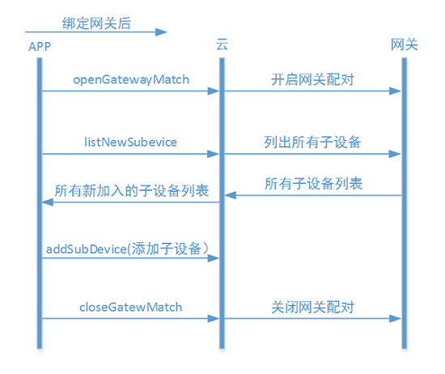

#开发准备
在进行微信开发前，需要到微信的硬件平台进行申请。具体的操作指导请参考 [开发指导-第三方云对接-微信](third_proxy.md#微信)

#帐号管理

##绑定手机号
- 1.获取账号管理对象

```php
$accountServcie=ACClient::getAccountService();
```

- 2.发送验证码

```php
$accountServcie->sendVerifyCode($phone);
```

$phone 字符串，是用户的手机号。

- 3.获取ACBridgeWeChat对象

```php
$wxBridge = new ACBridgeWeChat($accessToken);
```

$accessToken 微信公众号的Access Token。注意：微信的Access Token的有效期是有期限限制的。

- 4.提交验证码，绑定手机号
 
```php
$wxBridge->setPhone($openid,$phone, $verifyCode)；
```

$verifyCode 字符串，是用户修改手机号码的验证码
$openId 字符串，是微信用户的OpenID,开发者需要参考微信官方文档去获取openid。


#设备管理-独立设备

设备绑定的交互流程参考下图：


##设备绑定
- 1.微信官方授权设备
参考[微信硬件平台](http://iot.weixin.qq.com/)如何对硬件设备进行授权。


- 2.实例化ACBridgeWeChat对象

```php
$wxBridge = new ACBridgeWeChat($accessToken);
```

$accessToken 微信公众号的Access Token。注意：微信的Access Token的有效期是有期限限制的。


- 3.生成设备二维码码串

```php
$wxBridge->getDeviceQRCode($physicalId, FALSE, $openId );
```


- 4.利用二维码生生工具上一步中得到的码串生成二维码
例如[草料二维码生成工具](http://cli.im/)


- 5.处理微信推送扫码信息
在微信推送的device_event 的 bind事件中调用ablecloud sdk的响应函数
```php
$device = $wxBridge->onDeviceEventBind($xmlMsg, $deviceName);
```


- 6.扫描二维码关注公众号，绑定设备
第一个用微信扫描二维码的人，将会绑定设备，成为设备的管理员。当再次有人扫描二维码时，只会关注微信公众号，不会绑定设备。Ablecloud对于已有用户绑定的设备，其它用户想要得到设备的管理权需要设备的管理员分享设备，才能拥有设备的管理权。


   
##设备激活

###调起微信airkiss页面

在手机连上wifi的情况下，在aikiss页面输入wifi密码，等待设备连接云端。
微信airkiss相关内容请参参考微信官方文档。


##设备分享


- 1.实例化ACBridgeWeChat对象

```php
$wxBridge = new ACBridgeWeChat($accessToken);
```
$accessToken 微信公众号的Access Token。注意：微信的Access Token的有效期是有期限限制的。


- 2.实例化user对象


```php
$user=$wxBridge->getUser($openid);
```


- 3.实例化ACDeviceService

```php
$acDeviceService = ACClient::getDeviceService();
```


- 4.得到已绑定设备信息。


```php
$devices=$acDeviceService->listDevices($user);
```
从返回的信息中，可以得到与设备相关的信息。


- 5.分享设备，生成分享的二维码码串

```php
$wxBridge ->getDeviceQRCode($physicalId, TRUE, $openId , 300)；
```

拿到码串后，开发者可以本地用js去生成二维码图片。


##设备解绑

解除用户与设备绑定

```php
$wxBridge->unbindDevice($openId, $physicalId, FALSE)；
```


#设备管理-网关设备

##绑定网关

网关的绑定操作流程和独立设备是一样的，如下图：


- 1.微信官方授权设备
参考[微信硬件平台](http://iot.weixin.qq.com/)如何对硬件设备进行授权。


- 2.生成网关设备二维码

实例化ACBridgeWeChat对象

```php
$wxBridge = new ACBridgeWeChat($accessToken);
```

$accessToken 微信公众号的Access Token。注意：微信的Access Token的有效期是有期限限制的。


- 3.生成网关设备二维码码串
```php
$wxBridge->getDeviceQRCode($physicalId, $withACShareCode = FALSE, $openId = '', $timeout = 300);
```

- 4.利用二维码生生工具上一步中得到的码串生成二维码

例如[草料二维码生成工具](http://cli.im/)


- 5.处理微信推送扫码信息

在微信推送的device_event 的 bind事件中调用ablecloud sdk的响应函数

```php
$device = $wxBridge->onDeviceEventBind($xmlMsg, $deviceName);
```

- 6.扫描二维码关注公众号，绑定网关设备

第一个用微信扫描二维码的人，将会绑定设备，成为网关设备的拥有者。当再次有人扫描二维码时，只会关注微信公众号，不会绑定设备。


##分享网关设备


- 1.实例化ACBridgeWeChat对象

```php
$wxBridge = new ACBridgeWeChat($accessToken);
```

$accessToken 微信公众号的Access Token。注意：微信的Access Token的有效期是有期限限制的。


- 2.实例化user对象

```php
$user=$wxBridge->getUser($openid);
```

- 3.实例化ACDeviceService

```php
$acDeviceService = ACClient::getDeviceService();
```

- 4.得到已绑定设备信息。

```php
$devices=$acDeviceService->listDevices($user);
```

从返回的信息中，可以得到与设备相关的信息。

- 5.分享设备，生成分享的二维码码串。

```php
$wxBridge ->getDeviceQRCode($physicalId, TRUE, $openId , 300)；
```

拿到码串后，开发者可以本地用js去生成二维码图片。


##网关激活
调起微信airkiss页面
在手机连上wifi的情况下，在aikiss页面输入wifi密码，等待连接。
微信airkiss相关内容请参参考微信官方文档。


##绑定子设备

网关绑定成功以后，绑定子设备的流程如下图：



### 1.开启网关接入

(1)实例化ACDeviceService

```php
$acDeviceService = ACClient::getDeviceService();
```

(2)实例化user对象

用关注公众号用户的openid，去实例化user对象。如何去获取用户的openid详见微信官方参考文档。

(3)列举已绑定gateway列表

```php
$gateways=$acDeviceService->listGateways($user);
```

从返回的信息可以得到gateway的相关信息。

(4)开启网关接入功能

```php
$acDeviceService ->openGatewayMatch($deviceId, $user, $timeout = 300)
```

操作成功开启网关设备允许新的子设备接入的功能。


###2.绑定子设备

(1)列举新的子设备

```php
$acDeviceService –>listNewSubDevicesFromGateway($user, $gatewayId)；
```

从返回的信息中可以得到子设备的相关信息。

(2)绑定新的子设备到gateway

```php
$acDeviceService–>addSubDeviceToGateway($user,$gatewayId,$physicalId, $name)
```

### 3.关闭网关接入功能

```php
$acDeviceService ->closeGatewayMatch($deviceId, $user);
```

操作成功关闭网关设备允许新的子设备接入的功能。

$deviceId为设备逻辑id。


##设备解绑

### 1.解绑网关

（1）实例化ACBridgeWeChat对象

```php
$wxBridge = new ACBridgeWeChat($accessToken);
```

$accessToken 微信公众号的Access Token。注意：微信的Access Token的有效期是有期限限制的。

（2）解绑网关

```php
$wxBridge->unbindDevice($openId, $physicalId, $isGateway = TRUE)
```

### 2.解绑子设备

```php
$acDeviceService–>deleteSubDeviceFromGateway($user, $deviceId)
```


#OTA

###1.检查更新

- （1）实例化ACOtaService

```php
$otaService=ACClient::getOtaService();
```
- （2）检查更新

```php
$otaService-> checkUpdate($user, $deviceId);
```
通过返回的版本信息，可以来判断是否有新版本需要升级。

###2.确认升级
```php
$otaService->confirmUpdate($user, $deviceId, $toVersion);
```
调用这个方法可以升级设备的固件


#和云端通信

##发送消息到设备
###实例化ACRequest对象

```php
$request=new  ACRequest($serviceName, $methodName, $serviceVersion = 1);
 ```

###设置json格式的消息内容

```php
$request –>setPayloadAsJSON($payload);
```

$payload string类型的数据,为上传到云端的消息内容，必须是json格式

###设置二进制格式的消息内容

```php
$request –>setPayloadAsJSON($payload);
```

$payload string类型的数据,为上传到云端的消息内容，必须是二进制格式

##发送消息到服务 
```php
ACClient-> sendToService($request);
```


#定时任务
###添加定时任务
###1.获取ACTimerTaskService对象
```php
$acTimerTaskService=ACClient->getTimerTaskService();
```
###2.新增定时任务
```php
$acTimerTaskService ->addTask($task, $user)
```
$task为ACTimerTask对象，表示要新添加的任务。
$user 为ACUser对象，表示定义该任务的用户。
返回TRUE表示操作成功，否则表示操作失败。失败时，可调用getLastError()获取错误信息。

###启动定时任务


- 1.列举定时任务
```php
$acTimerTaskService ->listTasks($user, $deviceId);
```
$deviceId 整数，是设备的逻辑ID。操作成功时，返回一个数组，数组的元素是ACTimerTask对象。


- 2.启动定时任务
```php
$acTimerTaskService ->startTask($user, $deviceId, $taskId)
```
$taskId 整数，是要被启动的任务的ID。

###停止定时任务
```php
$acTimerTaskService ->stopTask($user, $deviceId, $taskId)
```
###修改定时任务

```php
$acTimerTaskService ->modifyTask($taskId, $task, $user)
```

$task ACTimerTask对象，表示任务的新内容。

###删除定时任务

```php
$acTimerTaskService ->deleteTask($user, $deviceId, $taskId)；
```

