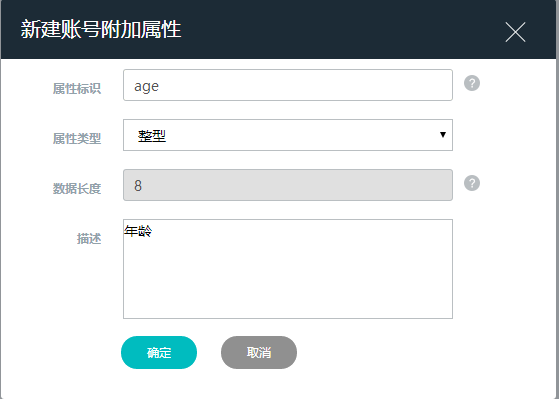
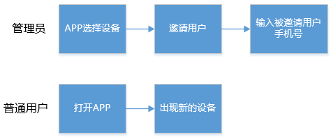
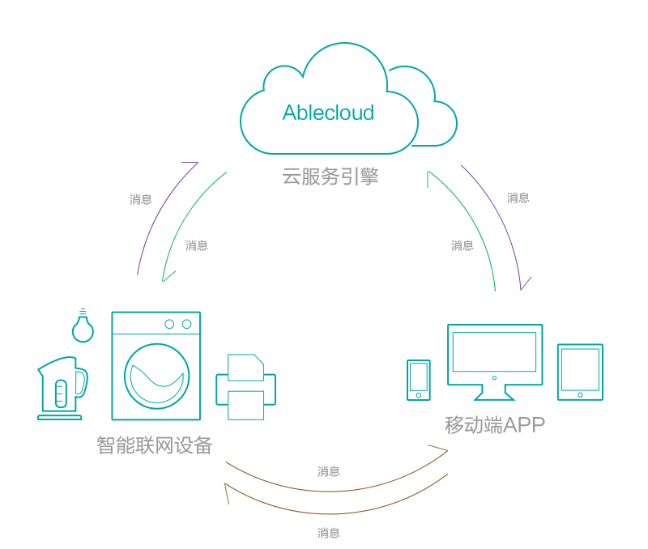
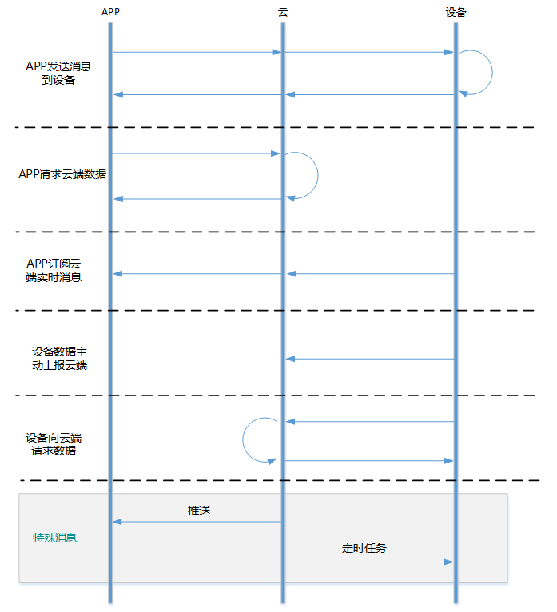

#基本概念
##智能硬件架构模型

 

上图是目前常见的智能硬件联网解决方案，从图中可以看到，整个硬件联网闭环存在三条消息流，分别表示不同的消息传递方式。

**远程控制 --**
如图中绿色箭头所示，用户在终端(如智能手机上)，发送控制命令到AbleCloud的云端，云端再将消息发往具体的某一设备，实现远程控制。
比如在酷热的夏天，下班回家前，您可以提前通过手机将家里的空调打开，并及时的查看家里温度情况，当您回到家时即可享受一片清凉。

**局域网通信 --**
如图中棕色箭头所示，当用户和设备在同一局域网内时，用户可以通过终端直接向设备发送控制命令实现直连，从而实现更加可靠的控制。设备直连的优势在于，当家里的公网访问出现故障时，您的智能设备仍然具备可用性。

**事件上报 --**
如图中紫色箭头所示，设备可以将运行中的状态、传感器采集到的各类数据上传到云端进行数据存储，供厂商进行数据分析和设备管理，也可以将上报的消息推送数据给用户。例如，当家里的安防系统出现异常时，发送报警数据到云端，云端再将该消息通过设定好的方式推送给客户，让用户及时了解家里所发生的情况，方便及时处理和应对。

##AbleCloud的功能模块

**1. 联网固件**

智能设备需要连接到云端，因此需要联网模块实现和互联网的连接。目前最主流的和互联网连接的联网模块是WiFi模块。除此之外还有蜂窝网络、以太网等联网方式。使用AbleCloud云服务的设备需要保证能够正常连接到AbleCloud的云端。因此，对于主流的WiFi模块，AbleCloud提供了联网固件，只要将这些联网固件烧入这些厂商的WiFi模块，就能够实现设备到云端的连接。对于目前AbleCloud尚未适配的联网模块，AbleCloud提供模块和云端握手的SDK，厂商只需要对SDK中的底层驱动部分进行适配即可实现设备到云端的连接。对于安卓设备、linux设备等自带网卡的设备，AbleCloud提供了SDK，只要使用SDK开发，即可让设备连接到AbleCloud的云端。

**2. 客户端SDK**

为了帮助开发者快速开发智能设备的客户端应用，我们提供Android、iOS和微信三大平台的SDK。厂商可利用AbleCloud提供的SDK快速开发控制智能硬件的APP。SDK提供了”帐号管理”、“设备管理”、“局域网通信”、“定时任务”、“和云端通信”、“实时消息同步”、”OTA管理”、“推送服务”等功能。 

**3. 云服务引擎**

云服务引擎，是我们提供的PaaS平台，包括开发、测试框架以及完整的运行平台。云服务引擎上提供通用服务和开发运行平台。通用服务包括：帐号管理、设备管理、定时任务、实时消息同步、OTA、推送服务、第三方云对接、存储管理、虚拟设备、设备调试等。对于通用服务，只需要调用SDK相关的接口或者在管理后台页面上操作即可使用，不需要在云端进行任何开发。

通用服务能满足智能联网设备的通用需求。对于个性化、定制化需求，我们提供云端服务开发引擎和运行平台,厂商也可以快速开发出自己的定制云端服务。

***云服务开发引擎***
AbleCloud封装了开发Web服务的框架，厂商的开发人员利用这个开发框架，可以完全不用关注服务和APP端、和设备端RPC交互的细节，而是将全部精力集中在服务具体业务逻辑的实现上。开发框架提供了完整的web service框架，让您用很少的代码即可实现一个服务，并提供了完备的单元测试、集成测试方案和工具包。

***云服务运行平台***
当厂商的自定义云端服务开发完毕并测试完成后，开发人员只需要将服务可执行程序提交到AbleCloud提供的PaaS平台，之后AbleCloud将自动完成发布、运维、日志收集、故障自动修复、服务监控报警、定时任务等工作。

##名词解释

###通用

- **设备绑定**：用户通过APP端对设备进行绑定，第一个绑定的人成为管理员，其他人只能够通过管理员的分享或者邀请绑定设备。只有通过绑定的用户才能控制设备。

- **设备解绑**：管理员解绑设备相当于删除设备，所有和该设备的绑定关系都删除。设备从逻辑上变为一台新的设备，所有注册用户可以绑定，且绑定后不会看到该设备的历史数据。普通用户进行设备解绑只是放弃对该设备的使用权。

- **设备分享**：管理员将设备的使用权分享给其他用户，一般模式下只有管理员才能够分享设备。设备的普通用户不能分享该设备。

###产品定义相关
- **主域**：Major Domain，是公司层面的概念，AbleCloud为每一个使用AbleCloud平台的公司分配一个唯一主域，如Google。

- **产品子域**：SubDomain，是公司的某一款产品，如Glass。在管理后台创建产品时需要填入相应的产品子域名称。

- **产品**：和产品子域等同的概念。一款产品包括产品名称和产品型号，如空调XXL。一款产品就是一个子域。对于网关型设备，网关和子设备分别要独立创建产品。因为不同的子设备看作是不同的产品。

- **设备**：Device，即厂商生产的具体的一台设备。只有被绑定的设备才能被控制。在没有指明是“网关”还是“子设备”时，Devie可以表示任何有设备ID的独立设备、网关、子设备。一台设备一定是属于某款产品的。

- **网关**：Gateway,是指自身具有联网能力，且可以连接控制其他设备的设备，如Zigbee网关、蓝牙网关等。网关下面的设备我们成为子设备。网关可以有独立的功能也可以纯粹作为一个协议转换的通道。

- **子设备**：Subdevice,指通过网关和云端进行通信的设备。子设备和网关有隶属关系，对网关有权限的用户也对子设备有权限。子设备可以单独进行权限管理。

- **数据点**：指设备的功能点。产品的所有功能都可以对应成响应的数据格式。在创建产品的时候，需要在云端创建该产品的数据点。

- **数据包**：数据点的集合。一个数据包中有一个或者多个数据点。每一个数据包有一个message code，作为不同数据包的区分，也作为该数据包功能的标识。

###服务相关

- **服务**：即开发者开发的具体Service，如Controller。一个服务，必须属于某一主域、子域。

- **版本**：为了支持服务升级、回滚等，AbleCloud支持为同一服务创建多个版本。版本由Major Version、Minor Version、Patch Version来标示。

- **云端通用服务**：由AbleCloud提供的云服务，如帐号管理、设备管理。

- **自定义服务**：由厂商基于AbleCloud的云服务引擎开发的自定义后端服务，也记为User Defined Service（UDS）。

###帐号相关
- **管理员**：对设备有终极权限的用户。可以对设备进行绑定、解绑、分享、添加子设备、删除子设备等操作，还可以将设备对普通用户进行授权管理。

- **普通用户**：即智能设备的终端用户，对设备有查看和控制权限，但是没有管理权限。

- **开发者**：产品的开发者。在AbleCloud的Web页面完成注册后可以在AbleCloud的后台进行产品的开发和管理。免费使用AbleCloud提供的各种开发工具和源代码。

###设备相关

- **Smartconfig**：是德州仪器开发的针对智能设备的APP端SDK。它支持将家庭WiFi的SSID以及密码通过加密后广播给智能设备，智能设备收到后自动完成配置并连上WiFi。 

- **Ablelink**：AbleCloud对Smartconfig协议进行封装然后添加云端握手和本地局域网广播后的协议。

- **流量控制**：对带宽等资源进行合理分配，防止资源抢占和拥堵。

- **握手认证**：采用优化后的非对称加密算法，提升设备的安全性。

- **局域网直连**：让手机可以在局域网内直接连接和控制设备。

- **命令转发**：采用AbleCloud优化的传输协议，将APP的对设备的指令通过云端发送到设备。

- **数据上报**：基于AbleCloud和设备的安全长链接通路，设备将数据上报到云端然后云端推送给用户或厂商自定义服务。

- **设备物理ID**：简称设备ID，设备出厂时，由厂商生成的ID，通常为16个字符的字符串。可以使用每台设备单独烧制的方式生成，也可以使用设备的MAC地址等信息生成。

- **设备逻辑ID**：设备在激活后被管理员绑定时生成的ID，通常为长整数。客户端（安卓、微信、iOS）对设备的控制和管理都使用逻辑ID。

- **设备密钥**：设备和云端交互的时候，在握手阶段需要进行密钥验证。握手阶段采用RSA非对称加密，云端需要有设备的公钥。AbleCloud支持两种密钥管理方式。一种是该产品的所有设备使用相同的密钥对；一种是该产品的每台设备有独立的密钥对。对于第一种，AbleCloud可以直接生成密钥对，设备开发人员将私钥烧到设备固件中即可。对于第二种，AbleCloud提供密钥生成工具，可以生成和设备物理ID一一对应的密钥对。将密钥文件上传到云端后，设备才能够和云端通信握手成功。

- **设备公钥**（RSA256）：32字节的整数，与设备私钥是一对。在设备批量出货前需要在管理后台提交设备公钥。在设备首次连接云端握手时，AbleCloud服务器用该公钥来加密给设备发送的消息。可以一款产品设置一对公钥私钥。对于安全性要求高的产品，也可以每台设备一个独立的公私钥对。

- **设备私钥**（RSA256）：112字节的整数（需要和设备公钥保持匹配）。

- **设备版本**：设备固件的版本信息，长度为4个字节。

- **设备域信息**：设备所属产品的domainID和subdomianID，长度8字节（两个字节的DomainID加上6个字节的SubDomainID）。

###开发调试相关

- **设备调试**：一般指开发者对设备功能进行调试。AbleCloud云端提供了辅助调试的工具，称作设备调试。该工具可以将设备上的数据通过网页直接展示出来。方便在APP还没有开发的阶段对设备的功能进行调试。用户可以在网页上查看数据，还可以模拟APP在网页上给设备发送指令。

- **虚拟设备**：指云端虚拟出一个用户已经定义的产品的设备。方便在设备还没有开发完成时对APP的调试。虚拟设备可以模拟真实设备上报数据，也可以显示APP发来的指令。

#功能介绍

##帐号管理

考虑到所有的智能设备，最终都需要由用户来操作，因此，用户在对设备进行管理前，首先需要注册帐号或者使用第三方帐号登录。AbleCloud提供了安全的帐号体系，开发者可以直接用云端的帐号管理服务，实现自己的帐号系统，如用户注册、登录、修改密码、找回密码、发送手机验证码、第三方登录、上传用户头像、填写用户个人信息等相关的功能。

AbleCloud提供两种帐号系统：

- 一、通过APP注册的用户为普通账号；
- 二、通过第三方帐号（比如微信，微博，QQ， 京东帐号）OAuth协议登录的帐号为第三方帐号。

### 1、AbleCloud普通帐号注册

- 	一般注册需要引导用户填写手机号码，然后发送短信验证码，为了防止频繁发送短信，一般设置倒计时1分钟（国内用户推荐使用手机注册）； 
- 	普通帐号也可以通过邮箱注册，部分地区的国外用户习惯用邮箱注册，也可以邮箱、手机号信息都写，对于仅通过邮箱注册的用户，会将验证码发送到注册邮箱；
- 	用户填写收到的验证码，通过验证码来验证是否是真实的用户。验证码的有效期为10分钟，验证通过后会立即失效；
-   注册中用户可以设置昵称，昵称没有唯一性要求，不同的用户可以重名，但不能通过昵称进行登录。

AbleCloud建议每个APP页面只实现一个功能，该功能用户操作成功以后再跳转到下个页面。APP开发者需要将整个流程中的意外情况做合理的处理，保证用户在使用过程中所有流程都是通顺的。

建议的流程如下图：

  
  
### 2、普通帐号和第三方帐号绑定

- 	普通帐号在登录后，可以绑定多个第三方帐号（微信、微博、QQ等）。绑定第三方帐号成功后，可以通过第三方帐号直接登录系统，并获取此普通帐号的相关数据，比如获取设备列表信息。普通帐号绑定第三方帐号时，不允许绑定一个已经注册或者已经被绑定的第三方帐号；
- 	系统支持第三方帐号的直接注册登录，APP端在完成OAuth认证登录之后，可以直接进行设备管理。同时，登录后的第三方帐号可以绑定一个未被注册的普通帐号，绑定普通帐号成功后，可以通过普通帐号直接登录系统，并获取此第三方帐号的相关数据，比如获取设备列表。

建议的交互流程如下图：

**第三方帐号登录**

 

**普通帐号注册后绑定第三方帐号**

 

 
**第三方帐号登录后绑定普通帐号**

 

### 3、帐号附加属性

AbleCloud的基本帐号属性只包括账户名和密码以及用户昵称。如果厂商的APP中需要用户填写更多信息，如性别，年龄等，需要用到帐号附加属性。若要使用帐号的附加属性，首先需要在管理后台的帐号管理中进行定义。如下图所示：

 

其中：属性标识是该属性的唯一标识，在SDK的附加属性接口中需要作为参数。

在当前主流的设计中，为了简化用户的注册流程，帐号的附加属性一般都是在用户完成注册以后补充填写，在帐号的注册过程中不填写。

建议的交互流程如下：

 

开发指导请参考：

[开发指导-安卓-帐号管理](develop_guide/android.md#帐号管理)

[开发指导-iOS-帐号管理](develop_guide/iOS.md#帐号管理)

[开发指导-微信-帐号管理](develop_guide/wechat.md#帐号管理)

如果需要存储用户的头像，请参考 [文件存储]

##设备管理

###独立设备管理

####功能介绍

独立设备指的是能够直接访问互联网、和云端进行交互的设备。

典型的独立设备包括通过WiFi连接网络的设备、通过蜂窝网络（GPRS）连接网络的设备和通过以太网连接网络的设备。

独立设备的管理内容包括：设备绑定、设备解绑、设备删除、设备分享、邀请用户、更换管理员、更换设备等。

AbleCloud提供的客户端的SDK中包括设备管理需要的接口。

AbleCloud的设备管理采用基于管理员的方案。即每个设备都有一个管理员，对设备有终极管理权限，可以将设备分享给其他人或者收回其他人的使用权。其他人为普通用户，普通用户只有使用权。普通用户需要从管理员那里获得设备的使用权。

**独立设备安全管理策略**

1. 第一个绑定的人是设备的管理员，有管理员权限。
1. 只有管理员能够分享设备，或者将某个用户添加成为具有权限的用户。同时管理员可以取消普通用户的绑定。
1. 管理员删除设备，所有绑定关系解除，设备可视为新设备。设备上也有取消所有绑定关系的接口，厂商根据需求调用。
1. 管理员删除设备后，所有用户对设备产生的历史数据都不可见。但该数据并未删除，只是与原设备的逻辑ID对应。
1. 厂商可以自己决定数据是记录在设备ID下还是用户ID下。对于医疗类和人相关的设备，建议记录在用户ID下。
1. 更换管理员，其他成员绑定关系不变。
1. 更换设备、所有绑定关系不变。

####建议的交互流程

对于WiFi类设备，可以通过局域网广播自己的物理ID，APP接收广播完成绑定。

 

对于蜂窝网络设备，没有局域网，需要APP扫描设备的物理ID（一般是二维码）来完成设备的绑定。
 
客户端为微信时，绑定不要求设备在线（与APP相比，微信的特殊之处）,微信的绑定流程如下所示：

 

第一个绑定的用户绑定成功后成为该设备的管理员，可以通过生成设备分享二维码或者邀请其他用户的方式分享设备的使用权。

**1、管理员分享**

 
 
**2、管理员邀请**

 
 
对于使用二维码分享方式分享设备使用权的，开发者可以自己定义二维码有效期，过了有效期再扫描的时候也不能够获得设备使用权。

对于使用邀请方式分享的，要求被邀请人已经注册。

客户端为微信时，目前AbleCloud只能够支持管理员分享的方式分享设备。

开发指导参考：

[开发指导-安卓-独立设备管理](develop_guide/android.md#_4)

[开发指导-iOS-独立设备管理](develop_guide/iOS.md##独立设备)

[开发指导-微信-独立设备管理](develop_guide/wechat.md#_5)

[开发指导-设备-设备激活](develop_guide/device.md#_3)

###网关型设备管理

####功能介绍

网关型设备是指结构如下图所示包括网关和子设备类型的设备。

 

 
其中网关是只能够通过TCP/IP协议和云端通信并且能够将其他协议转换为TCP/IP协议的设备。网关与子设备通信可以是Zigbee、蓝牙、RF、Z-wave、易能森、PLC等任意协议。AbleCloud只能够直接管理到网关，并不能够和网关下面的子设备直接通信。

网关和子设备都需要在管理后台进行独立的产品定义，子设备有独立的产品名称和subdomain用以区分子设备类型。

为了对子设备进行管理，需要网关按照约定的格式上报子设备的subdomian信息和物理ID信息。

网关型设备的管理采用和WiFi类设备相同的管理员模式，因此只有网关的管理员才对网关有管理权限。同时网关和子设备有主从关系，即子设备属于网关。所以，网关的管理员就是子设备的管理员。

网关的管理员可以选择将网关分享给普通用户，这时候，普通用户对网关和网关下面的所有子设备有使用权。管理员也可以选择只将子设备分享给普通用户，这时候，被分享的用户只对该子设备有使用权，对其他子设备以及网关没有使用权。但是将子设备单独分享给普通用户时，在某些情况下会有权限混乱的风险，不建议使用。

**网关型设备安全管理策略**

1. 第一个绑定网关的人是网关的管理员，同时也是网关下面的子设备的管理员。
1. 添加到网关的子设备必须没有被绑定过，否则无法添加。
1. 只有管理员能够分享设备，或者将某个用户添加成为具有权限的用户。
1. 管理员如果将网关分享了，那么被分享用户的权限包括网关和网关下的子设备。
1. 管理员可以单独分享子设备，被分享用户的权限只包括子设备。
1. 管理员删除设备，所有绑定关系解除，设备可视为新设备。普通用户删除设备，只是自己放弃对该设备的使用权，对其他所有用户无影响。
1. 管理员删除设备后，所有用户对设备产生的历史数据都不可见。但该数据并未删除，只是与原设备的逻辑ID对应。
1. 厂商可以自己决定数据是记录在设备ID下还是用户ID下。对于医疗类和人相关的设备，建议记录在用户ID下。
1. 更换管理员，其他成员绑定关系不变。只有管理员能够选择更换管理员。更换管理员后原管理员变为普通用户。
1. 更换设备、所有绑定关系不变。

####建议的交互流程
**1、绑定网关**
对于一台（或一套）新设备，首先要绑定网关才能够使用，第一个绑定的人成为管理员。和WiFi设备的绑定一样，为了防止被恶意攻击，要求网关云端在线（微信不需要）。如果网关是通过WiFi连接无线路由器的，绑定网关的建议操作流程和绑定WiFi设备是一样的。对于网关是通过以太网连接路由器的场景，建议的用户交互流程如下：

 
 
客户端为微信,网关为WiFi设备时，同绑定WiFi设备的流程一样。客户端为微信，网关通过以太网连接路由器时，直接扫描网关上的二维码就完成了设备的绑定（不要求网关在线），流程如下：

  

**2、添加子设备**

子设备作为独立设备时，同样有所有权问题，所以为了保证安全，同样要求子设备绑定时子设备是云端在线的（子设备能够连接上网关时基本都是云端在线的）。

 
 
客户端为微信时，操作流程是一样的。

**3、设备分享**
第一个绑定的用户绑定成功后成为该设备的管理员，可以通过生成设备分享二维码或者邀请其他用户的方式分享设备的使用权。对于网关型设备，管理员可以分享网关，此时网关即下面所有的子设备的使用权全部分享出去；也可以只分享子设备，此时被分享用户只有子设备的使用权。开发者也可以开发普通用户向管理员申请权限的功能，管理员同意后普通用户即有了设备的使用权。

*1、管理员分享*

 
 
*2、管理员邀请*

 
 
对于使用二维码分享方式分享设备使用权的，开发者可以自己定义二维码有效期，过了有效期再扫描的时候也不能够获得设备使用权。

对于使用邀请方式分享的，要求被邀请人已经注册。

客户端为微信时，只能够使用“管理员分享”的模式分享设备。

开发指导参考：

[开发指导-安卓-网关型设备管理](develop_guide/android.md#_9)

[开发指导-iOS-网关型设备管理](develop_guide/iOS.md#网关型设备管理)

[开发指导-微信-网关型设备管理](develop_guide/wechat.md#_10)

[开发指导-设备-设备绑定管理](develop_guide/device.md#_6)

###home模型

####基本介绍
考虑到用户管理的设备量变多的时候的分组管理需求，AbleCloud开发了home模型。

AbleCloud的home模型在权限管理上继承之前的WiFi设备以及网关型设备，这也正好和HomeKit的权限管理方式一致——基于管理员的权限管理。

home模型的组层次如下图所示：

 

 
**说明：**

- home是有管理权限的组。创建home的人成为该home的管理员。类似于网关，home的管理员是下面所有设备的管理员。管理员可以将home授权给普通用户，这时候，home下面的所有设备都授权给该用户。Home的管理员只能够将新设备或者自己有管理权限的设备放到home里。普通用户不能够在home中添加或者删除设备。
- home下面可以创建room，room只是方便管理并不能进行权限的授予和取消。
- home和room下面都可以有设备。这套组模型向下兼容WiFi设备和网关型设备，也就是说home和room下面可以是WiFi设备也可以是网关型设备，WiFi型设备和网关型设备的设备管理的接口同样都可以使用。同时，设备端固件不需要进行任何改动。
- 任何设备和room都有标识其所在home的属性。Home可以列出其下面有的所有room和home下的所有设备。room也可以列出该room下的设备。
- 可以先绑定设备再将设备添加到home中，但是建议先创建home，然后将新的设备添加到home中。
- 往home中添加的设备必须是以下三种之一：一种是新设备，一种是已经被之前的管理员解绑的设备，还有一种是该home管理员的设备。
- 创建room时必须指定其所属的home。将设备放入room前必须将设备先放入home。

需要单独说明的是，Home模型只是设备权限管理的模型，与用户的自定义场景设置没有关系。如果用户需要自定义场景对分组内的设备集中操作时，开发者可以自己定义场景，然后存储到云端的个人帐号下。在该用户在其他手机登录或帐号退出再登录时，可以从云端取出该用户的个人自定义设置。这种用户自定义的场景属于用户个人，不能够在多人之间分享。

####建议的交互流程

**1、设备为独立设备（WiFi）**

*（1）创建home*

home是有权限管理的，可以将home分享给其他人，则被分享的人对home下面的所有子组和子组里的设备都有使用权，但没有管理权。将home分享给其他人也可以看作将其他人添加到home里，这里从app上可以显示为添加成员到家庭。

*（2）创建room*

room没有权限管理，home的管理员不能把room分享给其他人，只能分享home和设备。对home有使用权的人就能看到子组以及子组下面的子组及设备。

*（3）添加设备到房间*

（走完整的绑定WiFi设备的流程，参考用户交互-设备管理-WiFi设备）

创建好房间后，可以将新的设备添加到房间。用户首先选择房间，接着选择添加设备到房间，然后配置设备WiFi密码，最后添加设备到房间。具体实现时，是先添加设备到home，然后将设备从home移动到子组。

**2、设备为网关型设备**

当设备为网关型设备时，一般一个家庭有一个网关，网关下面有多个子设备，子设备分布在不同的房间。此时，建议的交互流程是：

*（1）创建home*

同WiFi设备相同

*（2）创建room*

同WiFi设备相同

*（3）添加网关到家庭*（走和绑定WiFi设备一样的绑定网关的流程）

当家中只有一个网关时，建议采用此种流程。网关添加到家庭中后，再将各个子设备添加到房间。当家中有多个网关时，也可以采用此种流程，只是将子设备添加到房间的时候，需要选择添加到哪个网关。

*（4）添加子设备到房间*（走和网关添加子设备一样的流程） 

选择房间，然后进入网关型设备的添加子设备流程。具体实现是先添加子设备到网关，然后移动子设备到房间。

**3、微信**

由于微信绑定设备是要先扫描设备的二维码的，所以，流程与app会有不同。因此建议的流程是：

1. 扫描第一个设备的二维码关注公众号并绑定设备
1. 扫描第二、三、四个设备的二维码，绑定设备
1. 进入设备管理页面，创建家庭（home）
1. 在家庭（home）下创建房间
1. 将已经绑定的设备移动到房间

**人员管理**

AbleCloud支持两种设备分享模式。一种是通过分享码，普通用户通过扫描分享码获得使用权；一种是邀请模式，管理员填写普通用户的注册帐号，邀请该用户使用设备。

对于home模型，采用同样的模式。管理员可以将home分享给普通用户：即管理员生成分享码，普通用户扫描加入home；也可以邀请普通用户加入组的使用人员列表，即管理员将普通用户的帐号添加进home。只有home能够设定权限，即能够分享home或者邀请普通用户加入home。

开发指导参考：

[开发指导-安卓-home模型](develop_guide/android.md#home)

[开发指导-iOS-home模型](develop_guide/iOS.md#home)

[开发指导-微信-home模型](develop_guide/wechat.md#home)

###设备附加属性

AbleCloud的基本设备属性只包括设备名称。如果厂商需要用户在APP等客户端中填写更多和设备关联的信息，如设备关联手机号、家庭住址、地理位置等，就需要用到设备的附加属性。

为了简化设备绑定流程，一般设备附加属性可在设备绑定完成后补充填写，在绑定过程中不填写。

若要使用设备的附加属性，首先需要在产品管理中进行定义。

产品管理中选择要管理的产品，在产品属性页面创建该产品的设备的附加属性。如下图所示：

 

其中：属性标识是该属性的唯一标识，在SDK的附加属性接口中需要作为参数。

开发指导参考：

[开发指导-安卓-设备附加属性](develop_guide/android.md#_14)

[开发指导-iOS-设备附加属性](develop_guide/iOS.md#设备附加属性)

[开发指导-微信-设备附加属性](develop_guide/wechat.md#设备附加属性)

##和云端通信

云端通信指的是APP到云端、设备到云端的通信。分别对应下图中的绿色和紫色线所标注的数据流。

 

AbleCloud支持三种数据格式，分别是JSON、KLV和二进制：

- JSON格式，适合MCU支持JSON解析的设备或者使用安卓系统的设备。
 
- KLV格式，采用AbleCloud自定义的协议，与二进制码流类似，节省设备的运算资源，具体协议格式参见：[reference-设备-KLV协议介绍](reference/device.md#klv)；
- 二进制，这种数据格式AbleCloud不能够解析，因此部分可视化功能不可用，如设备虚拟。

 注:对于网关型设备，AbleCloud并不关心子设备和网关的具体通信协议和数据格式。云端能够看到的是网关上报的子设备的数据格式。例如，网关是安卓设备、子设备计算能力比较弱数据格式是二进制，但是安卓网关能够将子设备的数据解析然后重新打包成JSON格式和云端进行交互，那么在云端管理后台设置的时候，子设备的数据格式也需要设置成JSON格式。

无论采用JSON、KLV还是二进制为了统一，建议安卓、iOS、微信，全部采用有符号格式。比如一个十进制整数，当小于127时可以采用8bit数据表示，当大于127小于256时，就必须用16bit表示了。当前支持的交互数据类型包括：

|类型	|描述	|范围|
|-------|----|------|
|int8	|8位有符号整形	|-128~127|
|int16	|16位有符号整形	|-32768~32767|
|int32	|32位有符号整形	|-2^31~2^31-1|
|int64	|64位有符号整形	|-2^63~2^63-1|
|float32	|32位浮点数	|32位浮点数的范围|
|float64	|64位浮点数	|64位浮点数的范围|
|string	|字符串	|长度小于450字节|
|stream	|文件或者数据流，需要厂商写自定义服务进行处理|单个包长度小于450字节|
 
云端通信的详细通信类型见下图：

 

###发送消息到设备

客户端的指令接口为sendToDevice。云端直接将消息透传，发送到设备。如果不需要存储，直接调用SDK接口即可实现。如果需要存储，需要开发相关的存储服务。

根据网络条件不同，会有或长或短的响应时间。因此，我们建议，对于控制类指令，当用户控制指令发送以后APP即显示已经控制成功，当设备响应结果返回时，再根据返回结果修正APP状态：如果确实控制成功了，则不需要再给出提示，如果没有控制成功，修改APP相应显示为没有控制成功的状态并给出控制失败的提示。例如，APP远程控制一个插座的打开，当用户在APP上点击打开按钮的时候，APP上的按钮直接显示操作成功，以给用户及时的响应。如果APP远程打开插座成功，则APP不再有任何变化和提示；如果APP远程打开插座失败了，则APP页面上给出打开插座失败的提示，并把APP上显示的开关状态变为关闭。如果用户点击完打开就退出APP了，这时候如果打开失败了，建议给用户发送打开失败的推送通知。

对于APP请求设备和云端数据，如果是要设备返回相关数值的，网络环境比较差的情况下可能会有等待时间，建议APP在等待设备返回结果的时候给出相应的**等待**提示。

###发送消息到服务 

设备管理、帐号管理等，都是AbleCloud提供的通用云端服务，因此直接调用相关接口即可实现对应的功能。除此之外，智能硬件厂商通常还会开发自己的后端服务，这些后端服务通常也运行在AbleCloud提供的PAAS平台上，因此客户端还会和自定义的服务通信。

客户端到服务的指令接口为sendToService。云端需要写UDS服务，对客户端发来的指令进行解析和响应。例如，对于一个空气检测仪，APP需要获取过去三天的历史数据。用户需要开发对应UDS服务，收到APP的请求后，在数据库中检索出过去三天的历史数据，作为返回值返回给APP。

###实时消息同步

当APP打开时，可以订阅设备实时上报的消息。这时候，不需要APP刷新，设备端有新的数据或者状态变化的时候，APP上对应的页面的数据或者状态就会刷新。

AbleCloud的实时消息同步是和存储相关的。若要显示设备实时上报的消息，首先需要在管理后台的存储管理中定义需要watch的存储列。需要开发UDS服务，将设备上报的数据写入到存储中。

当APP上采用实时消息同步显示设备上报的数据时，在网络环境比较差的情景下，数据显示可能会不及时。此时，如果用户无法看到数据变化同时也不能进行任何操作，会导致用户焦虑。所以，建议对于实时显示数据的页面设计可以手动刷新数据的功能。这样，当实时数据显示没有变化时，用户可以手动刷新。

一般来讲，当APP没有打开的情况下，对于需要定时上报数据的设备也一般不建议设备高频次快速上报数据。但是在APP打开的情况下开启实施消息同步时，为了用户能快速及时的看到设备的数据和状态的变化，需要将设备的上报时间间隔变小。然后，在APP退出或者离开监控的页面的时候，再把设备的上报间隔变回原来的值。因此在设备开发时，需要开发调整上报频率的功能；在APP开发时，需要在进入需要实时监控设备状态变化的页面时给设备发一条指令，通知设备快速上报数据，当APP离开该页面的时候，再发一条指令，通知设备使用正常的上报间隔。

**开发指导请参考：**

[开发指导-安卓-和云端通信](develop_guide/android.md#_17)

[开发指导-iOS-和云端通信](develop_guide/iOS.md#和云端通信)

[开发指导-微信-和云端通信](develop_guide/wechat.md#_16)

###设备上报消息

设备可以在定时或者根据外界条件触发的情况下将设备数据和状态主动上报到云端。其中上报的消息号必须大于等于200。

###设备接收云端指令

设备接收云端指令可以控制设备，并返回执行结果，其中控制指令和响应指令的消息号必须大于64且小于200。

设备接收云端指令可以查询设备状态和数据，并返回查询结果，其中查询指令和响应指令的消息号必须大于64且小于200。

设备接收到云端指令必须回响应。

开发指导请参考：

[开发指导-设备-和云端通信](develop_guide/device.md#_14)

##局域网通信

局域网通信是指设备和设备、APP和设备在一个局域网内时，不通过云端直接进行通信。 

局域网通信能够保证在外网断开的情况下设备的正常使用，提供设备之间的高速访问能力及关联控制功能。

对于希望统计用户行为和设备数据的厂商，建议在云端和局域网都在线的情况下，用户的交互和设备的数据上报仍然走云端。只有在外网断掉，只有局域网的时候，才切换到只使用局域网的状态。因为这样才能够完整记录用户的行为数据和设备的历史数据，使数据分析的结果更可靠。

AbleCloud提供了非常简单的接口实现设备的局域网发现和状态获取以及控制。

如果要求用户进入到局域网以后，APP和设备的交互能够自动切换到局域网模式，而不再通过云端，那么对于用户来讲，最好的交互是完全感受不到这种切换。

我们提供的接口能够帮助厂商直接获取到当前设备的在线状态：云端和局域网在线、云端在线、局域网在线、云端和局域网都不在线。因此APP开发人员可以根据设备的在线情况调用相关的处理接口，是用户感受不到网络的切换。

具体请参考[开发指导-设备-局域网通信](develop_guide/device.md#局域网通信)

**安全机制**

局域网本身并不是可信网络，并不能依赖于局域网的安全机制，所以不能够认为接到同一个局域网的设备和用户就互相有权限。AbleCloud在局域网中采用基于loaclKey的认证机制。只有设备之间、应用和设备之间有相同的loaclKey的时候才能够进行局域网通信。localKey由云端发放，在特定场景下进行更新。

设备绑定、用户分享时，localKey的获取流程如下：

1. 设备连接云端自激活。
1. 第一个用户绑定设备成为管理员，云端向设备和管理员发送相同的localKey。
1. 管理员将设备分享给其他用户，其他用户绑定设备，从云端获得localKey。
1. 管理员将某用户解绑，该用户启动APP的时候，sdk自动到云端更新localKey，原localKey失效。

localKey对开发者不可见，由SDK自动维护。

##定时任务

对于没有定时器的设备，云端提供定时的功能。例如，开发者需要做一款插座，插座支持用户定时开关，但是没有一个精确的时钟。那么就需要用户将定时任务发送到云端。云端在用户设定的时间将设备的开关指令下发到插座上。

AbleCloud的定时任务功能支持单次任务、按天重复、按星期重复、按月重复等功能。用户只需要调用相关的接口，将任务类型和执行的指令内容发送到云端，云端就会在设定的时间将该指令下发到设备。而设备上不需要针对定时任务做任何开发，因为从设备端看来只是执行了一条普通指令。只不过该指令由云端按照用户设定的时间下发。

建议的用户交互请参考手机的闹钟设定方法。只是在闹钟设定的基础上增加对设备操作的设定。

开发指导请参考：

[开发指导-安卓-定时任务](develop_guide/android.md#_22)

[开发指导-iOS-定时任务](develop_guide/iOS.md#定时任务)

[开发指导-微信-定时任务](develop_guide/wechat.md#定时任务)

##OTA

OTA（Over－the－Air Technology），即空中下载技术。

在智能硬件领域，当设备固件需要升级的时候，可以借助OTA实现远程升级。

对于蓝牙设备，OTA需要先将固件下载到手机上，APP启动后连接设备，然后将手机中的固件下发到蓝牙设备进行升级。

对于非蓝牙设备，AbleCloud提供两种OTA模式：
 
- 一种是静默升级；
- 一种是需要用户确认的升级。

对于静默升级，不需要任何用户的交互操作，在厂商管理后台设定升级版本、升级时间、升级地域后，连接到云端的设备会自动完成升级。

对于需要用户确认的升级，厂商在管理后台提交新的固件版本后，云平台会把固件提前下载到设备当中，但是不进行升级操作，而是当用户启动APP的时候，给用户一个升级提醒，由用户来确认是否升级。

对于用户确认的升级，AbleCloud提供两种场景的支持：

- 一种是用户收到升级通知后，选择“当前不升级”，下次启动APP的时候，同样还会收到升级固件的通知；
- 一种是用户启动APP后，选择“忽略当前版本”，则以后再启动APP的时候，不会再收到该版本的固件更新通知，直到有更新版本的固件发布。

还有一种场景为强制升级，即APP启动后弹出升级确认框，但是用户只能选择确定不能选择取消。对于这种场景，APP开发者可以根据升级描述或者版本号来确定是否是强制升级。例如，版本号格式为"1-1-1"这种，APP开发者可以自己约定，当版本号中的最后一位为特殊数字的时候，系统固件要强制升级，此时APP弹出的升级提示没有取消选项。

开发指导参考：

[开发指导-安卓-OTA](develop_guide/android.md#ota)

[开发指导-iOS-OTA](develop_guide/iOS.md#ota)

[开发指导-微信-OTA](develop_guide/wechat.md#ota)

##推送

与实时消息不同，推送一般指的是用户收到的通知栏提醒。

AbleCloud的消息推送目前集成的是[友盟推送](http://www.umeng.com/)。

AbleCloud提供三种类型的推送，一种是厂商在后台定义的群发通知， 一种是和设备状态相关的消息推送，一种是和用户相关的消息推送。

对于群发通知，开发者直接去友盟的后台进行消息设定即可，不需要在AbleCloud的平台进行配置。

对于和设备状态相关的推送以及和用户状态相关的推送，首先需要在友盟和AbleCloud的后台进行相关的配置。配置完成后，开发者需要开发对应的云端UDS服务。

**和设备状态相关的推送**

和设备相关的推送分为两种，一种是厂商默认设备状态变化时就给用户发送推送通知，比如门磁检测到门窗开关时就给用户发送通知，用户可以设定该推送消息关闭或者打开；一种是用户自定义设备阈值，设备状态触发该阈值时，给用户发送通知，如设定一个烧水的壶当水温从高往低变到50摄氏度时发送通知。

用户在APP打开状态下收到通知时可以从通知栏弹出通知消息，用户点击后进入到相关页面，也可以不是从通知栏弹出推送，而是直接在APP中弹出消息框。

用户在息屏或者APP没有在前台的状态下收到通知时，从通知栏弹出推送，点击通知可以进入到相关页面。

**和用户状态相关的推送**

一个典型的应用场景是，某用户被管理员解绑后收到被解绑通知。这种类型的推送厂商根据实际需求开发。

安卓、iOS和微信实现推送的方式不同，具体开发请参考开发指导：

[开发指导-安卓-推送](develop_guide/android.md#_34)

[开发指导-iOS-推送](develop_guide/iOS.md#推送)

[开发指导-微信-推送](develop_guide/wechat.md#推送)

##文件存储

文件存储是AbleCloud提供的非结构化存储功能。可以用来存储头像、文件等大的数据块。
文件存储由于占用空间和带宽比较大，因此费用需要单独核算。具体请来电咨询我司商务。
目前文件存储功能只在客户端提供接口，设备端还不提供文件存储功能。

使用方法请参考

[开发指导-安卓-文件存储](develop_guide/android.md#_37)

[开发指导-iOS-文件存储](develop_guide/iOS.md#文件存储)

[开发指导-微信-文件存储](develop_guide/wechat.md#文件存储)

##第三方云对接

为了方便硬件厂商使用其它云厂商的已有资源，如终端优势，渠道优势等，AbleCloud实现了和其它云厂商的对接。这样一来，硬件厂商已经接入AbleCloud的硬件很方便就能和第三方打通，并且硬件厂商可以同时拥有多个云厂商的资源，不用再一家一家的实现对接，因为这些和第三方云的对接工作，已经由AbleCloud完成了。 当前，AbleCloud实现了和微信、京东云的对接，后续会对接更多的第三方云。

###微信

[微信硬件平台](http://iot.weixin.qq.com/)是微信为服务号提供的物联网解决方案。设备功能允许硬件设备厂商通过服务号，将用户与其拥有的智能设备相连。 通过微信硬件平台规定的连接协议，各种智能设备如蓝牙设备、WiFi设备和其他移动网络设备都能方便的接入微信，完成设备、人、服务三者的连接。
AbleCloud打通了和微信硬件平台的接入，实现了双方的云端对接，开启了微信硬件开发的全新模式。在该模式下，结合AbleCloud提供的PHP SDK，厂商可以在其微信服务号里实现和native app几乎一样的智能硬件功能特性，如设备绑定、解绑、网关和网关子设备的绑定解绑以及Home模型的使用，并且保证足够的安全性。

微信的对接和开发流程参考：
[开发指导-第三方云对接-微信](develop_guide/third_proxy.md#微信)

具体的功能开发请参考：[开发指导-微信](develop_guide/wechat.md)

###京东云对接

[京东智能云](http://devsmart.jd.com/dev/index)是京东推出的一个智能硬件云平台。基于京东智能云开发的接入京东微联的产品可以利用京东的渠道优势进行销售和品牌推广。同时接入京东智能云的设备也能够和京东微联的其他设备进行互联互通。

但是如果设备直接接入京东智能云，那么只能够使用京东微联来控制设备。厂商如果想要自己开发控制终端，就需要自己开发一套云服务和京东智能云对接。AbleCloud目前已经和京东智能云完成了云对接。设备如果直接接入AbleCloud，不需要修改固件就可以直接连接到京东智能云。

具体的开发流程请参考：

[开发指导-第三方云对接-京东](develop_guide/third_proxy.md#京东)

