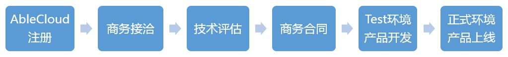

#接入流程

AbleCloud云平台的接入流程如下图所示

 

####1. AbleCloud注册

需要开发者到AbleCloud官网进行注册，按照页面要求，提供真实完整的申请人基本信息及产品的基本信息。我们会对每一位注册帐号进行人工审核，审核通过后开通AbleCloud的开发者帐号。

####2.商务接洽

**信息预审**：在成功提交信息后，我们会有相应的工作人员在后台对您提交的信息进行预审。

**意向沟通**：预审通过后会与您取得联系，与您就合作意向、合作需求进行初步沟通。

**签署保密协议**

####3. 技术评估

产品经理和开发者沟通确定技术对接方案。

AbleCloud的设备端目前支持WiFi设备、以太网设备、安卓设备、蓝牙设备、蜂窝网络设备（GPRS）等类型的设备接入。同时支持网关模型、Home模型。

####4. 商务合同

**与客户沟通确定**：确定定价、开发进度、预估设备量、上线时间等合同事宜。

**签署合作协议**：签署正式合作合同。

####5. test环境产品开发

在test.ablecloud.cn环境下进行产品功能开发。

####6. 正式环境产品上线

在test.ablecloud.cn的管理后台点击申请发布后，后台会将test环境的配置迁移到www.ablecloud.cn环境。再将设备和app的相关配置更新后，产品正式上线。

#开发流程
 
##一、定义产品

“产品定义”是开发者使用ablecloud服务进行开发的第一步，是指在AbleCloud的厂商管理后台中对产品及功能信息进行设定，设定成功后的产品即可按照后续步骤进行开发并有效使用AbleCloud的相关云服务。

在云端定义好设备端各个功能点的数据包以后，设备和APP直接的数据交互（无论是经过本地局域网还是云端）都必须采用数据包定义的内容进行。 数据点和数据包只能够定义设备上的功能点。除了设备上的功能点意外的APP和云端的交互由厂商的自定义服务完成，该部分数据格式由厂商自己定义。

##二、功能开发

###2.1 设备开发

####（1）设备激活

设备能连接到云端和云端完成握手叫做设备激活。

为了保证安全，对于设备和云端的交互AbleCloud采用了RSA加AES的加密通信方式。设备上电并且能够访问云端后，会首先和云端进行密钥认证，认证通过后，即认为设备已经激活。

对于WiFi设备，该加密协议已经烧入AbleCloud支持的WiFi模块中。对于尚未完成适配的联网模块，AbleCloud提供已经封装好的和云端握手交互的SDK，厂商只需要调用该SDK，更改底层驱动即可实现联网模块的适配。

已经完成适配的WiFi模块见下表：

|合作厂商|模块型号|WIFI芯片      | AirKiss|Smartconfig|
|-------|---------------|--------|----------|
|	汉枫   | LPB100         |MTK	         |	支持  |	支持|
|	      | LPB200         | Marvell	   |	支持  |	支持|
|	      | LPT100         |MTK	         |	支持  |	支持|
|	      | LPT200         |MTK	         |	支持  |	支持|
|	庆科   | EMW3162|broadcom        |	支持  |	支持|
|	      | EMW3165|broadcom        |	支持  |	支持|
|	      | EMW3088| Marvell              |	支持  |	支持|
|	      | EMW1088| Marvell              |	支持  |	支持|
|江波龙 | WK1230         |QCA4004       |	支持   |	支持|
|       | GT1216         |QCA4004       |	支持   |	支持|
|       | GT141         |QCA4004       |	支持   |	支持|
|       | WK1221          |QCA4004       |	支持   |	支持|
|思存	  |ITM-IOE01       |QCA4004		           |	支持 |	支持|
|    	  |ITM-IOE20       |QCA4004		           |	支持 |	支持|
|航锐	  |   HR WF411        |QCA4004		           |	不支持 |	支持|
|   	  |   HR WF422        |QCA4004		           |	不支持 |	支持|
| Marvel|          |Marvel-88MC500|	不支持|	支持|
|联盛德 |          |HED10W07SN        |	支持|	支持|
|卓立合 | LH781         |MTK7681       |  不支持   |支持|
|新岸线 |        | NL6621      |  不支持   |支持|
|Realtek |          |RTL8711       |  支持   |支持|
|村田 |   MIDK       |QCA4002       |  不支持   |支持|
|TI |   cc3200       |  cc3200     |  不支持   |支持|
|	|				|				|			|	|

对于安卓设备，AbleCloud提供安卓设备的SDK，SDK里封装了设备和云端握手的密钥，开发者不需要关心握手问题，直接调用SDK接口开发功能即可。

对于蜂窝网络设备（GPRS）、以太网设备等，AbleCloud提供了设备和云端握手需要的SDK，开发者移植SDK的底层驱动后就可以实现设备到云端的连接。

在厂商管理后台的“设备管理”中可以看到所有已经和云端成功握手的在线设备。

对于蓝牙设备，由于不连接云端，因此不需要进行设备激活。

####（2）设备绑定

设备绑定就是设备的ID和用户的ID在云端建立了对应的关系，是完成用户对设备的权限认证的过程。

要绑定设备需要获取到设备的ID信息。

对于WiFi设备和以太网设备，可以使用在局域网内广播设备ID的方式让APP获取到设备信息完成用户和设备的绑定。该功能已经集成在WiFi模块的固件里，开发者不需要单独进行开发。

对于其他设备、可以使用扫描设备上的二维码的方式完成设备和用户的绑定。这要求每台设备有独立的二维码。

####（3）和云端通信

设备和云端的通信分为两种：设备接收云端指令、设备上报数据。

设备接收云端指令分为控制指令和查询指令。开发者自己区分指令类型和返回值。

设备上报数据是指由定时器或其他外界环境触发的设备把数据主动上报到云端。

厂商管理后台的“设备调试”工具可以辅助设备开发。

####（4）局域网通信

设备在本地局域网内和APP通信采用和云端通信同样的格式。设备端和APP端的认证已经由SDK完成，开发者不需要关心。

####（5）OTA

OTA即远程升级。AbleCloud的SDK已经封装了OTA的功能，并且支持通信模块和主MCU两种固件升级。

在管理后台提交OTA文件后，可以厂商可以配置定时、定区域、指定设备等多种升级方式。

###2.2 APP开发

AbleClouD的APP端的SDK提供的功能主要包括：

- **帐号系统**：登录、注册、发送验证码、第三方登录、用户头像、用户个人信息。
- **设备激活**：通过smartconfig等技术给WiFi设备配置路由器密码。
- **设备管理-独立设备**：独立设备的绑定、解绑、分享、邀请。
- **设备管理-网关型设备**：网关的绑定、解绑、分享邀请和子设备的添加、删除、分享、邀请。
- **设备管理-Home模型**：以家庭为单元的设备管理，包括家庭和房间的创建、删除；向家庭和房间中添加和删除独立设备以及网关型设备；家庭成员的添加、删除。
- **OTA**：检查是否有固件更新，显示更新内容，确认设备固件进行更新。
- **实时消息同步**：基于websocket，APP和存储中的数据进行实时同步。
- **定时任务**：通过APP给设备设定定时任务。云端会在APP设定的时间将设定的指令发送到设备。
- **推送**：APP接收云端的推送通知。
- **文件存储**：图片、音频等块文件的存储。
- **访问服务**：访问云端的UDS服务。

以上功能，可以直接调用SDK的接口进行开发。 

管理后台提供了：“虚拟设备”的功能，云端可以虚拟出所定义产品的设备，在实体设备尚未开发完成时，可以用来辅助APP的开发和测试。

注：设备管理部分，AbleCloud提供了独立设备、网关设备和Home模型，开发者根据自己的实际情况进行选择。无论采用何种设备管理模型，其他功能的开发都是一样的。

###2.3 微信开发

如果使用微信作为控制设备的客户端，需要开发微信公众号上的相关功能。

AbleCloud在后台和微信硬件平台进行了对接，同时在云端提供了PHP的开发框架。

与微信的交互是指在开发者的微信公众号中实现设备管理功能，允许用户通过微信公众号的交互界面实现对设备的智能控制。因此除了在AbleCloud的平台注册并定义产品外，还需要有一些和微信公众号相关的操作。详细信息，请参考 [开发指导-第三方云对接-微信](develop_guide/third_proxy.md#_2)

###2.4 云端服务开发

AbleCloud提供了通用的云端服务，如“帐号管理”、“设备管理”、“定时任务”、“OTA”、“文件存储”、“实时消息同步”等。对于这些通用功能可以满足需求的产品，不需要进行任何云端服务的开发。

对于通用服务不能够满足需求的产品，AbleCloud在云端提供了开发框架，厂商可以对“用户帐号“、“设备管理”、“云端服务”，“设备数据存储系统”、“推送”进行定制化开发。甚至可以使用AbleCloud的云服务开发网上商城。云端服务开发框架参考 [开发指导-云端服务](develop_guide/cloud.md)
云端服务开发厂商只需要注重功能即可，“服务的上线和部署“、”数据的分布式存储“、”数据的多重备份“等底层功能AbleCloud已经做好封装。

##三、调试
 
如上所述，AbleCloud云端提供“设备虚拟”和“设备调试”服务。

单独说明如下：

**设备调试服务**-
在APP尚未开发完善，但是需要进行设备调试的时候，一方面可以利用调试APP进行调试，另一方面可以利用管理后台的“设备调试”进行调试。

在厂商管理后台的设备管理可以看到当前连接到云端的所有设备。点击详情，进入“设备调试”的详情页面。“设备调试”提供一下功能：

- 在Web页面直接看到当前连接到云端的设备的所有数据点的数据。
- 触发设备上报数据，页面的数据点会显示设备上报的数据。
- 提供模拟APP功能，开发者可以通过Web页面模拟APP给设备下发数据。

在APP和设备联调时，也可以通过该页面查看设备的数据上报和指令响应情况。

**虚拟设备服务**-
当进行移动端的调试的时候，云端提供虚拟设备服务。基于厂商在后台创建的产品，AbleCloud管理后台可以启动对应的虚拟设备。AbleCloud提供虚拟设备的功能可以在设备尚未开发完成的时候用以辅助APP的开发。APP可以绑定该虚拟设备，虚拟设备提供三个功能：
 
- 显示APP发给设备的指令。
- 响应APP的查询指令。
- 模拟真实设备上报数据。

##四、产品上线

为保证安全，AbleCloud的云平台分为test开发测试环境和正式生产环境。因此，当产品开发测试完成后，需要在test环境的管理后台的产品管理页面点击“申请发布”，将产品发布到正式生产环境。AbleCloud收到申请后会立即进行审核，并将您的配置转移到正式生产环境。

转移到正式生产环境后，需要将APP上的云地址、设备端的云地址和设备上的密钥全部更新成正式环境的。同时，将存储的配置、服务的配置在正式环境中重新上传。

然后再次测试通过后产品就可以进入生产流程，正式上线了。

