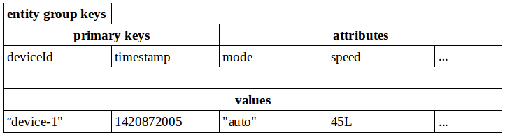

#云端服务开发参考

#简介
为了快速开发和业务逻辑相关的服务端程序，提高开发者效率，提高企业产品研发/上线的效率，AbleCloud提供了统一的服务开发框架，并内嵌了一系列由AbleCloud提供的云端服务。该框架支持开发者开发可运行于AbleCloud云端的自定义后端服务（UDS：User Defined Service）以及定时任务。AbleCloud的服务框架提供了高度封装的RPC服务，client与server通信时，client只需要知道service的名字，并提供相应的访问参数即可。当前AbleCloud提供Java版本的服务编程框架。本章介绍该框架提供的API。

#服务框架发布库
AbleCloud一期发布Java版本服务开发框架，其发布目录、文件如下所示
```java
/config
	/cloudservice-conf.xml
/lib
	/ablecloud-framework-1.1.0.jar
    /ac-java-api-1.0.0.jar
	/commons-collections-3.2.1.jar
    /commons-configuration-1.10.jar
    /commons-lang-2.6.jar
    /slf4j-api-1.7.7.jar
    /...
start.sh
start.cmd
```
><font color=red>注意事项：</font>

>1. 所有依赖的第三方jar包，均放在lib文件夹下。其中包括AbleCloud的服务框架`ablecloud-framework-1.1.0.jar`和`ac-java-api-1.0.0.jar`。根据AbleCloud的发行状态，各jar包的版本号可能不同。

>1. 开发者开发的自定义服务也编译成jar包，并置于lib文件夹下。同时，还要在pom.xml里的`<additionalClasspathElement>`标签下添加测试依赖。

>1. 按上述目录结构将所有文件压缩、打包成一个ZIP文件（文件名可自取）。要求ZIP文件解压缩后能直接得到上述目录或文件，不能存在其它中间层次的目录。

>1. 在开发者管理控制台中提交压缩后的ZIP文件，之后即可通过“上线”/“下线”功能管理UDS的运行状态。

#基础数据结构

##ACContext
ACContext即上下文，用于标记每一次交互（比如发起者、发起时间、签名等）、追踪通信事件。AbleCloud服务之间的交互消息中均需要带有上下文信息。
ACContext定义的内容如下：
```java
public class ACContext {
    private String majorDomain;			// 服务所属主域ID
    private String subDomain;			// 服务所属子域ID
    private String majorDomainName;     // 服务所属主域名
    private String subDomainName;       // 服务所属子域名
    private Long userId;				// 用户id
    private Long developerId;			// 开发者id
    private String traceId;				// 唯一事件id，可用于追查问题
    private String traceStartTime;		// 起始时间
    private String timestamp;			// 请求发起的时间戳，单位秒
    private String signature;			// 请求的签名
    private String timeout;				// 为防止签名被截获，设置签名的有效超时时间
    private String nonce;				// 用于签名的随机字符串
    private String accessKey;			// 开发者的accesskey，用于签名之用
}
```
通过ACContext的定义我们可以看出，其中包含两种用户信息：

+ **userId：**设备的终端（普通）用户id，比如用户在手机上通过app控制某一设备时，context中需要带上该用户的id，后台用于认证等之用。当用户通过云服务发起远程控制时，云服务程序透传用户的context。使用示例：`ac.newContext(userId)`
+ **developerId：**开发者id。UDS服务一方面接收APP或设备发来的消息，另一方面可能需要自主的访问云端通用服务或执行例行巡检任务，当对AbleCloud后台服务发起请求时，context中并不会有userId等终端用户的信息，此时服务创建的context需要填充developerId的值。使用示例：`ac.newContext()`

><font color="brown">**注：**</font>上下文context有一个重要的特性是，在其生成后的所有交互中，都不能更改其已有字段的值，可以添加还没有赋值的字段。比如有终端用户发起的请求中带有userId，请求到达云服务端时，云服务可以往该context中设置developerId的值，但不能修改其它值。否则就失去了追踪每一次交互的意义了。
开发者不应该直接用ACContext的构造函数构造上下文对象，而应使用AC框架的相关接口创建上下文对象，后面会有详细描述。

##ACObject
ACObject用于承载交互的具体数据，我们称之为payload（负载）。ACObject数据内部结构以HashMap来存放，通过put存入ACObject的数据内部以json方式处理，因此ACObject中的value也可以是嵌套的ACObject，能满足大部分需求场景。
```java
public class ACObject {
    private HashMap<String, Object> data = new HashMap<String, Object>();

	/**
     * 设置一个参数
     * @param key	参数名
     * @param <T>	参数值
     * @return
     */
    public <T> ACObject put(String key, T value) {}
    
    /**
     * 添加一个参数，该参数添加到一个List中
     * @param key	参数所在List的名字
     * @param value	参数值
     */
    public ACObject add(String key, Object value) {}
    
    /**
     * 获取一个参数值
     * @param key	参数名
     * @return		参数值
     */
    public <T> T get(String key) {}
    
    /**
     * 检查某一key是否存在
     * @param key	参数名
     * @return		存在返回true，否则返回false
     */
    public boolean contains(String key) {}
}
```
><font color="brown">**注：**最常用的三个接口是put/add/get。通过**add**接口保存在ACObject中的数据实际为List；相应的，get出来也是一个List。</font>

#交互消息
多个模块、服务之间都通过*消息*`message`来通信。AbleCloud定义了两种格式的消息：

+ **ACMsg：**APP与service，service与service之间的交互消息。
+ **ACDeviceMsg：**APP与device，service与device之间的交互消息。

##ACMsg
ACMsg继承自ACObject，扩展了一些功能，比如设置了交互的方法名name、交互的上下文context以及**其它形式**的负载payload信息。通常采用ACMsg进行数据交互，较多的使用默认的**ACMsg.OBJECT_PAYLOAD**格式，该格式只需要使用ACObject提供的put、add、get接口进行数据操作即可。因为在使用OBJECT_PAYLOAD格式时，框架会对数据进行序列化/反序列化。ACMsg也提供另外的数据交互格式，如json、stream等。如果用json格式，则通过setPayload/getPayload设置/获取序列化后的json数据并设置对应的payloadFormat，开发者后续可自行对payload进解析。
```java
public class ACMsg extends ACObject {
	public static final String OBJECT_PAYLOAD = "application/x-zc-object";
    public static final String JSON_PAYLOAD = "text/json";
    public static final String STREAM_PAYLOAD = "application/octet-stream";

    private String name;
    private ACContext context;
    private String payloadFormat;
    private byte[] payload;
    private int payloadSize;
    private InputStream streamPayload;

    public ACMsg() {}
    
    /**
     * 设置请求方法名，服务端将根据该方法名进行处理
     * @param name  方法名
     */
    public void setName(String name) {}
    
    /**
     * 获取方法名
     * @return
     */
    public String getName() {}
    
    /**
     * 获取交互上下文
     * @return
     */
    public ACContext getContext() {}
    
    /**
     * 设置交互上下文
     * @param context
     */
    public void setContext(ACContext context) {}
    
    /**
     * 获取负载格式
     * @return
     */
    public String getPayloadFormat() {}
    
    /**
     * 获取二进制负载
     * @return
     */
    public byte[] getPayload() {}
    
    /**
     * 获取负载大小
     * @return
     */
    public int getPayloadSize() {}
    
    /**
     * 设置二进制负载
     * 通过put/add方式设置的负载要么框架将其序列化为json，
     * 要么解析后作为url的参数传输。
     * 通过该函数可以设置额外的负载数据，比如传统的序列化后的json值。
     * @param payload
     * @param format
     */
    public void setPayload(byte[] payload, String format) {}
    
    /**
     * 设置流式负载，主要用于较大的数据传输，如上传文件等。
     * @param payload   负载内容
     * @param size      负载大小
     */
    public void setStreamPayload(InputStream payload, int size) {}
    
    /**
     * 获取流式负载
     * @return
     */
    public InputStream getStreamPayload() {}
    
    /**
     * 关闭流式负载。
     * 通过getStreamPayload拿到流式负载后，需要显示的关闭。
     * @throws IOException
     */
    public void closeStreamPayload() throws IOException {}
    
    /**
     * 设置错误信息。在服务端处理错误时，需要显示的调用该结果设置错误信息
     * @param errCode   错误码
     * @param errMsg    错误信息
     */
    public void setErr(Integer errCode, String errMsg) {}
    
    /**
     * 判断服务端响应的处理结果
     * @return  true-处理出错，false-处理成功
     */
    public boolean isErr() {}
    
    /**
     * 获取错误码
     * @return
     */
    public Integer getErrCode() {}
    
    /**
     * 获取错误信息
     * @return
     */
    public String getErrMsg() {}
    
    /**
     * 服务端处理成功后，调用该方法
     */
    public void setAck() {}
}
```
><font color="red">**注：**</font>开发者在本地测试或联调时，需要设置context的相关信息。客户端往后端服务发送消息，服务向另一服务发送消息的时候，均需要对所发请求进行签名，具体的签名算法见附录。

###使用示例
client端发起请求（伪代码，完整代码请参看各部分demo）：
```java
ACContext context = ac.newContext(account.getUid());	// 通过框架构造一个用户context
ACMsg req = new ACMsg();								// 创建一个空请求消息
req.setContext(context);								// 设置请求上下文
req.setName("controlLight");							// 设置请求消息名
req.put("deviceId", light.getId());						// 设置一个请求属性“设备id”
req.put("action", "on");								// 设置另一属性"动作“，开灯
ACMsg resp = client.send(req);							// 发送请求并返回服务端响应
```

服务端处理请求（伪代码，完整代码请参看各部分demo）：
```
private void handleControlLight(ACMsg req, ACMsg resp) throws Exception {
    Long lightId = req.get("deviceId");		// 从请求中获取“设备id”
    String action = req.get("action");		// 从请求中获取“动作”
    // do something
}
```

##ACDeviceMsg
该消息用于处理服务和设备之间的交互，框架会将ACDeviceMsg中的code部分解析出来，开发者可根据code来区分设备消息类型。并根据code的不同值执行不同的序列化/反序列化操作。
>+ **二进制/json**
>在使用二进制或json格式通讯协议的情况下,ACDeviceMsg的content部分由开发者解释，框架透传，因此开发者需要自己编写设备消息序列化/反序列化器。
>+ **KLV**
>KLV是由AbleCloud规定的一种数据格式，即可以理解为content部分的一种特殊格式。具体应用时，需要到AbleCloud平台定义设备的数据点和数据包。此时开发者不需要自己编写消息序列化/反序列化器，AbleCloud可依据定义的数据点和数据包自动解析消息的内容。

ACDeviceMsg定义如下：
```java
public class ACDeviceMsg {
    private int code;			// 消息码，用于区分消息类型
    private Object content;		// 设备消息的具体内容

    public ACDeviceMsg() {}
    public ACDeviceMsg(int code, Object content) {}
    public int getCode() {}
    public void setCode(int code) {}
    public Object getContent() {}
    public void setContent(Object content) {}
    public void setKLVObject(ACKLVObject object) {}
    public ACKLVObject getKLVObject() {}
}
```

<font color=red>注意</font>：从上面的定义可以看到，设备消息的具体内容为Object类型。开发者需要根据实际情况实现序列化器用来解释content的内容。

####ACDeviceMsgMarshaller
设备消息的序列化/反序列化器，用于解释ACDeviceMsg的具体内容。其定义如下：
```java
public interface ACDeviceMsgMarshaller {
	/**
     * 将具体的ACDeviceMsg序列化成字节数组，用于控制设备时通过网络下发****给设备
     *
     * @param msg       设备消息
     * @return          序列化后的字节数组
     * @throws Exception
     */
    public byte[] marshal(ACDeviceMsg msg) throws Exception;

    /**
     * 将通过网络收到的字节数组数据，反序列化成具体的消息，以便从消息中提取各个字段。
     *
     * @param msgCode   消息码
     * @param payload   设备消息序列化后的字节数组
     * @return          设备消息
     * @throws Exception
     */
    public ACDeviceMsg unmarshal(int msgCode, byte[] payload) throws Exception;
}
```

开发者应该在其重载的ACService.init()方法中初始化设备消息的序列化/反序列化器，并将其配置给服务开发框架。
当UDS向设备发送消息时，开发框架会自动调用该序列化/反序列化器的marshal方法将数据序列化为设备可理解的数据，之后再通过AbleCloud云端服务传输给设备。
当UDS接收到设备上报的消息时，开发框架会自动调用该序列化/反序列化器的unmarshal方法依据设备上报的消息创建ACDeviceMsg对象，并以该ACDeviceMsg对象为参数调用开发者重载的ACService.handleDeviceMsg()方法。

#服务开发框架
开发者在使用AbleCloud框架开发服务时，仅需简单的使用前文介绍的基础数据结构，将精力集中在实现应用的业务逻辑上，快速完成服务程序的开发/测试/发布。
##ACService：自定义后端服务
AbleCloud定义了抽象基类ACService，开发者只需要继承该类，并实现各个handler即可。定义如下:
```java
public abstract class ACService {
    // 开发者可以调用ac的相关接口直接调用AbleCloud提供的云服务。
    protected AC ac;
    
    // 以下信息可用于服务内部追踪问题等用，比如打印到日志中
    protected long developerId;			// 开发者id
    protected String majorDomain;		// 服务的主域名
    protected String subDomain;			// 服务的子域名
    protected int majorVersion;			// 服务的主版本号
    protected int minorVersion;			// 服务的副版本号
    protected int patchVersion;			// 服务的修订版本号

    /**
     * 开发者可根据自身需要，重载该方法，在该方法里做一些初始化工作，框架在启动服务时会调用该函数。
     * 比如，该服务要处理和设备之间的交互消息，需要自定义设备消息的序列化/反序列化器
     * ACDeviceMsgMarshaller，在init函数内将marshaller设置到ac中。
     *
     * @throws Exception
     */
    public void init() throws Exception {}

    /**
     * 处理APP-->Service，Service-->Service之间的交互消息
     * @param req   请求消息体
     * @param resp  响应消息体
     * @throws Exception
     */
    public abstract void handleMsg(ACMsg req, ACMsg resp) throws Exception;

    /**
     * 处理Device-->Service之间的交互消息
     * 如果服务不处理和设备之间的交互消息，则无须重载该方法。
     *
     * 当前，处理设备汇报的消息不做响应。
     *
     * @param context		设备的上下文，其中uid字段为系统填充
     * @param deviceId		设备的逻辑id
     * @param req			请求消息体
     * @throws Exception
     */
    public abstract void handleDeviceMsg(ACContext context, long deviceId, ACDeviceMsg req) throws Exception;

    /**
     * 处理JINDDONG-->Service之间的交互消息，收到Stream点数组，进行设备控制
     *
     * @param context          设备的上下文，其中uid字段为系统填充
     * @param physicalDeviceId 设备的物理id
     * @param req              请求消息体(Stream数组)
     * @param resp             响应消息体
     * @throws Exception
     */
    public void handleJDSetStatusMsg(ACContext context, String physicalDeviceId, List<ACJDMsg> req, ACMsg resp) throws Exception {}

    /**
     * 处理JINDDONG-->Service之间的交互消息,获取设备上所有Stream点
     *
     * @param context          设备的上下文，其中uid字段为系统填充
     * @param physicalDeviceId 设备的物理id
     * @param resp             响应消息体(Stream数组)
     * @throws Exception
     */
    public void handleJDGetStatusMsg(ACContext context, String physicalDeviceId, List<ACJDMsg> resp) throws Exception {}
    
    /**
     * 内部调用接口，开发者不用关注且不能修改。
     * 设置服务相关的信息，并将全局AC框架传给服务
     * 服务内部可以使用AC框架提供的各种功能，如
     * 帐号管理、设备管理、存储服务等。
     * @param ac
     * @param config
     */
    public final void setEnv(AC ac, ACConfiguration config) {}

    /**
     * 内部调用接口，开发者不用关注且不能修改。
     * @return
     */
    public final AC getAc() {}
}
```
在上述抽象类中，对开发者来说，总共有七个公共接口，其中init提供了默认实现。如果开发者实现的某一服务不需要和设备直接交互，则直接重载handleDeviceMsg为空实现即可。通常情况下，init只需要设置设备消息处理的序列化器即可。因此，开发者可以将精力集中在handleMsg接口的实现中，该接口处理客户端请求，并作出响应。下文会对该抽象类进行详细介绍。

><font color="red">**注：**</font>通常情况下，开发者只需要重点实现**handleMsg**即可。当然如果需要处理复杂的设备上报数据，则还需要重点实现**handleDeviceMsg**并根据不同code做不同处理 。

##ACCronJob：云端定时任务
AbleCloud定义了云端定时任务的抽象基类ACCronJob。开发者需要继承该类，并实现其定义的抽象方法ACCronJob::run，即能完成定时任务的开发。ACCronJob的定义如下：
```java
public abstract class ACCronJob {
    // 开发者可以调用ac的相关接口直接调用AbleCloud提供的云服务。
    protected AC ac;
    
    // 以下信息可用于任务内部追踪问题等用，比如打印到日志中等。
    protected long developerId;         // 开发者id
    protected String majorDomain;       // 服务的主域名
    protected String subDomain;         // 服务的子域名
    protected int majorVersion;         // 服务的主版本号
    protected int minorVersion;         // 服务的副版本号
    protected int patchVersion;         // 服务的修订版本号

    /**
     * 内部调用接口，开发者不用关注且不能修改。
     * 设置服务相关的信息，并将全局AC框架传给服务。服务内部可以使用AC框架提供的各种功能，如帐号管理、设备管理、存储服务等。
     * @param ac
     * @param config
     */
    public final void setEnv(AC ac, ACConfiguration config) {
        this.ac = ac;
        this.developerId = config.getDeveloperId();
        this.majorDomain = config.getServiceMajorDomain();
        this.subDomain = config.getServiceSubDomain();
        this.majorVersion = config.getServiceMajorVersion();
        this.minorVersion = config.getServiceMinorVersion();
        this.patchVersion = config.getServicePatchVersion();
    }

    /**
     * 用于获取AC框架。
     * @return AC对象。
     */
    public final AC getAc() {
        return ac;
    }

    /**
     * 定时任务的执行函数。
     * @return 返回任务的结束后，进程退出时所使用的状态码。
     * @throws Exception
     */
    public abstract int run() throws Exception;
}
```
上述抽象类共定义了三个公共方法：ACCronJob::setEnv，ACCronJob::getAC，以及ACCronJob::run。其中，ACCronJob::run是定时任务的执行函数，要求开发者提供具体实现。

##AC
在介绍ACService和ACCronJob的时候提到过重要的成员变量ac，ac实际上是AbleCloud对抽象服务框架AC的具体实现，其实现过程对开发者透明。通过AC，开发者可以根据需要获取一系列内嵌服务的功能接口。AC的定义如下：
```java
public abstract class AC {
    protected ACConfiguration config;
    protected ACDeviceMsgMarshaller deviceMsgMarshaller;

    /**
     * 构建一个开发者上下文
     * @return
     */
    public ACContext newContext() {}

    /**
     * 构建一个用户上下文，由于是框架创建的，因此也会带着开发者信息，一般用于单测
     * @param userId
     * @return
     */
    public ACContext newContext(long userId) {}
    
    /**
     * 构建一个用于数据查询的过滤器
     *
     * @return
     */
    public ACFilter filter(){}
    
    /**
     * 用于对数据分类进行具体的操作，如create/find/delete/update/scan等
     *
     * @param className     要操作的分类名
     * @param context       要进行操作的开发者context
     * @return
     */
    public abstract ACStore store(String className, ACContext context);
    
    /**
     * 则用于创建数据分类/清空数据等操作。
     * 用于测试之用。
     *
     * @return
     */
    public abstract ACStoreForTest storeForTest(ACContext context);

    /**
     * 往某一服务发送命令/消息
     *
     * @param subDomain 该服务所在产品名
     * @param name      服务名
     * @param version   服务版本
     * @param req       具体的消息内容，此处req无需构造ACContext
     * @return 服务端相应的消息
     * @throws Exception
     */
    public abstract ACMsg sendToService(String subDomain, String name, int version, ACMsg req) throws Exception;
    
    /**
     * 往JD service发送命令/消息,上报设备上的所有Stream点到JINGDONG Service
     *
     * @param context          设备的上下文，其中uid字段为系统填充
     * @param physicalDeviceId 设备的物理id
     * @param req              请求消息体(Stream数组)
     * @return 服务端相应的消息
     * @throws Exception
     */
    public abstract ACMsg sendToJDService(ACContext context, String physicalDeviceId, List<ACJDMsg> req) throws Exception;
    
    /**
     * 由于uds本身无法访问正常的外网服务，所以AbleCloud内部实现了正向代理，并提供ACHttpClient访问外网服务
     *
     * @param url 访问外网的url
     * @return ACHttpClient
     * @throws IOException
     */
    public abstract ACHttpClient getHttpClient(String url) throws IOException;

    /**
     * 获取帐号管理器。开发者组实现自定义服务时，
     * 可以调用ACAccountMgr提供的各个通用接口
     *
     * @param context   开发者的context
     * @return
     */
    public abstract ACAccountMgr accountMgr(ACContext context);

    /**
     * 获取用于单元测试的帐号管理器，可以注册用户等
     *
     * @param context   开发者的context
     * @return
     */
    public abstract ACAccountMgrForTest accountMgrForTest(ACContext context);

    /**
     * 获取设备绑定管理器。开发者在实现自定义服务时，
     * 可以调用ACBindMgr提供的各个通用接口
     *
     * @param context 用户的context
     * @return
     */
    public abstract ACBindMgr bindMgr(ACContext context);

    /**
     * 获取用于单元测试的设备绑定管理器，可以绑定/解绑设备等
     *
     * @param context 用户的context
     * @return
     */
    public abstract ACBindMgrForTest bindMgrForTest(ACContext context);
    
    /**
     * 获取推送通知管理器，可以给用户发送通知消息
     *
     * @param context   开发者的context
     * @return
     */
    public abstract ACNotificationMgr notificationMgr(ACContext context);
    
    /**
     * 获取用于单元测试的推送通知管理器
     *
     * @param context 开发者的context
     * @return
     */
    public abstract ACNotificationMgrForTest notificationMgrForTest(ACContext context);
    
    /**
     * 获取定时管理器，可以定时给设备发送消息
     *
     * @param context 开发者的context
     * @return
     */
    public abstract ACTimerTaskMgr timerTaskMgr(ACContext context);

    /**
     * 获取用于单元测试的定时管理器
     *
     * @param context 开发者的context
     * @return
     */
    public abstract ACTimerTaskMgrForTest timerTaskMgrForTest(ACContext context);
    
    /**
     * 为便于测试，开发者可实现一个服务的桩
     * 在框架中添加一个服务桩，即mock
     *
     * @param name  服务名
     * @param stub  服务桩的实现，实际上也是一个ACService
     */
    public abstract void addServiceStub(String name, ACService stub);

    /**
     * 为便于测试，开发者可实现一个设备的桩
     *
     * @param subDomain     设备所属子域
     * @param stub          设备桩
     */
    public abstract void addDeviceStub(String subDomain, ACDeviceStub stub);

    /**
     * 如果服务要处理和设备之间的交互消息，需要实现设备消息序列化/反序列化器
     * 该接口将序列化/反序列化器设置给ac框架
     *
     * @param marshaller    设备消息序列化/反序列化器
     */
    public void setDeviceMsgMarshaller(ACDeviceMsgMarshaller marshaller) {}

    /**
     * 获取设备消息序列化/反序列化器
     * @return
     */
    public ACDeviceMsgMarshaller getDeviceMsgMarshaller() {}

    /**
     * 获取用于单元测试的服务框架ac
     * @param config    单元测试环境构造的config
     * @return
     * @throws Exception
     */
    public static final AC getTestAc(ACConfiguration config) throws Exception {}
}
```
><font color=red>注意</font>：由于开发者具有超级权限，所以AbleCloud除了提供正常的服务管理器接口外，还提供一些用于单元测试的管理器接口，如`ac.accountMgrForTest(ac.newContext())`

#内嵌云端服务
顾名思义，内嵌云端服务，是指AbleCloud抽象并实现的多种通用后端服务，避免开发者重复开发这些基础设施。开发者可直接使用这些服务，降低应用服务程序的开发代价，提高开发效率。各个云端服务的对象可通过上节介绍的服务框架AC的相关接口获取。

##账号相关接口
该服务用于管理和某一智能设备相关的用户，比如查看用户的基本信息/状态等。发现异常用户时，服务程序能及时做出相应操作。
###获取方式
```java
ACAccountMgr accountMgr = ac.accountMgr(ac.newContext());
```
><font color="red">注意</font>：此处传开发者上下文，即`ac.newContext()`。

###接口说明
```java
public interface ACAccountMgr {

    /**
     * 根据用户的id，查找用户信息
     *
     * @param accountId
     * @throws Exception
     */
    public ACAccount getAccountInfo(long accountId) throws Exception;

    /**
     * 根据电话或email查找用户ID
     *
     * @param account
     * @return
     * @throws Exception
     */
    public long getIdByAccount(String account) throws Exception;

    /**
     * 根据用户ID查找用户扩展信息
     *
     * @param accountId
     * @return
     * @throws Exception
     */
    public ACObject getUserProfileById(long accountId) throws Exception;

    /**
     * 注册一个来自第三方平台的用户。
     *
     * @param thirdPlatform 第三方平台的标识符。
     * @param openId        新用户在第三方平台上的ID。
     * @return
     * @throws Exception
     */
    public ACAccount registerWithOpenId(ACThirdPlatform thirdPlatform, String openId) throws Exception;

    /**
     * 登录一个来自第三方平台的用户。
     *
     * @param thirdPlatform 第三方平台的标识符。
     * @param openId        新用户在第三方平台上的ID。
     * @return
     * @throws Exception
     */
    public ACAccount loginWithOpenId(ACThirdPlatform thirdPlatform, String openId) throws Exception;
}
```

###单元测试接口说明
服务框架接收的命令大部分来自于APP端，因此需要创建一些*测试用户*，以便模拟客户发起的请求。该单元测试类即用于此类场景。需要注意的是，该测试接口只在测试环境中正常工作，具体定义如下：
```java
public interface ACAccountMgrForTest extends ACAccountMgr {

    /**
     * 注册一个用户
     * @param email     用户邮箱
     * @param phone     用户电话
     * @param password  用户密码
     * @return
     * @throws Exception
     */
    public ACAccount register(String email, String phone, String password) throws Exception;

    /**
     * 开发者接口，删除一个用户
     * @param account   用户邮箱或电话
     * @return
     * @throws Exception
     */
    public long deleteAccount(String account) throws Exception;

    /**
     * 清除开发者主域下的所有帐号数据
     * 注意：测试环境有效，正式环境不允许，请慎重使用
     * @throws Exception
     */
    public void cleanAll() throws Exception;
}
```

##绑定相关接口
该服务接口主要用于用户和设备绑定关系管理，可以获取设备的详细信息，给设备发送消息等，定制化自己开发的服务。
###获取方式
```java
ACBindMgr bindMgr = ac.bindMgr(ACContext context);
```
><font color="red">注意</font>：此处应该传用户上下文，即`req.getContext()`，单测中使用`ac.newContext(userId)`(仅调用listUsers方法时，可以使用`ac.newContext()`)。

###接口说明
```java
public interface ACBindMgr {

    /**
     * 列举某一组内所有设备
     *
     * @return 所有设备信息
     * @throws Exception
     */
    public List<ACUserDevice> listDevices() throws Exception;

    /**
     * 列举某一设备的所有用户
     *
     * @param deviceId 设备逻辑id
     * @return 所有设备信息
     * @throws Exception
     */
    public List<ACDeviceUser> listUsers(long deviceId) throws Exception;

    /**
     * 绑定设备
     *
     * @param physicalDeviceId 设备物理id
     * @param name             名字
     * @throws Exception
     */
    public ACUserDevice bindDevice(String physicalDeviceId, String name) throws Exception;

    /**
     * 获取分享码（只有管理员可以获取 ，默认一小时内生效）
     *
     * @param deviceId 设备逻辑id
     * @return 分享码
     * @throws Exception
     */
    public String getShareCode(long deviceId) throws Exception;

    /**
     *
     * 获取分享码
     * @param deviceId 设备逻辑id
     * @param timeout  二维码超时时间(以秒为单位)
     * @return 分享码
     * @throws Exception
     */
    public String getShareCode(long deviceId, int timeout) throws Exception;

    /**
     * 通过分享码绑定设备
     *
     * @param shareCode 分享码
     * @throws Exception
     */
    public void bindDeviceWithShareCode(String shareCode) throws Exception;

    /**
     * 解绑设备
     *
     * @param deviceId 设备逻辑id
     * @throws Exception
     */
    public void unbindDevice(long deviceId) throws Exception;

    /**
     * 查询设备在线状态
     *
     * @param deviceId 设备逻辑id
     * @return 设备是否在线
     * @throws Exception
     */
    public boolean isDeviceOnline(long deviceId) throws Exception;

    /**
     * 查询设备在线状态
     *
     * @param physicalDeviceId 设备物理id
     * @return 设备是否在线
     * @throws Exception
     */
    public boolean isDeviceOnline(String physicalDeviceId) throws Exception;
    
    /**
     * 根据设备物理Id查询逻辑Id
     *
     * @param physicalDeviceId 设备物理id
     * @return deviceId 设备逻辑id
     * @throws Exception
     */
    public long getDeviceId(String physicalDeviceId) throws Exception;

    /**
     * 根据逻辑Id查询设备信息
     *
     * @param deviceId 设备逻辑id
     * @return ACUserDevice 设备对象信息
     * @throws Exception
     */
    public ACUserDevice getUserDevice(long deviceId) throws Exception;

    /**
     * 列举某一设备的所有扩展属性
     *
     * @param deviceId 设备逻辑id
     * @return 所有设备扩展属性信息
     * @throws Exception
     */
    public ACObject getDeviceProfile(long deviceId) throws Exception;

    /**
     * 直接往设备发送命令/消息
     *
     * @param subDomain 子域名，比如thermostat
     * @param deviceId  设备逻辑id
     * @param reqMsg    具体的消息内容，参考交互消息-->ACDeviceMsg
     * @return 设备返回的消息
     * @throws Exception
     */
    public ACDeviceMsg sendToDevice(String subDomain, long deviceId, ACDeviceMsg reqMsg) throws Exception;
}
```

###单元测试接口说明
为了便于对UDS进行单元测试，可以模拟APP的基本操作，包括设备绑定，解绑，更改设备的owner等。另外该类还提供了cleanAll和unbindUser接口，用于清理单元测试中产生的数据，在单元测试中可重复执行。需要注意的是，该类接口只在测试环境中正常工作，具体定义如下：
```java
public interface ACBindMgrForTest extends ACBindMgr {

    /**
     * 管理员接口，更改一个逻辑ID对应的物理设备
     * @param deviceId          设备的逻辑id
     * @param physicalDeviceId  新设备的物理id
     * @throws Exception
     */
    public void changeDevice(long deviceId, String physicalDeviceId) throws Exception;

    /**
     * 管理员接口，更改设备管理员
     * @param deviceId    设备的逻辑id
     * @param userId      新设备的物理id
     * @throws Exception
     */
    public void changeOwner(long deviceId, long userId) throws Exception;

    /**
     * 管理员接口，绑定一个设备和一个帐号（手机/邮箱）
     * @param deviceId     设备的逻辑id
     * @param account      帐号手机或邮箱
     * @return
     * @throws Exception
     */
    public void bindDeviceWithUser(long deviceId, String account) throws Exception;

    /**
     * 管理员接口，解绑一个设备和一个普通用户
     * @param deviceId     设备的逻辑id
     * @param userId       用户id
     * @return
     * @throws Exception
     */
    public void unbindDeviceWithUser(long deviceId, long userId) throws Exception;

    /**
     * 开发者接口，解绑一个用户的所有设备
     * 如果该用户是某个设备的管理员，则该设备的所有绑定关系被清除，该设备被删除
     * @throws Exception
     */
    public void unbindUser(long userId) throws Exception;

    /**
     * 清除开发者所属主域下的所有分组/设备/成员相关数据
     * 注意：测试环境有效，正式环境不允许，请慎重使用
     * @throws Exception
     */
    public void cleanAll() throws Exception;
}
```

###数据结构说明
被绑定的设备的基础信息。
```java
public class ACUserDevice {
    private long id;                  // 设备的逻辑ID
    private String physicalId;        // 设备的物理ID
    private long owner;               // 设备的管理员ID
    private String name;              // 设备的名称
    private long subDomainId;         // 设备所述产品子域ID
    private long gatewayDeviceId;     // 如果是子设备，其网关设备的逻辑ID
    private long rootId;              // 分组设备管理模型

    public ACUserDevice(long id, long owner, String name, String physicalId, long subDomainId, long gatewayDeviceId, long rootId) {}
}
```

绑定设备的用户的基础信息。
```java
public class ACDeviceUser {
    public static final long NORMAL = 0;
    public static final long OWNER = 1;

    private long id;           // 用户唯一标识ID
    private long deviceId;     // 设备唯一标识，逻辑ID
    private long userType;     // 设备绑定的用户类型：0普通用户，1管理员
    private String phone;      // 用户的手机号码
    private String email;      // 用户的Email

    public ACDeviceUser(long id, long deviceId, long userType, String phone, String email) {}
}
```

##存储相关接口
AbleCloud存储服务为开发者提供了一个通用的key-value存储系统服务。开发者可用此服务存储自定义数据。
###获取方式
```java
ACStore store = ac.store(String className, ACContext contexte);
```
><font color="red">注意</font>：此处传开发者上下文，即`ac.newContext()`。

###存储模型
AbleCloud目前提供基于MySQL的分布式存储服务。开发者需要预先设定数据集的结构，同时可以选择对数据进行分区或不分区。为定位数据所在分区，需要定义数据分区key，AbleCloud称其为entity group key（分区键）。当我们要查找一条存储在AbleCloud中的数据时，需要提供其key值，通过key值定位到具体的数据，这种用于定位具体数据的key，AbleCloud称其为primary key（主键）。
>+ <font color="red">entity group key必须属于primary key的一部分，可以相同。</font>
>+ <font color="red">一次查询命令只能选择一个分区</font>

存储模型示例如下：


从上图我们可以看到，定义的一个存储模型如下：

+ **entiry group keys：**deviceId，类型为字符串`String`。
+ **primary keys：**deviceId，类型为字符串；timestamp，类型为整型`Long`。
+ **attributes**：mode，类型为字符串；speed，类型为整型`Long`。

><font color="brown">**注：**目前整型统一为Long，浮点型统一为Double，字符串型可以设定字符串长度。</font>

###接口说明
####ACFilter：
数据查询过滤器，独立于数据集之外，同一个过滤器可用于在不同的数据集中进行数据查询过滤。

获取方式：
```java
ACFilter filter = ac.filter();
```
><font color="red">注意</font>：此处使用开发者或用户上下文都可以。

接口定义如下：
```java
public class ACFilter {
    // 各种关系连接符
    public static long INVALID          = 0;
    public static long EQUAL            = 1;  // 等于
    public static long NOT_EQUAL        = 2;  // 不等于
    public static long GREATER          = 3;  // 大于
    public static long GREATER_OR_EQUAL = 4;  // 大于等于
    public static long LESS             = 5;  // 小于
    public static long LESS_OR_EQUAL    = 6;  // 小于等于

    // 向查询过滤器中添加等于表达式
    public ACFilter whereEqualTo(String key, Object value);
    // 向查询过滤器中添加不等于表达式
    public ACFilter whereNotEqualTo(String key, Object value);
    // 向查询过滤器中添加大于表达式
    public ACFilter whereGreaterThan(String key, Object value);
    // 向查询过滤器中添加大于等于表达式
    public ACFilter whereGreaterThanOrEqualTo(String key, Object value);
    // 向查询过滤器中添加小于表达式
    public ACFilter whereLessThan(String key, Object value);
    // 向查询过滤器中添加小于等于表达式
    public ACFilter whereLessThanOrEqualTo(String key, Object value);
}
```

####ACStore:
```java
public abstract class ACStore {

    // 各数据类型
    public static long INVALID_TYPE= 0;
    public static long INT_TYPE    = 1;     // 整型数据，目前统一为Long
    public static long FLOAT_TYPE  = 2;     // 浮点型数据，目前统一为double
    public static long BOOL_TYPE   = 3;     // 布尔型数据
    public static long STRING_TYPE = 4;     // 字符串类型数据
    public static long OBJECT_TYPE = 5;     // 对象数据
    public static long ARRAY_TYPE  = 6;     // 数组/列表型数据

    // 查询过滤器的连接符
    public static long INVALID_CONNECTOR = 0;
    public static long AND               = 1;  // 表示过滤器之间“且”的关系
    public static long OR                = 2;  // 表示过滤器之间“或”的关系

    // 数据排序的参数
    public static long INVALID_ORDER = 0;
    public static long ASC           = 1;  // 正序排序
    public static long DESC          = 2;  // 倒序排序

    // 创建一条数据
    public interface Create {
        // 将key, value写入client端内存，可以连续调用put
        public Create put(String key, Object value) throws Exception;
        // 该接口最终将client端的key-value(s)写入AbleCloud的存储服务
        public void execute() throws Exception;
    }

    // 查找数据
    public interface Find {
        // 设置查找的keys，可以不调用。如果不掉用select，则
        // 返回primary key所对应的所有attributes
        public Find select(String... keys);
        // 该接口最终从AbleCloud的存储服务进行查找并返回数据
        public ACObject execute() throws Exception;
    }

    // 删除数据
    public interface Delete {
        // 该接口最终从AbleCloud的存储服务中删除数据
        public void execute() throws Exception;
    }

    // 批量删除数据
    public interface BatchDelete {
        // 设置第一个用于删除的条件过滤器，不允许重复调用
        public BatchDelete where(ACFilter filter);
        // 追加设置一个条件过滤器，与之前过滤器的关系是“且”，必须在where之后调用
        // 注意在追加过滤器时，and的优先级高于or
        public BatchDelete and(ACFilter filter);
        // 追加设置一个条件过滤器，与之前过滤器的关系是“或”，必须在where之后调用
        public BatchDelete or(ACFilter filter);
        // 该接口最终从AbleCloud的存储服务中删除数据
        public void execute() throws Exception;
    }

    // 更新数据
    public interface Update {
        // 将已存在的key设置新的value值，可以连续调用put
        public Update put(String key, Object value);
        // 该接口最终将client端的key-value(s)写入AbleCloud的存储服务
        public void execute() throws Exception;
    }

    // 替换数据，和update的区别是，update只能更改已经存在的attributes，而
    // replace可以设置全新的attributes
    public interface Replace {
        // 同Create的put
        public Replace put(String key, Object value);
        // 同Create的execute
        public void execute() throws Exception;
    }

    // 扫描数据，注意每次查询最多返回1000条结果
    public interface Scan {
        // 设置需要返回的keys，类似find的select
        public Scan select(String... keys);
        // 设置扫描的起始点，需传入除entity group key之外的primary keys
        // 不调用该接口默认从头开始扫描
        public Scan start(Object... primaryKeys) throws Exception;
        // 设置扫描的结束点，需传入除entity group key之外的primary keys
        // （end需要和start一起使用，不能单独出现）
        public Scan end(Object... primaryKeys) throws Exception;
        // 设置扫描的offset,默认为0
        public Scan offset(int number);
        // 设置扫描数据最大值
        public Scan limit(int number);
        // 设置第一个查询过滤器，不允许重复调用
        public Scan where(ACFilter filter);
        // 追加设置一个查询过滤器，与之前过滤器的关系是“且”，必须在where之后调用
        // 注意在追加过滤器时，and的优先级高于or
        public Scan and(ACFilter filter);
        // 追加设置一个查询过滤器，与之前过滤器的关系是“或”，必须在where之后调用
        public Scan or(ACFilter filter);
        // 按照参数列表中的顺序，对各字段进行正向排序，可重复调用
        public Scan orderByAsc(String... keys);
        // 按照参数列表中的顺序，对各字段进行逆向排序，可重复调用
        public Scan orderByDesc(String... keys);
        // 按照参数列表中的顺序，对各字段进行分组，可重复调用
        public Scan groupBy(String... keys);
        // 统计结果集或者其中各个分组的记录数量
        public Scan count();
        // 按照参数列表中的顺序，对各字段在结果集或者各分组中的值分别统计求和，结果值将以Double型呈现
        public Scan sum(String... keys);
        // 按照参数列表中的顺序，对各字段在结果集或者各分组中的值分别统计求平均值，结果值将以Double型呈现
        public Scan avg(String... keys);
        // 按照参数列表中的顺序，对各字段在结果集或者各分组中的值分别统计求最大值
        public Scan max(String... keys);
        // 按照参数列表中的顺序，对各字段在结果集或者各分组中的值分别统计求最小值
        public Scan min(String... keys);
        // 该接口最终从AbleCloud的存储服务中扫描数据，返回数据列表。
        public List<ACObject> execute() throws Exception;
    }

    // 基于entity group key（分区键）的全表扫描，每次处理一个数据分区的数据并返回结果集
    public interface FullScan {
        // 设置需要返回的keys，类似find的select
        public FullScan select(String... keys);
        // 设置扫描的起始点，需传入除entity group key之外的primary keys
        // 不调用该接口默认从头开始扫描（start和end至少需要调用一个）
        public FullScan start(Object... primaryKeys) throws Exception;
        // 设置扫描的结束点，需传入除entity group key之外的primary keys
        // 不掉用该接口默认扫描到末尾（start和end至少需要调用一个）
        public FullScan end(Object... primaryKeys) throws Exception;
        // 设置扫描数据最大值
        public FullScan limit(int number);
        // 设置第一个查询过滤器，不允许重复调用
        public FullScan where(ACFilter filter);
        // 追加设置一个查询过滤器，与之前过滤器的关系是“且”，必须在where之后调用
        // 注意在追加过滤器时，and的优先级高于or
        public FullScan and(ACFilter filter);
        // 追加设置一个查询过滤器，与之前过滤器的关系是“或”，必须在where之后调用
        public FullScan or(ACFilter filter);
        // 按照参数列表中的顺序，对各字段进行正向排序，可重复调用
        public FullScan orderByAsc(String... keys);
        // 按照参数列表中的顺序，对各字段进行逆向排序，可重复调用
        public FullScan orderByDesc(String... keys);
        // 按照参数列表中的顺序，对各字段进行分组，可重复调用
        public FullScan groupBy(String... keys);
        // 统计结果集或者其中各个分组的记录数量
        public FullScan count();
        // 对各字段在结果集或者各分组中的值分别统计求和，结果值将以Double型呈现，参数顺序不敏感
        public FullScan sum(String... keys);
        // 对各字段在结果集或者各分组中的值分别统计求平均值，结果值将以Double型呈现，参数顺序不敏感
        public FullScan avg(String... keys);
        // 对各字段在结果集或者各分组中的值分别统计求最大值，参数顺序不敏感
        public FullScan max(String... keys);
        // 对各字段在结果集或者各分组中的值分别统计求最小值，参数顺序不敏感
        public FullScan min(String... keys);
        // 该接口最终从AbleCloud的存储服务中扫描数据，返回各分区的数据游标供调用者使用
        public ACIterator execute() throws Exception;
    }

    // 简单全表扫描，基于用户每次设定的limit
    public interface SimpleFullScan {
        // 设置需要返回的keys，类似find的select
        public SimpleFullScan select(String... keys);
        // 设置第一个查询过滤器，不允许重复调用
        public SimpleFullScan where(ACFilter filter);
        // 追加设置一个查询过滤器，与之前过滤器的关系是“且”，必须在where之后调用
        // 注意在追加过滤器时，and的优先级高于or
        public SimpleFullScan and(ACFilter filter);
        // 追加设置一个查询过滤器，与之前过滤器的关系是“或”，必须在where之后调用
        public SimpleFullScan or(ACFilter filter);
        // 该接口最终从AbleCloud的存储服务中扫描数据，返回数据游标供调用者使用，调用者需要每次给定一个数据条数limit
        public ACRowIterator execute() throws Exception;
    }

    /**
     * 创建数据写入对象
     * @param primaryKeys   完整的primary keys包括entity group keys
     *
     * @notice  不定参数primaryKeys可以有两种形态，如果是key-value对的方式
     *          k-v必须是成对出现。也可以传入一个ACObject对象，此时只能传入
     *          一个参数，并且ACObject对象中需要将所有的primary key的value
     *          值put进去。
     * @return
     */
    public abstract Create create(Object... primaryKeys);

    /**
     * 创建数据查找对象
     * @param primaryKeys   同create的参数primaryKeys
     * @return
     */
    public abstract Find find(Object... primaryKeys);

    /**
     * 创建数据删除对象
     * @param primaryKeys   同create的参数primaryKeys
     * @return
     */
    public abstract Delete delete(Object... primaryKeys);

    /**
     * 创建数据批量删除对象
     * @param entityKeys    完整的entity group keys
     * @notice  不定参数entityKeys可以有两种形态，如果是key-value对的方式
     *          k-v必须是成对出现。也可以传入一个ACObject对象，此时只能传入
     *          一个参数，并且ACObject对象中需要将所有的entity group key的
     *          value值put进去。
     * @return
     */
    public abstract BatchDelete batchDelete(Object... entityKeys);

    /**
     * 创建数据更新对象
     * @param primaryKeys   同create的参数primaryKeys
     * @return
     */
    public abstract Update update(Object... primaryKeys);

    /**
     * 创建数据替换对象
     * @param primaryKeys   同create的参数primaryKeys
     * @return
     */
    public abstract Replace replace(Object... primaryKeys);

    /**
     * 创建数据扫描对象
     * @param entityKeys    对于已分区的数据集，需要传入完整的entity group keys；
     *                      对于未分区的数据集，不需要传入任何参数；
     * @notice  不定参数entityKeys可以有两种形态，如果是key-value对的方式
     *          k-v必须是成对出现。也可以传入一个ACObject对象，此时只能传入
     *          一个参数，并且ACObject对象中需要将所有的entity group key的
     *          value值put进去。
     * @return
     */
    public abstract Scan scan(Object... entityKeys);

    /**
     * 创建全表数据扫描对象，基于数据分区
     * @return
     */
    public abstract FullScan fullScan();

    /**
     * 创建简单全表数据扫描对象
     * @return
     */
    public abstract SimpleFullScan simpleFullScan();
}
```

><font color=red>务必注意</font>：全表扫描FullScan操作非常消耗资源，建议只在后台做离线的定时任务用。为了保证在线用户数据访问的高可用性，会限制线上服务直接使用这样的接口；另外，全表数据扫描接口FullScan只能保证扫描结果在分区内的是有序的，而不能保证其在全局内有序。

####ACIterator：
FullScan操作的游标。
```java
public class ACIterator {
    // 从游标中取出下一份数据结果集，每一份结果集对应一个分区键
    public List<ACObject> next() throws Exception;

    // 获取游标当前所在的分区键
    public ACObject currentEntityGroup();
}
```
><font color=red>注意</font>：ACIterator仅用于分区数据集。对于未分区的数据集，请直接使用Scan接口。

###单元测试接口说明
测试过程如果用到了AbleCloud云端存储，也会在云端存储中存储一些测试用的数据。在每次单元测试执行前（junit的@Before或@BeforClass）或执行后（junit的@After或@AfterClass），可对测试数据进行清理。该类便提供了创建/删除数据集（类似于table）的功能。接口定义如下：
```java
public interface ACStoreForTest {
    /**
     * 创建一个class
     */
    public interface CreateClass {
        public CreateClass addEntityGroupKey(String attrName, long attrType) throws Exception;
        public CreateClass addPrimaryKey(String attrName, long attrType) throws Exception;
        public void execute() throws Exception;
    }

    /**
     * 删除一个class
     */
    public interface DeleteClass {
        public void execute() throws Exception;
    }

    /**
     * 创建一个class
     * @param className     要创建的class名
     * @return
     */
    public abstract ACStoreForTest.CreateClass createClass(String className);

    /**
     * 删除一个class
     * @param className     要删除的class名
     * @return
     */
    public abstract ACStoreForTest.DeleteClass deleteClass(String className);
}
```

##推送服务接口
该服务用于向当前设备的拥有者（owner）或所有用户发送推送消息（App端）。
###获取方式
```java
ACNotificationMgr notificationMgr = ac.notificationMgr(ac.newContext());
```
><font color="red">注意</font>：此处使用开发者上下文，即`ac.newContext()`。

###接口说明
```java
public interface ACNotificationMgr {
    //通知绑定该设备的所有用户
    public static long NOTIFY_ALL_USER = 0;
    //通知绑定该设备的管理员
    public static long NOTIFY_OWNER    = 1;

    /**
     * 向当前设备owner或所有用户App发送通知
     * @param deviceId 逻辑id
     * @param userType 指定向当前设备的owner还是所有用户发送消息
     * @param notification 指定通知标题/内容/是否振动、响铃、呼吸灯/通知点击后的动作
     * @throws Exception
     */
    public void sendNotification(long deviceId, long userType, ACNotification notification) throws Exception;

    /**
     * 向指定用户发送通知
     * @param userList 用户id列表
     * @param notification 指定通知标题/内容/是否振动、响铃、呼吸灯/通知点击后的动作
     * @throws Exception
     */
    public void sendNotification(List<Long> userList, ACNotification notification) throws Exception;
}
```
###单元测试接口说明
```java
public interface ACNotificationMgrForTest extends ACNotificationMgr {

    /**
     * 添加一个测试用推送账号数据
     * @name  name        推送名称（用户自定义，不为空即可）
     * @param channel     推送渠道（友盟YM/信鸽XG）
     * @param platform    推送平台（android/ios)
     * @param accessId    用户access id
     * @param accessKey   用户access key
     * @param secretKey   用户secret key
     * @return
     * @throws Exception
     */
    public void addNotifyInfo(String name, String channel, String platform, String accessId, String accessKey, String secretKey, Boolean isDevMode) throws Exception;

    /**
     * 清除所有推送帐号数据
     * 注意：测试环境有效，正式环境不允许，请慎重使用
     * @throws Exception
     */
    public void cleanAll() throws Exception;
}
```
###数据结构说明
```java
public class ACNotification {
    public static final long GO_APP = 0;
    public static final long GO_URL = 1;
    public static final long GO_ACTIVITY = 2;

    public static final long NOTIFICATION = 0;
    public static final long MESSAGE = 1;

    // 通知显示类型
    // NOTIFICATION:通知，MESSAGE:自定义消息
    private long displayType;

    // 通知标题,必填
    private String title;

    // 通知内容,必填
    private String content;

    // 是否振动
    private boolean vibrate;

    // 是否呼吸灯
    private boolean lights;

    // 是否响铃
    private boolean sound;

    // 点击通知时的动作类型
    // GO_APP:跳转到APP, GO_URL:跳转到指定url, GO_ACTIVITY:跳转到指定activity
    private long openType;

    // 当openType为GO_URL时指定url地址
    private String url;

    // 当openType为GO_ACTIVITY时指定activity
    private String activity;

    // 用户自定义数据
    private Map<String, String> userData;

    // 默认值
    public ACNotification(String title, String content) {
        this.displayType = NOTIFICATION;
        this.title = title;
        this.content = content;
        this.vibrate = true;
        this.lights = true;
        this.sound = true;
        this.openType = GO_APP;
        this.url = "";
        this.activity = "";
        this.userData = new HashMap();
    }
```
><font color=red>注意：</font>`title`跟`content`为必填项，其它为可选项。

##定时服务接口
该服务用于定时向设备下发消息。

###获取方式
```java
ACTimerTaskMgr timerMgr = ac.timerTaskMgr(ACContext context);
```
><font color="red">注意</font>：此处应该使用用户上下文，即`req.getContext()`，单测中使用`ac.newContext(userId)`。

###接口说明
```java
public interface ACTimerTaskMgr {

    /**
     * 添加一个新定时任务。
     *
     * @param task 新定时任务。
     * @return 返回true表示添加任务成功，否则表示添加任务失败。
     * @throws Exception
     */
    public boolean addTask(ACTimerTask task) throws Exception;


    /**
     * 修改指定的定时任务。
     *
     * @param taskId 要被修改的任务的ID。
     * @param task   任务的新内容。
     * @return 返回true表示修改任务成功，否则表示修改任务失败。
     * @throws Exception
     */
    public boolean modifyTask(long taskId, ACTimerTask task) throws Exception;

    /**
     * 取用户针对某设备定制的定时任务。
     *
     * @param userId   用户ID。
     * @param deviceId 设备的逻辑ID。
     * @return 返回用户（userId）针对设备（deviceId）设置的所有定时任务的列表。
     * @throws Exception
     */
    public ArrayList<ACTimerTask> listTasks(long deviceId) throws Exception;

    /**
     * 删除一个定时任务。
     *
     * @param deviceId 要被删除的任务所关联的设备的逻辑ID。
     * @param taskId   要被删除的任务的ID。
     * @return 返回true表示操作成功，否则表示操作失败。
     * @throws Exception
     */
    public boolean deleteTask(long deviceId, long taskId) throws Exception;

    /**
     * 停止一个定时任务。
     *
     * @param deviceId 要被停止的任务所关联的设备的逻辑ID。
     * @param taskId   要被停止的任务的ID。
     * @return 返回true表示操作成功，否则表示操作失败。
     * @throws Exception
     */
    public boolean stopTask(long deviceId, long taskId) throws Exception;

    /**
     * 启动一个定时任务。
     *
     * @param deviceId 要被启动的任务所关联的设备的逻辑ID。
     * @param taskId   要被启动的任务的ID。
     * @return 返回true表示操作成功，否则表示操作失败。
     * @throws Exception
     */
    public boolean startTask(long deviceId, long taskId) throws Exception;
}
```
###单元测试接口说明
```java
public interface ACTimerTaskMgrForTest {

    /**
     * 清除所有定时任务
     * 注意：测试环境有效，正式环境不允许，请慎重使用
     * @throws Exception
     */
    public void cleanAll() throws Exception;
}
```
###数据结构说明
```java
public class ACTimerTask {
    private String name;            // 任务的名字。
    private String description;     // 该任务的描述信息。
    private Calendar timePoint;     // 初次执行该任务的时间。周期任务的周期执行时间也以此时间为基准。
    private String timeCycle;       // 该任务的定时规则。
    private long userId;            // 定义该任务的用户的ID。
    private long deviceId;          // 该任务要操作的设备的逻辑ID。
    private ACDeviceMsg devMsg;     // 执行该任务时，要发送给设备的消息。

    private long taskId;            // 任务的ID。由云端分配。
    private byte status;            // 任务的状态：0 - 已停止；1 - 已启动；2 - 已冻结。
    private String createTime;      // 任务的创建时间。
    private String modifyTime;      // 任务的更新时间。

    public ACTimerTask() {
        this.timePoint = Calendar.getInstance();
        this.devMsg = new ACDeviceMsg();
    }


    /**
     * 设置任务的名字。
     *
     * @param name 任务的名字。
     */
    public void setName(String name) {
        this.name = name;
    }

    /**
     * 取任务的名字。
     *
     * @return 返回任务的名字。
     */
    public String getName() {
        return this.name;
    }

    /**
     * 设置任务的描述信息。
     *
     * @param description 任务的描述信息。
     */
    public void setDescription(String description) {
        this.description = description;
    }

    /**
     * 取任务的描述信息。
     *
     * @return 返回任务的描述信息。
     */
    public String getDescription() {
        return this.description;
    }

    /**
     * 设置初次执行该任务的时间。周期任务的周期执行时间也以此时间为基准。
     *
     * @param timePoint 初次执行该任务的时间。
     */
    public void setTimePoint(Calendar timePoint) {
        this.timePoint = timePoint;
    }

    /**
     * 取初次执行任务的时间。周期任务的周期执行时间也以此时间为基准。
     *
     * @return 返回初次执行该任务的时间。
     */
    public Calendar getTimePoint() {
        return this.timePoint;
    }

        /**
     * 设置任务的定时规则。
     *
     * @param timeCycle 任务的周期执行规则。
     *                  once - 单次执行任务；
     *                  min  - 每隔一分钟执行一次；
     *                  hour - 每隔一小时执行一次；
     *                  day  - 每隔一天执行一次；
     *                  month - 每隔一个月执行一次；
     *                  year - 每隔一年执行一次；
     *                  week - 指定每周的某一天或某几天执行一次。如week[0,1,2,3,4,5,6]表示周日至周六每天都执行一次；week[1,3,6]表示每周一、周三、周六各执行一次。每天执行的时间以ACTimerTask.timePoint指定的时间（忽略年-月-日）为准。
     * @return 无
     */
    public void setTimeCycle(String timeCycle) {
        this.timeCycle = timeCycle;
    }

    /**
     * 取本任务的定时规则。
     *
     * @return 返回本任务的定时规则。
     */
    public String getTimeCycle() {
        return this.timeCycle;
    }

    /**
     * 制定本任务的用户。
     *
     * @param userId 制定本任务的用户的ID。
     */
    public void setUser(long userId) {
        this.userId = userId;
    }

    /**
     * 取制定本任务的用户的ID。
     *
     * @return 制定本任务的用户的ID。
     */
    public long getUser() {
        return this.userId;
    }

    /**
     * 设置本任务要操作的设备。
     *
     * @param deviceId 要操作的设备的逻辑ID。
     */
    public void setDevice(long deviceId) {
        this.deviceId = deviceId;
    }

    /**
     * 取本任务要操作的设备。
     *
     * @return 返回本任务要操作的设备的逻辑ID。
     */
    public long getDevice() {
        return this.deviceId;
    }

    /**
     * 设置任务执行时要发送给设备的消息。
     *
     * @param msg 任务执行时要发送给设备的消息。
     */
    public void setDeviceMessage(ACDeviceMsg msg) {
        this.devMsg = msg;
    }

    /**
     * 取任务执行时，要发送给设备的消息。
     *
     * @return 返回任务执行时要发送给设备的消息。
     */
    public ACDeviceMsg getDeviceMessage() {
        return this.devMsg;
    }

    /**
     * 设置任务的ID。该ID由云端分配。
     *
     * @param taskId
     */
    public void setTaskId(long taskId) {
        this.taskId = taskId;
    }

    /**
     * 取任务的ID。
     *
     * @return 返回本任务的ID。
     */
    public long getTaskId() {
        return this.taskId;
    }

    /**
     * 设置任务的状态。
     *
     * @param status 任务的状态：0 - 已停止；1 - 已启动；2 - 已冻结。
     */
    public void setStatus(byte status) {
        this.status = status;
    }

    /**
     * 获取任务的状态。
     *
     * @return 返回任务的状态码：0 - 已停止；1 - 已启动；2 - 已冻结。
     */
    public byte getStatus() {
        return this.status;
    }

    /**
     * 设置任务的创建时间。
     *
     * @param timeString 任务的创建时间。
     */
    public void setCreateTime(String timeString) {
        this.createTime = timeString;
    }

    /**
     * 取任务的创建时间。
     *
     * @return 返回本任务的创建时间。
     */
    public String getCreateTime() {
        return this.createTime;
    }

    /**
     * 设置任务的修改时间。
     *
     * @param timeString 任务的修改时间。
     */
    public void setModifyTime(String timeString) {
        this.modifyTime = timeString;
    }

    /**
     * 取任务的更新时间。
     *
     * @return 返回任务的更新时间。
     */
    public String getModifyTime() {
        return this.modifyTime;
    }
}
```

##测试桩
在开发较大型项目时，通常会多个系统/模块并行开发。这多个系统/模块又相互依赖，例如上游程序相对简单，开发进度较快即将进入测试阶段，而其所依赖的下游服务还在开发之中。此时不能等着下游完全就绪后才开始测试。上游的开发人员一般会写桩程序（stub）用以模拟下游的简单实现，以使得上游程序能顺利的进行单元测试或模块测试。
开发者基于AbleCloud的服务开发框架开发的服务既可能会和设备交互，也可能会和另外的服务交互，因此AbleCloud的服务开发框架支持两类桩：

+ **设备桩：**模拟一个智能设备，对服务发过来的命令/消息做出响应。
+ **服务桩：**模拟一个服务，对当前服务发过来的消息做出响应。

###设备桩
设备桩的目的是为了模拟设备，对服务发来的请求做出响应，因此设备桩只定义了一个处理请求并做出响应的接口。如下所示：
```java
public abstract  class ACDeviceStub {
    public abstract void handleControlMsg(String majorDomain, String subDomain,
                                          ACDeviceMsg req, ACDeviceMsg resp) throws Exception;
}
```

###服务桩
服务桩的定义和真正的服务开发类似，开发者需要实现其中的`handleMsg(ACMsg req, ACMsg resp)`接口以模拟服务提供的功能。
```java
public abstract class ACServiceSub {

    /**
     * 服务桩，处理Service-->Service之间的交互消息
     *
     * @param req  请求消息体
     * @param resp 响应消息体
     * @throws Exception
     */
    public abstract void handleMsg(ACMsg req, ACMsg resp) throws Exception;
}
```

><font color="red">**注：**无论是设备桩，还是服务桩，仅在测试（**test**）模式生效，正式生产（**production**）环境无效。</font>

#附录
##签名算法
```java
public class ACSigner {
    private static final Logger logger = LoggerFactory.getLogger(ACSigner.class);
    private static final String ENCODING = "UTF-8";
    private static final String HASH = "HmacSHA256";
    
    /**
     * developerId 开发者id
     * majorDomain 主域名
     * subDomain   子域名
     * method      接口方法名(即ACMsg里对应的name)
     * timestamp   当前时间，单位秒
     * timeout     签名有效期，单位毫秒
     * nonce       随机16位字符串
     */
    public static String genSignString(long developerId, String majorDomain,
                                       String subDomain, String method,
                                       long timestamp, long timeout, String nonce) {
        String stringToSign = String.valueOf(timeout) +
                    String.valueOf(timestamp) +
                    nonce +
                    String.valueOf(developerId) +
                    method +
                    majorDomain +
                    subDomain;
        return stringToSign;
    }

    public static String genSignature(String sk, String stringToSign) {
        String signature = "";

        try {
            String encodedSign = URLEncoder.encode(stringToSign, ENCODING);
            try {
                Mac mac = Mac.getInstance(HASH);
                mac.init(new SecretKeySpec(sk.getBytes(ENCODING), HASH));
                byte[] hashData = mac.doFinal(encodedSign.getBytes(ENCODING));

                StringBuilder sb = new StringBuilder(hashData.length * 2);
                for (byte data : hashData) {
                    String hex = Integer.toHexString(data & 0xFF);
                    if (hex.length() == 1) {
                        // append leading zero
                        sb.append("0");
                    }
                    sb.append(hex);
                }
                signature = sb.toString().toLowerCase();
            } catch (Exception e) {
                logger.warn("sha256 exception for[" + sk + "," + stringToSign + "]. e:", e);
            }
        } catch (UnsupportedEncodingException e) {
            logger.warn("encode error, string[" + stringToSign + "] e:" + e);
        }

        return signature;
    }
}
```

其中，timestamp精确到秒；nonce是一个随机字符串（一般选则长度为16个字符）。如：
```java
long timestamp = System.currentTimeMillis() / 1000;
String nonce = genNonce(timestamp, 16);
public static String genNonce(long seed, int length) {
    String base = "abcdefghijklmnopqrstuvwxyzABCDEFGHIJKLMNOPQRSTUVWXYAC0123456789";
    Random random = new Random();
    random.setSeed(seed);
    StringBuilder sb = new StringBuilder(length);
    for (int i = 0; i < length; i++) {
        sb.append(base.charAt(random.nextInt(base.length())));
    }
    return sb.toString();
}
```
><font color=red>注意</font>：使用如上方法算出签名后，通过HTTP请求的Header将签名的结果发送给云端服务，用于验证请求的消息是否被篡改。

示例：以下为windows通过curl命令发送HTTP请求。其中Header项“X-Zc-Developer-Signature”即用来发送签名值。
```curl
curl -v -X POST -H "Content-Type:application/x-zc-object" -H "X-Zc-Major-Domain:ablecloud" -H "X-Zc-Sub-Domain:test" -H "X-Zc-Developer-Id:developerId" -H "X-Zc-Timestamp:timestamp" -H "X-Zc-Timeout:timeout" -H "X-Zc-Nonce:exzabc9xy10a2cb3" -H "X-Zc-Developer-Signature:signature" --data-ascii "{\"deviceId\":\"1\"}"
```

#Error Code
参考[Reference-Error Code](../reference/error_code.md)。
