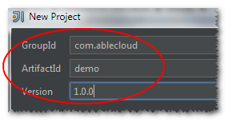
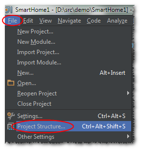
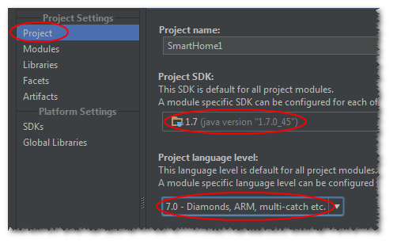
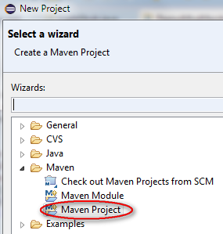
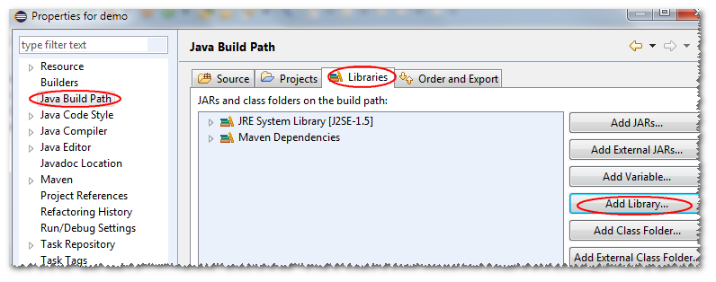
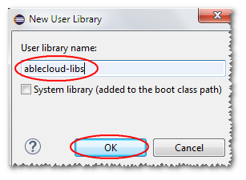

#开发环境配置

本节将详细介绍开发者基于ablecloud提供的服务框架，快速开发自定义后端服务（UDS）和云端定时任务的流程：两者的开发流程是完全一致的。这里介绍ablecloud框架进行开发环境搭建、单元测试、集成测试以及服务发布等内容。

##服务框架发布库
ablecloud一期发布java版本服务开发框架，其发布目录、文件如下所示
```java
/config
	/cloudservice-conf.xml
/lib
	/ablecloud-framework-1.0.0.jar
	/commons-collections-3.2.1.jar
    /commons-configuration-1.10.jar
    /commons-lang-2.6.jar
    /slf4j-api-1.7.7.jar
    /...
start.sh
start.cmd
```
><font color="brown">**注：**所有依赖的第三方jar包，均放在lib文件夹下。其核心jar包为ablecloud的服务框架**ablecloud-framework-1.0.0.jar**。各jar包版本根据ablecloud发行的大版本不同可能不同。</font>

<font color="red">**在开发者开发完自定义服务后，需要将自定义服务编译好的jar包也放到ablecloud发布库的lib文件夹下。**</font>

##本地启动命令
开发者写好服务后，可在本机启动服务进行测试集成或功能测试。

<b>*linux*</b>下在终端运行如下命令启动服务进行测试：
```java
sh start.sh -m test
```
<b>*windows*</b>下在cmd中运行如下命令启动服务进行测试：
```java
start.cmd -m test
```

><font color="brown">**注：**启动时的参数"-m test"用于测试环境，所依赖的配置项如域名/版本等信息从config目录下的cloudservice-conf.xml配置文件中读取，开发者可以修改配置文件中的内容以适应测试环境。正式线上环境，开发者不用关心配置文件以及配置项，域名/版本等所有的信息均由框架自动获取并填充。</font>

##开发工具设置
###系统准备
在进行开发前，需要对系统以及环境进行设置。目前框架只支持java语言，因此系统准备基本都是和java相关，如jdk、maven等。

+ **JDK**

	安装JDK，建议采用1.7版本JDK
    
+ **maven**

	安装maven，建议采用3.2以上版本
    
+ **ablecloud**

	下载ablecloud开发框架并解压

###Intellij
1. **新建工程**
	
    选择新建maven工程，JDK选择正确的版本。
    
    
    
    选择**maven**工程
    
    
    
    注意jdk版本选择安装的1.7+
    点击**next**即可。
    
    
    
    进入下一个页面，根据情况填写groupid/artifactid/version等信息。
    
    
    
    填好后点击**next**，进入下一步，填写工程名以及存放路径。
    
    
    
    然后点击**finish**完成新建工程向导。
    
    
    
    至此，新建工程完成。
   
1. **设置工程**

	按照步骤1完成了工程的新建，还需对工程属性进行一些设置以方便后续的编译、单测。
    点击**File** -> **Project Structure...**
    
    
    
    首先设置工程所使用的JDK版本1.7+和语言级别7.0
    
    
    
    设置开发服务所要依赖的ablecloud框架包，点击**+**号，选择下载并解压后的ablecloud开发框架的**lib目录**即可。
    同上，打开**Project Structure...**,然后选择**Libraries**，点击右边的**+**号，选择**Java**，如下图所示
    
    
    
    在弹出的对话框中选择下载并解压后的ablecloud中的lib目录，并点击**OK**
    
    
    
    回到上一个窗口后再次点击**OK**确认
    
    
    
    这个过程中，我们可以对添加的lib库重命名（可选），例如这里重命名为**ablecloud-libs**。点击**OK**完成添加。
    
    
    
    完成上述步骤后，我们将在工程视图里面看到新添加的该目录，如下
    
    )
    
    至此，开发者开发服务所以来的ablecloud开发框架库添加成功。
    
1. **修改pom.xml文件**

	下面是一个demo的完整pom.xml文件，如下：
    
		<?xml version="1.0" encoding="UTF-8"?>
		<project xmlns="http://maven.apache.org/POM/4.0.0"
         	xmlns:xsi="http://www.w3.org/2001/XMLSchema-instance"
         	xsi:schemaLocation="http://maven.apache.org/POM/4.0.0 http://maven.apache.org/xsd/maven-4.0.0.xsd">
    		<modelVersion>4.0.0</modelVersion>

    		<groupId>com.ablecloud.demo</groupId>
    		<artifactId>SmartHome</artifactId>
    		<version>1.0.0</version>

    		<properties>
        		<ablecloud.lib.dir>/home/chenpeng/IdeaProjects/ablecloud-framework/target/lib</ablecloud.lib.dir>
    		</properties>

    		<build>
	        	<plugins>
	            	<plugin>
	                	<!--this plugin and dependency jars are used for testing-->
	                	<groupId>org.apache.maven.plugins</groupId>
	                	<artifactId>maven-surefire-plugin</artifactId>
	                	<version>2.18.1</version>
                        <dependencies>
                    		<dependency>
                        		<groupId>org.apache.maven.surefire</groupId>
                        		<artifactId>surefire-junit47</artifactId>
                        		<version>2.18.1</version>
                    		</dependency>
                		</dependencies>
	                	<configuration>
	                    	<argLine>-Dmode=test</argLine>
	                    	<additionalClasspathElements>
    	                    	<additionalClasspathElement>${ablecloud.lib.dir}/ablecloud-framework-1.0.2.jar</additionalClasspathElement>
        	                	<additionalClasspathElement>${ablecloud.lib.dir}/slf4j-log4j12-1.7.7.jar</additionalClasspathElement>
            	            	<additionalClasspathElement>${ablecloud.lib.dir}/slf4j-api-1.7.7.jar</additionalClasspathElement>
                	        	<additionalClasspathElement>${ablecloud.lib.dir}/log4j-1.2.17.jar</additionalClasspathElement>
                    	    	<additionalClasspathElement>${ablecloud.lib.dir}/junit-4.11.jar</additionalClasspathElement>
                                <additionalClasspathElement>${ablecloud.lib.dir}/hamcrest-core-1.3.jar</additionalClasspathElement>
                        		<additionalClasspathElement>${ablecloud.lib.dir}/commons-configuration-1.10.jar</additionalClasspathElement>
                        		<additionalClasspathElement>${ablecloud.lib.dir}/commons-collections-3.2.1.jar</additionalClasspathElement>
                        		<additionalClasspathElement>${ablecloud.lib.dir}/commons-lang-2.6.jar</additionalClasspathElement>
	                        	<additionalClasspathElement>${ablecloud.lib.dir}/commons-logging-1.1.1.jar</additionalClasspathElement>
    	                    	<additionalClasspathElement>${ablecloud.lib.dir}/jetty-all-9.2.10.v20150310.jar</additionalClasspathElement>
        	                	<additionalClasspathElement>${ablecloud.lib.dir}/jackson-core-2.3.2.jar</additionalClasspathElement>
            	            	<additionalClasspathElement>${ablecloud.lib.dir}/jackson-annotations-2.3.2.jar</additionalClasspathElement>
                	        	<additionalClasspathElement>${ablecloud.lib.dir}/jackson-databind-2.3.2.jar</additionalClasspathElement>
                    		</additionalClasspathElements>
	                	</configuration>
	            	</plugin>
	            	<plugin>
    	            	<groupId>org.apache.maven.plugins</groupId>
            	    	<artifactId>maven-compiler-plugin</artifactId>
                        <version>3.3</version>
        	        	<configuration>
                	    	<source>1.7</source>
                    		<target>1.7</target>
                    		<encoding>UTF-8</encoding>
                    		<compilerArguments>
	                        	<extdirs>${ablecloud.lib.dir}</extdirs>
    	                	</compilerArguments>
        	        	</configuration>
            		</plugin>
            		<plugin>
                		<groupId>org.apache.maven.plugins</groupId>
                		<artifactId>maven-jar-plugin</artifactId>
                        <version>2.6</version>
                		<executions>
	                    	<execution>
	    	                    <phase>package</phase>
    	    	                <goals>
        	    	                <goal>jar</goal>
            	    	        </goals>
                	    	</execution>
                		</executions>
                		<configuration>
                    		<outputDirectory>${project.build.directory}/lib</outputDirectory>
                		</configuration>
            		</plugin>
        		</plugins>
    		</build>
		</project>

    <font style="background:cyan">完整拷贝该示例pom.xml文件内容，其中绝大部分内容都无须修改，开发者仅需修改如下几个配置项即可：</font>
    
    	<project>
    		<groupId>your service group id</groupId>
       		<artifactId>your service artifact id</artifactId>
       		<version>your service version</version>
       		<properties>
        		<ablecloud.lib.dir>unzipped ablecloud lib dir where you put</ablecloud.lib.dir>
       		</properties>
    	</project>
        
	<font style="background:cyan">注意以下配置项**一定不能修改**，否则单测将无法通过。开发者不用担心该配置项，线上环境该配置项自动失效。</font>
        
1. **修改配置文件**

	配置文件位于ablecloud发行库的config文件夹下，名字为cloudservice-conf.xml。
    
		<?xml version="1.0" encoding="UTF-8"?>
		<configuration>
	    	<developer>
        		<id>4</id>
    		</developer>

    		<authentication>
        		<access-key>33df24a54054067e80af49d939b429c2</access-key>
        		<secret-key>5e2fec3440e23c5e807910b13b672015</secret-key>
        		<timeout>5000</timeout>
	    	</authentication>

    		<framework>
        		<router>192.168.1.126:5000</router>
    		</framework>

    		<service>
        		<name>SmartHome</name>
        		<class>com.ablecloud.demo.DemoService</class>
        		<port>1234</port>
        		<major-domain>ablecloud</major-domain>
        		<sub-domain>demo</sub-domain>
        		<major-version>1</major-version>
        		<minor-version>0</minor-version>
        		<patch-version>0</patch-version>
    		</service>
		</configuration>
	
    ><font color="brown">**注:**开发者id，access-key，secret-key等信息，均能通过登录ablecloud测试环境的web console获取。
    除了**service.class**配置项在测试环境和线上环境均生效外，所有的其它配置项只在测试环境有效。线上服务将忽略配置文件中的配置项。</font>
    
1. **编译单测**

	在IDE的终端（terminal）或系统终端中运行命令`mvn package`即可完整的执行编译、单元测试（如果写了单测代码的话）。
    
1. **本地运行**

	如果编译、单测都没有问题，则将编译出来的服务jar包（在服务工程主目录下的target/lib目录下）拷贝到ablecloud框架的lib目录下，在ablecloud的框架主目录执行ablecloud提供的脚本`sh start.sh -m test`或`start.cmd -m test`，即可在您的开发机上启动您编写好的服务程序。
    
	><font color="brown">**注：**在本机上运行服务测试时必须加**-m test**参数，否则无法启动服务。服务启动所需的参数，如域名、版本、端口等信息均在xml的配置文件中设置。</font>
    
1. **提交到平台**

	将你编译好的服务jar包（位于你服务代码主目录下的target/lib文件夹中，如`~/SmartHome/target/lib/SmartHome-1.0.0.jar`）放入ablecloud框架的lib目录下，然后将ablecloud的config目录、lib目录、start.sh打成zip包，通过ablecloud的web平台提交。

###Eclipse
1. **新建工程**

	选择**File-->New-->Project...**
    
    
    
    选择**maven**工程
    
    
    
    点击**Next**进入下一步
    
    
    
    填写groupId,artifactId,version等信息，并点击**Finish**完成新建工程。
    
    
    
1. **设置工程**
	在工程视窗右键点击步骤1中新建的工程进行工程设置。或者点击菜单栏**Project-->Properties**进行设置
    
    
    
    首先设置工程对ablecloud发行库的依赖。如图选择**Java Build Path**的**Libaries**标签页，点击**Add Library...**
    
    
    
    在**Add Library**页选择**User Library**
    
    
    
    继续点击**User Libraries...**按钮
    
    
    
    然后点击**New...**新建一个用户library文件夹
    
    
    
    这里可以给该用户lib重命名，如图中命名为ablecloud-libs，点击**OK**完成
    
    
    
    回到**User Libraries**页面，点击右方的**Add External JARs...**按钮，选择下载并解压的ablecloud发行库中的**lib**目录，将该目录中所有的jars添加到新建的user library中。
    
    
    
    勾选上新建的user library，并点击**Finish**将ablecloud的jars添加到新建的工程中。
    
    
    
    下面进行java语言的设置，类似上面的设置，先进入**Properties**窗口，选择**Java Compiler**，**去掉**默认的*Use compliance from execution environment...*，并且选择*Compiler compliance level*为**1.7**
    
    
    
1. **修改pom.xml文件**

	同**intellij**章节
    
1. **修改配置文件**

	同**intellij**章节

1. **编译单测**

	TBD

1. **本地运行**

	同**intellij**章节
    
1. **提交到平台**

	同**intellij**章节
   


#基础数据结构
在具体讲解ACMsg和ACDeviceMsg之前，先介绍两个重要的基础数据结构：

**ACContext：** 即上下文。有了交互消息，就可以在多个模块之间进行通信。为了标记每一次交互（比如发起者、发起时间、签名等），也为了追踪通信事件，所有交互消息中均需要带有上下文信息。 

**ACObject：**ACMsg的格式本质上是json，服务开发框架以及APP端的SDK在传输过程均会对其进行序列化/反序列化，也就是开发者能直接从ACMsg中put进/get出具体的某个值。

无论什么格式的数据，终归是需要由某种数据结构来表示，ablecloud采用ACObject来承载ACMsg中json格式的具体数据。

##ACContext
**说明：**ACContext中包含两种用户信息：


- userId：设备的终端（普通）用户id，比如用户在手机上通过app控制某一设备时，context中需要带上该用户的id，后台程序用于认证等之用。当用户通过云服务发起远程控制时，云服务程序透传用户的context。
- developerId：开发者id。当某一服务开发好上线后，一方面接收APP或设备发来的消息，另一方面可能自主的执行例行巡检任务。当在巡检过程中自主的对后台服务发起请求时，context中并不会有userId等终端用户的信息，此时服务创建的context需要填充developerId的值。

```java
public class ACContext {
    private String majorDomain;         // 服务所属主域名
    private String subDomain;           // 服务所属子域名
    private Long userId;                // 用户id
    private Long developerId;           // 开发者id
    private String traceId;             // 唯一事件id，可用于追查问题
    private String traceStartTime;      // 起始时间
    private String timestamp;           // 请求发起的时间戳，单位秒
    private String signature;           // 请求的签名
    private String timeout;             // 为防止签名被截获，设置签名的有效超时时间
    private String nonce;               // 用于签名的随机字符串
    private String accessKey;           // 开发者的accesskey，用于签名之用

    // setter
    // getter
}
```

<font color="red">注：</font>上下文context有一个重要的特性是，在其生成后的所有交互中，都不能更改其已有字段的值，可以添加还没有赋值的字段。比如有终端用户发起的请求中带有userId，请求到达云服务端时，云服务可以往该context中设置developerId的值，但不能修改其它值。否则就失去了追踪每一次交互的意义了。 开发者不应该直接用ACContext的构造函数构造上下文，而是使用AC框架的相关接口创建上下文对象，后面会有详细描述。

##ACObject

ACObject用于承载交互的具体数据，我们称之为payload（负载）。上文提到通过put存入ACObject的数据内部以json方式处理，因此ACObject中的某一value也可以是嵌套的ACObject，能满足大部分需求场景。

```java
public class ACObject {
    private HashMap<String, Object> data = new HashMap<String, Object>();

    /**
     * 设置一个参数
     * @param key   参数名
     * @param <T>   参数值
     * @return
     */
    public <T> ACObject put(String key, T value) {}

    /**
     * 添加一个参数，该参数添加到一个List中
     * @param key   参数所在List的名字
     * @param value 参数值
    public ACObject add(String key, Object value) {}

    /**
     * 获取一个参数值
     * @param key   参数名
     * @return      参数值
     */
    public <T> T get(String key) {}

    /**
     * 检查某一key是否存在
     * @param key   参数名
     * @return      存在返回true，否则返回false
     */
    public boolean contains(String key) {}
}
```

<font color="red">注：</font>最常用的三个接口是put/add/get，通过add接口保存在ACObject中的数据实际为List，相应的，get出来也是一个List。

#交互消息
多个模块、服务之间都通过消息message来通信。ablecloud定义了两种格式的消息：

- ACMsg：APP与service，service与service之间的交互消息。
- ACDeviceMsg：APP与device，service与device之间的交互消息。
- 
##ACMsg
ACMsg继承自ACObject，扩展了一些功能，比如设置了交互的方法名name、交互的上下文context以及其它形式的负载payload信息。通常采用ACMsg进行数据交互，较多的使用默认的OBJECT_PAYLOAD格式，该格式只需要使用ACObject提供的put、add、get接口进行数据操作即可。因为在使用OBJECT_PAYLOAD格式时，框架会对数据进行序列化/反序列化。ACMsg也提供另外的数据交互格式，如json、stream等。如果用json格式，则通过setPayload/getPayload设置/获取序列化后的json数据并设置对应的payloadFormat，开发者后续可自行对payload进解析。
```java
public class ACMsg extends ACObject {
    public static final String OBJECT_PAYLOAD = "application/x-zc-object";
    public static final String JSON_PAYLOAD = "text/json";
    public static final String STREAM_PAYLOAD = "application/octet-stream";

    private String name;
    private ACContext context;
    private String payloadFormat;
    private byte[] payload;
    private int payloadSize;
    private InputStream streamPayload;

    public ACMsg() {}

    /**
     * 设置请求方法名，服务端将根据该方法名进行处理
     * @param name  方法名
     */
    public void setName(String name) {}

    /**
     * 获取方法名
     * @return
     */
    public String getName() {}

    /**
     * 获取交互上下文
     * @return
     */
    public ACContext getContext() {}

    /**
     * 设置交互上下文
     * @param context
     */
    public void setContext(ACContext context) {}

    /**
     * 获取负载格式
     * @return
     */
    public String getPayloadFormat() {}

    /**
     * 获取二进制负载
     * @return
     */
    public byte[] getPayload() {}

    /**
     * 获取负载大小
     * @return
     */
    public int getPayloadSize() {}

    /**
     * 设置二进制负载
     * 通过put/add方式设置的负载要么框架将其序列化为json，
     * 要么解析后作为url的参数传输。
     * 通过该函数可以设置额外的负载数据，比如传统的序列化后的json值。
     * @param payload
     * @param format
     */
    public void setPayload(byte[] payload, String format) {}

    /**
     * 设置流式负载，主要用于较大的数据传输，如上传文件等。
     * @param payload   负载内容
     * @param size      负载大小
     */
    public void setStreamPayload(InputStream payload, int size) {}

    /**
     * 获取流式负载
     * @return
     */
    public InputStream getStreamPayload() {}

    /**
     * 关闭流式负载。
     * 通过getStreamPayload拿到流式负载后，需要显示的关闭。
     * @throws IOException
     */
    public void closeStreamPayload() throws IOException {}

    /**
     * 设置错误信息。在服务端处理错误时，需要显示的调用该结果设置错误信息
     * @param errCode   错误码
     * @param errMsg    错误信息
     */
    public void setErr(Integer errCode, String errMsg) {}

    /**
     * 判断服务端响应的处理结果是否有错
     * @return  true-处理有错，false-处理成功
     */
    public boolean isErr() {}

    /**
     * 获取错误码
     * @return
     */
    public Integer getErrCode() {}

    /**
     * 获取错误信息
     * @return
     */
    public String getErrMsg() {}

    /**
     * 服务端处理成功后，调用该方法
     */
    public void setAck() {}
}
```

<font color="red">注：</font>开发者在本地测试或联调时，需要在配置文件中设置context的相关信息（见配置示例），线上环境context的内容由服务框架获取，开发者可不用关注。 客户端往后端服务发送消息，服务向另一服务发送消息的时候，均需要对所发请求进行签名，具体的签名算法见附录。

###使用示例
client端发起请求（伪代码，完整代码请参看各部分demo）：
```java
ACContext context = ac.newContext(account.getUid());    // 通过框架构造一个用户context
ACMsg req = new ACMsg();                                // 创建一个空请求消息
req.setContext(context);                                // 设置请求上下文
req.setName("controlLight");                            // 设置请求消息名
req.put("deviceId", light.getId());                     // 设置一个请求属性“设备id”
req.put("action", "on");                                // 设置另一属性"动作“，开灯
ACMsg resp = client.send(req);                          // 发送请求并返回服务端响应
服务端处理请求（伪代码，完整代码请参看各部分demo）：
private void handleControlLight(ACMsg req, ACMsg resp) throws Exception {
    Long lightId = req.get("deviceId");     // 从请求中获取“设备id”
    String action = req.get("action");      // 从请求中获取“动作”
    // do something
}
```

##ACDeviceMsg
说明：该消息用于处理服务和设备之间的交互，框架会将ACDeviceMsg中的code部分解析出来，开发者可根据code来区分设备消息类型。但是ACDeviceMsg的content部分由开发者解释，框架透传，因此开发者需要自己编写设备消息序列化/反序列化器。ACDeviceMsg定义如下：

```java
public class ACDeviceMsg {
    private int code;           // 消息码，用于区分消息类型
    private Object content;     // 设备消息的具体内容

    public ACDeviceMsg() {}
    public ACDeviceMsg(int code, Object content) {}
    public int getCode() {}
    public void setCode(int code) {}
    public Object getContent() {}
    public void setContent(Object content) {}
}
```

<font color="red">注：</font>设备消息的具体内容为Object类型，开发者根据实际情况实现序列化器用来解释content的内容，在作具体的序列化/反序列化时，可根据code的不同值做出不同的序列化行为。

```java
ACDeviceMsgMarshaller
说明：设备消息的序列化/反序列化器，用于解释ACDeviceMsg的内容，其定义如下：
public interface ACDeviceMsgMarshaller {
    /**
     * 将具体的ACDeviceMsg序列化成字节数组，用于控制设备时通过网络传输给设备
     *
     * @param msg       设备消息
     * @return          序列化后的字节数组
     * @throws Exception
     */
    public byte[] marshal(ACDeviceMsg msg) throws Exception;

    /**
     * 将通过网络收到的字节数组数据，反序列化成具体的消息，以便从消息中提取各个字段。
     *
     * @param msgCode   消息码，ablcloud也称为操作码opCode
     * @param payload   设备消息序列化后的字节数组
     * @return          设备消息
     * @throws Exception
     */
    public ACDeviceMsg unmarshal(int msgCode, byte[] payload) throws Exception;
}
```


#服务开发框架
##ACService
说明： AbleCoud定义了抽象基类ACService，开发者只需要继承该类，并实现各个handler即可。总共有三个公共接口，其中init提供了默认实现。如果开发者实现的某一服务不需要和设备直接交互，则直接重载handleDeviceMsg为空实现即可。通常情况下，init也无需重载。因此，开发者可以将精力集中在handleMsg接口的实现中，该接口处理客户端请求，并作出响应。定义如下:
```java
public abstract class ACService {
    // ac是非常重要的ablecloud云框架服务，ablecloud提供了默认实现ACCloud，
    // 开发者可以调用ac的相关接口直接调用ablecloud提供的云服务，后文会有详述
    protected AC ac;

    // 以下信息可用于服务内部追踪问题等用，比如打印到日志中
    protected long developerId;         // 开发者id
    protected String majorDomain;       // 服务的主域名
    protected String subDomain;         // 服务的子域名
    protected int majorVersion;         // 服务的主版本号
    protected int minorVersion;         // 服务的副版本号
    protected int patchVersion;         // 服务的修订版本号

    /**
     * 开发者可根据自身需要，重载该方法，在该方法里做一些初始化工作，框架在启动服务时会调用该函数。
     * 比如，该服务要处理和设备之间的交互消息，需要自定义设备消息的序列化/反序列化器
     * ACDeviceMsgMarshaller，在init函数内将marshaller设置到ac中。
     *
     * @throws Exception
     */
    public void init() throws Exception {}

    /**
     * 处理APP-->Service，Service-->Service之间的交互消息
     * @param req   请求消息体
     * @param resp  响应消息体
     * @throws Exception
     */
    public abstract void handleMsg(ACMsg req, ACMsg resp) throws Exception;

    /**
     * 处理Device-->Service之间的交互消息
     * 如果服务不处理和设备之间的交互消息，则无须重载该方法。
     *
     * 当前，处理设备汇报的消息不做响应。
     *
     * @param context       设备的上下文，其中uid字段为系统填充
     * @param deviceId      设备的逻辑id
     * @param req           请求消息体
     * @throws Exception
     */
    public abstract void handleDeviceMsg(ACContext context, long deviceId, ACDeviceMsg req) throws Exception;
   
    /**
     * 处理JINDDONG-->Service之间的交互消息，收到Stream点数组，进行设备控制
     *
     * @param context          设备的上下文，其中uid字段为系统填充
     * @param physicalDeviceId 设备的物理id
     * @param req              请求消息体(Stream数组)
     * @param resp             响应消息体
     * @throws Exception
     */
    public void handleJDSetStatusMsg(ACContext context, String physicalDeviceId, List<ACJDMsg> req, ACMsg resp) throws Exception {}

    /**
     * 处理JINDDONG-->Service之间的交互消息,获取设备上所有Stream点
     *
     * @param context          设备的上下文，其中uid字段为系统填充
     * @param physicalDeviceId 设备的物理id
     * @param resp             响应消息体(Stream数组)
     * @throws Exception
     */
    public void handleJDGetStatusMsg(ACContext context, String physicalDeviceId, List<ACJDMsg> resp) throws Exception {}
    
    /**
     * 内部调用接口，开发者不用关注且不能修改。
     * 设置服务相关的信息，并将全局AC框架传给服务
     * 服务内部可以使用AC框架提供的各种功能，如
     * 帐号管理、设备管理、存储服务等。
     * @param ac
     * @param config
     */
    public final void setEnv(AC ac, ACConfiguration config) {}

    /**
     * 内部调用接口，开发者不用关注且不能修改。
     * @return
     */
    public final AC getAc() {}
}
```

<font color="red">注：</font>通常情况下，开发者只需要重点实现handleMsg即可。

##AC
说明：在介绍ACService的时候提到过重要的成员变量ac，ac实际上是ablecloud对抽象服务框架AC的具体实现，其实现过程对开发者透明。通过AC，开发者可以根据需要获取一系列内嵌服务的功能接口。AC的定义如下：

```java
public abstract class AC {
    protected ACConfiguration config;
    protected ACDeviceMsgMarshaller deviceMsgMarshaller;

    /**
     * 初始化框架
     * @param config    配置信息
     */
    public void init(ACConfiguration config) {}

    /**
     * 构建一个开发者上下文
     * @return
     */
    public ACContext newContext() {}

    /**
     * 构建一个用户上下文
     * @param userId
     * @return
     */
    public ACContext newContext(long userId) {}

    /**
     * 则用于创建数据分类/清空数据等操作。
     * 用于测试之用。
     *
     * @return
     */
    public abstract ACStoreForTest storeForTest(ACContext context);

    /**
     * 用于对数据分类进行具体的操作，如create/find/delete/update/scan等
     *
     * @param className     要操作的分类名
     * @param context       要进行操作的开发者context
     * @return
     */
    public abstract ACStore store(String className, ACContext context);

    /**
     * 直接往设备发送命令/消息
     * @param subDomain     子域名，比如thermostat
     * @param deviceId      设备逻辑id
     * @param reqMsg        具体的消息内容
     * @param context       如果通过app端发送消息到服务，服务在中继给设备，
     *                      则服务在发送给设备的时候需要带上app端的用户context。
     *                      如果是服务自主发送控制命令给设备，则需要传入开发者的context。
     * @return  设备返回的消息
     * @throws Exception
     */
    public abstract ACDeviceMsg sendToDevice(String subDomain, long deviceId,
                                             ACDeviceMsg reqMsg, ACContext context) throws Exception;

    /**
     * 往某一服务发送命令/消息
     * @param name          服务名
     * @param version       服务版本
     * @param req           具体的消息内容
     * @return  服务端相应的消息
     * @throws Exception
     */
    public abstract ACMsg sendToService(String name, int version, ACMsg req) throws Exception;

    /**
     * 往JD service发送命令/消息,上报设备上的所有Stream点到JINGDONG Service
     *
     * @param context          设备的上下文，其中uid字段为系统填充
     * @param physicalDeviceId 设备的物理id
     * @param req              请求消息体(Stream数组)
     * @return 服务端相应的消息
     * @throws Exception
     */
    public abstract ACMsg sendToJDService(ACContext context, String physicalDeviceId, List<ACJDMsg> req) throws Exception;

    /**
     * 使用ACHttpClient访问外网服务
     *
     * @param url 访问外网的url
     * @return ACHttpClient
     * @throws IOException
     */
    public abstract ACHttpClient getHttpClient(String url) throws IOException;

    /**
     * 获取设备管理器。开发者在实现自定义服务时，
     * 可以调用ACDeviceMgr提供的各个通用接口
     *
     * @param context   用户的context
     * @return
     */
    public abstract ACDeviceMgr deviceMgr(ACContext context);

    /**
     * 获取用于单元测试的设备管理器，可以创建分组/绑定设备等
     *
     * @param context   用户的context
     * @return
     */
    public abstract ACDeviceMgrForTest deviceMgrForTest(ACContext context);

    /**
     * 获取帐号管理器。开发者组实现自定义服务时，
     * 可以调用ACAccountMgr提供的各个通用接口
     *
     * @param context   开发者的context
     * @return
     */
    public abstract ACAccountMgr accountMgr(ACContext context);

    /**
     * 获取用于单元测试的帐号管理器，可以注册用户等
     *
     * @param context   开发者的context
     * @return
     */
    public abstract ACAccountMgrForTest accountMgrForTest(ACContext context);

    /**
     * 获取通知管理器，可以给用户发送通知消息
     *
     * @param context   开发者的context
     * @return
     */
    public abstract ACNotificationMgr notificationMgr(ACContext context);

    /**
     * 为便于测试，开发者可实现一个服务的桩
     * 在框架中添加一个服务桩
     *
     * @param name  服务名
     * @param stub  服务桩的实现，实际上也是一个ACService
     */
    public abstract void addServiceStub(String name, ACService stub);

    /**
     * 为便于测试，开发者可实现一个设备的桩
     *
     * @param subDomain     设备所属子域
     * @param stub          设备桩
     */
    public abstract void addDeviceStub(String subDomain, ACDeviceStub stub);

    /**
     * 如果服务要处理和设备之间的交互消息，需要实现设备消息序列化/反序列化器
     * 该接口将序列化/反序列化器设置给ac框架
     *
     * @param marshaller    设备消息序列化/反序列化器
     */
    public void setDeviceMsgMarshaller(ACDeviceMsgMarshaller marshaller) {}

    /**
     * 获取设备消息序列化/反序列化器
     * @return
     */
    public ACDeviceMsgMarshaller getDeviceMsgMarshaller() {}

    /**
     * 获取用于单元测试的服务框架ac
     * @param config    单元测试环境构造的config
     * @return
     * @throws Exception
     */
    public static final AC getTestAc(ACConfiguration config) throws Exception {}
}
```
###访问外网使用示例
```java
try {
    ACHttpClient client = ac.getHttpClient("http://apis.baidu.com/apistore/aqiservice/aqi?city=%E5%8C%97%E4%BA%AC");
    //默认为GET方法
    client.setRequestMethod("GET");
    //默认超时时间为5000
    client.setConnectTime(5000);
    client.setHeader("apikey", "caf46348383a17f6070e0bda0e361a28");
    client.connect();
    //AbleCloud签名认证失败
    if (client.getResponseCode() == 401) {
        assertEquals(client.getResponseMessage(), "Unauthorized");
    } else if (client.getResponseCode() == HttpURLConnection.HTTP_OK) {
        assertEquals(client.getResponseMessage(), "OK");
        //通过getData()或getInputStream()获取response,不能同时一起调用
    }
} catch (IOException e) {
    fail(e.toString());
}
```

#内嵌云端服务
顾名思义，内嵌云端服务，是指ablecloud抽象并实现的多种通用后端服务，避免开发者重复开发这些基础设施。开发者可直接使用这些服务，降低应用服务程序的开发代价，提高开发效率。各个云端服务的对象通过上节介绍的服务框架AC的相关接口获取。
##账号管理服务
该服务用于管理和某一智能设备相关的用户，比如查看用户的基本信息/状态等。发现异常用户时，服务程序能及时做出相应操作。
###获取方式
```java
ACAccountMgr accountMgr = ac.accountMgr(ACContext context);
```
###接口说明
当前提供接口较少，后续会进一步丰富。
```java
public interface ACAccountMgr {
    /**
     * 根据用户的id，查找用户信息
     * @param accountId
     * @throws Exception
     */
    public ACAccount getAccountInfo(long accountId) throws Exception;
}
```
##存储服务
该服务为开发者提供了一个通用的key-value存储系统服务。开发者可用此服务存储自定义数据。
###获取方式
```java
ACStore store = ac.store(String className, ACContext contexte);
```
###存储模型
ablecloud目前提供基于sql的存储服务，开发者需要预先设定数据集的结构，同时可以选择对数据进行分区或不分区。因此如何定位数据所在分区，需要提供分区key，ablecloud称其为entity group key。当我们要查找一条存储在ablecloud中的数据时，需要提供其key值，通过key值定位到具体的数据，这种用于定位具体数据的key，ablecloud称其为primary key。
><font color="brown">**注：**entity group key必须是primary key的前缀，可以相同。</font>

存储模型示例如下：


从上图我们可以看到，定义的一个存储模型如下：

+ **entiry group keys：**deviceId，类型为字符串`String`。
+ **primary keys：**deviceId，类型为字符串；timestamp，类型为整型`Long`。
+ **attributes**：mode，类型为字符串；speed，类型为整型`Long`。

><font color="brown">**注：**目前所有的整型，都统一支持Long，浮点型统一为Double，字符串型可以设定字符串长度</font>

###接口说明
数据查询过滤器ACFilter：
独立于数据集之外，同一个过滤器可用于在不同的数据集中进行数据查询过滤。

获取方式：
ACFilter filter = ac.filter();
```java
public class ACFilter {
    // 各种关系连接符
    public static long INVALID          = 0;
    public static long EQUAL            = 1;  // 等于
    public static long NOT_EQUAL        = 2;  // 不等于
    public static long GREATER          = 3;  // 大于
    public static long GREATER_OR_EQUAL = 4;  // 大于等于
    public static long LESS             = 5;  // 小于
    public static long LESS_OR_EQUAL    = 6;  // 小于等于

    // 向查询过滤器中添加等于表达式
    public ACFilter whereEqualTo(String key, Object value);
    // 向查询过滤器中添加不等于表达式
    public ACFilter whereNotEqualTo(String key, Object value);
    // 向查询过滤器中添加大于表达式
    public ACFilter whereGreaterThan(String key, Object value);
    // 向查询过滤器中添加大于等于表达式
    public ACFilter whereGreaterThanOrEqualTo(String key, Object value);
    // 向查询过滤器中添加小于表达式
    public ACFilter whereLessThan(String key, Object value);
    // 向查询过滤器中添加小于等于表达式
    public ACFilter whereLessThanOrEqualTo(String key, Object value);
}
```

全表扫描FullScan的数据游标ACIterator：
注意ACIterator仅用于进行了分区的数据集，对于未分区的数据集，请直接使用Scan接口。
```java
public class ACIterator {
    // 从游标中取出下一份数据结果集，每一份结果集对应一个分区键
    public List<ACObject> next() throws Exception;

    // 获取游标当前所在的分区键
    public ACObject currentEntityGroup();
}
```

~~~
public abstract class ACStore {

    // 各数据类型
    public static long INVALID_TYPE    = 0;
    public static long INT_TYPE    = 1;     // 整型数据，目前统一为Long
    public static long FLOAT_TYPE  = 2;     // 浮点型数据，目前统一为double
    public static long BOOL_TYPE   = 3;     // 布尔型数据
    public static long STRING_TYPE = 4;     // 字符串类型数据
    public static long OBJECT_TYPE = 5;     // 对象数据
    public static long ARRAY_TYPE  = 6;     // 数组/列表型数据

    // 查询过滤器的连接符
    public static long INVALID_CONNECTOR = 0;
    public static long AND               = 1;  // 表示过滤器之间“且”的关系
    public static long OR                = 2;  // 表示过滤器之间“或”的关系

    // 数据排序的参数
    public static long INVALID_ORDER = 0;
    public static long ASC           = 1;  // 正序排序
    public static long DESC          = 2;  // 倒序排序

    // 创建一条数据
    public interface Create {
        // 将key, value写入client端内存，可以连续调用put
        public Create put(String key, Object value) throws Exception;
        // 该接口最终将client端的key-value(s)写入ablecloud的存储服务
        public void execute() throws Exception;
    }

    // 查找数据
    public interface Find {
        // 设置查找的keys，可以不调用。如果不掉用select，则
        // 返回primary key所对应的所有attributes
        public Find select(String... keys);
        // 该接口最终从ablecloud的存储服务进行查找并返回数据
        public ACObject execute() throws Exception;
    }

    // 删除数据
    public interface Delete {
        // 该接口最终从ablecloud的存储服务中删除数据
        public void execute() throws Exception;
    }

    // 批量删除数据
    public interface BatchDelete {
        // 设置第一个用于删除的条件过滤器，不允许重复调用
        public BatchDelete where(ACFilter filter);
        // 追加设置一个条件过滤器，与之前过滤器的关系是“且”，必须在where之后调用
        // 注意在追加过滤器时，and的优先级高于or
        public BatchDelete and(ACFilter filter);
        // 追加设置一个条件过滤器，与之前过滤器的关系是“或”，必须在where之后调用
        public BatchDelete or(ACFilter filter);
        // 该接口最终从ablecloud的存储服务中删除数据
        public void execute() throws Exception;
    }

    // 更新数据
    public interface Update {
        // 将已存在的key设置新的value值，可以连续调用put
        public Update put(String key, Object value);
        // 该接口最终将client端的key-value(s)写入ablecloud的存储服务
        public void execute() throws Exception;
    }

    // 替换数据，和update的区别是，update只能更改已经存在的attributes，而
    // replace可以设置全新的attributes
    public interface Replace {
        // 同Create的put
        public Replace put(String key, Object value);
        // 同Create的execute
        public void execute() throws Exception;
    }

    // 扫描数据
    public interface Scan {
        // 设置需要返回的keys，类似find的select
        public Scan select(String... keys);
        // 设置扫描的起始点，需传入除entity group key之外的primary keys
        // 不调用该接口默认从头开始扫描
        public Scan start(Object... primaryKeys) throws Exception;
        // 设置扫描的结束点，需传入除entity group key之外的primary keys
        // （end需要和start一起使用，不能单独出现）
        public Scan end(Object... primaryKeys) throws Exception;
        // 设置扫描数据最大值
        public Scan limit(int number);
        // 设置第一个查询过滤器，不允许重复调用
        public Scan where(ACFilter filter);
        // 追加设置一个查询过滤器，与之前过滤器的关系是“且”，必须在where之后调用
        // 注意在追加过滤器时，and的优先级高于or
        public Scan and(ACFilter filter);
        // 追加设置一个查询过滤器，与之前过滤器的关系是“或”，必须在where之后调用
        public Scan or(ACFilter filter);
        // 按照参数列表中的顺序，对各字段进行正向排序，可重复调用
        public Scan orderByAsc(String... keys);
        // 按照参数列表中的顺序，对各字段进行逆向排序，可重复调用
        public Scan orderByDesc(String... keys);
        // 按照参数列表中的顺序，对各字段进行分组，可重复调用
        public Scan groupBy(String... keys);
        // 统计结果集或者其中各个分组的记录数量
        public Scan count();
        // 按照参数列表中的顺序，对各字段在结果集或者各分组中的值分别统计求和，结果值将以Double型呈现
        public Scan sum(String... keys);
        // 按照参数列表中的顺序，对各字段在结果集或者各分组中的值分别统计求平均值，结果值将以Double型呈现
        public Scan avg(String... keys);
        // 按照参数列表中的顺序，对各字段在结果集或者各分组中的值分别统计求最大值
        public Scan max(String... keys);
        // 按照参数列表中的顺序，对各字段在结果集或者各分组中的值分别统计求最小值
        public Scan min(String... keys);
        // 该接口最终从ablecloud的存储服务中扫描数据，返回数据列表。
        public List<ACObject> execute() throws Exception;
    }

    // 基于entity group key（分区键）的全表扫描，每次处理一个数据分区的数据并返回结果集
    public interface FullScan {
        // 设置需要返回的keys，类似find的select
        public FullScan select(String... keys);
        // 设置扫描的起始点，需传入除entity group key之外的primary keys
        // 不调用该接口默认从头开始扫描（start和end至少需要调用一个）
        public FullScan start(Object... primaryKeys) throws Exception;
        // 设置扫描的结束点，需传入除entity group key之外的primary keys
        // 不掉用该接口默认扫描到末尾（start和end至少需要调用一个）
        public FullScan end(Object... primaryKeys) throws Exception;
        // 设置扫描数据最大值
        public FullScan limit(int number);
        // 设置第一个查询过滤器，不允许重复调用
        public FullScan where(ACFilter filter);
        // 追加设置一个查询过滤器，与之前过滤器的关系是“且”，必须在where之后调用
        // 注意在追加过滤器时，and的优先级高于or
        public FullScan and(ACFilter filter);
        // 追加设置一个查询过滤器，与之前过滤器的关系是“或”，必须在where之后调用
        public FullScan or(ACFilter filter);
        // 按照参数列表中的顺序，对各字段进行正向排序，可重复调用
        public FullScan orderByAsc(String... keys);
        // 按照参数列表中的顺序，对各字段进行逆向排序，可重复调用
        public FullScan orderByDesc(String... keys);
        // 按照参数列表中的顺序，对各字段进行分组，可重复调用
        public FullScan groupBy(String... keys);
        // 统计结果集或者其中各个分组的记录数量
        public FullScan count();
        // 对各字段在结果集或者各分组中的值分别统计求和，结果值将以Double型呈现，参数顺序不敏感
        public FullScan sum(String... keys);
        // 对各字段在结果集或者各分组中的值分别统计求平均值，结果值将以Double型呈现，参数顺序不敏感
        public FullScan avg(String... keys);
        // 对各字段在结果集或者各分组中的值分别统计求最大值，参数顺序不敏感
        public FullScan max(String... keys);
        // 对各字段在结果集或者各分组中的值分别统计求最小值，参数顺序不敏感
        public FullScan min(String... keys);
        // 该接口最终从ablecloud的存储服务中扫描数据，返回各分区的数据游标供调用者使用
        public ACIterator execute() throws Exception;
    }

    // 简单全表扫描，基于用户每次设定的limit
    public interface SimpleFullScan {
        // 设置需要返回的keys，类似find的select
        public SimpleFullScan select(String... keys);
        // 设置第一个查询过滤器，不允许重复调用
        public SimpleFullScan where(ACFilter filter);
        // 追加设置一个查询过滤器，与之前过滤器的关系是“且”，必须在where之后调用
        // 注意在追加过滤器时，and的优先级高于or
        public SimpleFullScan and(ACFilter filter);
        // 追加设置一个查询过滤器，与之前过滤器的关系是“或”，必须在where之后调用
        public SimpleFullScan or(ACFilter filter);
        // 该接口最终从ablecloud的存储服务中扫描数据，返回数据游标供调用者使用，调用者需要每次给定一个数据条数limit
        public ACRowIterator execute() throws Exception;
    }

    /**
     * 创建数据写入对象
     * @param primaryKeys   完整的primary keys包括entity group keys
     *
     * @notice  不定参数primaryKeys可以有两种形态，如果是key-value对的方式
     *          k-v必须是成对出现。也可以传入一个ACObject对象，此时只能传入
     *          一个参数，并且ACObject对象中需要将所有的primary key的value
     *          值put进去。
     * @return
     */
    public abstract Create create(Object... primaryKeys);

    /**
     * 创建数据查找对象
     * @param primaryKeys   同create的参数primaryKeys
     * @return
     */
    public abstract Find find(Object... primaryKeys);

    /**
     * 创建数据删除对象
     * @param primaryKeys   同create的参数primaryKeys
     * @return
     */
    public abstract Delete delete(Object... primaryKeys);

    /**
     * 创建数据批量删除对象
     * @param entityKeys    完整的entity group keys
     * @notice  不定参数entityKeys可以有两种形态，如果是key-value对的方式
     *          k-v必须是成对出现。也可以传入一个ACObject对象，此时只能传入
     *          一个参数，并且ACObject对象中需要将所有的entity group key的
     *          value值put进去。
     * @return
     */
    public abstract BatchDelete batchDelete(Object... entityKeys);

    /**
     * 创建数据更新对象
     * @param primaryKeys   同create的参数primaryKeys
     * @return
     */
    public abstract Update update(Object... primaryKeys);

    /**
     * 创建数据替换对象
     * @param primaryKeys   同create的参数primaryKeys
     * @return
     */
    public abstract Replace replace(Object... primaryKeys);

    /**
     * 创建数据扫描对象
     * @param entityKeys    对于已分区的数据集，需要传入完整的entity group keys；
     *                      对于未分区的数据集，不需要传入任何参数；
     * @notice  不定参数entityKeys可以有两种形态，如果是key-value对的方式
     *          k-v必须是成对出现。也可以传入一个ACObject对象，此时只能传入
     *          一个参数，并且ACObject对象中需要将所有的entity group key的
     *          value值put进去。
     * @return
     */
    public abstract Scan scan(Object... entityKeys);

    /**
     * 创建全表数据扫描对象，基于数据分区
     * @return
     */
    public abstract FullScan fullScan();

    /**
     * 创建简单全表数据扫描对象
     * @return
     */
    public abstract SimpleFullScan simpleFullScan();
}
~~~
###使用示例
以数据集"test_data"为例，假定其分区键为"deviceId"（字符串型）；主键为"deviceId"（字符串型）和"timestamp"（整型）；其他字段包括"status"（字符串型）、"mode"（字符串型）、"speed"（整型）和"pm25"（浮点型）等。

**Create**

方式一：显示的传入primary keys的k-v对
~~~
ac.store("test_data", context).create("deviceId", "12345", "timestamp", 1L)	// 这里是k-v对
                    .put("status", "run")
                    .put("mode", "auto")
                    .put("speed", 45L)
                    .put("pm25", 35.5)
                    .execute();
~~~
方式二：传入primary keys的对象
~~~
ACObject pk = new ACObject();
pk.put("deviceId", "12345");
pk.put("timestamp", 1L);
ac.store("test_data", context).create(pk)	// 这里是primary keys的对象
                    .put("status", "run")
                    .put("mode", "auto")
                    .put("speed", 45L)
                    .put("pm25", 35.5)
                    .execute();
~~~
**Find**
~~~
ACObject ao = ac.store("test_data", context)
                    .find("deviceId", "12345", "timestamp", 1L)
                    .execute();
String status = ao.get("status");
String mode = ao.get("mode");
Long speed = ao.get("speed");
~~~
**Scan**

由于是分区数据集，在Scan时需要传入分区键值对，这里是"deviceId"及其值。注意如果是非分区的数据集，则调用scan接口时不需要传入参数，如ac.store("test_data", context).scan()...

示例一：设定start和limit，由start开始正向扫描，返回limit数量的结果集，其中各数据记录按主键自然正序排列
~~~
ac.store("test_data", context).scan("deviceId", "12345")
                    .start("timestamp", 1L)
                    .limit(10)
                    .execute();
~~~
示例二：设定start和end，由start开始正向扫描到end，返回start和end之间的结果集，其中各数据记录按主键自然正序排列
~~~
ac.store("test_data", context).scan("deviceId", "12345")
                    .start("timestamp", 1L)
                    .end("timestamp", 10L)
                    .execute();
~~~
示例三：设定end和limit，由end开始逆向扫描，返回limit数量的数据集，注意其中各数据记录按主键倒序排列。
><font color="brown">**注：**我们经常遇到的获取设备最新的n条数据的需求就可以用这个接口组合来实现。</font>
~~~
ac.store("test_data", context).scan("deviceId", "12345")
                    .end("timestamp", 10L)
                    .limit(10)
                    .execute();
~~~
示例四：指定查询过滤器进行查询
~~~
// 查询条件1：状态是正在运行并且转速大于等于300
ACFilter f1 = ac.filter().whereEqualTo("status", "running")
                    .whereGreaterThanOrEqualTo("speed", 300L);

// 查询条件2：状态是已停止并且PM2.5监控值小于50.0
ACFilter f2 = ac.filter().whereEqualTo("status", "stopped")
                    .whereLessThan("pm25", 50.0);

// 查询设备ID为"12345"的设备在一段时间内所有满足条件1或条件2的数据记录
ac.store("test_data", context).scan("deviceId", "12345")
                    .start("timestamp", 1L)
                    .end("timestamp", 10L)
                    .where(f1)
                    .or(f2)
                    .execute();
~~~
示例五：指定查询过滤器进行查询并排序，注意排序的各字段之间有优先级关系，在参数列表中越靠前优先级越高
~~~
// 查询条件：状态是正在运行
ACFilter f = ac.filter().whereEqualTo("status", "running");

// 查询设备ID为"12345"的设备在一段时间内所有满足条件的数据记录并按照转速（正序）、PM2.5监控值（倒序）以及时间戳（倒序）排序
// 本示例的意图为：查询设备ID为"12345"的设备在"1L"到"10L"这段时间内所有正在运转时上报的数据，同时进行排序，转速越低越靠前，转速相同的PM2.5越高越靠前，PM2.5也相同的时间越近越靠前
ac.store("test_data", context).scan("deviceId", "12345")
                    .start("timestamp", 1L)
                    .end("timestamp", 10L)
                    .where(f)
                    .orderByAsc("speed")
                    .orderByDesc("pm25", "timestamp")
                    .execute();
~~~
示例六：分组并进行简单的数值统计
~~~
/*
 将设备ID为"12345"的设备在一段时间内的数据记录按照运行状态和控制模式分组，假设有四种情况：
 -------------------------
 | status    |    mode   |
 -------------------------
 | running   |    auto   |
 -------------------------
 | running   |    manual |
 -------------------------
 | stopped   |    auto   |
 -------------------------
 | stopped   |    manual |
 -------------------------
 本示例的意图为：统计设备ID为"12345"的设备在"1L"到"10L"这段时间内所有上报的数据，按照"status"和"mode"分组，统计每个分组的记录总数、合计转速、平均转速和平均PM2.5以及最大转速和最大PM2.5.
*/
ac.store("test_data", context).scan("deviceId", "12345")
                    .start("timestamp", 1L)
                    .end("timestamp", 10L)
                    .groupBy("status", "mode")
                    .count()
                    .sum("speed")
                    .avg("speed", "pm25")
                    .max("speed", "pm25")
                    .execute();
~~~
示例七：复杂示例，各接口之间限制比较少，可以灵活组合来满足需求
~~~
// 将设备ID为"12345"的设备在一段时间内满足查询条件的数据记录进行分组、排序和聚合
ACFilter f1 = ac.filter().whereGreaterThan("speed", 0L)
                    .whereLessThan("speed", 50L);

ACFilter f2 = ac.filter().whereGreaterThanOrEqualTo("speed", 300L);

ACFilter f3 = ac.filter().whereLessThan("pm25", 30.0);

ac.store("test_data", context).scan("deviceId", "12345")
                    .start("timestamp", 1L)
                    .end("timestamp", 100L)
                    .where(f1)
                    .or(f2)
                    .or(f3)
                    .groupBy("status", "mode")
                    .orderByAsc("status", "mode")
                    .count()
                    .max("speed")
                    .min("speed", "pm25")
                    .execute();
~~~
**FullScan**

分区数据集还可以调用FullScan接口得到全表扫描的Iterator，每次调用Iterator的next()方法得到下一个有数据记录存在的分区中的数据，注意各分区间不保证有序！
同时注意全表扫描过程中Iterator会自动跳过没有数据的分区，整个扫描结束的条件是next()方法返回为空
~~~
// 延续Scan示例七中的查询条件进行全表所有分区的扫描
ACFilter f1 = ac.filter().whereGreaterThan("speed", 0L)
                    .whereLessThan("speed", 50L);

ACFilter f2 = ac.filter().whereGreaterThanOrEqualTo("speed", 300L);

ACFilter f3 = ac.filter().whereLessThan("pm25", 30.0);

ACIterator it = ac.store("test_data", context).fullScan()
                    .start("timestamp", 1L)
                    .end("timestamp", 100L)
                    .where(f1)
                    .or(f2)
                    .or(f3)
                    .groupBy("status", "mode")
                    .orderByAsc("status", "mode")
                    .count()
                    .max("speed")
                    .min("speed", "pm25")
                    .execute();

List<ACObject> zos;
while((zos = it.next()) != null) {
	// 处理当前分区中的数据
        ...
}
~~~
**BatchDelete**

分区或者非分区的数据集都可以使用BatchDelete接口来支持批量删除。对于分区数据集，类似scan接口，每次的批量删除操作也是在某个分区键的范围内进行的，同时可以定义一个或几个ACFilter作为删除的条件；对于非分区数据集，同样类似于scan接口，batchDelete接口也是无参的，同时必须定义一个或几个ACFilter进行条件删除。
~~~
ACFilter f1 = ac.filter().whereGreaterThan("speed", 0L)
                    .whereLessThan("speed", 50L);

ACFilter f2 = ac.filter().whereGreaterThanOrEqualTo("speed", 300L);

ACFilter f3 = ac.filter().whereLessThan("pm25", 30.0);

ac.store("test_data", context).batchDelete("deviceId", "12345")
                    .where(f1)
                    .or(f2)
                    .or(f3)
                    .execute();
~~~
**基于SimpleFullScan和Scan的全表分页浏览**

全表的分页浏览也是一个重要的需求。本需求可以通过SimpleFullScan和Scan接口来实现，下面分别给出分区数据集和非分区数据集的实现示例。

非分区数据集
~~~
// limit是每个分页的最大数据条数，举例为50
int limit = 50;
List<ACObject> zos;

// 第一次调用scan，由非分区表的起始向下扫描limit+1条数据。注意每次多取一条，呈现前limit条，最后一条用作下一次取数据的start；同时注意非分区数据集的scan不需要传分区键
zos = ac.store("test_data", context)
	.scan()
	.limit(limit + 1)
	.execute();

// 后续调用scan接口，start使用上一次扫描的结果数据集的最后一条
while (zos.size() >= limit + 1) {
	zos = ac.store("test_data", context)
		.scan()
		.start(zos.get(limit))
		.limit(limit + 1)
		.execute();
}

~~~
分区数据集
~~~
// limit是每个分页的最大数据条数，举例为50
int limit = 50;

// 可以定义一些查询条件的过滤器
ACFilter f1 = ac.filter().whereGreaterThan("speed", 0L)
                    .whereLessThan("speed", 50L);

ACFilter f2 = ac.filter().whereGreaterThanOrEqualTo("speed", 300L);

ACFilter f3 = ac.filter().whereLessThan("pm25", 30.0);

ACRowIterator it = ac.store(TEST_CLASS, context)
		.simpleFullScan()
		.where(f1)
		.and(f2)
		.or(f3)
		.execute();

// 注意这里可以直接使用每次期望获取的数据条数limit，不需要传入limit+1;同时每次迭代给定的limit可以不同
List<ACObject> zos;
while ((zos = it.next(limit)) != null) {
	// 处理本次迭代取到的数据集
        ...
}
~~~
**其它**
`delete/update/replace`的接口使用请参见上面的接口说明，使用方式类似，这里不一一举例了。
##推送管理服务
该服务用于向当前设备的拥有者（owner）或所有用户发送推送消息（App端）
###获取方式
~~~
ACNotificationMgr notificationMgr = ac.notificationMgr(ACContext context);
~~~
###接口说明
~~~
public interface ACNotificationMgr {
    public static long NOTIFY_ALL_USER = 0;
    public static long NOTIFY_OWNER    = 1;

    /**
     * 向当前设备owner或所有用户App发送通知
     * @param deviceId 逻辑id
     * @param userType 指定向当前设备的owner还是所有用户发送消息
     * @param notification 指定通知标题/内容/是否振动、响铃、呼吸灯/通知点击后的动作
     * @throws Exception
     */
    public void sendNotification(long deviceId, long userType, ACNotification notification) throws Exception;

    /**
     * 向指定用户发送通知
     * @param userList 用户id列表
     * @param notification 指定通知标题/内容/是否振动、响铃、呼吸灯/通知点击后的动作
     * @throws Exception
     */
    public void sendNotification(List<Long> userList, ACNotification notification) throws Exception;
}
~~~
###数据结构说明
~~~
public class ACNotification {
    public static final long GO_APP = 0;
    public static final long GO_URL = 1;
    public static final long GO_ACTIVITY = 2;

    public static final long NOTIFICATION = 0;
    public static final long MESSAGE = 1;

    // 通知显示类型
    // NOTIFICATION:通知，MESSAGE:消息
    private long displayType;

    // 通知标题
    private String title;

    // 通知内容
    private String content;

    // 是否振动
    private boolean vibrate;

    // 是否呼吸灯
    private boolean lights;

    // 是否响铃
    private boolean sound;

    // 点击通知时的动作类型
    // GO_APP:跳转到APP, GO_URL:跳转到指定url, GO_ACTIVITY:跳转到指定activity
    private long openType;

    // 当openType为GO_URL时指定url地址
    private String url;

    // 当openType为GO_ACTIVITY时指定activity
    private String activity;

    // 用户自定义数据
    private Map<String, String> userData;

    // 默认值
    public ACNotification() {
        this.title = "";
        this.content = "";
        this.vibrate = true;
        this.lights = true;
        this.sound = true;
        this.openType = GO_APP;
        this.url = "";
        this.activity = "";
        this.userData = new HashMap();
    }

    // 默认值
    public ACNotification(String title, String content) {
        this.title = title;
        this.content = content;
        this.vibrate = true;
        this.lights = true;
        this.sound = true;
        this.openType = GO_APP;
        this.url = "";
        this.activity = "";
        this.userData = new HashMap();
    }
~~~
##测试桩
有过开发经验的同学应该都知道，在开发较大项目时，通常会多个系统/模块并行开发。这多个系统/模块又相互依赖，例如上游程序相对简单，开发进度较快即将进入测试阶段，而其所依赖的下游还在开发之中，此时咱们不能等着下游完全ready后才开始测试，上游的开发人员一般会写桩程序（stub）用以模拟下游的简单实现，以使得上游程序能顺利的进行单元测试或模块测试。
开发者基于ablecloud的服务开发框架开发的服务既可能会和设备交互，也可能会和另外的服务交互，因此ablecloud的服务开发框架支持两类桩：

+ **设备桩：**模拟一个智能设备，对服务发过来的命令/消息做出响应
+ **服务桩：**模拟一个服务，对当前服务发过来的消息做出响应

###设备桩
设备桩的定义非常简单，其目的是为了模拟设备，对服务发来的请求做出相应，因此只有一个处理请求并做出响应的接口，如下：
~~~
public abstract  class ACDeviceStub {
    public abstract void handleControlMsg(String majorDomain, String subDomain,
                                          ACDeviceMsg req, ACDeviceMsg resp) throws Exception;
}
~~~
###服务桩
服务桩没有另外定义，和真正的服务开发类似，直接继承ACService类，实现其中的`handleMsg(ACMsg req, ACMsg resp)`接口，模拟另外依赖服务的行为即可。


