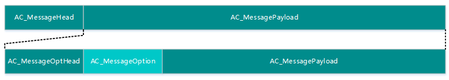

#嵌入式设备开发参考

#设备应用开发框架

对于嵌入式WiFi设备，AbleCloud提供了设备主控MCU的SDK，SDK软件逻辑框图如下所示：


 
在使用SDK开发时，软件逻辑分如下三层：

1. APP层：该层实现设备的控制过程，此部分由厂商自行实现。
1. HAL层：该层属于硬件抽象层，它向上为APP提供控制逻辑接口，同时为API层提供回调函数，访问硬件资源。
1. API层：负责协议控制逻辑的实现，协议报文的解析，协议报文的组装等。


设备通过联网模块给云端发送的消息由消息头和消息payload构成。每个消息的构成说明见下图

 

每个消息由AC_MessageHead和AC_MessagePayload两部分构成：

|名称	 			|  	作用						    |
|-------------------|---------------------------    |
|AC_MessageHead     |	公共消息头，所有消息都要包含此头|
|AC_MessagePayload  |	具体的消息内容                |
|					|								|


##AC_MessageHead

 
 
格式定义如下所示： 
```
typedef struct
{
    u8  Version;
    u8  MsgId;        //消息ID
    u8  MsgCode;      //消息类型
    u8  OptNum;
    u16 Payloadlen;   //msg payload len + opt len + opt head len
    u16 TotalMsgCrc;
} AC_MessageHead;
```

AC_MessageHead中各个字段的说明：

|名称		|	作用						|
|-----------|---------------------------|   
|Version	|协议版本号，AbleCloud的SDK已经自动填写|
|MsgId		|消息序号，上报时填0；相应云端指令时填写云端指令的MsgId|
|MsgCode	|消息类型，云端根据对应的代码区分设备上报的AC_MessagePayload的消息的类型。所有的消息类型定义见“消息类型表”|
|OptNum		|用以指示AC_MessagePayload中AC_MessageOptHead和AC_MessageOption项的个数。OptNum大于等于0。|
|Payloadlen	|AC_MessagePayload消息体的总长度，不包括AC_MessageHead。|
|TotalMsgCrc|消息内容AC_MessagePayload的CRC校验。采用16bit CRC-CCITT|
|			|							|

消息类型表（MsgCode）如下：


|MsgCode|	消息类型				|消息类型说明			|
|-------|-----------------------|-------------------|
|0		|AC_CODE_EQ_BEGIN		|设备启动通知			|
|1		|AC_CODE_EQ_DONE		|Wifi回应设备启动通知	|
|2		|AC_CODE_WIFI_CONNECTED	|Wifi链接成功通知		|
|3		|AC_CODE_WIFI_DISCONNECTED|	Wifi断链通知		|
|4		|AC_CODE_CLOUD_CONNECTED|	云端链接成功通知	|
|5		|AC_CODE_CLOUD_DISCONNECTED|	云端链接断链通知|
|7		|AC_CODE_REGSITER		|注册接入请求			|
|8		|AC_CODE_REST			|重置wifi密码设置		|
|15		|AC_CODE_ACK			|回应消息			|
|16		|AC_CODE_ERR			|错误消息			|
|17		|AC_CODE_OTA_BEGIN		|OTA启动消息			|	
|18		|AC_CODE_OTA_FILE_BEGIN	|OTA文件传输消息		|
|19		|AC_CODE_OTA_FILE_CHUNK	|OTA文件传输			|
|20		|AC_CODE_OTA_FILE_END	|OTA文件传输结束		|
|21		|AC_CODE_OTA_END		|OTA结束				|
|36		|AC_CODE_UNBIND			|解除设备的绑定		|
|45		|AC_CODE_GATEWAY_CTRL	|网关控制消息			|
|46		|AC_CODE_LIST_SUBDEVICES_REQ|查询所有子设备列表请求|
|47		|AC_CODE_LIST_SUBDEVICES_RSP|查询所有子设备列表请求|
|48		|AC_CODE_IS_DEVICEONLINE_REQ|查询子设备是否在线请求|
|49		|AC_CODE_IS_DEVICEONLINE_RSP|查询子设备是否在线响应|
|50		|AC_CODE_LEAVE_DEVICE		|从网络中移除子设备|
|60		|AC_CODE_KLV_RSP			|KLV响应消息|
|61		|AC_CODE_JSON_RSP			|JSON响应消息|
|63		|AC_CODE_EXT			|扩展消息|
|64		|AC_EVENT_BASE			|设备自定义控制消息基址|
|(64,200)|AC_EVENT_CONTROL_AND_RESPONSE|由服务或APP发给设备的控制消息以及设备的应答消息|
|[200,255]|	AC_EVENT_DEVICE_REPORT		|设备上报信息|
|		|						|					|

##AC_MessagePayload

 
 
AC_MessagePayload中的AC_MessageOptHead和AC_MessageOption是成对出现的可选项。由AC_MessageHead中的OptNum来定义这对可选项的数目。当OptNum为0时，AC_MessagePayload中就不存在此可选项。当OptNum大于0时，AC_MessageOptHead和AC_MessageOption在AC_MessagePayload中按照顺序依次排列。

###AC_MessageOptHead

 
 
格式定义如下所示：

```
typedef struct
{
    u16 OptCode;
    u16 OptLen;
}AC_MessageOptHead;
```

字段说明如下：

|名称	|作用										|
|-------|-------------------------------------------|
|OptCode|定义AC_MessageOption中的消息类型。参考OptCode表|
|OptLen	|可选Option的消息长度							|
|		|											|

可选Option类型定义表（OptCode表）：

|值|	消息类型			|说明			|
|--|----------------|---------------|
|0 |AC_OPT_TRANSPORT|	设备ID透传   |
|1 |AC_OPT_SSESSION	|链接SSESSION    |
|	|				|				|

###AC_MessageOption

 
 
AC_MessageOption是由AC_MessageOptHead定义的Option的内容。

**AC_OPT_TRANSPORT消息**

该消息用于将设备ID和消息一并上传，用来进行针对指定设备的控制管理。 消息定义如下：

```
typedef struct{
    u8 DomainId[8]; //用户ID，定长ZC_HS_DEVICE_ID_LEN（8字节），子设备域名信息
    u8 DeviceId[16];//用户ID，定长ZC_HS_DEVICE_ID_LEN（16字节），子设备id
} AC_TransportInfo;
```

**AC_OPT_SSESSION消息**

在APP和wifi模块直连模式下，会包含此字段，用以区分是链接SSESSION控制。设备收到直连控制消息后，发送对应的回应消息时，也要包含该可选字段。 消息定义如下：

```
typedef struct{
    u32 u32SsessionId;
}AC_SsessionInfo;
AC_MessagePayload
```
 
###AC_MessagePayload

 

是由AC_MessageHead中的MsgCode定义的消息类型的具体内容。各个类型的消息的具体内容如下：

***Message code 0:  AC_CODE_EQ_BEGIN*** 

设备启动消息，无实际消息内容。设备启动后，择机发送该消息，用以探测wifi模块是否启动完成。

***Message code 1:  AC_CODE_EQ_DONE***

wifi启动回应，无实际消息内容。Wifi收到AC_CODE_EQ_BEGIN消息后，回复该消息。

***Message code 2:  AC_CODE_WIFI_CONNECTED***

Wifi链接成功通知回应，无实际消息内容。

***Message code 3:  AC_CODE_WIFI_DISCONNECTED***

Wifi断链通知，无实际消息内容。

***Message code 4:  AC_CODE_CLOUD_CONNECTED*** 

Wifi链接云端成功通知，无实际消息内容。

***Message code 5:  AC_CODE_CLOUD_DISCONNECTED***

云端断链通知，无实际消息内容。

***Message code 7:  AC_CODE_REGSITER***

设备接入请求消息，用以设备发起接入云端的请求，wifi模块收到后，立即开始云端接入。 消息格式定义如下：

```
typedef struct 
{
    u8  u8EqVersion[4];
    u8  u8ModuleKey[112];
    u8  u8Domain[8];
    u8  u8DeviceId[8];
}AC_RegisterReq
```

字段说明如下：

|名称		|作用						|
|-----------|---------------------------|
|u8EqVersion|设备版本信息，通过此version来确定目前设备版本，用以后续OTA升级。版本信息设备需要自行存储|
|u8ModuleKey|设备的秘钥Key，不同设备Key是唯一的|
|u8Domain	|设备域信息，不同设备类型不一样|
|u8DeviceId	|设备唯一标示					|
|			|							|

以上信息，都是在设备在出厂前进行相关的注册，注册成功后，自行存储。当设备启动后，先发送请求信息给wifi模块，wifi用来进行和云端认证。

***Message code 8:  AC_CODE_REST***

Wifi密码重置情况，消息体为空，当局域网的wifi AP更换，或者密码更换后，重置密码。

***Message code 15:  AC_CODE_ACK***

OTA消息的正确回应，msgid要和请求消息一一对应。

***Message code 16:  AC_CODE_ERR***

OTA消息的错误回应。

```
typedef struct{
    u8 ErrorCode;
}AC_ErrorMsg;
```


***Message code 17:  AC_CODE_OTA_BEGIN***

OTA升级启动请求。其后按照每个文件的顺序，云端依次发送AC_CODE_OTA_FILE_BEGIN消息，若干AC_CODE_OTA_FILE_CHUNK消息，AC_CODE_OTA_FILE_END消息给设备。所有文件升级完成后，云端发送 AC_CODE_OTA_END。 该消息需要给回应AC_CODE_ACK消息，失败回应AC_CODE_ERR消息。 消息格式定义如下：

```
typedef struct
{
    u8 u8FileNum;
    u8 u8Pad[3];
    //u8 u8FileType[0];
}AC_OtaBeginReq;
```

字段说明如下：

|名称		|作用						|
|-----------|---------------------------|
|u8FileNum	|用以指示本次升级时文件类型和个数。文件类型在该消息体之后，按字节依次排列|
|u8Pad		|填充位，无意义				|
|			|							|

***Message code 18:  AC_CODE_OTA_FILE_BEGIN***

OTA 文件传输启动请求，该消息需要给回应AC_CODE_ACK消息，失败回应AC_CODE_ERR消息。

```
typedef struct
{
    u8 u8FileType;
    u8 u8FileVersion;
    u16  u16TotalFileCrc;

    u32 u32FileTotalLen;
}AC_OtaFileBeginReq;
```

字段说明如下：

|名称		|作用			|
|-----------|---------------|
|u8FileType	|文件类型		|
|u8FileVersion|	文件版本号	|
|u16TotalFileCrc|	整个文件的CRC|
|u32FileTotalLen|	文件长度|
|				|			|

***Message code 19:  AC_CODE_OTA_FILE_CHUNK***

OTA 文件块传输请求，该消息需要给回应AC_CODE_ACK消息，失败回应AC_CODE_ERR消息。整个升级文件后，会被拆分成若干文件块进行传输。一次升级会有若干文件块。

```
typedef struct
{
    u32 u32Offset;
}AC_OtaFileChunkReq;
```

字段说明如下：

|名称		|作用		|
|-----------|-----------|
|u32Offset	|文件偏移	|
|			|			|

***Message code 20:  AC_CODE_OTA_FILE_END***

OTA升级文件传输结束消息，该消息需要给回应AC_CODE_ACK消息，失败回应AC_CODE_ERR消息。无消息体

***Message code 21:  AC_CODE_OTA_END ***

OTA升级结束消息，该消息需要给回应AC_CODE_ACK消息，失败回应AC_CODE_ERR消息。

***Message code 23:  AC_CODE_ZOTA_FILE_BEGIN***

关于wifi模块，目前支持两种方式的wifi模块的升级方式，一种方式是wifi模块和云端直接进行OTA交互，一种方式是设备先和云端进行交互，获得wifi模块的文件，然后再由设备触发wifi模块升级。 该消息用在第二种方式下wifi模块升级。 消息格式同AC_CODE_OTA_FILE_BEGIN。

***Message code 24:  AC_CODE_ZOTA_FILE_CHUNK ***

消息格式同AC_CODE_OTA_FILE_CHUNK。

***Message code 25:  AC_CODE_ZOTA_FILE_END***

消息格式同AC_CODE_OTA_FILE_END。

***Message code 26:  AC_CODE_ZOTA_END***

该消息用以wifi OTA升级完成后，通知设备，设备收到后，择机复位wifi模块，建议收到后，尽快断电复位wifi。

***Message code 36: AC_CODE_UNBIND***

该消息用以设备解除自己绑定。相当于管理员删除设备。
消息格式定义如下：
```
typedef struct
{   
    u8 UnbindFlag;//0:解绑，1：重置wifi密码并解绑
    u8 Pad[3]; 
}AC_GateWay_Ctrl;
```
|名称		|	作用								|
|-----------|-----------------------------------|
|UnbindFlag |解绑功能标志位，0:解绑，1：重置wifi密码并解绑|
|			|	 								|
***Message code 45:  AC_CODE_GATEWAY_CTRL***

该消息执行成功需要给回应AC_CODE_ACK消息，失败回应AC_CODE_ERR消息。

消息格式定义如下：

```
typedef struct
{   
u32 timeWindows;
}AC_GateWay_Ctrl;
```

字段说明如下：

|名称		|	作用								|
|-----------|-----------------------------------|
|timeWindows|打开网络，时间窗的单位和含义开发者自己定义|
|			|	 								|

***Message code 46:  AC_CODE_LIST_SUBDEVICES_REQ消息***

云端下发到网关，请求罗列所有子设备。

***Message code 47:  AC_CODE_LIST_SUBDEVICES_RSP***

网关响应到云端所有子设备信息。

```
typedef struct
{
    u8 DomainId[AC_DOMAIN_LEN]; //用户ID，定长ZC_HS_DEVICE_ID_LEN（8字节），子设备域名信息
    u8 DeviceId[AC_HS_DEVICE_ID_LEN];//用户ID，定长ZC_HS_DEVICE_ID_LEN（16字节），子设备id
}ZC_SubDeviceInfo;
typedef struct
{
    u8 u8ClientNum;	//子设备数目
    u8 u8Pad[3];
    ZC_SubDeviceInfo StruSubDeviceInfo[0];
}ZC_SubDeviceList;
```

***Message code 48:   AC_CODE_LEAVE_DEVICE信息***

云端下发给网关，将指定的子设备移除对应的网络。

该消息成功需要回应AC_CODE_ACK消息，失败回应AC_CODE_ERR消息。

```
typedef struct
{
    u8 DomainId[AC_DOMAIN_LEN]; //用户ID，定长ZC_HS_DEVICE_ID_LEN（8字节），子设备域名信息
    u8 DeviceId[AC_HS_DEVICE_ID_LEN];//用户ID，定长ZC_HS_DEVICE_ID_LEN（16字节），子设备id
}ZC_SubDeviceInfo;
```

***Message code 63:  AC_CODE_EXT ***

设备下发给联网模块，消息定义如下：

```
typedef struct
{
    u8  ExtMsgCode;//扩展消息号
    u8  Pad[3];            
}AC_ExtMessageHead;
```
扩展消息类型表（ExtMsgCode）如下：
|ExtMsgCode|	消息类型				|消息类型说明			|
|-------|-----------------------|-------------------|
|0		|AC_CODE_EXT_REGSITER		|使用mac地址注册接入请求			|
|1		|AC_CODE_EXT_REBOOT		|WIFI设备重启	|
|	     |				|				|

AC_CODE_EXT_REGSITER消息体同AC_CODE_REGSITER，AC_CODE_EXT_REBOOT无消息体

***Message code 64:  AC_EVENT_BASE ***

除了上述公共控制消息外，设备可以自行定义消息内容，所有消息类型的基址为AC_EVENT_BASE，根据需要进行累加，最多支持到255。

<font color="red">说明</font>：
开区间(64,200)内的代码表示由服务或APP发给设备的控制消息以及设备的应答消息, 注意控制消息和应答消息使用不同的消息类型；闭区间[200,255]内的代码表示设备上报信息。


#KLV协议介绍


KLV是一种比json更轻量级的类json数据交换格式，适合在低处理能力的嵌入式设备上运行。KLV采用了流格式，KLV中key必须是数字，可以跟简单json进行转换，只是需要将json中的不同类型的key映射成KLV的数字的key。

KLV数据格式如下图所示：


 
KLV数据格式包含四部分：键值（Key），数据类型，长度（Length），数值（Value）。

键值：key使用8个bit的数字表示，范围从0～255，可以表示256个不同的key。如果产品的数据格式选择为KLV，在管理后台定义数据点时，需要填写数据点的key值。

数据类型：使用第二个字节的低5个bit用于表示数值的数据类型，高3个bit预留不用，约定：

-   0x00：无效，只有key，没有value，适用于不需要参数的控制，比如上报当前温度。
-   0x01：布尔型（占用8bit数值表示，只使用第一个bit）
-   0x02：8位整型
-   0x03：16位整型（网络字节序）
- 	0x04：32整型（网络字节序）
- 	0x05：64整型（网络字节序）
- 	0x06：浮点型（32位，网络字节序）
- 	0x07：双精度型（64位，网络字节序）
- 	0x08：字符串
- 	0x09：二进制
- 	0x0A：KLV类型[保留]

数据长度：占用两个字节（网络字节序），数据长度是可选参数，当数据类型是无效，布尔，整形，浮点型时，不需要数据长度，根据数据类型就可以知道数据长度，约定：
无效数据类型数据长度为0，即第三个字节是下一个KLV结构。

- 布尔型数据长度为1，占用其后一个字节。
- 8位整形数据长度为1，占用其后一个字节。
- 16整形数据长度为2，占用其后两个字节。
- 32整形数据长度为4，占用其后四个字节。
- 64整形数据长度为8，占用其后八个字节。
- 浮点型数据长度为4，占用其后四个字节。
- 双精度型数据长度为8，占用其后8个字节。

字符串，二进制和KLV类型需要使用两个字节指示数据长度。

数值：根据长度指示，其后指定的连续字节为数值，如果是整形和浮点型，统一采用网络字节序。

KLV最短长度为2个字节。

多个KLV打包的结构示意图如下：
 


##设备侧使用说明

设备需要预先知道各个key的真实含义，比如key 123代表温度。

设备获取各个key对应的value，其value的含义由设备开发者定义。KLV中携带了value的数据类型。对于二进制类型，需要设备开发者自行处理其含义。对于布尔型，使用8bit的数字表示，0表示false，非0值表示true。

如果一次请求中携带多组KLV，并且不止一组KLV需要响应这次请求，那么设备需要打包这些响应，组成KLVs一次回复，不能对其中的各个KLV单独回复一次。

设备侧SDK与云端约定一个固定的messageCode作为设备控制的消息编码，一个固定的messageCode为响应消息编码，一个固定的messageCode为上报消息编码，这些消息编码对开发者不可见。

设备端SDK也提供编解码接口，开发者需要编码和解码时直接调用对应的编解码接口即可。

设备端开发参考 [开发指导-设备-和云端通信](../develop_guide/device.md#和云端通信)

##UDS/APP侧使用说明

UDS和APP如果使用json，那么就需要SDK将KLV转换为json。

UDS和APP如果也直接使用KLV则SDK不需要做任何处理。

SDK提供一套独立的编码和解码接口，当开发者认为需要编码为KLV时，调用我们的接口进行编码，当开发者认为需要解码时，调用SDK中的解码接口，解码为json格式的kv。

开发者需要编码或者解码时，需要提供云端生成的数据点json文件，SDK按照提供的格式进行编解码。

在正式上线环境，数据点的变动意为着产品升级。

客户端开发请参考：

[开发指导-安卓-和云端通信](../develop_guide/android.md#和云端通信)

[开发指导-iOS-和云端通信](../develop_guide/iOS.md#和云端通信)

[开发指导-微信-和云端通信](../develop_guide/wechat.md#和云端通信)


##厂商管理后台的使用说明

厂商管理后台在创建产品时，选择产品的数据类型KLV。一个产品只能选择一种数据类型。

然后在功能点设置页面，创建设备的数据点（数据点对应设备上的功能点），填写数据点的名称、标识、key值，数据类型。

- 名称：用户自己定义的标识，不在开发中使用，在管理后台中方便区分标识的意思。
- 标识：该标识在设备和客户端开发中不会使用。在开发UDS的时候，可以用作存储的列的唯一标识。
- key值：相当于JSON中的key，设备、云端、客户端开发中都会用到。是产品功能点的唯一标识，不能重复。
- 数据类型：标识该key对应的数据类型。支持bool、int8、int16、int32、int64、float、double float、string、binary格式。目前还不支持数组。如果要使用数组，可以将该数据点定义为binary格式。

数据点对应设备上的功能点。数据包对应设备和云端通信的通信包，一个数据包可以包括一个或者多个数据点。

在数据点和数据包页面可以导出创建的数据点

如果某些KLV存在关联，需要打包处理，可以使用KLV嵌套的方式将关联的KLV打包在一个KLV中，即KLV的value是KLVS。

##云端消息解析

在管理后台定义好数据点之后，云端就可以根据定义的数据点解析数据。

如果不开发UDS，不需要关系此部分。如果需要开发UDS，参考[开发指导-云端服务](../develop_guide/cloud.md)


#JSON

JSON(JavaScript Object Notation) 是一种轻量级的数据交换格式。 它采用完全独立于语言的文本格式，但是也使用了类似于C语言家族的习惯（包括C, C++, C#, Java, JavaScript, Perl, Python等）。

Ablecloud规定UDS/APP与设备通信使用简单json格式，即value支持的类型有：布尔、整形、浮点形、字符串、数组，字符串采用UTF-8编码，且不支持对象。举例说明，一条合法格式的控制指令：
{
“key1”: true,
“key2”: 31.5,
“key3”: 18,
“key4”: ”hello world”,
“key5”: [1,2,3,4],
}

非法格式的控制指令：
{
“key1”: true,
“key2”: 31.5,
“key3”: 18,
“key4”: ”hello world”,
“key5”: [1,2,3,4],
“key6”: {“key7”:11, “key8”:”error”},
}

##厂商管理后台使用说明

厂商管理后台在创建产品时，选择产品的数据类型JSON。一个产品只能选择一种数据类型。

然后在功能点设置页面，创建设备的数据点（数据点对应设备上的功能点），填写数据点的名称、标识、数据类型。

- 名称：用户自己定义的标识，不在开发中使用，在管理后台中方便区分标识的意思。
- 标识：JSON中的key，设备、云端、客户端开发中都会用到。是产品功能点的唯一标识，不能重复。
- 数据类型：标识该key对应的数据类型。支持bool、int8、int16、int32、int64、float、double float、string、binary格式。目前还不支持数组。如果要使用数组，可以将该数据点定义为binary格式。

数据点对应设备上的功能点。数据包对应设备和云端通信的通信包，一个数据包可以包括一个或者多个数据点。

在数据点和数据包页面可以导出创建的数据点


设备端开发请参考：

[开发指导-设备-和云端通信](../develop_guide/device.md#和云端通信)

客户端使用说明请参考：

[开发指导-安卓-和云端通信](../develop_guide/android.md#和云端通信)

[开发指导-iOS-和云端通信](../develop_guide/iOS.md#和云端通信)

[开发指导-微信-和云端通信](../develop_guide/wechat.md#和云端通信)


